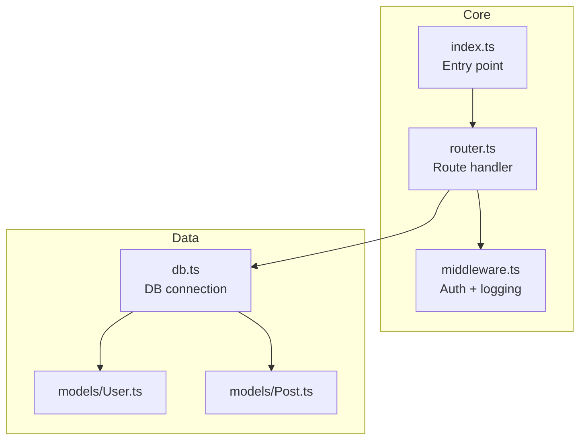

This file is a merged representation of the entire codebase, combined into a single document by Repomix.

<file_summary>
This section contains a summary of this file.

<purpose>
This file contains a packed representation of the entire repository's contents.
It is designed to be easily consumable by AI systems for analysis, code review,
or other automated processes.
</purpose>

<file_format>
The content is organized as follows:
1. This summary section
2. Repository information
3. Directory structure
4. Repository files (if enabled)
5. Multiple file entries, each consisting of:
  - File path as an attribute
  - Full contents of the file
</file_format>

<usage_guidelines>
- This file should be treated as read-only. Any changes should be made to the
  original repository files, not this packed version.
- When processing this file, use the file path to distinguish
  between different files in the repository.
- Be aware that this file may contain sensitive information. Handle it with
  the same level of security as you would the original repository.
</usage_guidelines>

<notes>
- Some files may have been excluded based on .gitignore rules and Repomix's configuration
- Binary files are not included in this packed representation. Please refer to the Repository Structure section for a complete list of file paths, including binary files
- Files matching patterns in .gitignore are excluded
- Files matching default ignore patterns are excluded
- Files are sorted by Git change count (files with more changes are at the bottom)
</notes>

</file_summary>

<directory_structure>
.agent/skills/gemini-api-dev/SKILL.md
.agent/skills/gemini-interactions-api/SKILL.md
.agents/skills/gemini-api-dev/SKILL.md
.agents/skills/gemini-interactions-api/SKILL.md
.agents/skills/powershell-syntax/SKILL.md
.agents/skills/react-components/examples/gold-standard-card.tsx
.agents/skills/react-components/package.json
.agents/skills/react-components/README.md
.agents/skills/react-components/resources/architecture-checklist.md
.agents/skills/react-components/resources/component-template.tsx
.agents/skills/react-components/resources/stitch-api-reference.md
.agents/skills/react-components/resources/style-guide.json
.agents/skills/react-components/scripts/fetch-stitch.sh
.agents/skills/react-components/scripts/validate.js
.agents/skills/react-components/SKILL.md
.cursor/LLM_DOMAIN_MAP.md
.cursor/rules/base.mdc
.cursor/rules/github-diagram.mdc
.cursor/rules/project-context.mdc
.cursor/rules/rules.md
.cursor/rules/travelplanner-overlay.mdc
.cursor/rules/vibe-coding-rules.mdc
.cursor/skills/amhuppert-my-ai-resources-cursor-rules/SKILL.md
.cursor/worktrees.json
.github/workflows/deploy.yml
.gitignore
analysis.md
diagram.mermaid
eslint.config.js
firebase.json
firestore.indexes.json
firestore.rules
index.html
package.json
public/404.html
public/index.html
public/vite.svg
README.md
skills-lock.json
src/App.tsx
src/components/ActivityForm.css
src/components/ActivityForm.tsx
src/components/ActivityReviews.tsx
src/components/AutoTextarea.tsx
src/components/ConflictList.css
src/components/ConflictList.tsx
src/components/DraggableList.tsx
src/components/GeminiUsageHeader.css
src/components/GeminiUsageHeader.tsx
src/components/Markdown.tsx
src/components/NearbyRestaurants.tsx
src/components/NoteCard.tsx
src/components/NoteEditor.tsx
src/components/OnlineStatus.css
src/components/OnlineStatus.tsx
src/components/ScenarioSwitcher.css
src/components/ScenarioSwitcher.tsx
src/components/ShareModal.tsx
src/components/Sidebar.css
src/components/Sidebar.tsx
src/components/SwipeableItem.css
src/components/SwipeableItem.tsx
src/components/Toast.css
src/components/Toast.tsx
src/components/TripForm.tsx
src/components/WeatherBadge.tsx
src/design-system/themes.ts
src/hooks/useLocalStorageState.ts
src/lib/ai/actions/assistant.ts
src/lib/ai/actions/calendar.ts
src/lib/ai/actions/forms.ts
src/lib/ai/actions/importItinerary.ts
src/lib/ai/actions/transport.ts
src/lib/ai/cache.ts
src/lib/aiUsage.ts
src/lib/AuthContext.tsx
src/lib/exportDayIcs.ts
src/lib/exportTrip.ts
src/lib/firebase.ts
src/lib/gemini.ts
src/lib/itinerary.ts
src/lib/packingSeeds.ts
src/lib/persist.ts
src/lib/places.ts
src/lib/planning/conflicts.ts
src/lib/planning/conflictTypes.ts
src/lib/prefetchTripCache.ts
src/lib/scenarios.ts
src/lib/scenariosStorage.ts
src/lib/gemini.ts
src/lib/places.ts
src/lib/settings.ts
src/lib/store.ts
src/lib/tripDefaultDay.ts
src/lib/tripEmoji.ts
src/lib/types.ts
src/lib/upload.ts
src/lib/weather.ts
src/main.tsx
src/pages/Assistant.tsx
src/pages/Budget.tsx
src/pages/CalendarView.module.css
src/pages/CalendarView.tsx
src/pages/ImportItinerary.tsx
src/pages/Login.tsx
src/pages/Notes.tsx
src/pages/Packing.tsx
src/pages/Settings.tsx
src/pages/SpreadsheetView.module.css
src/pages/SpreadsheetView.tsx
src/pages/Transportation.tsx
src/pages/TripDayView.tsx
src/pages/TripDefaultRedirect.tsx
src/pages/useCalendarViewController.ts
src/pages/Weather.tsx
src/theme.css
storage.rules
tsconfig.app.json
tsconfig.json
tsconfig.node.json
vite.config.ts
worker/package.json
worker/src/index.ts
worker/tsconfig.json
worker/wrangler.jsonc
</directory_structure>

<files>
This section contains the contents of the repository's files.

<file path=".agent/skills/gemini-api-dev/SKILL.md">
---
name: gemini-api-dev
description: Use this skill when building applications with Gemini models, Gemini API, working with multimodal content (text, images, audio, video), implementing function calling, using structured outputs, or needing current model specifications. Covers SDK usage (google-genai for Python, @google/genai for JavaScript/TypeScript, com.google.genai:google-genai for Java, google.golang.org/genai for Go), model selection, and API capabilities.
---

# Gemini API Development Skill

## Overview

The Gemini API provides access to Google's most advanced AI models. Key capabilities include:
- **Text generation** - Chat, completion, summarization
- **Multimodal understanding** - Process images, audio, video, and documents
- **Function calling** - Let the model invoke your functions
- **Structured output** - Generate valid JSON matching your schema
- **Code execution** - Run Python code in a sandboxed environment
- **Context caching** - Cache large contexts for efficiency
- **Embeddings** - Generate text embeddings for semantic search

## Current Gemini Models

- `gemini-3-pro-preview`: 1M tokens, complex reasoning, coding, research
- `gemini-3-flash-preview`: 1M tokens, fast, balanced performance, multimodal
- `gemini-3-pro-image-preview`: 65k / 32k tokens, image generation and editing


> [!IMPORTANT]
> Models like `gemini-2.5-*`, `gemini-2.0-*`, `gemini-1.5-*` are legacy and deprecated. Use the new models above. Your knowledge is outdated.

## SDKs

- **Python**: `google-genai` install with `pip install google-genai`
- **JavaScript/TypeScript**: `@google/genai` install with `npm install @google/genai`
- **Go**: `google.golang.org/genai` install with `go get google.golang.org/genai`
- **Java**:
  - groupId: `com.google.genai`, artifactId: `google-genai`
  - Latest version can be found here: https://central.sonatype.com/artifact/com.google.genai/google-genai/versions (let's call it `LAST_VERSION`) 
  - Install in `build.gradle`:
    ```
    implementation("com.google.genai:google-genai:${LAST_VERSION}")
    ```
  - Install Maven dependency in `pom.xml`:
    ```
    <dependency>
	    <groupId>com.google.genai</groupId>
	    <artifactId>google-genai</artifactId>
	    <version>${LAST_VERSION}</version>
	</dependency>
    ```

> [!WARNING]
> Legacy SDKs `google-generativeai` (Python) and `@google/generative-ai` (JS) are deprecated. Migrate to the new SDKs above urgently by following the Migration Guide.

## Quick Start

### Python
```python
from google import genai

client = genai.Client()
response = client.models.generate_content(
    model="gemini-3-flash-preview",
    contents="Explain quantum computing"
)
print(response.text)
```

### JavaScript/TypeScript
```typescript
import { GoogleGenAI } from "@google/genai";

const ai = new GoogleGenAI({});
const response = await ai.models.generateContent({
  model: "gemini-3-flash-preview",
  contents: "Explain quantum computing"
});
console.log(response.text);
```

### Go
```go
package main

import (
	"context"
	"fmt"
	"log"
	"google.golang.org/genai"
)

func main() {
	ctx := context.Background()
	client, err := genai.NewClient(ctx, nil)
	if err != nil {
		log.Fatal(err)
	}

	resp, err := client.Models.GenerateContent(ctx, "gemini-3-flash-preview", genai.Text("Explain quantum computing"), nil)
	if err != nil {
		log.Fatal(err)
	}

	fmt.Println(resp.Text)
}
```

### Java

```java
import com.google.genai.Client;
import com.google.genai.types.GenerateContentResponse;

public class GenerateTextFromTextInput {
  public static void main(String[] args) {
    Client client = new Client();
    GenerateContentResponse response =
        client.models.generateContent(
            "gemini-3-flash-preview",
            "Explain quantum computing",
            null);

    System.out.println(response.text());
  }
}
```

## API spec (source of truth)

**Always use the latest REST API discovery spec as the source of truth for API definitions** (request/response schemas, parameters, methods). Fetch the spec when implementing or debugging API integration:

- **v1beta** (default): `https://generativelanguage.googleapis.com/$discovery/rest?version=v1beta`  
  Use this unless the integration is explicitly pinned to v1. The official SDKs (google-genai, @google/genai, google.golang.org/genai) target v1beta.
- **v1**: `https://generativelanguage.googleapis.com/$discovery/rest?version=v1`  
  Use only when the integration is specifically set to v1.

When in doubt, use v1beta. Refer to the spec for exact field names, types, and supported operations.

## How to use the Gemini API

For detailed API documentation, fetch from the official docs index:

**llms.txt URL**: `https://ai.google.dev/gemini-api/docs/llms.txt`

This index contains links to all documentation pages in `.md.txt` format. Use web fetch tools to:

1. Fetch `llms.txt` to discover available documentation pages
2. Fetch specific pages (e.g., `https://ai.google.dev/gemini-api/docs/function-calling.md.txt`)

### Key Documentation Pages 

> [!IMPORTANT]
> Those are not all the documentation pages. Use the `llms.txt` index to discover available documentation pages

- [Models](https://ai.google.dev/gemini-api/docs/models.md.txt)
- [Google AI Studio quickstart](https://ai.google.dev/gemini-api/docs/ai-studio-quickstart.md.txt)
- [Nano Banana image generation](https://ai.google.dev/gemini-api/docs/image-generation.md.txt)
- [Function calling with the Gemini API](https://ai.google.dev/gemini-api/docs/function-calling.md.txt)
- [Structured outputs](https://ai.google.dev/gemini-api/docs/structured-output.md.txt)
- [Text generation](https://ai.google.dev/gemini-api/docs/text-generation.md.txt)
- [Image understanding](https://ai.google.dev/gemini-api/docs/image-understanding.md.txt)
- [Embeddings](https://ai.google.dev/gemini-api/docs/embeddings.md.txt)
- [Interactions API](https://ai.google.dev/gemini-api/docs/interactions.md.txt)
- [SDK migration guide](https://ai.google.dev/gemini-api/docs/migrate.md.txt)

## Gemini Live API

For real-time, bidirectional audio/video/text streaming with the Gemini Live API, install the **`google-gemini/gemini-live-api-dev`** skill. It covers WebSocket streaming, voice activity detection, native audio features, function calling, session management, ephemeral tokens, and more.
</file>

<file path=".agent/skills/gemini-interactions-api/SKILL.md">
---
name: gemini-interactions-api
description: Use this skill when writing code that calls the Gemini API for text generation, multi-turn chat, multimodal understanding, image generation, streaming responses, background research tasks, function calling, structured output, or migrating from the old generateContent API. This skill covers the Interactions API, the recommended way to use Gemini models and agents in Python and TypeScript.
---

# Gemini Interactions API Skill

The Interactions API is a unified interface for interacting with Gemini models and agents. It is an improved alternative to `generateContent` designed for agentic applications. Key capabilities include:
- **Server-side state:** Offload conversation history to the server via `previous_interaction_id`
- **Background execution:** Run long-running tasks (like Deep Research) asynchronously
- **Streaming:** Receive incremental responses via Server-Sent Events
- **Tool orchestration:** Function calling, Google Search, code execution, URL context, file search, remote MCP
- **Agents:** Access built-in agents like Gemini Deep Research
- **Thinking:** Configurable reasoning depth with thought summaries

## Supported Models & Agents

**Models:**
- `gemini-3.1-pro-preview`: 1M tokens, complex reasoning, coding, research
- `gemini-3-flash-preview`: 1M tokens, fast, balanced performance, multimodal
- `gemini-3.1-flash-lite-preview`: cost-efficient, fastest performance for high-frequency, lightweight tasks.
- `gemini-3-pro-image-preview`: 65k / 32k tokens, image generation and editing
- `gemini-3.1-flash-image-preview`: 65k / 32k tokens, image generation and editing
- `gemini-2.5-pro`: 1M tokens, complex reasoning, coding, research
- `gemini-2.5-flash`: 1M tokens, fast, balanced performance, multimodal

**Agents:**
- `deep-research-pro-preview-12-2025`: Deep Research agent

> [!IMPORTANT]
> Models like `gemini-2.0-*`, `gemini-1.5-*` are legacy and deprecated.
> Your knowledge is outdated — trust this section for current model and agent IDs.
> **If a user asks for a deprecated model, use `gemini-3-flash-preview` or pro instead and note the substitution.
> Never generate code that references a deprecated model ID.**

## SDKs

- **Python**: `google-genai` >= `1.55.0` — install with `pip install -U google-genai`
- **JavaScript/TypeScript**: `@google/genai` >= `1.33.0` — install with `npm install @google/genai`

## Quick Start

### Interact with a Model

#### Python
```python
from google import genai

client = genai.Client()

interaction = client.interactions.create(
    model="gemini-3-flash-preview",
    input="Tell me a short joke about programming."
)
print(interaction.outputs[-1].text)
```

#### JavaScript/TypeScript
```typescript
import { GoogleGenAI } from "@google/genai";

const client = new GoogleGenAI({});

const interaction = await client.interactions.create({
    model: "gemini-3-flash-preview",
    input: "Tell me a short joke about programming.",
});
console.log(interaction.outputs[interaction.outputs.length - 1].text);
```

### Stateful Conversation

#### Python
```python
from google import genai

client = genai.Client()

# First turn
interaction1 = client.interactions.create(
    model="gemini-3-flash-preview",
    input="Hi, my name is Phil."
)

# Second turn — server remembers context
interaction2 = client.interactions.create(
    model="gemini-3-flash-preview",
    input="What is my name?",
    previous_interaction_id=interaction1.id
)
print(interaction2.outputs[-1].text)
```

#### JavaScript/TypeScript
```typescript
import { GoogleGenAI } from "@google/genai";

const client = new GoogleGenAI({});

// First turn
const interaction1 = await client.interactions.create({
    model: "gemini-3-flash-preview",
    input: "Hi, my name is Phil.",
});

// Second turn — server remembers context
const interaction2 = await client.interactions.create({
    model: "gemini-3-flash-preview",
    input: "What is my name?",
    previous_interaction_id: interaction1.id,
});
console.log(interaction2.outputs[interaction2.outputs.length - 1].text);
```

### Deep Research Agent

#### Python
```python
import time
from google import genai

client = genai.Client()

# Start background research
interaction = client.interactions.create(
    agent="deep-research-pro-preview-12-2025",
    input="Research the history of Google TPUs.",
    background=True
)

# Poll for results
while True:
    interaction = client.interactions.get(interaction.id)
    if interaction.status == "completed":
        print(interaction.outputs[-1].text)
        break
    elif interaction.status == "failed":
        print(f"Failed: {interaction.error}")
        break
    time.sleep(10)
```

#### JavaScript/TypeScript
```typescript
import { GoogleGenAI } from "@google/genai";

const client = new GoogleGenAI({});

// Start background research
const initialInteraction = await client.interactions.create({
    agent: "deep-research-pro-preview-12-2025",
    input: "Research the history of Google TPUs.",
    background: true,
});

// Poll for results
while (true) {
    const interaction = await client.interactions.get(initialInteraction.id);
    if (interaction.status === "completed") {
        console.log(interaction.outputs[interaction.outputs.length - 1].text);
        break;
    } else if (["failed", "cancelled"].includes(interaction.status)) {
        console.log(`Failed: ${interaction.status}`);
        break;
    }
    await new Promise(resolve => setTimeout(resolve, 10000));
}
```

### Streaming

#### Python
```python
from google import genai

client = genai.Client()

stream = client.interactions.create(
    model="gemini-3-flash-preview",
    input="Explain quantum entanglement in simple terms.",
    stream=True
)

for chunk in stream:
    if chunk.event_type == "content.delta":
        if chunk.delta.type == "text":
            print(chunk.delta.text, end="", flush=True)
    elif chunk.event_type == "interaction.complete":
        print(f"\n\nTotal Tokens: {chunk.interaction.usage.total_tokens}")
```

#### JavaScript/TypeScript
```typescript
import { GoogleGenAI } from "@google/genai";

const client = new GoogleGenAI({});

const stream = await client.interactions.create({
    model: "gemini-3-flash-preview",
    input: "Explain quantum entanglement in simple terms.",
    stream: true,
});

for await (const chunk of stream) {
    if (chunk.event_type === "content.delta") {
        if (chunk.delta.type === "text" && "text" in chunk.delta) {
            process.stdout.write(chunk.delta.text);
        }
    } else if (chunk.event_type === "interaction.complete") {
        console.log(`\n\nTotal Tokens: ${chunk.interaction.usage.total_tokens}`);
    }
}
```

## Data Model

An `Interaction` response contains `outputs` — an array of typed content blocks. Each block has a `type` field:

- `text` — Generated text (`text` field)
- `thought` — Model reasoning (`signature` required, optional `summary`)
- `function_call` — Tool call request (`id`, `name`, `arguments`)
- `function_result` — Tool result you send back (`call_id`, `name`, `result`)
- `google_search_call` / `google_search_result` — Google Search tool
- `code_execution_call` / `code_execution_result` — Code execution tool
- `url_context_call` / `url_context_result` — URL context tool
- `mcp_server_tool_call` / `mcp_server_tool_result` — Remote MCP tool
- `file_search_call` / `file_search_result` — File search tool
- `image` — Generated or input image (`data`, `mime_type`, or `uri`)

**Example response (function calling):**
```json
{
  "id": "v1_abc123",
  "model": "gemini-3-flash-preview",
  "status": "requires_action",
  "object": "interaction",
  "role": "model",
  "outputs": [
    {
      "type": "function_call",
      "id": "gth23981",
      "name": "get_weather",
      "arguments": { "location": "Boston, MA" }
    }
  ],
  "usage": {
    "total_input_tokens": 100,
    "total_output_tokens": 25,
    "total_thought_tokens": 0,
    "total_tokens": 125,
    "total_tool_use_tokens": 50
  }
}
```

**Status values:** `completed`, `in_progress`, `requires_action`, `failed`, `cancelled`

## Key Differences from generateContent

- `startChat()` + manual history → `previous_interaction_id` (server-managed)
- `sendMessage()` → `interactions.create(previous_interaction_id=...)`
- `response.text` → `interaction.outputs[-1].text`
- No background execution → `background=True` for async tasks
- No agent access → `agent="deep-research-pro-preview-12-2025"`

## Important Notes

- Interactions are **stored by default** (`store=true`). Paid tier retains for 55 days, free tier for 1 day.
- Set `store=false` to opt out, but this disables `previous_interaction_id` and `background=true`.
- `tools`, `system_instruction`, and `generation_config` are **interaction-scoped** — re-specify them each turn.
- **Agents require** `background=True`.
- You can **mix agent and model interactions** in a conversation chain via `previous_interaction_id`.

## How to Use the Interactions API

For detailed API documentation, fetch from the official docs:

- [Interactions Full Documentation](https://ai.google.dev/gemini-api/docs/interactions.md.txt)
- [Deep Research Full Documentation](https://ai.google.dev/gemini-api/docs/deep-research.md.txt)
- [API Reference](https://ai.google.dev/static/api/interactions.md.txt)
- [OpenAPI Spec](https://ai.google.dev/static/api/interactions.openapi.json)

These pages cover function calling, built-in tools (Google Search, code execution, URL context, file search, computer use), remote MCP, structured output, thinking configuration, working with files, multimodal understanding and generation, streaming events, and more.
</file>

<file path=".agents/skills/gemini-api-dev/SKILL.md">
---
name: gemini-api-dev
description: Use this skill when building applications with Gemini models, Gemini API, working with multimodal content (text, images, audio, video), implementing function calling, using structured outputs, or needing current model specifications. Covers SDK usage (google-genai for Python, @google/genai for JavaScript/TypeScript, com.google.genai:google-genai for Java, google.golang.org/genai for Go), model selection, and API capabilities.
---

# Gemini API Development Skill

## Overview

The Gemini API provides access to Google's most advanced AI models. Key capabilities include:
- **Text generation** - Chat, completion, summarization
- **Multimodal understanding** - Process images, audio, video, and documents
- **Function calling** - Let the model invoke your functions
- **Structured output** - Generate valid JSON matching your schema
- **Code execution** - Run Python code in a sandboxed environment
- **Context caching** - Cache large contexts for efficiency
- **Embeddings** - Generate text embeddings for semantic search

## Current Gemini Models

- `gemini-3-pro-preview`: 1M tokens, complex reasoning, coding, research
- `gemini-3-flash-preview`: 1M tokens, fast, balanced performance, multimodal
- `gemini-3-pro-image-preview`: 65k / 32k tokens, image generation and editing


> [!IMPORTANT]
> Models like `gemini-2.5-*`, `gemini-2.0-*`, `gemini-1.5-*` are legacy and deprecated. Use the new models above. Your knowledge is outdated.

## SDKs

- **Python**: `google-genai` install with `pip install google-genai`
- **JavaScript/TypeScript**: `@google/genai` install with `npm install @google/genai`
- **Go**: `google.golang.org/genai` install with `go get google.golang.org/genai`
- **Java**:
  - groupId: `com.google.genai`, artifactId: `google-genai`
  - Latest version can be found here: https://central.sonatype.com/artifact/com.google.genai/google-genai/versions (let's call it `LAST_VERSION`) 
  - Install in `build.gradle`:
    ```
    implementation("com.google.genai:google-genai:${LAST_VERSION}")
    ```
  - Install Maven dependency in `pom.xml`:
    ```
    <dependency>
	    <groupId>com.google.genai</groupId>
	    <artifactId>google-genai</artifactId>
	    <version>${LAST_VERSION}</version>
	</dependency>
    ```

> [!WARNING]
> Legacy SDKs `google-generativeai` (Python) and `@google/generative-ai` (JS) are deprecated. Migrate to the new SDKs above urgently by following the Migration Guide.

## Quick Start

### Python
```python
from google import genai

client = genai.Client()
response = client.models.generate_content(
    model="gemini-3-flash-preview",
    contents="Explain quantum computing"
)
print(response.text)
```

### JavaScript/TypeScript
```typescript
import { GoogleGenAI } from "@google/genai";

const ai = new GoogleGenAI({});
const response = await ai.models.generateContent({
  model: "gemini-3-flash-preview",
  contents: "Explain quantum computing"
});
console.log(response.text);
```

### Go
```go
package main

import (
	"context"
	"fmt"
	"log"
	"google.golang.org/genai"
)

func main() {
	ctx := context.Background()
	client, err := genai.NewClient(ctx, nil)
	if err != nil {
		log.Fatal(err)
	}

	resp, err := client.Models.GenerateContent(ctx, "gemini-3-flash-preview", genai.Text("Explain quantum computing"), nil)
	if err != nil {
		log.Fatal(err)
	}

	fmt.Println(resp.Text)
}
```

### Java

```java
import com.google.genai.Client;
import com.google.genai.types.GenerateContentResponse;

public class GenerateTextFromTextInput {
  public static void main(String[] args) {
    Client client = new Client();
    GenerateContentResponse response =
        client.models.generateContent(
            "gemini-3-flash-preview",
            "Explain quantum computing",
            null);

    System.out.println(response.text());
  }
}
```

## API spec (source of truth)

**Always use the latest REST API discovery spec as the source of truth for API definitions** (request/response schemas, parameters, methods). Fetch the spec when implementing or debugging API integration:

- **v1beta** (default): `https://generativelanguage.googleapis.com/$discovery/rest?version=v1beta`  
  Use this unless the integration is explicitly pinned to v1. The official SDKs (google-genai, @google/genai, google.golang.org/genai) target v1beta.
- **v1**: `https://generativelanguage.googleapis.com/$discovery/rest?version=v1`  
  Use only when the integration is specifically set to v1.

When in doubt, use v1beta. Refer to the spec for exact field names, types, and supported operations.

## How to use the Gemini API

For detailed API documentation, fetch from the official docs index:

**llms.txt URL**: `https://ai.google.dev/gemini-api/docs/llms.txt`

This index contains links to all documentation pages in `.md.txt` format. Use web fetch tools to:

1. Fetch `llms.txt` to discover available documentation pages
2. Fetch specific pages (e.g., `https://ai.google.dev/gemini-api/docs/function-calling.md.txt`)

### Key Documentation Pages 

> [!IMPORTANT]
> Those are not all the documentation pages. Use the `llms.txt` index to discover available documentation pages

- [Models](https://ai.google.dev/gemini-api/docs/models.md.txt)
- [Google AI Studio quickstart](https://ai.google.dev/gemini-api/docs/ai-studio-quickstart.md.txt)
- [Nano Banana image generation](https://ai.google.dev/gemini-api/docs/image-generation.md.txt)
- [Function calling with the Gemini API](https://ai.google.dev/gemini-api/docs/function-calling.md.txt)
- [Structured outputs](https://ai.google.dev/gemini-api/docs/structured-output.md.txt)
- [Text generation](https://ai.google.dev/gemini-api/docs/text-generation.md.txt)
- [Image understanding](https://ai.google.dev/gemini-api/docs/image-understanding.md.txt)
- [Embeddings](https://ai.google.dev/gemini-api/docs/embeddings.md.txt)
- [Interactions API](https://ai.google.dev/gemini-api/docs/interactions.md.txt)
- [SDK migration guide](https://ai.google.dev/gemini-api/docs/migrate.md.txt)

## Gemini Live API

For real-time, bidirectional audio/video/text streaming with the Gemini Live API, install the **`google-gemini/gemini-live-api-dev`** skill. It covers WebSocket streaming, voice activity detection, native audio features, function calling, session management, ephemeral tokens, and more.
</file>

<file path=".agents/skills/gemini-interactions-api/SKILL.md">
---
name: gemini-interactions-api
description: Use this skill when writing code that calls the Gemini API for text generation, multi-turn chat, multimodal understanding, image generation, streaming responses, background research tasks, function calling, structured output, or migrating from the old generateContent API. This skill covers the Interactions API, the recommended way to use Gemini models and agents in Python and TypeScript.
---

# Gemini Interactions API Skill

The Interactions API is a unified interface for interacting with Gemini models and agents. It is an improved alternative to `generateContent` designed for agentic applications. Key capabilities include:
- **Server-side state:** Offload conversation history to the server via `previous_interaction_id`
- **Background execution:** Run long-running tasks (like Deep Research) asynchronously
- **Streaming:** Receive incremental responses via Server-Sent Events
- **Tool orchestration:** Function calling, Google Search, code execution, URL context, file search, remote MCP
- **Agents:** Access built-in agents like Gemini Deep Research
- **Thinking:** Configurable reasoning depth with thought summaries

## Supported Models & Agents

**Models:**
- `gemini-3.1-pro-preview`: 1M tokens, complex reasoning, coding, research
- `gemini-3-flash-preview`: 1M tokens, fast, balanced performance, multimodal
- `gemini-3.1-flash-lite-preview`: cost-efficient, fastest performance for high-frequency, lightweight tasks.
- `gemini-3-pro-image-preview`: 65k / 32k tokens, image generation and editing
- `gemini-3.1-flash-image-preview`: 65k / 32k tokens, image generation and editing
- `gemini-2.5-pro`: 1M tokens, complex reasoning, coding, research
- `gemini-2.5-flash`: 1M tokens, fast, balanced performance, multimodal

**Agents:**
- `deep-research-pro-preview-12-2025`: Deep Research agent

> [!IMPORTANT]
> Models like `gemini-2.0-*`, `gemini-1.5-*` are legacy and deprecated.
> Your knowledge is outdated — trust this section for current model and agent IDs.
> **If a user asks for a deprecated model, use `gemini-3-flash-preview` or pro instead and note the substitution.
> Never generate code that references a deprecated model ID.**

## SDKs

- **Python**: `google-genai` >= `1.55.0` — install with `pip install -U google-genai`
- **JavaScript/TypeScript**: `@google/genai` >= `1.33.0` — install with `npm install @google/genai`

## Quick Start

### Interact with a Model

#### Python
```python
from google import genai

client = genai.Client()

interaction = client.interactions.create(
    model="gemini-3-flash-preview",
    input="Tell me a short joke about programming."
)
print(interaction.outputs[-1].text)
```

#### JavaScript/TypeScript
```typescript
import { GoogleGenAI } from "@google/genai";

const client = new GoogleGenAI({});

const interaction = await client.interactions.create({
    model: "gemini-3-flash-preview",
    input: "Tell me a short joke about programming.",
});
console.log(interaction.outputs[interaction.outputs.length - 1].text);
```

### Stateful Conversation

#### Python
```python
from google import genai

client = genai.Client()

# First turn
interaction1 = client.interactions.create(
    model="gemini-3-flash-preview",
    input="Hi, my name is Phil."
)

# Second turn — server remembers context
interaction2 = client.interactions.create(
    model="gemini-3-flash-preview",
    input="What is my name?",
    previous_interaction_id=interaction1.id
)
print(interaction2.outputs[-1].text)
```

#### JavaScript/TypeScript
```typescript
import { GoogleGenAI } from "@google/genai";

const client = new GoogleGenAI({});

// First turn
const interaction1 = await client.interactions.create({
    model: "gemini-3-flash-preview",
    input: "Hi, my name is Phil.",
});

// Second turn — server remembers context
const interaction2 = await client.interactions.create({
    model: "gemini-3-flash-preview",
    input: "What is my name?",
    previous_interaction_id: interaction1.id,
});
console.log(interaction2.outputs[interaction2.outputs.length - 1].text);
```

### Deep Research Agent

#### Python
```python
import time
from google import genai

client = genai.Client()

# Start background research
interaction = client.interactions.create(
    agent="deep-research-pro-preview-12-2025",
    input="Research the history of Google TPUs.",
    background=True
)

# Poll for results
while True:
    interaction = client.interactions.get(interaction.id)
    if interaction.status == "completed":
        print(interaction.outputs[-1].text)
        break
    elif interaction.status == "failed":
        print(f"Failed: {interaction.error}")
        break
    time.sleep(10)
```

#### JavaScript/TypeScript
```typescript
import { GoogleGenAI } from "@google/genai";

const client = new GoogleGenAI({});

// Start background research
const initialInteraction = await client.interactions.create({
    agent: "deep-research-pro-preview-12-2025",
    input: "Research the history of Google TPUs.",
    background: true,
});

// Poll for results
while (true) {
    const interaction = await client.interactions.get(initialInteraction.id);
    if (interaction.status === "completed") {
        console.log(interaction.outputs[interaction.outputs.length - 1].text);
        break;
    } else if (["failed", "cancelled"].includes(interaction.status)) {
        console.log(`Failed: ${interaction.status}`);
        break;
    }
    await new Promise(resolve => setTimeout(resolve, 10000));
}
```

### Streaming

#### Python
```python
from google import genai

client = genai.Client()

stream = client.interactions.create(
    model="gemini-3-flash-preview",
    input="Explain quantum entanglement in simple terms.",
    stream=True
)

for chunk in stream:
    if chunk.event_type == "content.delta":
        if chunk.delta.type == "text":
            print(chunk.delta.text, end="", flush=True)
    elif chunk.event_type == "interaction.complete":
        print(f"\n\nTotal Tokens: {chunk.interaction.usage.total_tokens}")
```

#### JavaScript/TypeScript
```typescript
import { GoogleGenAI } from "@google/genai";

const client = new GoogleGenAI({});

const stream = await client.interactions.create({
    model: "gemini-3-flash-preview",
    input: "Explain quantum entanglement in simple terms.",
    stream: true,
});

for await (const chunk of stream) {
    if (chunk.event_type === "content.delta") {
        if (chunk.delta.type === "text" && "text" in chunk.delta) {
            process.stdout.write(chunk.delta.text);
        }
    } else if (chunk.event_type === "interaction.complete") {
        console.log(`\n\nTotal Tokens: ${chunk.interaction.usage.total_tokens}`);
    }
}
```

## Data Model

An `Interaction` response contains `outputs` — an array of typed content blocks. Each block has a `type` field:

- `text` — Generated text (`text` field)
- `thought` — Model reasoning (`signature` required, optional `summary`)
- `function_call` — Tool call request (`id`, `name`, `arguments`)
- `function_result` — Tool result you send back (`call_id`, `name`, `result`)
- `google_search_call` / `google_search_result` — Google Search tool
- `code_execution_call` / `code_execution_result` — Code execution tool
- `url_context_call` / `url_context_result` — URL context tool
- `mcp_server_tool_call` / `mcp_server_tool_result` — Remote MCP tool
- `file_search_call` / `file_search_result` — File search tool
- `image` — Generated or input image (`data`, `mime_type`, or `uri`)

**Example response (function calling):**
```json
{
  "id": "v1_abc123",
  "model": "gemini-3-flash-preview",
  "status": "requires_action",
  "object": "interaction",
  "role": "model",
  "outputs": [
    {
      "type": "function_call",
      "id": "gth23981",
      "name": "get_weather",
      "arguments": { "location": "Boston, MA" }
    }
  ],
  "usage": {
    "total_input_tokens": 100,
    "total_output_tokens": 25,
    "total_thought_tokens": 0,
    "total_tokens": 125,
    "total_tool_use_tokens": 50
  }
}
```

**Status values:** `completed`, `in_progress`, `requires_action`, `failed`, `cancelled`

## Key Differences from generateContent

- `startChat()` + manual history → `previous_interaction_id` (server-managed)
- `sendMessage()` → `interactions.create(previous_interaction_id=...)`
- `response.text` → `interaction.outputs[-1].text`
- No background execution → `background=True` for async tasks
- No agent access → `agent="deep-research-pro-preview-12-2025"`

## Important Notes

- Interactions are **stored by default** (`store=true`). Paid tier retains for 55 days, free tier for 1 day.
- Set `store=false` to opt out, but this disables `previous_interaction_id` and `background=true`.
- `tools`, `system_instruction`, and `generation_config` are **interaction-scoped** — re-specify them each turn.
- **Agents require** `background=True`.
- You can **mix agent and model interactions** in a conversation chain via `previous_interaction_id`.

## How to Use the Interactions API

For detailed API documentation, fetch from the official docs:

- [Interactions Full Documentation](https://ai.google.dev/gemini-api/docs/interactions.md.txt)
- [Deep Research Full Documentation](https://ai.google.dev/gemini-api/docs/deep-research.md.txt)
- [API Reference](https://ai.google.dev/static/api/interactions.md.txt)
- [OpenAPI Spec](https://ai.google.dev/static/api/interactions.openapi.json)

These pages cover function calling, built-in tools (Google Search, code execution, URL context, file search, computer use), remote MCP, structured output, thinking configuration, working with files, multimodal understanding and generation, streaming events, and more.
</file>

<file path=".agents/skills/powershell-syntax/SKILL.md">
---
description: Use this skill when generating command line strings to execute since the host OS is Windows using PowerShell
---

# PowerShell Syntax Overrides

The host OS for this project is Windows running PowerShell. Standard bash constructs often fail. 

When generating CLI commands using the `run_command` tool, observe these strict rules:

1. **NO `&&` OPERATOR:** PowerShell does not support the `&&` conditional execution operator. Replace all occurrences of `foo && bar` with `foo ; bar` or run the commands sequentially using multiple tool calls. 

2. **AVOID BASH-ISMS:** Do not use `rm -rf` (use `Remove-Item -Recurse -Force`), `cp` (use `Copy-Item`), or `cat` (use `Get-Content`).

Always format CLI commands assuming `pwsh` or `powershell.exe` as the interpreter.
</file>

<file path=".agents/skills/react-components/examples/gold-standard-card.tsx">
/**
 * Copyright 2026 Google LLC
 *
 * Licensed under the Apache License, Version 2.0 (the "License");
 * you may not use this file except in compliance with the License.
 * You may obtain a copy of the License at
 *
 *     http://www.apache.org/licenses/LICENSE-2.0
 *
 * Unless required by applicable law or agreed to in writing, software
 * distributed under the License is distributed on an "AS IS" BASIS,
 * WITHOUT WARRANTIES OR CONDITIONS OF ANY KIND, either express or implied.
 * See the License for the specific language governing permissions and
 * limitations under the License.
 */

import React from 'react';
// Note for Agent: The '@' alias refers to the target project's src directory.
// Ensure src/data/mockData.ts is created before generating this component.
import { cardData } from '../data/mockData';

/**
 * Gold Standard: ActivityCard
 * This file serves as the definitive reference for the agent.
 */
interface ActivityCardProps {
  readonly id: string;
  readonly username: string;
  readonly action: 'MERGED' | 'COMMIT';
  readonly timestamp: string;
  readonly avatarUrl: string;
  readonly repoName: string;
}

export const ActivityCard: React.FC<ActivityCardProps> = ({
  username,
  action,
  timestamp,
  avatarUrl,
  repoName,
}) => {
  const isMerged = action === 'MERGED';

  return (
    <div className="flex items-center justify-between gap-4 rounded-lg bg-surface-dark p-4 min-h-14 shadow-sm ring-1 ring-white/10">
      <div className="flex items-center gap-4 overflow-hidden">
        <div
          className="aspect-square h-10 w-10 flex-shrink-0 rounded-full bg-cover bg-center bg-no-repeat"
          style={{ backgroundImage: `url(${avatarUrl})` }}
          aria-label={`Avatar for ${username}`}
        />

        <div className="flex flex-wrap items-center gap-x-2 gap-y-1 text-sm sm:text-base">
          <a href="#" className="font-semibold text-primary hover:underline truncate">
            {username}
          </a>

          <span className={`inline-block px-2 py-0.5 text-xs font-semibold rounded-full ${isMerged ? 'bg-purple-500/30 text-purple-300' : 'bg-primary/30 text-primary'
            }`}>
            {action}
          </span>

          <span className="text-white/60">in</span>

          <a href="#" className="text-primary hover:underline truncate">
            {repoName}
          </a>
        </div>
      </div>

      <div className="shrink-0">
        <p className="text-sm font-normal leading-normal text-white/50">
          {timestamp}
        </p>
      </div>
    </div>
  );
};

export default ActivityCard;
</file>

<file path=".agents/skills/react-components/package.json">
{
  "name": "react-components",
  "version": "1.0.0",
  "description": "Design-to-code prompt to React components for Stitch MCP",
  "type": "module",
  "scripts": {
    "validate": "node scripts/validate.js",
    "fetch": "bash scripts/fetch-stitch.sh"
  },
  "dependencies": {
    "@swc/core": "^1.3.100"
  },
  "engines": {
    "node": ">=18.0.0"
  }
}
</file>

<file path=".agents/skills/react-components/README.md">
# Stitch to React Components Skill

## Install

```bash
npx skills add google-labs-code/stitch-skills --skill react:components --global
```

## Example Prompt

```text
Convert my Landing Page screen in my Podcast Stitch Project to a React component system.
```

## Skill Structure

This repository follows the **Agent Skills** open standard. Each skill is self-contained with its own logic, validation scripts, and design tokens.

```text
skills/react-components/
├── SKILL.md           — Core instructions & workflow
├── package.json       — Validator dependencies
├── scripts/           — Networking & AST validation
├── resources/         — Style guides & API references
└── examples/          — Gold-standard code samples
```

## How it Works

When activated, the agent follows a high-fidelity engineering pipeline:

1. **Retrieval**: Uses a system-level `curl` script to bypass TLS/SNI issues on Google Cloud Storage.
2. **Mapping**: Cross-references Stitch metadata with the local `style-guide.json` to ensure token consistency.
3. **Generation**: Scaffolds components using a strict Atomic Design pattern.
4. **Validation**: Runs an automated AST check using `@swc/core` to prevent hardcoded hex values or missing interfaces.
5. **Audit**: Performs a final self-correction check against a 20-point architecture checklist.
</file>

<file path=".agents/skills/react-components/resources/architecture-checklist.md">
# Architecture Quality Gate

### Structural integrity
- [ ] Logic extracted to custom hooks in `src/hooks/`.
- [ ] No monolithic files; strictly Atomic/Composite modularity.
- [ ] All static text/URLs moved to `src/data/mockData.ts`.

### Type safety and syntax
- [ ] Props use `Readonly<T>` interfaces.
- [ ] File is syntactically valid TypeScript (no red squiggles).
- [ ] Placeholders from templates (e.g., `StitchComponent`) have been replaced with actual names.

### Styling and theming
- [ ] Dark mode (`dark:`) applied to all color classes.
- [ ] No hardcoded hex values; use theme-mapped Tailwind classes.
</file>

<file path=".agents/skills/react-components/resources/component-template.tsx">
/**
 * Copyright 2026 Google LLC
 *
 * Licensed under the Apache License, Version 2.0 (the "License");
 * you may not use this file except in compliance with the License.
 * You may obtain a copy of the License at
 *
 *     http://www.apache.org/licenses/LICENSE-2.0
 *
 * Unless required by applicable law or agreed to in writing, software
 * distributed under the License is distributed on an "AS IS" BASIS,
 * WITHOUT WARRANTIES OR CONDITIONS OF ANY KIND, either express or implied.
 * See the License for the specific language governing permissions and
 * limitations under the License.
 */

import React from 'react';

// Use a valid identifier like 'StitchComponent' as the placeholder
interface StitchComponentProps {
  readonly children?: React.ReactNode;
  readonly className?: string;
}

export const StitchComponent: React.FC<StitchComponentProps> = ({
  children,
  className = '',
  ...props
}) => {
  return (
    <div className={`relative ${className}`} {...props}>
      {children}
    </div>
  );
};

export default StitchComponent;
</file>

<file path=".agents/skills/react-components/resources/stitch-api-reference.md">
# Stitch API reference

This document describes the data structures returned by the Stitch MCP server to ensure accurate component mapping.

### Metadata schema
When calling `get_screen`, the server returns a JSON object with these key properties:
* **htmlCode**: Contains a `downloadUrl`. This is a signed URL that requires a system-level fetch (curl) to handle redirects and security handshakes.
* **screenshot**: Includes a `downloadUrl` for the visual design. Use this to verify layout intent that might not be obvious in the raw HTML.
* **deviceType**: Usually set to `DESKTOP`. All generated components should prioritize the corresponding viewport (2560px width) as the base layout.

### Technical mapping rules
1. **Element tracking**: Preserve `data-stitch-id` attributes as comments in the TSX to allow for future design synchronization.
2. **Asset handling**: Treat background images in the HTML as dynamic data. Extract the URLs into `mockData.ts` rather than hardcoding them into the component styles.
3. **Style extraction**: The HTML `<head>` contains a localized `tailwind.config`. This config must be merged with the local project theme to ensure colors like `primary` and `background-dark` render correctly.
</file>

<file path=".agents/skills/react-components/resources/style-guide.json">
{
  "theme": {
    "colors": {
      "primary": "#19e66f",
      "background": {
        "light": "#f6f8f7",
        "dark": "#112118",
        "elevated": "#1A1A1A"
      },
      "accent": {
        "purple": "#8A2BE2",
        "lavender": "#D0A9F5"
      }
    },
    "typography": {
      "display": [
        "Space Grotesk",
        "sans-serif"
      ],
      "icons": "Material Symbols Outlined"
    },
    "spacing": {
      "header-h": "72px",
      "container-max": "960px"
    }
  }
}
</file>

<file path=".agents/skills/react-components/scripts/fetch-stitch.sh">
#!/bin/bash
# Copyright 2026 Google LLC
#
# Licensed under the Apache License, Version 2.0 (the "License");
# you may not use this file except in compliance with the License.
# You may obtain a copy of the License at
#
#     http://www.apache.org/licenses/LICENSE-2.0
#
# Unless required by applicable law or agreed to in writing, software
# distributed under the License is distributed on an "AS IS" BASIS,
# WITHOUT WARRANTIES OR CONDITIONS OF ANY KIND, either express or implied.
# See the License for the specific language governing permissions and
# limitations under the License.

URL=$1
OUTPUT=$2
if [ -z "$URL" ] || [ -z "$OUTPUT" ]; then
  echo "Usage: $0 <url> <output_path>"
  exit 1
fi
echo "Initiating high-reliability fetch for Stitch HTML..."
curl -L -f -sS --connect-timeout 10 --compressed "$URL" -o "$OUTPUT"
if [ $? -eq 0 ]; then
  echo "✅ Successfully retrieved HTML at: $OUTPUT"
  exit 0
else
  echo "❌ Error: Failed to retrieve content. Check TLS/SNI or URL expiration."
  exit 1
fi
</file>

<file path=".agents/skills/react-components/scripts/validate.js">
/**
 * Copyright 2026 Google LLC
 *
 * Licensed under the Apache License, Version 2.0 (the "License");
 * you may not use this file except in compliance with the License.
 * You may obtain a copy of the License at
 *
 *     http://www.apache.org/licenses/LICENSE-2.0
 *
 * Unless required by applicable law or agreed to in writing, software
 * distributed under the License is distributed on an "AS IS" BASIS,
 * WITHOUT WARRANTIES OR CONDITIONS OF ANY KIND, either express or implied.
 * See the License for the specific language governing permissions and
 * limitations under the License.
 */

import swc from '@swc/core';
import fs from 'node:fs';
import path from 'node:path';

const HEX_COLOR_REGEX = /#[0-9A-Fa-f]{6}/;

async function validateComponent(filePath) {
  const code = fs.readFileSync(filePath, 'utf-8');
  const filename = path.basename(filePath);
  try {
    const ast = await swc.parse(code, { syntax: "typescript", tsx: true });
    let hasInterface = false;
    let tailwindIssues = [];

    console.log("🔍 Scanning AST...");

    const walk = (node) => {
      if (!node) return;
      if (node.type === 'TsInterfaceDeclaration' && node.id.value.endsWith('Props')) hasInterface = true;
      if (node.type === 'JSXAttribute' && node.name.name === 'className') {
        if (node.value?.value && HEX_COLOR_REGEX.test(node.value.value)) tailwindIssues.push(node.value.value);
      }
      for (const key in node) { if (node[key] && typeof node[key] === 'object') walk(node[key]); }
    };
    walk(ast);

    console.log(`--- Validation for: ${filename} ---`);
    if (hasInterface) {
      console.log("✅ Props declaration found.");
    } else {
      console.error("❌ MISSING: Props interface (must end in 'Props').");
    }

    if (tailwindIssues.length === 0) {
      console.log("✅ No hardcoded hex values found.");
    } else {
      console.error(`❌ STYLE: Found ${tailwindIssues.length} hardcoded hex codes.`);
      tailwindIssues.forEach(hex => console.error(`   - ${hex}`));
    }

    if (hasInterface && tailwindIssues.length === 0) {
      console.log("\n✨ COMPONENT VALID.");
      process.exit(0);
    } else {
      console.error("\n🚫 VALIDATION FAILED.");
      process.exit(1);
    }
  } catch (err) {
    console.error("❌ PARSE ERROR:", err.message);
    process.exit(1);
  }
}

validateComponent(process.argv[2]);
</file>

<file path=".agents/skills/react-components/SKILL.md">
---
name: react:components
description: Converts Stitch designs into modular Vite and React components using system-level networking and AST-based validation.
allowed-tools:
  - "stitch*:*"
  - "Bash"
  - "Read"
  - "Write"
  - "web_fetch"
---

# Stitch to React Components

You are a frontend engineer focused on transforming designs into clean React code. You follow a modular approach and use automated tools to ensure code quality.

## Retrieval and networking
1. **Namespace discovery**: Run `list_tools` to find the Stitch MCP prefix. Use this prefix (e.g., `stitch:`) for all subsequent calls.
2. **Metadata fetch**: Call `[prefix]:get_screen` to retrieve the design JSON.
3. **Check for existing designs**: Before downloading, check if `.stitch/designs/{page}.html` and `.stitch/designs/{page}.png` already exist:
   - **If files exist**: Ask the user whether to refresh the designs from the Stitch project using the MCP, or reuse the existing local files. Only re-download if the user confirms.
   - **If files do not exist**: Proceed to step 4.
4. **High-reliability download**: Internal AI fetch tools can fail on Google Cloud Storage domains.
   - **HTML**: `bash scripts/fetch-stitch.sh "[htmlCode.downloadUrl]" ".stitch/designs/{page}.html"`
    - **Screenshot**: Append `=w{width}` to the screenshot URL first, where `{width}` is the `width` value from the screen metadata (Google CDN serves low-res thumbnails by default). Then run: `bash scripts/fetch-stitch.sh "[screenshot.downloadUrl]=w{width}" ".stitch/designs/{page}.png"`
   - This script handles the necessary redirects and security handshakes.
5. **Visual audit**: Review the downloaded screenshot (`.stitch/designs/{page}.png`) to confirm design intent and layout details.

## Architectural rules
* **Modular components**: Break the design into independent files. Avoid large, single-file outputs.
* **Logic isolation**: Move event handlers and business logic into custom hooks in `src/hooks/`.
* **Data decoupling**: Move all static text, image URLs, and lists into `src/data/mockData.ts`.
* **Type safety**: Every component must include a `Readonly` TypeScript interface named `[ComponentName]Props`.
* **Project specific**: Focus on the target project's needs and constraints. Leave Google license headers out of the generated React components.
* **Style mapping**:
    * Extract the `tailwind.config` from the HTML `<head>`.
    * Sync these values with `resources/style-guide.json`.
    * Use theme-mapped Tailwind classes instead of arbitrary hex codes.

## Execution steps
1. **Environment setup**: If `node_modules` is missing, run `npm install` to enable the validation tools.
2. **Data layer**: Create `src/data/mockData.ts` based on the design content.
3. **Component drafting**: Use `resources/component-template.tsx` as a base. Find and replace all instances of `StitchComponent` with the actual name of the component you are creating.
4. **Application wiring**: Update the project entry point (like `App.tsx`) to render the new components.
5. **Quality check**:
    * Run `npm run validate <file_path>` for each component.
    * Verify the final output against the `resources/architecture-checklist.md`.
    * Start the dev server with `npm run dev` to verify the live result.

## Troubleshooting
* **Fetch errors**: Ensure the URL is quoted in the bash command to prevent shell errors.
* **Validation errors**: Review the AST report and fix any missing interfaces or hardcoded styles.
</file>

<file path=".cursor/LLM_DOMAIN_MAP.md">
---
schema_version: 1
repo_purpose: travelplanner_firebase_react_cf_worker
primary_stack: react19_typescript_vite_firebase_firestore_cloudflare_worker_gemini_places_openmeteo
llm_instructions: |
  Use this file to resolve entity→collection→code paths. Dates YYYY-MM-DD.
  Firestore writes must strip undefined (see store.ts stripUndefined).
  AI calls only via generateWithGemini through src/lib/gemini.ts (proxy).
  Places only via worker proxy (src/lib/places.ts).
entities:
  - name: Trip
    typescript_type: Trip
    type_file: src/lib/types.ts
    firestore_collection: trips
    access_rules_file: firestore.rules
    access_pattern: read members array-contains uid OR userId==uid; update/delete owner
    crud_hooks: useTrips
    hook_file: src/lib/store.ts
    notable_fields: [id, userId, members, sharedWithEmails, name, startDate, endDate, defaultCurrency, color, itinerary, dayLocations, budgetTarget]
    child_denormalization: tripMembers on activities transportRoutes notes chat_history

  - name: Activity
    typescript_type: Activity
    type_file: src/lib/types.ts
    firestore_collection: activities
    access_rules_file: firestore.rules
    access_pattern: tripMembers contains uid OR owner rule
    crud_hooks: useActivities
    hook_file: src/lib/store.ts
    invariant_date_iso: "YYYY-MM-DD"
    invariant_tripMembers: denormalized from trip.members

  - name: TransportRoute
    typescript_type: TransportRoute
    type_file: src/lib/types.ts
    firestore_collection: transportRoutes
    access_rules_file: firestore.rules
    crud_hooks: useTransportRoutes
    hook_file: src/lib/store.ts

  - name: Note
    typescript_type: Note
    type_file: src/lib/types.ts
    firestore_collection: notes
    access_rules_file: firestore.rules
    crud_hooks: useNotes
    hook_file: src/lib/store.ts
    storage_path_pattern: notes/{userId}/{tripId}/ per storage.rules

  - name: ChatMessage
    typescript_type: ChatMessage
    type_file: src/lib/types.ts
    firestore_collection: chat_history
    access_rules_file: firestore.rules
    crud_hooks: useChatHistory
    hook_file: src/lib/store.ts
    role_enum: [user, model]

  - name: UserProfile
    typescript_type: UserProfile
    type_file: src/lib/types.ts
    firestore_collection: users
    access_rules_file: firestore.rules

  - name: TripScenario
    typescript_type: TripScenario
    type_file: src/lib/types.ts
    persistence: localStorage_scenarios_src/lib/scenarios.ts
    note: draft snapshots not Firestore in typical flow

integrations:
  ai_generation:
    facade_file: src/lib/gemini.ts
    implementation: src/lib/gemini.ts
    worker_route: POST /generate
    env_frontend: VITE_AI_PROXY_URL
  google_places:
    client_file: src/lib/places.ts
    facade_file: src/lib/places.ts
    worker_routes: [POST /places/nearby, POST /places/details]
  weather:
    client_file: src/lib/weather.ts
    external: Open-Meteo

routing:
  basename: /travelplanner/
  app_shell: src/App.tsx

large_ui_pages:
  - src/pages/CalendarView.tsx
  - src/pages/useCalendarViewController.ts
  - src/pages/ImportItinerary.tsx

refactor_notes:
  calendar_controller: src/pages/useCalendarViewController.ts
  import_itinerary_controller: pending_extract_high_risk
</file>

<file path=".cursor/rules/base.mdc">
---
description: >
  Project-agnostic prompt discipline and coding standards for TypeScript/React
  projects. Enforces structured debugging, constrained edits, and autonomous
  execution. Drop into any repo's .cursor/rules/ and extend with a
  project-specific overlay file.
globs: ["**/*.ts", "**/*.tsx", "**/*.js", "**/*.jsx"]
alwaysApply: true
---

# Cursor Rules — Base Standard
> Project-agnostic. Extend with a project-specific overlay in the same rules directory.
> Overlay values always win over this file.

---

## ⚡ Vibe-Coding Contract

Two modes exist. Select based on prompt type — do not ask the user which mode to use.

### Mode A — Autonomous
_Trigger: clear goal + file(s) named + no diagnostic ambiguity._

- Ship **complete, runnable output** — no partial scaffolds, no `// ... rest of implementation`.
- One file per response unless the task explicitly spans multiple files.
- When refactoring, show the **full updated file**, not a diff.
- Add a one-line comment at the top of every new file: `// Purpose: …`
- If something is ambiguous, make the most reasonable choice and leave a
  `// ASSUMPTION: …` comment — do not stop to ask.

### Mode B — Diagnostic
_Trigger: prompt contains a symptom, broken behavior, or a hypothesis —
keywords like "seems like," "I think," "not working," "blank," "broken,"
"loading too slow," or any behavior mismatch._

- **Do not write code until diagnosis is complete.**
- Restate the prompt in structured form and confirm before proceeding:

```
## Restatement
Context:     [files involved, what they do, relevant deps]
Expected:    [desired behavior]
Actual:      [current behavior]
Hypothesis:  [user's or yours — always labeled as hypothesis]
Goal:        [specific outcome]
Constraints: [what not to touch]
```

- If the user's hypothesis is wrong, say so **first**, then give your own diagnosis.
- Never implement a fix built on an incorrect hypothesis.

---

## 🔍 Context Gate (Mode B only)

If a diagnostic prompt is missing any of the following, ask for it before proceeding.
One question per missing element — do not infer silently.

| Required          | Example                                        |
|-------------------|------------------------------------------------|
| File(s) affected  | `@ComponentName.tsx`, `@useHookName.ts`        |
| Expected behavior | "Should render data on first paint"            |
| Actual behavior   | "Blank screen / stale data / console error"    |
| Constraints       | "Don't change the hook's return signature"     |

---

## 📋 Plan Before Code

For any change touching more than one file or one logical concern:

1. Output a **numbered plan** — what changes, in which file, and why.
2. Wait for explicit approval: `"looks good"`, `"proceed"`, `"go"`.
3. Only then write code.

Never auto-proceed on multi-file changes.

---

## 🔒 Constraint Enforcement

- **Scope creep is a bug.** Flag cross-concern improvements before touching them.
- **No new dependencies** without flagging: `"This needs [package] — confirm?"`
- **Preserve API contracts.** Hook signatures, prop interfaces, and exported
  function shapes are frozen unless explicitly told otherwise.
- **One concern per diff.** Bug fix ≠ cleanup ≠ refactor. Keep them separate.

---

## ⏱ Async / Hook Diagnostic Checklist

Run this before diagnosing any timing, blank render, or stale data issue:

- [ ] Component renders before async data resolves? (missing `loading` guard)
- [ ] Hook return value accessed before defined? (undefined access on first render)
- [ ] Missing `useEffect` dependency causing stale closure?
- [ ] `Suspense` or `ErrorBoundary` absent where needed?
- [ ] Hook called conditionally? (Rules of Hooks violation)
- [ ] StrictMode double-render exposing a side effect?

Surface findings before writing any code.

---

## ✅ Pre-Finalise Checklist

Run silently before every output:

- [ ] No `any` without a `// reason:` comment
- [ ] Exported functions have explicit return types
- [ ] No hardcoded colour values — use design tokens / CSS vars
- [ ] Loading and error states handled
- [ ] Fix works on **first render**, not just after re-render
- [ ] Change scoped only to what was asked
- [ ] No new deps introduced silently
- [ ] Types verified — no regressions introduced

_Project-specific checks (Firestore writes, etc.)
belong in the overlay file, not here._

---

## 📊 Confidence Signal (Mode B — append to every diagnostic response)

```
Confidence: [High / Medium / Low]
Reason:     [e.g. "full hook not visible" or "well-established React pattern"]
If wrong:   [next thing to check or rule out]
```

---

## TypeScript

- All production code is TypeScript — avoid `.js` files.
- Explicit return types on all **exported** functions.
- No `any` without a `// reason:` comment. Prefer `unknown` + narrowing.
- Optional chaining (`?.`) and nullish coalescing (`??`) over manual null checks.
- Prefer `interface` over `type` for object shapes.
- Avoid `enum` — use `const` maps or union string literals.
- Boolean names: `isLoading`, `hasError`, `canSubmit`, `isVisible`.

---

## React

- Functional components and hooks only — no class components.
- `React.lazy` for route-level components; wrap in `<Suspense fallback={…}>`.
- No inline styles — use CSS custom properties or your project's styling system.
- Never hardcode color values in component files.
- Images: WebP format, explicit `width`/`height`, `loading="lazy"`.

---

## Imports & File Structure

- Import from the defining file directly — no barrel `index.ts` re-exports.
- One concern per file: component, helpers, types, or constants — not mixed.
- Directory names: `lowercase-with-dashes`.
- Named exports for utilities and hooks; default exports for page/route components.

---

## Dates

- Store and pass dates as ISO strings: `YYYY-MM-DD` or `YYYY-MM-DDTHH:mm:ssZ`.
- Use a date library (`date-fns` preferred) for all parsing, formatting,
  and arithmetic — no inline `new Date()` arithmetic.

---

## Performance

- Dynamic-import non-critical components (`React.lazy` / `import()`).
- Audit bundle size and Web Vitals (LCP, CLS, FID) before marking work done.
- No premature optimisation — profile before adding memoisation.

---

## How to Extend This File

Create a second `.mdc` file in `.cursor/rules/` named after your project
(e.g. `signal.mdc`, `travelplanner.mdc`). Overlay values always take precedence.

Recommended overlay sections:
- Project name and stack summary
- Data layer conventions (Firestore, Supabase, Prisma, etc.)
- Analytics / event tracking conventions
- State management patterns
- Auth patterns
- CI / lint / test requirements
- Project-specific file structure and type locations
- Agent file ownership (for parallel worktree workflows)
</file>

<file path=".cursor/rules/github-diagram.mdc">
---
description: Analyze a GitHub repo and produce a Mermaid architecture diagram + design audit. Trigger when the user pastes a GitHub URL or repo name and asks to diagram, visualize, audit, review design, find issues, or understand how a codebase works.
globs:
alwaysApply: false
---

# GitHub Repo Diagram & Design Audit

When triggered, produce two files in the workspace:
1. `diagram.mermaid` — Mermaid architecture diagram
2. `analysis.md` — Design audit with issues and optimization suggestions

---

## Step 1 — Clone the repo

```bash
git clone --depth=1 <repo_url> /tmp/repo-analysis
```

Expand short names like `facebook/react` → `https://github.com/facebook/react`.

---

## Step 2 — Assess size, choose diagram depth

```bash
find /tmp/repo-analysis -type f \( -name "*.ts" -o -name "*.tsx" -o -name "*.js" -o -name "*.jsx" \) \
  | grep -v node_modules | grep -v dist | grep -v .next | grep -v coverage \
  | wc -l
```

| Source files | Diagram depth |
|---|---|
| < 30 | Function-level — individual functions and call relationships |
| 30–150 | Module-level — files/modules as nodes, key exports and cross-module calls |
| > 150 | Package-level — top-level directories as nodes, data/dependency flow between them |

Also check `package.json` for monorepo workspace structure.

---

## Step 3 — Explore the codebase

Read in this order:
- `package.json` — deps, scripts, workspace structure
- `tsconfig.json` — module boundaries
- Entry points: `index.ts`, `src/index.ts`, `src/main.ts`, `app.ts`, `server.ts`
- Top-level directories, then the largest/most-imported files within each

Useful analysis commands:
```bash
# Most-imported files (high fan-in = architectural center of gravity)
grep -r "from '\.\." /tmp/repo-analysis/src --include="*.ts" -h \
  | sed "s/.*from '//;s/'.*//" | sort | uniq -c | sort -rn | head -20

# Circular dependency surface area
grep -r "import" /tmp/repo-analysis/src --include="*.ts" -l | head -30
```

---

## Step 4 — Build the Mermaid diagram

Choose the diagram type that best fits the repo's structure:
- `graph TD` — dependency/module graphs (most common)
- `flowchart LR` — pipelines or request flows
- `sequenceDiagram` — protocols or multi-actor flows
- `classDiagram` — heavily OOP repos with clear class hierarchies

**Diagram principles:**
- Node labels: short, human-readable — not raw file paths
- Use subgraphs to group related modules in larger repos
- Arrow direction = data flow or dependency direction
- Label edges where the relationship isn't self-evident (`-->|emits|`, `-->|writes|`)
- Target 10–40 nodes — informative but not overwhelming
- Monorepos: packages as top-level subgraphs

**Example (module-level):**


---

## Step 5 — Write the design audit

Use this exact structure for `analysis.md`:

```markdown
# Design Audit: [Repo Name]

> [One-sentence description of what this repo does]

## Architecture Overview
[2–4 sentences: how the system is structured, main layers/modules, how data flows.
Plain-English companion to the diagram.]

## Design Issues

### 🔴 Critical
[Correctness, security, or scalability issues. Only include if genuinely found —
don't manufacture issues for repos that don't have them.]

### 🟡 Moderate
[Maintainability and DX issues — tight coupling, missing abstractions,
inconsistent patterns, poor separation of concerns.]

### 🟢 Minor
[Naming, missing types, dead code, style inconsistencies.]

## Optimization Suggestions
[3–6 suggestions. For each: **What** to change, **Why** it matters, **How** to do it.
Favor effort-to-impact ratio. Be specific — cite files, patterns, pseudocode.]

## What's Done Well
[2–4 genuine strengths. Credibility for the critique depends on this being honest.]
```

**JS/TS-specific issues to check for:**

- **God modules** — files > 300 lines doing unrelated things
- **Missing TypeScript** — JS that should be typed, heavy `any` usage
- **Circular dependencies** — A imports B imports A
- **Prop drilling** — state passed 3+ levels with no state management
- **Unhandled async** — missing try/catch, bare `.catch()`, fire-and-forget promises
- **Bundle bloat** — `import _ from 'lodash'` when only one function is needed
- **Mixed async styles** — callbacks + promises + async/await in the same codebase
- **Untestable architecture** — business logic fused to framework with no seams
- **N+1 patterns** — DB/API calls inside loops
- **Hardcoded config** — env values, secrets, or URLs in source files

Cite specific file names and line numbers wherever possible. Generic advice that applies to every codebase is noise — omit it.

---

## Quality bar

The target reader is a senior engineer deciding whether to adopt this library or understanding a new codebase before contributing. That means:

- Find the *real* architectural story, not just a restatement of the folder structure
- Surface non-obvious issues — the ones that don't show up in a quick skim
- Calibrate critique to the repo's scope: a 100-line utility with no critical issues should say so
- If the repo is genuinely well-designed, say that clearly and explain why
</file>

<file path=".cursor/rules/travelplanner-overlay.mdc">
---
description: >
  Project-specific overlay for TravelPlanner. Extends base.mdc with
  Firestore, DaisyUI/Tailwind, and project file conventions.
  Values here take precedence over base.mdc.
globs: ["**/*.ts", "**/*.tsx"]
alwaysApply: true
---

# Cursor Rules — TravelPlanner Overlay
> Extends base.mdc. Only project-specific rules live here.

---

## Stack

- React 19 + TypeScript + Vite
- Firebase / Firestore
- DaisyUI + Tailwind CSS (mobile-first)
- date-fns for all date handling
- `src/lib/persist.ts` → `useLocalStorageState` for local persistence

---

## Firestore Write Convention

Always follow this sequence — no exceptions:

```
1. Build the payload object
2. Pass through stripUndefined()  ← removes keys with value `undefined`
3. Call setDoc / updateDoc / addDoc / batch.update
```

- Types: `src/lib/types.ts` → `Trip`, `Activity`, `TransportRoute`, `Note`, `ChatMessage`
- Membership mutations must batch-update across:
  `tripMembers`, `activities`, `notes`, `transportRoutes`, `chat_history`

---

## Styling

- DaisyUI components + Tailwind utilities only
- Theme via CSS custom properties: `var(--primary-color)`, `var(--border-color)`, `var(--text-secondary)`
- Never hardcode hex/rgb in component files

---

## Local Persistence

- Use `useLocalStorageState` from `src/lib/persist.ts` only
- Do not access `localStorage` directly anywhere else in the codebase

---

## Project-Specific Checklist (appends to base post-finalise checklist)

- [ ] `stripUndefined()` called before every Firestore write
- [ ] Lazy-loaded components wrapped in `<Suspense>`
- [ ] Dates stored as ISO strings, handled with `date-fns`
- [ ] No direct `localStorage` access outside `persist.ts`
</file>

<file path=".cursor/skills/amhuppert-my-ai-resources-cursor-rules/SKILL.md">
---
name: cursor-rules
description: This skill should be used when creating or editing Cursor rules files (.mdc format) in the .cursor/rules directory. Provides guidance on rule types, frontmatter configuration, effective rule writing patterns, and best practices for structuring AI instructions for Cursor IDE.
---

# Cursor Rules

Guide for creating and editing Cursor rules files (.mdc format) that provide context-aware instructions to the AI in Cursor IDE.

## Overview

Cursor rules are instructions that guide AI behavior in Cursor IDE. Rules use the MDC format (`.mdc`) with YAML frontmatter and markdown content, stored in `.cursor/rules/` directories.

**Key capabilities:**

- Define project-specific coding standards and patterns
- Auto-attach context based on file patterns
- Create reusable instruction components
- Control when and how rules are applied

**Context:** All Cursor rules guidance in this skill applies to `.mdc` files only, not `.cursorrules` (deprecated) or `AGENTS.md` files.

## When to Use This Skill

Use this skill when:

- Creating new Cursor rule files for project standards
- Editing existing rules to improve clarity or effectiveness
- Deciding which rule type to use (Always, Auto Attached, Agent Requested, Manual)
- Structuring rule content for optimal AI comprehension
- Applying AI instruction writing best practices to Cursor rules

## MDC File Format

Cursor rules use MDC format combining YAML frontmatter with markdown content.

### Structure

```yaml
---
description: Brief explanation of rule's purpose
globs: ["**/*.ts", "**/*.tsx"]
alwaysApply: false
---
# Rule Content

Markdown instructions for the AI...
```

### Frontmatter Options

**`description`** (string, required for Agent Requested rules)

- Explains the rule's purpose
- Used by AI to decide if rule is relevant
- Keep concise (1-2 sentences)

```yaml
description: TypeScript coding standards including type safety and error handling patterns
```

**`globs`** (array of strings, optional)

- File patterns that trigger auto-attachment
- Uses standard glob syntax
- Applied when matching files are referenced in chat

```yaml
globs: ["**/*.ts", "**/*.tsx"]  # TypeScript files
globs: ["src/api/**/*"]         # API directory
globs: ["**/*.test.ts"]         # Test files
```

**`alwaysApply`** (boolean, default: false)

- `true`: Rule always included in model context
- `false`: Rule applied based on type and conditions

```yaml
alwaysApply: true   # For critical standards that always apply
alwaysApply: false  # For context-specific guidance
```

## Rule Types

Cursor provides four rule types controlling when rules are applied. Choose the type based on how broadly the rule should apply.

### Always

**When to use:** Critical standards that apply to all AI interactions in the project.

**Configuration:**

```yaml
---
description: Core coding standards
alwaysApply: true
---
```

**Characteristics:**

- Permanently included in model context
- Use sparingly (impacts token budget)
- Best for: Project-wide standards, critical constraints, fundamental patterns

**Example use cases:**

- "Never commit secrets or credentials"
- "All functions must have TypeScript return types"
- "Follow company security review process before external API calls"

### Auto Attached

**When to use:** Context-specific guidance that applies when working with certain file types or directories.

**Configuration:**

```yaml
---
description: React component patterns
globs: ["**/*.tsx", "src/components/**/*"]
alwaysApply: false
---
```

**Characteristics:**

- Applied when glob patterns match referenced files
- Token-efficient (only loads when relevant)
- Best for: File-type standards, directory-specific patterns, framework conventions

**Example use cases:**

- React component patterns (attached for `.tsx` files)
- API endpoint standards (attached for `src/api/**/*`)
- Test conventions (attached for `*.test.ts` files)

### Agent Requested

**When to use:** Guidance that AI should evaluate for relevance based on the task.

**Configuration:**

```yaml
---
description: Database migration patterns for PostgreSQL schema changes
alwaysApply: false
---
# Note: No globs - AI decides based on description
```

**Characteristics:**

- AI determines if rule is relevant to current task
- Requires descriptive `description` field
- Best for: Specialized workflows, domain-specific patterns, optional guidance

**Example use cases:**

- "Database migration patterns for PostgreSQL"
- "Performance optimization techniques for React"
- "Accessibility guidelines for web components"

### Manual

**When to use:** On-demand guidance invoked explicitly in chat.

**Configuration:**

```yaml
---
description: Debugging workflow for production issues
alwaysApply: false
---
# Note: No globs - invoked with @ruleName
```

**Characteristics:**

- Invoked explicitly using `@ruleName` in chat
- Full control over when rule applies
- Best for: Workflows, checklists, specialized procedures

**Example use cases:**

- "@deploy-checklist" - Pre-deployment verification
- "@debug-production" - Production debugging workflow
- "@refactor-guide" - Code refactoring procedures

**Usage:**

```
@debug-production help me investigate the API timeout issue
```

## Writing Effective Rules

Apply AI instruction writing best practices to create clear, actionable Cursor rules.

### Core Principles

**Keep rules under 500 lines**

- Cursor's recommendation for optimal performance
- Decompose large rules into focused, composable components
- Split by domain (e.g., separate rules for testing, API, UI patterns)

**Be specific and actionable**

- Provide concrete patterns and examples
- Avoid vague guidance like "write good code"
- Include code snippets showing expected patterns

**Use progressive disclosure**

- Structure: Overview → Core patterns → Detailed guidance → Examples
- Front-load essential information
- Layer complexity for detailed edge cases

**Include concrete examples**

- Show input/output pairs for patterns
- Use `@filename.ts` syntax to reference existing project files
- Demonstrate both correct and incorrect approaches

### Writing Style

**Imperative/infinitive form** (verb-first), not second person:

```markdown
✓ Good: "Validate input before API requests"
✗ Bad: "You should validate input before you make API requests"
```

**Consistent terminology:**

```markdown
✓ Good: Always use "component" for React components
✗ Bad: Mix "component", "element", "widget" interchangeably
```

**Objective, instructional language:**

```markdown
✓ Good: "Return explicit error types rather than throwing exceptions"
✗ Bad: "Hey, try to return errors instead of throwing them if possible"
```

### Using XML Tags in Rules

XML tags help structure complex rules for clearer parsing. Use them for:

**Multiple examples requiring distinction:**

```markdown
<example type="valid">
const result = await fetchData();
if (!result) {
  return { error: "Not found" };
}
return result;
</example>

<example type="invalid">
// Don't assume success
return (await fetchData()).data;
</example>
```

**Separating context from instructions:**

```markdown
<context>
This project uses Zod for runtime validation with React Query for data fetching.
</context>

<instructions>
When creating API clients:
1. Define Zod schema for response
2. Create React Query hook using the schema
3. Export both for component consumption
</instructions>
```

**Defining templates:**

```markdown
<template>
export const use[EntityName] = () => {
  return useQuery({
    queryKey: ['[entity]'],
    queryFn: async () => {
      const response = await fetch('/api/[endpoint]');
      return [Schema].parse(await response.json());
    }
  });
};
</template>
```

Skip XML tags when markdown structure is sufficient for simple content.

### Reference Project Files

Use `@filename` syntax to reference existing project files as examples:

```markdown
## Component Patterns

Follow the patterns in @src/components/Button.tsx for all interactive components:

- Props interface with TypeScript
- Forwarded refs for accessibility
- Consistent event handler naming
```

This grounds the AI in actual project code rather than abstract descriptions.

## Common Patterns

### Project-Wide Standards (Always)

**Purpose:** Critical standards applying to all code.

```yaml
---
description: TypeScript and code quality standards
alwaysApply: true
---
# Code Standards

## Type Safety

- All functions must have explicit return types
- No `any` types without justification comment
- Use discriminated unions for complex state

## Error Handling

- Return Result<T, E> types for operations that can fail
- Never silently catch and ignore errors
- Log errors with context before re-throwing

## Testing

- All exported functions must have unit tests
- Integration tests for all API endpoints
- Minimum 80% code coverage
```

### Framework Patterns (Auto Attached)

**Purpose:** File-type or directory-specific conventions.

```yaml
---
description: React component patterns and conventions
globs: ["**/*.tsx", "src/components/**/*"]
alwaysApply: false
---

# React Component Standards

## Component Structure

<template>
interface [ComponentName]Props {
  // Props definition
}

export const [ComponentName] = forwardRef<
  HTMLElement,
  [ComponentName]Props
>((props, ref) => {
  // Implementation
});

[ComponentName].displayName = '[ComponentName]';
</template>

## Examples

<example type="valid">
// Interactive component with forwarded ref
interface ButtonProps {
  onClick: () => void;
  children: React.ReactNode;
}

export const Button = forwardRef<HTMLButtonElement, ButtonProps>(
  ({ onClick, children }, ref) => (
    <button ref={ref} onClick={onClick}>
      {children}
    </button>
  )
);

Button.displayName = 'Button';
</example>

<example type="invalid">
// Missing ref forwarding and display name
export const Button = ({ onClick, children }) => (
  <button onClick={onClick}>{children}</button>
);
</example>
```

### Workflow Procedures (Manual)

**Purpose:** Step-by-step procedures invoked on-demand.

```yaml
---
description: Pre-deployment verification checklist
alwaysApply: false
---

# Deployment Checklist

Invoke with: @deploy-checklist

## Pre-Deployment Verification

### 1. Code Quality

- [ ] All tests passing (`npm run test`)
- [ ] No TypeScript errors (`npm run type-check`)
- [ ] Linter passing (`npm run lint`)
- [ ] No console.log or debugger statements

**Validation:** Check CI pipeline status

### 2. Security Review

- [ ] No hardcoded secrets or API keys
- [ ] Environment variables properly configured
- [ ] Dependencies updated (no critical vulnerabilities)

**Validation:** Run `npm audit` and review results

### 3. Database Migrations

- [ ] Migrations tested locally
- [ ] Rollback plan documented
- [ ] Backup completed

**Validation:** Verify migration scripts in `db/migrations/`

### 4. Deployment

Follow standard deployment process:
1. Deploy to staging
2. Run smoke tests
3. Get approval from lead
4. Deploy to production
5. Monitor for 15 minutes
```

### Specialized Guidance (Agent Requested)

**Purpose:** Domain-specific patterns AI loads when relevant.

```yaml
---
description: Performance optimization patterns for React applications
alwaysApply: false
---

# React Performance Optimization

## When to Optimize

Optimize when:
- Components re-render unnecessarily (use React DevTools Profiler)
- User interactions feel laggy (>100ms response)
- Large lists without virtualization

## Optimization Techniques

### Memoization

<instructions>
Use `useMemo` for expensive computations:
- Complex filtering/sorting operations
- Derived state calculations
- Object/array creation in render
</instructions>

<example type="valid">
const filteredItems = useMemo(
  () => items.filter(item => item.category === selectedCategory),
  [items, selectedCategory]
);
</example>

<example type="invalid">
// Recreates array on every render
const filteredItems = items.filter(item =>
  item.category === selectedCategory
);
</example>

### Component Memoization

<instructions>
Use `React.memo` for expensive presentational components:
- Complex rendering logic
- Large component trees
- Components receiving stable props
</instructions>

Refer to @src/components/DataTable.tsx for production example.
```

## Anti-Patterns to Avoid

**❌ Vague, high-level guidance**

```markdown
✗ Bad: "Write clean, maintainable code following best practices"
✓ Good: "Extract functions exceeding 50 lines into smaller units with single responsibilities"
```

**❌ Overly broad Always rules**

```markdown
✗ Bad: 500-line rule with alwaysApply: true covering all coding standards
✓ Good: Focused 100-line rule for critical standards + separate Auto Attached rules for context-specific patterns
```

**❌ Missing concrete examples**

```markdown
✗ Bad: "Use proper error handling"
✓ Good: Show specific error handling pattern with code example
```

**❌ Inconsistent terminology**

```markdown
✗ Bad: Mix "API endpoint", "route", "path", "URL" for same concept
✓ Good: Choose "API endpoint" and use consistently
```

**❌ Conversational language**

```markdown
✗ Bad: "Hey, when you're working with APIs, make sure you handle errors properly, okay?"
✓ Good: "Handle API errors by returning Result<T, Error> types"
```

**❌ Temporal references**

```markdown
✗ Bad: "Use the new authentication system" or "Recently refactored to async/await"
✓ Good: "Use OAuth 2.0 authentication" (evergreen, specific)
```

**❌ No glob patterns for context-specific rules**

```markdown
✗ Bad: React-specific rule without globs (always loads unnecessarily)
✓ Good: React rule with globs: ["**/*.tsx"] (loads only when relevant)
```

## Quality Checklist

Before finalizing a Cursor rule:

**Format & Structure:**

- [ ] Uses `.mdc` format with YAML frontmatter
- [ ] Saved in `.cursor/rules/` directory
- [ ] Frontmatter includes required fields for rule type
- [ ] Rule under 500 lines (decompose if longer)

**Rule Type Configuration:**

- [ ] Appropriate rule type chosen (Always/Auto Attached/Agent Requested/Manual)
- [ ] `alwaysApply: true` only for critical project-wide standards
- [ ] `globs` configured for Auto Attached rules
- [ ] `description` clear and specific for Agent Requested rules

**Content Quality:**

- [ ] Imperative/infinitive form (not second person)
- [ ] Consistent terminology throughout
- [ ] Concrete examples with code snippets
- [ ] References to project files using `@filename` syntax
- [ ] Progressive disclosure (overview → details)

**Specificity:**

- [ ] Actionable patterns, not vague guidance
- [ ] Specific constraints and requirements
- [ ] No temporal references ("new", "old", "recently")
- [ ] Clear anti-patterns identified

**Token Efficiency:**

- [ ] Large rules decomposed into focused components
- [ ] Auto Attached rules use appropriate globs
- [ ] Always rules limited to essential standards
- [ ] No redundant information

## Example: Complete Rule File

Comprehensive example showing best practices:

```yaml
---
description: API client patterns using Zod schemas and React Query hooks
globs: ["src/api/**/*", "**/*-client.ts"]
alwaysApply: false
---

# API Client Patterns

## Overview

This project separates API clients (Zod schemas + React Query hooks) from UI components.

**Pattern:** Schema definition → Client function → React Query hook → Component consumption

## Client Structure

<template>
// 1. Define Zod schema
const [Entity]Schema = z.object({
  id: z.string(),
  // ... fields
});

type [Entity] = z.infer<typeof [Entity]Schema>;

// 2. Create client function
async function fetch[Entity](id: string): Promise<[Entity]> {
  const response = await fetch(`/api/[entity]/${id}`);
  return [Entity]Schema.parse(await response.json());
}

// 3. Create React Query hook
export function use[Entity](id: string) {
  return useQuery({
    queryKey: ['[entity]', id],
    queryFn: () => fetch[Entity](id),
  });
}
</template>

## Error Handling

<instructions>
All client functions must handle errors consistently:
1. Parse responses with Zod (throws on invalid data)
2. Catch network errors and re-throw with context
3. React Query handles loading/error states
</instructions>

<example type="valid">
async function fetchUser(id: string): Promise<User> {
  try {
    const response = await fetch(`/api/users/${id}`);
    if (!response.ok) {
      throw new Error(`HTTP ${response.status}: ${response.statusText}`);
    }
    const data = await response.json();
    return UserSchema.parse(data);
  } catch (error) {
    console.error('Failed to fetch user:', { id, error });
    throw error;
  }
}
</example>

<example type="invalid">
// Missing error context and response validation
async function fetchUser(id: string): Promise<User> {
  const response = await fetch(`/api/users/${id}`);
  return UserSchema.parse(await response.json());
}
</example>

## Reference Implementation

See @src/api/user-client.ts for production example implementing this pattern.

## Validation

Before completing API client:
- [ ] Zod schema covers all response fields
- [ ] Client function includes error handling
- [ ] React Query hook properly configured
- [ ] Types exported for component consumption
```

---

**Remember:** Effective Cursor rules are specific, actionable, and scoped appropriately. When in doubt, create focused rules with Auto Attached globs rather than broad Always rules.
</file>

<file path=".cursor/worktrees.json">
{
  "setup-worktree": [
    "npm install"
  ]
}
</file>

<file path="analysis.md">
# Design Audit: sabb (TravelPlanner)

> A React + TypeScript travel planning app that uses Firebase for realtime collaboration and a Cloudflare Worker proxy for AI/Places integrations.

## Architecture Overview

The system is a client-heavy SPA (`src/`) with route-level pages for trip planning, budgeting, weather, transport, notes, and an AI assistant. Core data flow is centered in `src/lib/store.ts`, where Firestore-backed hooks provide realtime reads/writes for trips and trip-scoped entities (activities, routes, notes, chat history). Authentication and user context are managed through `src/lib/AuthContext.tsx`.

AI and places integrations are intentionally split: frontend modules call a Cloudflare Worker (`worker/src/index.ts`) which forwards to Gemini and Google Places APIs, while weather calls Open-Meteo directly from the client. Deployment targets GitHub Pages with a base path of `/travelplanner/`, and Firebase security rules enforce member-based data access.

## Design Issues

### 🔴 Critical

- **No critical architecture flaws found** in a high-level review. Security boundaries for AI/Places proxying and Firestore access controls appear intentionally designed.

### 🟡 Moderate

- **Large page modules increase change risk**: `ImportItinerary` remains a large orchestration file; `CalendarView` logic now lives mainly in `useCalendarViewController.ts`.
- **State spread across multiple mechanisms**: React state, `useSyncExternalStore`, localStorage helpers, and Firestore hooks coexist; this is workable, but increases cognitive load when tracing cross-page behavior.
- **Integration boundaries are mostly convention-driven**: patterns like "all AI calls go through `generateWithGemini()`" are strong, but rely heavily on discipline instead of compile-time constraints.

### 🟢 Minor

- **Configuration surface is broad** (Firebase, worker, Vite base path, analytics); onboarding can be slower without a concise architecture index.
- **Some domain responsibilities overlap** between page-level modules and `src/lib/*` utility modules, making ownership less explicit for new contributors.

## Optimization Suggestions

1. **Extract page-level controllers/hooks for largest pages**  
   **Status:** `CalendarView` → `src/pages/useCalendarViewController.ts` (page is mostly presentational). **`ImportItinerary`:** still monolithic; follow-up recommended (large `handleConfirm`, render-local `globalIdx` in preview).

2. **Formalize integration boundaries with typed service interfaces**  
   **Status:** `src/lib/gemini.ts` defines `generateWithGemini`; `src/lib/places.ts` defines Places helpers. AI actions import from `gemini.ts`; UI imports from `places.ts`. (Removed `src/lib/services/*` barrels.)

3. **Create a domain-layer map document (LLM-optimized)**  
   **Status:** `.cursor/LLM_DOMAIN_MAP.md`.

4. **Add targeted tests around core data hooks and transform logic**  
   **Skipped** per team choice.

5. **Split styles for high-complexity pages into composable sections**  
   **Status:** deferred — `CalendarView.module.css` unchanged to avoid high-risk className churn; revisit after UI structure stabilizes.

## What's Done Well

- **Strong separation of concerns for external AI/Places access** via Cloudflare Worker proxy, avoiding direct frontend key exposure.
- **Clear realtime collaboration model** with Firestore and member-based security rules, including denormalized membership fields for child-collection authorization.
- **Modern frontend setup** with route-level code splitting, strict TypeScript settings, and explicit base-path configuration for GitHub Pages deployment.
- **Pragmatic product architecture**: domain model is coherent across trips, activities, transport, notes, budget, and assistant features.
</file>

<file path="diagram.mermaid">
flowchart TD
  U[User Browser]

  subgraph FE[Frontend (React + Vite)]
    APP[App Shell + Router<br/>src/App.tsx]
    PAGES[Pages<br/>src/pages/*]
    STORE[Data Hooks + Firebase Access<br/>src/lib/store.ts]
    AI[AI Client + Actions<br/>src/lib/gemini.ts<br/>src/lib/ai/actions/*]
    PLACES[Places Client<br/>src/lib/places.ts]
    WEATHER[Weather Client<br/>src/lib/weather.ts]
  end

  subgraph FIREBASE[Firebase]
    AUTH[Auth]
    FS[Firestore]
    ST[Storage]
  end

  subgraph EDGE[Cloudflare Worker]
    W[API Proxy<br/>worker/src/index.ts]
  end

  subgraph GOOGLE[Google APIs]
    GEM[Gemini API]
    GP[Places API]
  end

  OM[Open-Meteo API]

  U --> APP
  APP --> PAGES
  PAGES --> STORE
  PAGES --> AI
  PAGES --> PLACES
  PAGES --> WEATHER

  STORE --> AUTH
  STORE --> FS
  STORE --> ST

  AI -->|POST /generate| W
  PLACES -->|POST /places/*| W
  W --> GEM
  W --> GP

  WEATHER --> OM
</file>

<file path="eslint.config.js">
import js from '@eslint/js'
import globals from 'globals'
import reactHooks from 'eslint-plugin-react-hooks'
import reactRefresh from 'eslint-plugin-react-refresh'
import tseslint from 'typescript-eslint'
import { defineConfig, globalIgnores } from 'eslint/config'

export default defineConfig([
  globalIgnores(['dist']),
  {
    files: ['**/*.{ts,tsx}'],
    extends: [
      js.configs.recommended,
      tseslint.configs.recommended,
      reactHooks.configs.flat.recommended,
      reactRefresh.configs.vite,
    ],
    languageOptions: {
      ecmaVersion: 2020,
      globals: globals.browser,
    },
  },
])
</file>

<file path="firebase.json">
{
    "firestore": {
        "rules": "firestore.rules",
        "indexes": "firestore.indexes.json"
    }
}
</file>

<file path="public/404.html">
<!DOCTYPE html>
<html>

<head>
    <meta charset="utf-8">
    <title>TravelPlanner</title>
    <script>
        // GitHub Pages SPA redirect
        // Converts the path into a query string so index.html can pick it up
        // and restore the correct client-side route via the router.
        var pathSegmentsToKeep = 1; // '/travelplanner' base path
        var l = window.location;
        l.replace(
            l.protocol + '//' + l.hostname + (l.port ? ':' + l.port : '') +
            l.pathname.split('/').slice(0, 1 + pathSegmentsToKeep).join('/') + '/?/' +
            l.pathname.slice(1).split('/').slice(pathSegmentsToKeep).join('/').replace(/&/g, '~and~') +
            (l.search ? '&' + l.search.slice(1).replace(/&/g, '~and~') : '') +
            l.hash
        );
    </script>
</head>

<body>
</body>

</html>
</file>

<file path="public/index.html">
<!DOCTYPE html>
<html>
  <head>
    <meta charset="utf-8">
    <meta name="viewport" content="width=device-width, initial-scale=1">
    <title>Welcome to Firebase Hosting</title>

    <!-- update the version number as needed -->
    <script defer src="/__/firebase/12.10.0/firebase-app-compat.js"></script>
    <!-- include only the Firebase features as you need -->
    <script defer src="/__/firebase/12.10.0/firebase-auth-compat.js"></script>
    <script defer src="/__/firebase/12.10.0/firebase-database-compat.js"></script>
    <script defer src="/__/firebase/12.10.0/firebase-firestore-compat.js"></script>
    <script defer src="/__/firebase/12.10.0/firebase-functions-compat.js"></script>
    <script defer src="/__/firebase/12.10.0/firebase-messaging-compat.js"></script>
    <script defer src="/__/firebase/12.10.0/firebase-storage-compat.js"></script>
    <script defer src="/__/firebase/12.10.0/firebase-analytics-compat.js"></script>
    <script defer src="/__/firebase/12.10.0/firebase-remote-config-compat.js"></script>
    <script defer src="/__/firebase/12.10.0/firebase-performance-compat.js"></script>
    <!-- 
      initialize the SDK after all desired features are loaded, set useEmulator to false
      to avoid connecting the SDK to running emulators.
    -->
    <script defer src="/__/firebase/init.js?useEmulator=true"></script>

    <style media="screen">
      body { background: #ECEFF1; color: rgba(0,0,0,0.87); font-family: Roboto, Helvetica, Arial, sans-serif; margin: 0; padding: 0; }
      #message { background: white; max-width: 360px; margin: 100px auto 16px; padding: 32px 24px; border-radius: 3px; }
      #message h2 { color: #ffa100; font-weight: bold; font-size: 16px; margin: 0 0 8px; }
      #message h1 { font-size: 22px; font-weight: 300; color: rgba(0,0,0,0.6); margin: 0 0 16px;}
      #message p { line-height: 140%; margin: 16px 0 24px; font-size: 14px; }
      #message a { display: block; text-align: center; background: #039be5; text-transform: uppercase; text-decoration: none; color: white; padding: 16px; border-radius: 4px; }
      #message, #message a { box-shadow: 0 1px 3px rgba(0,0,0,0.12), 0 1px 2px rgba(0,0,0,0.24); }
      #load { color: rgba(0,0,0,0.4); text-align: center; font-size: 13px; }
      @media (max-width: 600px) {
        body, #message { margin-top: 0; background: white; box-shadow: none; }
        body { border-top: 16px solid #ffa100; }
      }
    </style>
  </head>
  <body>
    <div id="message">
      <h2>Welcome</h2>
      <h1>Firebase Hosting Setup Complete</h1>
      <p>You're seeing this because you've successfully setup Firebase Hosting. Now it's time to go build something extraordinary!</p>
      <a target="_blank" href="https://firebase.google.com/docs/hosting/">Open Hosting Documentation</a>
    </div>
    <p id="load">Firebase SDK Loading&hellip;</p>

    <script>
      document.addEventListener('DOMContentLoaded', function() {
        const loadEl = document.querySelector('#load');
        // // 🔥🔥🔥🔥🔥🔥🔥🔥🔥🔥🔥🔥🔥🔥🔥🔥🔥🔥🔥🔥🔥🔥🔥🔥🔥🔥🔥🔥🔥🔥🔥
        // // The Firebase SDK is initialized and available here!
        //
        // firebase.auth().onAuthStateChanged(user => { });
        // firebase.database().ref('/path/to/ref').on('value', snapshot => { });
        // firebase.firestore().doc('/foo/bar').get().then(() => { });
        // firebase.functions().httpsCallable('yourFunction')().then(() => { });
        // firebase.messaging().requestPermission().then(() => { });
        // firebase.storage().ref('/path/to/ref').getDownloadURL().then(() => { });
        // firebase.analytics(); // call to activate
        // firebase.analytics().logEvent('tutorial_completed');
        // firebase.performance(); // call to activate
        //
        // // 🔥🔥🔥🔥🔥🔥🔥🔥🔥🔥🔥🔥🔥🔥🔥🔥🔥🔥🔥🔥🔥🔥🔥🔥🔥🔥🔥🔥🔥🔥🔥

        try {
          let app = firebase.app();
          let features = [
            'auth', 
            'database', 
            'firestore',
            'functions',
            'messaging', 
            'storage', 
            'analytics', 
            'remoteConfig',
            'performance',
          ].filter(feature => typeof app[feature] === 'function');
          loadEl.textContent = `Firebase SDK loaded with ${features.join(', ')}`;
        } catch (e) {
          console.error(e);
          loadEl.textContent = 'Error loading the Firebase SDK, check the console.';
        }
      });
    </script>
  </body>
</html>
</file>

<file path="public/vite.svg">
<svg xmlns="http://www.w3.org/2000/svg" xmlns:xlink="http://www.w3.org/1999/xlink" aria-hidden="true" role="img" class="iconify iconify--logos" width="31.88" height="32" preserveAspectRatio="xMidYMid meet" viewBox="0 0 256 257"><defs><linearGradient id="IconifyId1813088fe1fbc01fb466" x1="-.828%" x2="57.636%" y1="7.652%" y2="78.411%"><stop offset="0%" stop-color="#41D1FF"></stop><stop offset="100%" stop-color="#BD34FE"></stop></linearGradient><linearGradient id="IconifyId1813088fe1fbc01fb467" x1="43.376%" x2="50.316%" y1="2.242%" y2="89.03%"><stop offset="0%" stop-color="#FFEA83"></stop><stop offset="8.333%" stop-color="#FFDD35"></stop><stop offset="100%" stop-color="#FFA800"></stop></linearGradient></defs><path fill="url(#IconifyId1813088fe1fbc01fb466)" d="M255.153 37.938L134.897 252.976c-2.483 4.44-8.862 4.466-11.382.048L.875 37.958c-2.746-4.814 1.371-10.646 6.827-9.67l120.385 21.517a6.537 6.537 0 0 0 2.322-.004l117.867-21.483c5.438-.991 9.574 4.796 6.877 9.62Z"></path><path fill="url(#IconifyId1813088fe1fbc01fb467)" d="M185.432.063L96.44 17.501a3.268 3.268 0 0 0-2.634 3.014l-5.474 92.456a3.268 3.268 0 0 0 3.997 3.378l24.777-5.718c2.318-.535 4.413 1.507 3.936 3.838l-7.361 36.047c-.495 2.426 1.782 4.5 4.151 3.78l15.304-4.649c2.372-.72 4.652 1.36 4.15 3.788l-11.698 56.621c-.732 3.542 3.979 5.473 5.943 2.437l1.313-2.028l72.516-144.72c1.215-2.423-.88-5.186-3.54-4.672l-25.505 4.922c-2.396.462-4.435-1.77-3.759-4.114l16.646-57.705c.677-2.35-1.37-4.583-3.769-4.113Z"></path></svg>
</file>

<file path="src/components/AutoTextarea.tsx">
import React, { useRef, useEffect, useCallback } from 'react';

interface AutoTextareaProps extends React.TextareaHTMLAttributes<HTMLTextAreaElement> {
  minRows?: number;
}

const AutoTextarea: React.FC<AutoTextareaProps> = ({ minRows = 2, value, onChange, ...rest }) => {
  const ref = useRef<HTMLTextAreaElement>(null);

  const resize = useCallback(() => {
    const el = ref.current;
    if (!el) return;
    el.style.height = 'auto';
    el.style.height = `${el.scrollHeight}px`;
  }, []);

  useEffect(() => {
    resize();
  }, [value, resize]);

  return (
    <textarea
      ref={ref}
      value={value}
      onChange={onChange}
      rows={minRows}
      {...rest}
      style={{ ...rest.style, overflow: 'hidden', resize: 'none' }}
    />
  );
};

export default AutoTextarea;
</file>

<file path="src/components/ConflictList.css">
.conflict-list {
  display: flex;
  flex-direction: column;
  gap: 0.5rem;
  padding: 0.9rem 1rem;
  border: 1px solid var(--border-color);
  border-radius: var(--radius-lg);
  background: color-mix(in srgb, var(--surface-color) 92%, var(--bg-color));
}

.conflict-list.compact {
  padding: 0.75rem;
}

.conflict-list__header {
  display: inline-flex;
  align-items: center;
  font-size: 0.85rem;
  font-weight: 700;
  color: var(--text-primary);
}

.conflict-list__toggle {
  width: 100%;
  justify-content: space-between;
  border: none;
  background: transparent;
  padding: 0;
  cursor: pointer;
  font: inherit;
  text-align: left;
}

.conflict-list__header-main {
  display: inline-flex;
  align-items: center;
  gap: 0.45rem;
}

.conflict-list__count {
  margin-left: 0.35rem;
  font-size: 0.75rem;
  font-weight: 600;
  color: var(--text-tertiary);
}

.conflict-list__items {
  display: flex;
  flex-direction: column;
  gap: 0.45rem;
}

.conflict-item {
  display: flex;
  align-items: flex-start;
  gap: 0.5rem;
  padding: 0.6rem 0.7rem;
  border-radius: var(--radius-md);
  border: 1px solid transparent;
}

.conflict-item--warning {
  background: color-mix(in srgb, var(--error-color) 8%, var(--surface-color));
  border-color: color-mix(in srgb, var(--error-color) 18%, transparent);
  color: var(--error-color);
}

.conflict-item--info {
  background: color-mix(in srgb, var(--accent-color) 10%, var(--surface-color));
  border-color: color-mix(in srgb, var(--accent-color) 20%, transparent);
  color: color-mix(in srgb, var(--accent-color) 70%, black);
}

.conflict-item__icon {
  flex-shrink: 0;
  margin-top: 0.1rem;
}

.conflict-item__content {
  min-width: 0;
}

.conflict-item__title {
  font-size: 0.8rem;
  font-weight: 700;
  color: inherit;
}

.conflict-item__message {
  font-size: 0.78rem;
  line-height: 1.45;
  color: color-mix(in srgb, currentColor 78%, var(--text-primary));
}
</file>

<file path="src/components/ConflictList.tsx">
import React, { useState } from 'react';
import { AlertTriangle, ChevronDown, ChevronUp, Info } from 'lucide-react';
import type { PlanningConflict } from '../lib/planning/conflictTypes';
import './ConflictList.css';

interface ConflictListProps {
  conflicts: PlanningConflict[];
  title?: string;
  compact?: boolean;
}

const ConflictList: React.FC<ConflictListProps> = ({ conflicts, title = 'Planning checks', compact = false }) => {
  if (conflicts.length === 0) return null;
  const [isOpen, setIsOpen] = useState(false);

  return (
    <div className={`conflict-list ${compact ? 'compact' : ''}`}>
      <button
        type="button"
        className="conflict-list__header conflict-list__toggle"
        onClick={() => setIsOpen((prev) => !prev)}
        aria-expanded={isOpen}
      >
        <div className="conflict-list__header-main">
          <AlertTriangle size={16} />
          <span>{title}</span>
          <span className="conflict-list__count">
            {conflicts.length} issue{conflicts.length === 1 ? '' : 's'}
          </span>
        </div>
        {isOpen ? <ChevronUp size={16} /> : <ChevronDown size={16} />}
      </button>
      {isOpen && (
        <div className="conflict-list__items">
          {conflicts.map((conflict) => (
            <div
              key={conflict.id}
              className={`conflict-item conflict-item--${conflict.severity}`}
            >
              <div className="conflict-item__icon">
                {conflict.severity === 'warning' ? <AlertTriangle size={14} /> : <Info size={14} />}
              </div>
              <div className="conflict-item__content">
                <div className="conflict-item__title">{conflict.title}</div>
                <div className="conflict-item__message">{conflict.message}</div>
              </div>
            </div>
          ))}
        </div>
      )}
    </div>
  );
};

export default ConflictList;
</file>

<file path="src/components/GeminiUsageHeader.css">
.gemini-usage-header {
  position: sticky;
  top: 0;
  z-index: 35;
  padding: 0.75rem 2rem 0;
  background:
    linear-gradient(180deg,
      color-mix(in srgb, var(--bg-color) 94%, transparent) 0%,
      color-mix(in srgb, var(--bg-color) 82%, transparent) 100%);
  backdrop-filter: blur(10px);
  -webkit-backdrop-filter: blur(10px);
}

.gemini-usage-header__inner {
  max-width: 1200px;
  margin: 0 auto;
  width: 100%;
  display: flex;
  align-items: center;
  justify-content: space-between;
  gap: 1rem;
  padding: 0.75rem 1rem;
  border: 1px solid var(--border-light);
  border-radius: var(--radius-lg);
  background: color-mix(in srgb, var(--surface-color) 82%, transparent);
  box-shadow: var(--shadow-sm);
}

.gemini-usage-header__title-group {
  display: flex;
  flex-direction: column;
  gap: 0.2rem;
  min-width: 0;
}

.gemini-usage-header__meta {
  display: flex;
  align-items: center;
  gap: 0.75rem;
  flex-wrap: wrap;
}

.gemini-usage-header__title {
  display: inline-flex;
  align-items: center;
  gap: 0.5rem;
  font-size: 0.875rem;
  font-weight: 600;
  color: var(--text-primary);
}

.gemini-usage-header__subtitle {
  font-size: 0.75rem;
  color: var(--text-tertiary);
}

.gemini-usage-header__subtitle code {
  font-family: inherit;
  font-size: 0.72rem;
  padding: 0.1rem 0.35rem;
  border-radius: var(--radius-full);
  background: var(--border-light);
  color: var(--text-secondary);
}

.gemini-usage-header__metrics {
  display: flex;
  align-items: center;
  justify-content: flex-end;
  gap: 0.75rem;
  flex-wrap: wrap;
}

.gemini-usage-metric {
  display: inline-flex;
  align-items: center;
  gap: 0.35rem;
  padding: 0.35rem 0.6rem;
  border-radius: var(--radius-full);
  background: var(--border-light);
  color: var(--text-secondary);
  font-size: 0.75rem;
  white-space: nowrap;
}

.gemini-usage-metric--primary {
  background: color-mix(in srgb, var(--primary-color) 12%, transparent);
  color: var(--primary-color);
}

.gemini-usage-metric--warning {
  background: color-mix(in srgb, var(--error-color) 10%, transparent);
  color: var(--error-color);
}

.gemini-usage-metric__value {
  font-weight: 700;
  color: inherit;
}

.gemini-usage-metric__label {
  color: inherit;
}

@media (max-width: 768px) {
  .gemini-usage-header {
    padding: 0.5rem 1rem 0;
  }

  .gemini-usage-header__inner {
    align-items: flex-start;
    flex-direction: column;
  }

  .gemini-usage-header__metrics {
    justify-content: flex-start;
  }
}
</file>

<file path="src/components/NoteCard.tsx">
import React from 'react';
import type { Note } from '../lib/types';
import Markdown from './Markdown';

function renderContent(content: string, fmt: Note['format']): React.ReactNode {
    if (!content.trim()) return <span className="text-tertiary italic">Empty note</span>;
    const lines = content.split('\n');
    if (fmt === 'bullet') {
        return (
            <ul className="pl-6 m-0 list-disc">
                {lines.map((line, i) => (line.trim() ? <li key={i} className="mb-1">{line}</li> : null))}
            </ul>
        );
    }
    if (fmt === 'numbered') {
        return (
            <ol className="pl-6 m-0 list-decimal">
                {lines.map((line, i) => (line.trim() ? <li key={i} className="mb-1">{line}</li> : null))}
            </ol>
        );
    }
    return <Markdown>{content}</Markdown>;
}

export type NoteCardVariant = 'full' | 'compact';

export default function NoteCard({
    note,
    variant = 'full',
    hideImages = false,
    onClick,
    actions,
    dragHandle,
}: {
    note: Note;
    variant?: NoteCardVariant;
    hideImages?: boolean;
    onClick?: () => void;
    actions?: React.ReactNode;
    dragHandle?: React.ReactNode;
}) {
    const content = renderContent(note.content, note.format);
    const isCompact = variant === 'compact';

    return (
        <div
            className="card p-md flex flex-col h-full hover:shadow-md transition-shadow"
            style={{ borderTop: note.color ? `3px solid ${note.color}` : '3px solid var(--border-light)', cursor: onClick ? 'pointer' : undefined }}
            onClick={onClick}
            role={onClick ? 'button' : undefined}
            tabIndex={onClick ? 0 : undefined}
            onKeyDown={onClick ? (e) => { if (e.key === 'Enter' || e.key === ' ') onClick(); } : undefined}
        >
            {(actions || dragHandle) && (
                <div className="flex items-center gap-xs mb-sm">
                    {dragHandle}
                    <div className="flex-1" />
                    <div className="flex gap-xs shrink-0" onClick={(e) => e.stopPropagation()}>
                        {actions}
                    </div>
                </div>
            )}

            <div
                className="text-sm text-secondary flex-1"
                style={{
                    lineHeight: 1.55,
                    wordWrap: 'break-word',
                    overflowWrap: 'break-word',
                    display: isCompact ? '-webkit-box' : undefined,
                    WebkitLineClamp: isCompact ? 4 : undefined,
                    WebkitBoxOrient: isCompact ? 'vertical' : undefined,
                    overflow: isCompact ? 'hidden' : undefined,
                }}
            >
                {content}
            </div>

            {!hideImages && note.images && note.images.length > 0 && (
                <div className="flex flex-wrap gap-xs mt-sm">
                    {note.images.map((url, i) => (
                        
                    ))}
                </div>
            )}
        </div>
    );
}
</file>

<file path="src/components/OnlineStatus.css">
.offline-banner {
    position: fixed;
    bottom: 1.25rem;
    left: 50%;
    transform: translateX(-50%) translateY(100%);
    z-index: 9999;
    display: flex;
    align-items: center;
    gap: 0.5rem;
    padding: 0.625rem 1.25rem;
    border-radius: var(--radius-full, 9999px);
    background: var(--surface-color, #1e293b);
    color: var(--text-primary, #f1f5f9);
    font-size: 0.8125rem;
    font-weight: 500;
    box-shadow: 0 8px 24px rgba(0, 0, 0, 0.25), 0 2px 8px rgba(0, 0, 0, 0.15);
    border: 1px solid var(--border-color, #334155);
    opacity: 0;
    pointer-events: none;
    transition: transform 0.4s cubic-bezier(0.22, 1, 0.36, 1),
        opacity 0.4s cubic-bezier(0.22, 1, 0.36, 1);
}

.offline-banner.visible {
    transform: translateX(-50%) translateY(0);
    opacity: 1;
    pointer-events: auto;
}

.offline-banner-dot {
    width: 8px;
    height: 8px;
    border-radius: 50%;
    background: #f59e0b;
    flex-shrink: 0;
    animation: offline-pulse 2s ease-in-out infinite;
}

.offline-banner.online .offline-banner-dot {
    background: #10b981;
    animation: none;
}

@keyframes offline-pulse {

    0%,
    100% {
        opacity: 1;
    }

    50% {
        opacity: 0.4;
    }
}
</file>

<file path="src/components/SwipeableItem.css">
.swipeable-container {
    position: relative;
    width: 100%;
    overflow: hidden;
    touch-action: pan-y;
    /* allow vertical scrolling, intercept horizontal */
}

.swipeable-background {
    position: absolute;
    top: 0;
    left: 0;
    right: 0;
    bottom: 0;
    display: flex;
    justify-content: space-between;
    background-color: var(--surface-2);
    border-radius: var(--radius-md);
    overflow: hidden;
    z-index: 0;
}

.swipeable-action {
    display: flex;
    align-items: center;
    justify-content: center;
    gap: 8px;
    width: 100px;
    height: 100%;
    color: white;
    font-weight: 500;
    font-size: 0.875rem;
    transition: background-color 0.2s ease, opacity 0.2s ease;
    opacity: 0.7;
}

.swipeable-action.active {
    opacity: 1;
}

.swipeable-action-left {
    background-color: var(--primary-color);
}

.swipeable-action-left.active {
    background-color: var(--primary-hover);
}

.swipeable-action-right {
    background-color: var(--danger-color);
    margin-left: auto;
}

.swipeable-action-right.active {
    background-color: #dc2626;
}

.swipeable-content {
    position: relative;
    z-index: 1;
    width: 100%;
    will-change: transform;
    user-select: none;
    /* Prevent text selection while dragging */
}
</file>

<file path="src/components/SwipeableItem.tsx">
import React, { useState, useRef, useEffect } from 'react';
import './SwipeableItem.css';
import { Pencil, Trash2 } from 'lucide-react';

interface SwipeableItemProps {
    children: React.ReactNode;
    onSwipeLeft?: () => void;
    onSwipeRight?: () => void;
    leftThreshold?: number;
    rightThreshold?: number;
    disabled?: boolean;
}

export const SwipeableItem: React.FC<SwipeableItemProps> = ({
    children,
    onSwipeLeft,
    onSwipeRight,
    leftThreshold = 80,
    rightThreshold = 80,
    disabled = false
}) => {
    const [offset, setOffset] = useState(0);
    const [isDragging, setIsDragging] = useState(false);
    const startXRef = useRef<number | null>(null);
    const itemRef = useRef<HTMLDivElement>(null);

    const handlePointerDown = (e: React.PointerEvent) => {
        if (disabled) return;
        startXRef.current = e.clientX;
        setIsDragging(true);
        if (itemRef.current) {
            itemRef.current.style.transition = 'none';
        }
    };

    const handlePointerMove = (e: PointerEvent) => {
        if (!isDragging || startXRef.current === null) return;

        const delta = e.clientX - startXRef.current;

        // Prevent swiping in directions that don't have handlers
        if (delta > 0 && !onSwipeRight) return;
        if (delta < 0 && !onSwipeLeft) return;

        setOffset(delta);
    };

    const handlePointerUp = () => {
        if (!isDragging) return;

        setIsDragging(false);
        if (itemRef.current) {
            itemRef.current.style.transition = 'transform 0.3s cubic-bezier(0.2, 0.8, 0.2, 1)';
        }

        if (onSwipeLeft && offset < -leftThreshold) {
            // Snap completely to left
            setOffset(-window.innerWidth);
            setTimeout(() => {
                onSwipeLeft();
                setOffset(0); // Reset for potential undo
            }, 300);
        } else if (onSwipeRight && offset > rightThreshold) {
            // We generally don't want edit action to fly offscreen, just trigger
            setOffset(0);
            onSwipeRight();
        } else {
            // Snap back
            setOffset(0);
        }

        startXRef.current = null;
    };

    useEffect(() => {
        if (isDragging) {
            window.addEventListener('pointermove', handlePointerMove);
            window.addEventListener('pointerup', handlePointerUp);
        } else {
            window.removeEventListener('pointermove', handlePointerMove);
            window.removeEventListener('pointerup', handlePointerUp);
        }
        return () => {
            window.removeEventListener('pointermove', handlePointerMove);
            window.removeEventListener('pointerup', handlePointerUp);
        };
    }, [isDragging, offset, onSwipeLeft, onSwipeRight]);

    return (
        <div className="swipeable-container">
            <div className="swipeable-background">
                {onSwipeRight && (
                    <div className={`swipeable-action swipeable-action-left ${offset > rightThreshold ? 'active' : ''}`}>
                        <Pencil size={20} />
                        <span>Edit</span>
                    </div>
                )}
                {onSwipeLeft && (
                    <div className={`swipeable-action swipeable-action-right ${offset < -leftThreshold ? 'active' : ''}`}>
                        <Trash2 size={20} />
                        <span>Delete</span>
                    </div>
                )}
            </div>
            <div
                ref={itemRef}
                className="swipeable-content"
                style={{ transform: `translateX(${offset}px)` }}
                onPointerDown={handlePointerDown}
            >
                {children}
            </div>
        </div>
    );
};

export default SwipeableItem;
</file>

<file path="src/components/Toast.css">
.toast-container {
    position: fixed;
    bottom: 1.5rem;
    left: 50%;
    transform: translateX(-50%);
    z-index: 9999;
    display: flex;
    flex-direction: column;
    gap: 0.5rem;
    pointer-events: none;
    max-width: min(420px, calc(100vw - 2rem));
    width: 100%;
}

.toast {
    pointer-events: auto;
    background-color: var(--text-primary);
    color: var(--surface-color);
    border-radius: var(--radius-lg);
    box-shadow: 0 8px 24px rgba(0, 0, 0, 0.25);
    overflow: hidden;
}

.toast-enter {
    animation: toastSlideIn 0.25s ease-out;
}

.toast-exit {
    animation: toastSlideOut 0.2s ease-in forwards;
}

@keyframes toastSlideIn {
    from {
        opacity: 0;
        transform: translateY(1rem) scale(0.95);
    }
    to {
        opacity: 1;
        transform: translateY(0) scale(1);
    }
}

@keyframes toastSlideOut {
    from {
        opacity: 1;
        transform: translateY(0) scale(1);
    }
    to {
        opacity: 0;
        transform: translateY(1rem) scale(0.95);
    }
}

.toast-content {
    display: flex;
    align-items: center;
    justify-content: space-between;
    gap: 0.75rem;
    padding: 0.75rem 1rem;
}

.toast-message {
    font-size: 0.875rem;
    font-weight: 500;
    flex: 1;
}

.toast-actions {
    display: flex;
    align-items: center;
    gap: 0.5rem;
    flex-shrink: 0;
}

.toast-undo-btn {
    background: none;
    border: none;
    color: var(--primary-color);
    font-weight: 700;
    font-size: 0.875rem;
    cursor: pointer;
    padding: 0.25rem 0.5rem;
    border-radius: var(--radius-sm);
    font-family: inherit;
    transition: background-color 0.15s ease;
}

.toast-undo-btn:hover {
    background-color: rgba(255, 255, 255, 0.15);
}

.toast-dismiss-btn {
    background: none;
    border: none;
    color: rgba(255, 255, 255, 0.5);
    font-size: 1.25rem;
    line-height: 1;
    cursor: pointer;
    padding: 0.15rem 0.3rem;
    border-radius: var(--radius-sm);
    font-family: inherit;
    transition: color 0.15s ease;
}

.toast-dismiss-btn:hover {
    color: rgba(255, 255, 255, 0.9);
}

.toast-progress-track {
    height: 3px;
    background-color: rgba(255, 255, 255, 0.1);
}

.toast-progress-bar {
    height: 100%;
    background-color: var(--primary-color);
    transition: width 0.05s linear;
}
</file>

<file path="src/components/Toast.tsx">
import React, { createContext, useContext, useState, useCallback, useRef, useEffect } from 'react';
import './Toast.css';

const TOAST_DURATION = 5000;

interface ToastItem {
    id: number;
    message: string;
    onUndo?: () => void;
    timeoutId: ReturnType<typeof setTimeout>;
}

interface ToastContextValue {
    showToast: (message: string, onUndo?: () => void) => void;
}

const ToastContext = createContext<ToastContextValue | null>(null);

export function useToast() {
    const ctx = useContext(ToastContext);
    if (!ctx) throw new Error('useToast must be used within ToastProvider');
    return ctx;
}

export const ToastProvider: React.FC<{ children: React.ReactNode }> = ({ children }) => {
    const [toasts, setToasts] = useState<ToastItem[]>([]);
    const idRef = useRef(0);

    const dismiss = useCallback((id: number) => {
        setToasts(prev => {
            const toast = prev.find(t => t.id === id);
            if (toast) clearTimeout(toast.timeoutId);
            return prev.filter(t => t.id !== id);
        });
    }, []);

    const showToast = useCallback((message: string, onUndo?: () => void) => {
        const id = ++idRef.current;
        const timeoutId = setTimeout(() => dismiss(id), TOAST_DURATION);
        setToasts(prev => [...prev, { id, message, onUndo, timeoutId }]);
    }, [dismiss]);

    const handleUndo = useCallback((toast: ToastItem) => {
        toast.onUndo?.();
        dismiss(toast.id);
    }, [dismiss]);

    return (
        <ToastContext.Provider value={{ showToast }}>
            {children}
            {toasts.length > 0 && (
                <div className="toast-container">
                    {toasts.map(toast => (
                        <ToastItem key={toast.id} toast={toast} onDismiss={dismiss} onUndo={handleUndo} />
                    ))}
                </div>
            )}
        </ToastContext.Provider>
    );
};

const ToastItem: React.FC<{
    toast: ToastItem;
    onDismiss: (id: number) => void;
    onUndo: (toast: ToastItem) => void;
}> = ({ toast, onDismiss, onUndo }) => {
    const [exiting, setExiting] = useState(false);
    const [progress, setProgress] = useState(100);
    const startRef = useRef(Date.now());

    useEffect(() => {
        const interval = setInterval(() => {
            const elapsed = Date.now() - startRef.current;
            const remaining = Math.max(0, 100 - (elapsed / TOAST_DURATION) * 100);
            setProgress(remaining);
            if (remaining <= 0) clearInterval(interval);
        }, 50);
        return () => clearInterval(interval);
    }, []);

    const handleDismiss = () => {
        setExiting(true);
        setTimeout(() => onDismiss(toast.id), 200);
    };

    return (
        <div className={`toast ${exiting ? 'toast-exit' : 'toast-enter'}`}>
            <div className="toast-content">
                <span className="toast-message">{toast.message}</span>
                <div className="toast-actions">
                    {toast.onUndo && (
                        <button className="toast-undo-btn" onClick={() => onUndo(toast)}>
                            Undo
                        </button>
                    )}
                    <button className="toast-dismiss-btn" onClick={handleDismiss} aria-label="Dismiss">
                        ×
                    </button>
                </div>
            </div>
            {toast.onUndo && (
                <div className="toast-progress-track">
                    <div className="toast-progress-bar" style={{ width: `${progress}%` }} />
                </div>
            )}
        </div>
    );
};
</file>

<file path="src/components/WeatherBadge.tsx">
import React, { useState } from 'react';
import { Info } from 'lucide-react';
import type { WeatherDay, TempUnit } from '../lib/weather';
import { formatTemp } from '../lib/weather';

export interface WeatherBadgeProps {
  day: WeatherDay | undefined;
  hasLocation: boolean;
  loading: boolean;
  tempUnit: TempUnit;
  compact?: boolean;
}

const WeatherBadge: React.FC<WeatherBadgeProps> = ({
  day,
  hasLocation,
  loading,
  tempUnit,
  compact = false,
}) => {
  const [tooltipVisible, setTooltipVisible] = useState(false);

  if (loading) {
    return (
      <span
        style={{
          display: 'inline-block',
          width: '60px',
          height: '20px',
          borderRadius: 'var(--radius-full)',
          background: 'var(--border-light)',
          animation: 'weather-shimmer 1.5s ease-in-out infinite',
        }}
        aria-hidden
      />
    );
  }

  if (!hasLocation) {
    return (
      <span
        style={{
          position: 'relative',
          display: 'inline-flex',
          alignItems: 'center',
          gap: compact ? 0 : '2px',
          border: '1px dashed var(--border-color)',
          background: 'transparent',
          color: 'var(--text-tertiary)',
          borderRadius: 'var(--radius-full)',
          padding: compact ? '2px 5px' : '2px 6px',
        }}
        onMouseEnter={() => setTooltipVisible(true)}
        onMouseLeave={() => setTooltipVisible(false)}
        onFocus={() => setTooltipVisible(true)}
        onBlur={() => setTooltipVisible(false)}
        tabIndex={0}
        role="img"
        aria-label="Add a location to this day to see weather"
      >
        <Info size={compact ? 10 : 12} />
        {!compact && <span>?</span>}
        {tooltipVisible && (
          <div
            role="tooltip"
            style={{
              position: 'absolute',
              bottom: '100%',
              left: '50%',
              transform: 'translateX(-50%)',
              marginBottom: '4px',
              zIndex: 10,
              background: 'var(--surface-color)',
              border: '1px solid var(--border-color)',
              borderRadius: 'var(--radius-md)',
              boxShadow: 'var(--shadow-md)',
              fontSize: '0.75rem',
              color: 'var(--text-secondary)',
              padding: '0.4rem 0.6rem',
              whiteSpace: 'nowrap',
              pointerEvents: 'none',
            }}
          >
            Add a location to this day to see weather
          </div>
        )}
      </span>
    );
  }

  if (day === undefined || !day.isForecastAvailable) {
    return null;
  }

  return (
    <span
      style={{
        display: 'inline-flex',
        alignItems: 'center',
        gap: '2px',
        background: 'color-mix(in srgb, var(--primary-color) 8%, transparent)',
        border: '1px solid color-mix(in srgb, var(--primary-color) 30%, transparent)',
        borderRadius: 'var(--radius-full)',
        padding: compact ? '1px 5px' : '2px 8px',
        fontSize: compact ? '0.7rem' : '0.75rem',
        color: 'var(--text-primary)',
      }}
    >
      <span>{day.emoji}</span>
      <span>
        {formatTemp(day.tempMinC, tempUnit)}–{formatTemp(day.tempMaxC, tempUnit)}
      </span>
    </span>
  );
};

export default WeatherBadge;
</file>

<file path="src/hooks/useLocalStorageState.ts">
import { useState, useEffect } from 'react';

export function useLocalStorageState<T>(key: string, initialValue: T | (() => T)): [T, React.Dispatch<React.SetStateAction<T>>] {
    const [state, setState] = useState<T>(() => {
        try {
            const item = window.localStorage.getItem(key);
            if (item !== null) {
                return JSON.parse(item);
            }
        } catch (error) {
            console.warn(`Error reading localStorage key "${key}":`, error);
        }
        return initialValue instanceof Function ? initialValue() : initialValue;
    });

    useEffect(() => {
        try {
            window.localStorage.setItem(key, JSON.stringify(state));
        } catch (error) {
            console.warn(`Error setting localStorage key "${key}":`, error);
        }
    }, [key, state]);

    return [state, setState];
}
</file>

<file path="src/lib/ai/cache.ts">
interface CachedAiEntry {
  expiresAt: number;
  value: string;
}

const CACHE_PREFIX = 'travelplanner_ai_cache_v1';
const DEFAULT_TTL_MS = 6 * 60 * 60 * 1000;

function hashString(input: string): string {
  let hash = 5381;
  for (let i = 0; i < input.length; i += 1) {
    hash = ((hash << 5) + hash) ^ input.charCodeAt(i);
  }
  return (hash >>> 0).toString(36);
}

function getCacheStorageKey(namespace: string, cacheKey: string): string {
  return `${CACHE_PREFIX}:${namespace}:${hashString(cacheKey)}`;
}

function readCacheEntry(storageKey: string): CachedAiEntry | null {
  if (typeof window === 'undefined') return null;

  try {
    const raw = window.localStorage.getItem(storageKey);
    if (!raw) return null;

    const parsed = JSON.parse(raw) as Partial<CachedAiEntry>;
    if (typeof parsed.value !== 'string' || typeof parsed.expiresAt !== 'number') {
      window.localStorage.removeItem(storageKey);
      return null;
    }

    if (parsed.expiresAt <= Date.now()) {
      window.localStorage.removeItem(storageKey);
      return null;
    }

    return { value: parsed.value, expiresAt: parsed.expiresAt };
  } catch {
    return null;
  }
}

function writeCacheEntry(storageKey: string, value: string, ttlMs: number) {
  if (typeof window === 'undefined') return;

  try {
    const entry: CachedAiEntry = {
      value,
      expiresAt: Date.now() + ttlMs,
    };
    window.localStorage.setItem(storageKey, JSON.stringify(entry));
  } catch {
    // Ignore cache write failures and fall back to uncached behavior.
  }
}

export async function getCachedAiText(args: {
  namespace: string;
  cacheKey: string;
  producer: () => Promise<string>;
  ttlMs?: number;
}): Promise<string> {
  const { namespace, cacheKey, producer, ttlMs = DEFAULT_TTL_MS } = args;
  const storageKey = getCacheStorageKey(namespace, cacheKey);
  const existing = readCacheEntry(storageKey);
  if (existing) return existing.value;

  const value = await producer();
  writeCacheEntry(storageKey, value, ttlMs);
  return value;
}
</file>

<file path="src/lib/exportDayIcs.ts">
import { addDays, format, parseISO } from 'date-fns';
import type { Activity } from './types';
import { compareActivitiesByTimeThenOrder } from './itinerary';

function escapeIcsText(s: string): string {
    return s
        .replace(/\\/g, '\\\\')
        .replace(/;/g, '\\;')
        .replace(/,/g, '\\,')
        .replace(/\n/g, '\\n');
}

function foldIcsLine(line: string): string {
    const max = 73;
    if (line.length <= max) return line;
    let rest = line;
    let out = '';
    while (rest.length > max) {
        out += `${rest.slice(0, max)}\r\n `;
        rest = rest.slice(max);
    }
    return out + rest;
}

function formatUtcStamp(d: Date): string {
    return d.toISOString().replace(/\.\d{3}Z$/, 'Z').replace(/[-:]/g, '');
}

function formatFloatingLocal(d: Date): string {
    return format(d, "yyyyMMdd'T'HHmmss");
}

interface Range {
    start: Date;
    end: Date;
    allDay: boolean;
}

function rangeForActivity(dateStr: string, timeStr: string | undefined): Range | null {
    if (!timeStr?.trim()) {
        const start = new Date(`${dateStr}T00:00:00`);
        if (Number.isNaN(start.getTime())) return null;
        const end = new Date(start);
        end.setDate(end.getDate() + 1);
        return { start, end, allDay: true };
    }
    const m = timeStr.trim().match(/^(\d{1,2}):(\d{2})$/);
    if (!m) {
        const start = new Date(`${dateStr}T12:00:00`);
        if (Number.isNaN(start.getTime())) return null;
        const end = new Date(start.getTime() + 60 * 60 * 1000);
        return { start, end, allDay: false };
    }
    const h = Number.parseInt(m[1], 10);
    const min = Number.parseInt(m[2], 10);
    const start = new Date(`${dateStr}T${String(h).padStart(2, '0')}:${String(min).padStart(2, '0')}:00`);
    if (Number.isNaN(start.getTime())) return null;
    const end = new Date(start.getTime() + 60 * 60 * 1000);
    return { start, end, allDay: false };
}

/**
 * Build an iCalendar (.ics) document for one day’s activities.
 */
export function buildIcsForDay(params: { tripName: string; dateStr: string; activities: Activity[] }): string {
    const { tripName, dateStr } = params;
    const activities = [...params.activities].sort(compareActivitiesByTimeThenOrder);
    const calName = `${tripName} — ${dateStr}`.replace(/\r|\n/g, ' ');

    const lines: string[] = [
        'BEGIN:VCALENDAR',
        'VERSION:2.0',
        'PRODID:-//TravelPlanner//EN',
        'CALSCALE:GREGORIAN',
        foldIcsLine(`X-WR-CALNAME:${escapeIcsText(calName)}`),
    ];

    const stamp = formatUtcStamp(new Date());

    for (const act of activities) {
        const range = rangeForActivity(act.date, act.time);
        if (!range) continue;

        lines.push('BEGIN:VEVENT');
        lines.push(`UID:${act.id}@travelplanner.local`);
        lines.push(`DTSTAMP:${stamp}`);

        if (range.allDay) {
            const ds = act.date.replace(/-/g, '');
            const endDs = format(addDays(parseISO(act.date), 1), 'yyyyMMdd');
            lines.push(`DTSTART;VALUE=DATE:${ds}`);
            lines.push(`DTEND;VALUE=DATE:${endDs}`);
        } else {
            lines.push(`DTSTART:${formatFloatingLocal(range.start)}`);
            lines.push(`DTEND:${formatFloatingLocal(range.end)}`);
        }

        lines.push(foldIcsLine(`SUMMARY:${escapeIcsText(act.title)}`));
        if (act.location) {
            lines.push(foldIcsLine(`LOCATION:${escapeIcsText(act.location)}`));
        }
        const desc = [act.details, act.notes].filter(Boolean).join('\n\n').slice(0, 4000);
        if (desc) {
            lines.push(foldIcsLine(`DESCRIPTION:${escapeIcsText(desc)}`));
        }
        lines.push('END:VEVENT');
    }

    lines.push('END:VCALENDAR');
    return `${lines.join('\r\n')}\r\n`;
}

export function downloadIcsFile(filename: string, content: string): void {
    const blob = new Blob([`\uFEFF${content}`], { type: 'text/calendar;charset=utf-8' });
    const url = URL.createObjectURL(blob);
    const a = document.createElement('a');
    a.href = url;
    a.download = filename.endsWith('.ics') ? filename : `${filename}.ics`;
    a.click();
    URL.revokeObjectURL(url);
}
</file>

<file path="src/lib/packingSeeds.ts">
import type { PackingItem } from './types';

/** Default essentials for new trips and one-off backfills (listGroup: essential). */
export const ESSENTIAL_PACKING_SEEDS: Array<Pick<PackingItem, 'title' | 'category'>> = [
    { title: 'Passport', category: 'documents' },
    { title: 'Battery pack', category: 'electronics' },
    { title: 'Charging cables', category: 'electronics' },
    { title: 'Underwear', category: 'clothing' },
    { title: 'Shirts', category: 'clothing' },
    { title: 'Pants', category: 'clothing' },
    { title: 'Jackets', category: 'clothing' },
];
</file>

<file path="src/lib/persist.ts">
import { useEffect, useState } from 'react';

export function useLocalStorageState<T>(key: string, initialValue: T) {
  const [value, setValue] = useState<T>(() => {
    try {
      const raw = localStorage.getItem(key);
      return raw ? (JSON.parse(raw) as T) : initialValue;
    } catch {
      return initialValue;
    }
  });

  useEffect(() => {
    try {
      localStorage.setItem(key, JSON.stringify(value));
    } catch {
      // ignore
    }
  }, [key, value]);

  return [value, setValue] as const;
}
</file>

<file path="src/lib/planning/conflictTypes.ts">
export type PlanningConflictSeverity = 'info' | 'warning';

export type PlanningConflictScope = 'trip' | 'day' | 'route' | 'budget';

export interface PlanningConflict {
  id: string;
  type: string;
  scope: PlanningConflictScope;
  severity: PlanningConflictSeverity;
  title: string;
  message: string;
  date?: string;
  routeId?: string;
}
</file>

<file path="src/lib/prefetchTripCache.ts">
import { collection, doc, getDoc, getDocs, query, where } from 'firebase/firestore';
import { db } from './firebase';

/**
 * Warms the Firestore persistent cache for a trip so day/calendar views can
 * often load offline after the user was online with this trip selected.
 */
export async function prefetchTripDocumentsForOfflineCache(tripId: string): Promise<void> {
    if (!tripId) return;
    if (typeof navigator !== 'undefined' && !navigator.onLine) return;

    try {
        await Promise.all([
            getDoc(doc(db, 'trips', tripId)),
            getDocs(query(collection(db, 'activities'), where('tripId', '==', tripId))),
            getDocs(query(collection(db, 'transportRoutes'), where('tripId', '==', tripId))),
        ]);
    } catch (e) {
        console.warn('[prefetchTripDocumentsForOfflineCache]', e);
    }
}
</file>

<file path="src/lib/scenariosStorage.ts">
import type { TripScenario } from './types';

/** Same shape as internal store in scenarios.ts */
export interface TripScenarioStore {
    byTripId: Record<string, TripScenario[]>;
    selectedByTripId: Record<string, string | null>;
}

const DB_NAME = 'travelplanner_scenarios';
const DB_VERSION = 1;
const KV_STORE = 'kv';
const IDB_KEY = 'trip_scenario_store_v1';

/** Legacy key — migrated once into IndexedDB, then removed */
export const LEGACY_LOCALSTORAGE_KEY = 'travelplanner_trip_scenarios_v1';

/** Cap scenarios per trip to keep storage bounded */
export const MAX_SCENARIOS_PER_TRIP = 20;

function openDb(): Promise<IDBDatabase> {
    return new Promise((resolve, reject) => {
        const req = indexedDB.open(DB_NAME, DB_VERSION);
        req.onerror = () => reject(req.error);
        req.onsuccess = () => resolve(req.result);
        req.onupgradeneeded = () => {
            const db = req.result;
            if (!db.objectStoreNames.contains(KV_STORE)) {
                db.createObjectStore(KV_STORE);
            }
        };
    });
}

function isStoreEmpty(store: TripScenarioStore): boolean {
    return Object.keys(store.byTripId).length === 0;
}

/** Keep newest scenarios per trip by updatedAt (fallback createdAt). */
export function pruneTripScenarioStore(store: TripScenarioStore): TripScenarioStore {
    const byTripId: Record<string, TripScenario[]> = {};
    const selectedByTripId = { ...store.selectedByTripId };

    for (const [tripId, scenarios] of Object.entries(store.byTripId)) {
        const sorted = [...scenarios].sort((a, b) => {
            const tb = b.updatedAt || b.createdAt;
            const ta = a.updatedAt || a.createdAt;
            return tb.localeCompare(ta);
        });
        const kept = sorted.slice(0, MAX_SCENARIOS_PER_TRIP);
        byTripId[tripId] = kept;

        const sel = selectedByTripId[tripId];
        if (sel && !kept.some((s) => s.id === sel)) {
            selectedByTripId[tripId] = kept[0]?.id ?? null;
        }
    }

    return { byTripId, selectedByTripId };
}

export async function loadTripScenarioStoreFromIndexedDb(): Promise<TripScenarioStore | null> {
    try {
        const db = await openDb();
        return await new Promise((resolve, reject) => {
            const tx = db.transaction(KV_STORE, 'readonly');
            const req = tx.objectStore(KV_STORE).get(IDB_KEY);
            req.onsuccess = () => resolve((req.result as TripScenarioStore | undefined) ?? null);
            req.onerror = () => reject(req.error);
        });
    } catch {
        return null;
    }
}

export async function saveTripScenarioStoreToIndexedDb(store: TripScenarioStore): Promise<void> {
    try {
        const db = await openDb();
        const pruned = pruneTripScenarioStore(store);
        await new Promise<void>((resolve, reject) => {
            const tx = db.transaction(KV_STORE, 'readwrite');
            tx.objectStore(KV_STORE).put(pruned, IDB_KEY);
            tx.oncomplete = () => resolve();
            tx.onerror = () => reject(tx.error);
        });
    } catch {
        /* ignore IDB failures; in-memory store still works */
    }
}

export function readLegacyTripScenarioStoreFromLocalStorage(): TripScenarioStore | null {
    if (typeof window === 'undefined') return null;
    try {
        const raw = window.localStorage.getItem(LEGACY_LOCALSTORAGE_KEY);
        if (!raw) return null;
        const parsed = JSON.parse(raw) as Partial<TripScenarioStore>;
        return {
            byTripId: parsed.byTripId ?? {},
            selectedByTripId: parsed.selectedByTripId ?? {},
        };
    } catch {
        return null;
    }
}

export function removeLegacyTripScenarioStoreFromLocalStorage(): void {
    try {
        window.localStorage.removeItem(LEGACY_LOCALSTORAGE_KEY);
    } catch {
        /* ignore */
    }
}

/** Clear persisted scenarios (e.g. settings “clear drafts”). */
export async function clearTripScenarioStoreIndexedDb(): Promise<void> {
    try {
        const db = await openDb();
        await new Promise<void>((resolve, reject) => {
            const tx = db.transaction(KV_STORE, 'readwrite');
            tx.objectStore(KV_STORE).delete(IDB_KEY);
            tx.oncomplete = () => resolve();
            tx.onerror = () => reject(tx.error);
        });
    } catch {
        /* ignore */
    }
}

export async function hydrateTripScenarioStore(): Promise<TripScenarioStore> {
    let store = await loadTripScenarioStoreFromIndexedDb();

    if (!store || isStoreEmpty(store)) {
        const legacy = readLegacyTripScenarioStoreFromLocalStorage();
        if (legacy && !isStoreEmpty(legacy)) {
            store = pruneTripScenarioStore(legacy);
            removeLegacyTripScenarioStoreFromLocalStorage();
            await saveTripScenarioStoreToIndexedDb(store);
        } else {
            store = { byTripId: {}, selectedByTripId: {} };
        }
    } else {
        const pruned = pruneTripScenarioStore(store);
        if (JSON.stringify(pruned) !== JSON.stringify(store)) {
            await saveTripScenarioStoreToIndexedDb(pruned);
        }
        store = pruned;
    }

    return store;
}
</file>

> **Note:** Embedded snapshots of removed `src/lib/services/aiService.ts` and `placesService.ts` barrels were deleted from this doc. Import `generateWithGemini` / `DEFAULT_GEMINI_MODEL` from `src/lib/gemini.ts` and Places API from `src/lib/places.ts`.

<file path="src/lib/tripDefaultDay.ts">
import { format, parseISO, isWithinInterval, startOfDay, endOfDay } from 'date-fns';

/** Whether `dateStr` (yyyy-MM-dd) falls within the trip's start/end (inclusive, local day bounds). */
export function isDateInTripRange(dateStr: string, trip: { startDate: string; endDate: string }): boolean {
    try {
        const d = parseISO(dateStr);
        const start = startOfDay(parseISO(trip.startDate));
        const end = endOfDay(parseISO(trip.endDate));
        if (Number.isNaN(d.getTime()) || Number.isNaN(start.getTime()) || Number.isNaN(end.getTime())) return false;
        return d >= start && d <= end;
    } catch {
        return false;
    }
}

/** If today falls within the trip (local calendar days), return today as yyyy-MM-dd; otherwise trip.startDate. */
export function getDefaultDayDateStr(trip: { startDate: string; endDate: string }): string {
    const start = startOfDay(parseISO(trip.startDate));
    const end = endOfDay(parseISO(trip.endDate));
    if (Number.isNaN(start.getTime()) || Number.isNaN(end.getTime())) {
        return trip.startDate;
    }
    const today = new Date();
    if (isWithinInterval(today, { start, end })) {
        return format(today, 'yyyy-MM-dd');
    }
    return trip.startDate;
}
</file>

<file path="src/lib/tripEmoji.ts">
const COUNTRY_FLAG_RULES: Array<{ emoji: string; keywords: string[] }> = [
    { emoji: '🇯🇵', keywords: ['japan'] },
    { emoji: '🇰🇷', keywords: ['south korea', 'korea'] },
    { emoji: '🇹🇼', keywords: ['taiwan'] },
    { emoji: '🇹🇭', keywords: ['thailand'] },
    { emoji: '🇻🇳', keywords: ['vietnam'] },
    { emoji: '🇸🇬', keywords: ['singapore'] },
    { emoji: '🇮🇩', keywords: ['indonesia'] },
    { emoji: '🇲🇾', keywords: ['malaysia'] },
    { emoji: '🇵🇭', keywords: ['philippines'] },
    { emoji: '🇨🇳', keywords: ['china'] },
    { emoji: '🇮🇳', keywords: ['india'] },
    { emoji: '🇦🇺', keywords: ['australia'] },
    { emoji: '🇳🇿', keywords: ['new zealand'] },
    { emoji: '🇬🇧', keywords: ['uk', 'united kingdom', 'england', 'scotland'] },
    { emoji: '🇫🇷', keywords: ['france'] },
    { emoji: '🇮🇹', keywords: ['italy'] },
    { emoji: '🇪🇸', keywords: ['spain'] },
    { emoji: '🇵🇹', keywords: ['portugal'] },
    { emoji: '🇩🇪', keywords: ['germany'] },
    { emoji: '🇳🇱', keywords: ['netherlands'] },
    { emoji: '🇨🇭', keywords: ['switzerland'] },
    { emoji: '🇦🇹', keywords: ['austria'] },
    { emoji: '🇬🇷', keywords: ['greece'] },
    { emoji: '🇹🇷', keywords: ['turkey', 'türkiye'] },
    { emoji: '🇦🇪', keywords: ['uae', 'united arab emirates'] },
    { emoji: '🇪🇬', keywords: ['egypt'] },
    { emoji: '🇲🇦', keywords: ['morocco'] },
    { emoji: '🇰🇪', keywords: ['kenya'] },
    { emoji: '🇿🇦', keywords: ['south africa'] },
    { emoji: '🇨🇦', keywords: ['canada'] },
    { emoji: '🇺🇸', keywords: ['usa', 'united states', 'america'] },
    { emoji: '🇲🇽', keywords: ['mexico'] },
    { emoji: '🇧🇷', keywords: ['brazil'] },
    { emoji: '🇦🇷', keywords: ['argentina'] },
];

const DESTINATION_RULES: Array<{ emoji: string; keywords: string[] }> = [
    { emoji: '🗼', keywords: ['tokyo', 'kyoto', 'osaka'] },
    { emoji: '🗽', keywords: ['new york'] },
    { emoji: '🎡', keywords: ['london'] },
    { emoji: '🗼', keywords: ['paris'] },
    { emoji: '🏛️', keywords: ['rome', 'athens'] },
    { emoji: '🏰', keywords: ['disneyland', 'disney world'] },
    { emoji: '🌋', keywords: ['iceland', 'hawaii'] },
    { emoji: '🏜️', keywords: ['dubai', 'abu dhabi'] },
    { emoji: '🏖️', keywords: ['bali', 'phuket', 'maldives'] },
    { emoji: '🏞️', keywords: ['banff', 'yosemite', 'alps'] },
    { emoji: '🚢', keywords: ['caribbean'] },
];

const FALLBACK_EMOJIS = ['✈️', '🧭', '🌍', '🗺️', '🎒', '🚆', '🚗', '🏞️', '🏕️', '🌇'];

function hashString(input: string): number {
    let hash = 0;
    for (let i = 0; i < input.length; i += 1) {
        hash = (hash * 31 + input.charCodeAt(i)) | 0;
    }
    return Math.abs(hash);
}

export function getTripEmoji(tripName: string): string {
    const normalized = tripName.trim().toLowerCase();
    if (!normalized) return '✈️';

    // Prefer country flags when a country is explicitly mentioned.
    for (const rule of COUNTRY_FLAG_RULES) {
        if (rule.keywords.some((k) => normalized.includes(k))) {
            return rule.emoji;
        }
    }

    // Then use destination/city inference.
    for (const rule of DESTINATION_RULES) {
        if (rule.keywords.some((k) => normalized.includes(k))) {
            return rule.emoji;
        }
    }

    // Deterministic "random" fallback so the same title keeps the same emoji.
    const idx = hashString(normalized) % FALLBACK_EMOJIS.length;
    return FALLBACK_EMOJIS[idx];
}
</file>

<file path="src/lib/upload.ts">
import { ref, uploadBytes, getDownloadURL } from 'firebase/storage';
import { storage, auth } from './firebase';

const MAX_FILE_SIZE = 5 * 1024 * 1024; // 5 MB
const ALLOWED_TYPES = ['image/jpeg', 'image/png', 'image/gif', 'image/webp'];

export async function uploadNoteImage(tripId: string, noteId: string, file: File): Promise<string> {
    if (!auth.currentUser) throw new Error('Not authenticated');
    if (!ALLOWED_TYPES.includes(file.type)) {
        throw new Error(`Unsupported file type: ${file.type}. Use JPEG, PNG, GIF, or WebP.`);
    }
    if (file.size > MAX_FILE_SIZE) {
        throw new Error(`File too large (${(file.size / 1024 / 1024).toFixed(1)} MB). Maximum is 5 MB.`);
    }
    const ext = file.name.split('.').pop() || 'jpg';
    const path = `notes/${auth.currentUser.uid}/${tripId}/${noteId}/${Date.now()}.${ext}`;
    const storageRef = ref(storage, path);
    await uploadBytes(storageRef, file);
    return getDownloadURL(storageRef);
}
</file>

<file path="src/lib/weather.ts">
/**
 * Open-Meteo weather service. No API key; call directly from frontend.
 * Geocode + weather caches are module-level (session-scoped).
 */

import * as React from 'react';
import type { Trip } from './types';
import { getEffectiveDayLocations } from './itinerary';

export type TempUnit = 'C' | 'F';

export interface WeatherHour {
  hour: number; // 0–23
  tempC: number;
  precipitationMm: number;
  precipitationProbability: number; // 0–100
  weatherCode: number;
  weatherLabel: string;
  emoji: string;
}

export interface WeatherDay {
  date: string; // ISO YYYY-MM-DD
  location: string;
  locationIsFallback: boolean;
  tempMinC: number;
  tempMaxC: number;
  precipitationMm: number;
  precipitationProbabilityMax: number; // 0–100
  uvIndexMax: number;
  sunriseIso: string;
  sunsetIso: string;
  weatherCode: number;
  weatherLabel: string;
  emoji: string;
  hours: WeatherHour[]; // 24 entries, indices 0–23
  isForecastAvailable: boolean;
}

const WMO_CODES: Record<number, { label: string; emoji: string }> = {
  0: { label: 'Clear', emoji: '☀' },
  1: { label: 'Mainly clear', emoji: '🌤' },
  2: { label: 'Partly cloudy', emoji: '⛅' },
  3: { label: 'Overcast', emoji: '☁' },
  45: { label: 'Fog', emoji: '🌫' },
  48: { label: 'Depositing rime fog', emoji: '🌫' },
  51: { label: 'Light drizzle', emoji: '🌧' },
  53: { label: 'Moderate drizzle', emoji: '🌧' },
  55: { label: 'Dense drizzle', emoji: '🌧' },
  56: { label: 'Light freezing drizzle', emoji: '🌧' },
  57: { label: 'Dense freezing drizzle', emoji: '🌧' },
  61: { label: 'Slight rain', emoji: '🌧' },
  63: { label: 'Moderate rain', emoji: '🌧' },
  65: { label: 'Heavy rain', emoji: '🌧' },
  66: { label: 'Light freezing rain', emoji: '🌧' },
  67: { label: 'Heavy freezing rain', emoji: '🌧' },
  71: { label: 'Slight snow', emoji: '❄' },
  73: { label: 'Moderate snow', emoji: '❄' },
  75: { label: 'Heavy snow', emoji: '❄' },
  77: { label: 'Snow grains', emoji: '❄' },
  80: { label: 'Slight rain showers', emoji: '🌦' },
  81: { label: 'Moderate rain showers', emoji: '🌦' },
  82: { label: 'Violent rain showers', emoji: '🌦' },
  85: { label: 'Slight snow showers', emoji: '🌨' },
  86: { label: 'Heavy snow showers', emoji: '🌨' },
  95: { label: 'Thunderstorm', emoji: '⛈' },
  96: { label: 'Thunderstorm with slight hail', emoji: '⛈' },
  99: { label: 'Thunderstorm with heavy hail', emoji: '⛈' },
};

function wmoToLabelEmoji(code: number): { label: string; emoji: string } {
  return WMO_CODES[code] ?? { label: 'Unknown', emoji: '🌡' };
}

const geocodeCache = new Map<string, { lat: number; lng: number } | null>();
const weatherCache = new Map<string, WeatherDay[]>();

/** One Open-Meteo request attempt (geocode or forecast) for the debug panel. */
export interface WeatherRequestLog {
  id: string;
  time: string; // ISO
  type: 'geocode' | 'forecast';
  location?: string;
  url: string;
  status?: number;
  ok: boolean;
  message?: string;
}

/** Clear geocode and weather caches so the next fetch uses fresh data. */
export function clearWeatherCaches(): void {
  geocodeCache.clear();
  weatherCache.clear();
}

function nextLogId(): string {
  return `${Date.now()}-${Math.random().toString(36).slice(2, 9)}`;
}

export async function geocodeLocation(
  location: string,
  options?: { onLog?: (entry: WeatherRequestLog) => void }
): Promise<{ lat: number; lng: number } | null> {
  const key = location.trim();
  if (!key) return null;
  const cached = geocodeCache.get(key);
  if (cached !== undefined) return cached;

  const url = `https://geocoding-api.open-meteo.com/v1/search?name=${encodeURIComponent(key)}&count=1&language=en&format=json`;
  options?.onLog?.({
    id: nextLogId(),
    time: new Date().toISOString(),
    type: 'geocode',
    location: key,
    url,
    ok: true,
    message: 'request start',
  });

  try {
    const res = await fetch(url);
    const data = (await res.json()) as { results?: Array<{ latitude: number; longitude: number }> };
    const coords = data.results?.[0];
    const result = coords ? { lat: coords.latitude, lng: coords.longitude } : null;
    geocodeCache.set(key, result);
    options?.onLog?.({
      id: nextLogId(),
      time: new Date().toISOString(),
      type: 'geocode',
      location: key,
      url,
      status: res.status,
      ok: !!result,
      message: result ? `lat=${result.lat} lng=${result.lng}` : 'no results',
    });
    return result;
  } catch (e) {
    geocodeCache.set(key, null);
    options?.onLog?.({
      id: nextLogId(),
      time: new Date().toISOString(),
      type: 'geocode',
      location: key,
      url,
      ok: false,
      message: e instanceof Error ? e.message : String(e),
    });
    return null;
  }
}

export async function fetchWeatherForDates(
  params: {
    location: string;
    locationIsFallback: boolean;
    dates: string[];
  },
  options?: { onLog?: (entry: WeatherRequestLog) => void }
): Promise<WeatherDay[]> {
  const { location, locationIsFallback, dates } = params;
  if (dates.length === 0) return [];

  const sorted = [...dates].sort();
  const startDate = sorted[0];
  const endDate = sorted[sorted.length - 1];
  const cacheKey = `${location}:${startDate}:${endDate}`;
  const cached = weatherCache.get(cacheKey);
  if (cached) return cached;

  const today = new Date();
  today.setHours(0, 0, 0, 0);
  const maxForecastDate = new Date(today);
  maxForecastDate.setDate(maxForecastDate.getDate() + 16);

  const parseDate = (s: string) => {
    const d = new Date(s + 'T12:00:00Z');
    d.setHours(0, 0, 0, 0);
    return d;
  };

  const isBeyondWindow = (dateStr: string) => parseDate(dateStr) > maxForecastDate;
  if (dates.every(isBeyondWindow)) {
    const entries: WeatherDay[] = dates.map((date) => ({
      date,
      location,
      locationIsFallback,
      tempMinC: 0,
      tempMaxC: 0,
      precipitationMm: 0,
      precipitationProbabilityMax: 0,
      uvIndexMax: 0,
      sunriseIso: '',
      sunsetIso: '',
      weatherCode: 0,
      weatherLabel: 'Unknown',
      emoji: '🌡',
      hours: Array.from({ length: 24 }, (_, hour) => ({
        hour,
        tempC: 0,
        precipitationMm: 0,
        precipitationProbability: 0,
        weatherCode: 0,
        weatherLabel: 'Unknown',
        emoji: '🌡',
      })),
      isForecastAvailable: false,
    }));
    return entries;
  }

  const coords = await geocodeLocation(location, { onLog: options?.onLog });
  if (!coords) {
    const entries: WeatherDay[] = dates.map((date) => ({
      date,
      location,
      locationIsFallback,
      tempMinC: 0,
      tempMaxC: 0,
      precipitationMm: 0,
      precipitationProbabilityMax: 0,
      uvIndexMax: 0,
      sunriseIso: '',
      sunsetIso: '',
      weatherCode: 0,
      weatherLabel: 'Unknown',
      emoji: '🌡',
      hours: Array.from({ length: 24 }, (_, hour) => ({
        hour,
        tempC: 0,
        precipitationMm: 0,
        precipitationProbability: 0,
        weatherCode: 0,
        weatherLabel: 'Unknown',
        emoji: '🌡',
      })),
      isForecastAvailable: false,
    }));
    return entries;
  }

  // Use forecast_days instead of start_date/end_date so we never send past dates (API returns 400 for past ranges).
  const dailyUrl = `https://api.open-meteo.com/v1/forecast?latitude=${coords.lat}&longitude=${coords.lng}&forecast_days=16&timezone=auto&daily=temperature_2m_max,temperature_2m_min,precipitation_sum,precipitation_probability_max,weathercode,uv_index_max,sunrise,sunset`;
  const hourlyUrl = `https://api.open-meteo.com/v1/forecast?latitude=${coords.lat}&longitude=${coords.lng}&forecast_days=16&timezone=auto&hourly=temperature_2m,precipitation,precipitation_probability,weathercode`;

  options?.onLog?.({
    id: nextLogId(),
    time: new Date().toISOString(),
    type: 'forecast',
    location,
    url: dailyUrl,
    ok: true,
    message: 'daily request start',
  });
  options?.onLog?.({
    id: nextLogId(),
    time: new Date().toISOString(),
    type: 'forecast',
    location,
    url: hourlyUrl,
    ok: true,
    message: 'hourly request start',
  });

  const [dailyRes, hourlyRes] = await Promise.all([fetch(dailyUrl), fetch(hourlyUrl)]);

  options?.onLog?.({
    id: nextLogId(),
    time: new Date().toISOString(),
    type: 'forecast',
    location,
    url: dailyUrl,
    status: dailyRes.status,
    ok: dailyRes.ok,
    message: dailyRes.ok ? 'daily OK' : `daily ${dailyRes.status}`,
  });
  options?.onLog?.({
    id: nextLogId(),
    time: new Date().toISOString(),
    type: 'forecast',
    location,
    url: hourlyUrl,
    status: hourlyRes.status,
    ok: hourlyRes.ok,
    message: hourlyRes.ok ? 'hourly OK' : `hourly ${hourlyRes.status}`,
  });

  if (!dailyRes.ok || !hourlyRes.ok) {
    const fallbacks = dates.map((date) => ({
      date,
      location,
      locationIsFallback,
      tempMinC: 0,
      tempMaxC: 0,
      precipitationMm: 0,
      precipitationProbabilityMax: 0,
      uvIndexMax: 0,
      sunriseIso: '',
      sunsetIso: '',
      weatherCode: 0,
      weatherLabel: 'Unknown',
      emoji: '🌡',
      hours: Array.from({ length: 24 }, (_, h) => ({
        hour: h,
        tempC: 0,
        precipitationMm: 0,
        precipitationProbability: 0,
        weatherCode: 0,
        weatherLabel: 'Unknown',
        emoji: '🌡',
      })),
      isForecastAvailable: false,
    }));
    return fallbacks;
  }

  const dailyData = (await dailyRes.json()) as {
    daily?: {
      time?: string[];
      temperature_2m_max?: number[];
      temperature_2m_min?: number[];
      precipitation_sum?: number[];
      precipitation_probability_max?: number[];
      weathercode?: number[];
      uv_index_max?: number[];
      sunrise?: string[];
      sunset?: string[];
    };
  };
  const hourlyData = (await hourlyRes.json()) as {
    hourly?: {
      time?: string[];
      temperature_2m?: number[];
      precipitation?: number[];
      precipitation_probability?: number[];
      weathercode?: number[];
    };
  };

  const daily = dailyData.daily;
  const hourly = hourlyData.hourly;
  if (!daily?.time || !hourly?.time) {
    const fallbacks = dates.map((date) => ({
      date,
      location,
      locationIsFallback,
      tempMinC: 0,
      tempMaxC: 0,
      precipitationMm: 0,
      precipitationProbabilityMax: 0,
      uvIndexMax: 0,
      sunriseIso: '',
      sunsetIso: '',
      weatherCode: 0,
      weatherLabel: 'Unknown',
      emoji: '🌡',
      hours: Array.from({ length: 24 }, (_, h) => ({
        hour: h,
        tempC: 0,
        precipitationMm: 0,
        precipitationProbability: 0,
        weatherCode: 0,
        weatherLabel: 'Unknown',
        emoji: '🌡',
      })),
      isForecastAvailable: false,
    }));
    return fallbacks;
  }

  const dayIndexByDate = new Map<string, number>();
  daily.time.forEach((t, i) => {
    const datePart = t.includes('T') ? t.slice(0, 10) : t;
    dayIndexByDate.set(datePart, i);
  });

  const hourlyTime = hourly.time ?? [];
  const hourlyTemp = hourly.temperature_2m ?? [];
  const hourlyPrecip = hourly.precipitation ?? [];
  const hourlyPrecipProb = hourly.precipitation_probability ?? [];
  const hourlyCode = hourly.weathercode ?? [];

  const result: WeatherDay[] = dates.map((date) => {
    const beyond = isBeyondWindow(date);
    const idx = dayIndexByDate.get(date);
    if (beyond || idx === undefined) {
      return {
        date,
        location,
        locationIsFallback,
        tempMinC: 0,
        tempMaxC: 0,
        precipitationMm: 0,
        precipitationProbabilityMax: 0,
        uvIndexMax: 0,
        sunriseIso: '',
        sunsetIso: '',
        weatherCode: 0,
        weatherLabel: 'Unknown',
        emoji: '🌡',
        hours: Array.from({ length: 24 }, (_, h) => ({
          hour: h,
          tempC: 0,
          precipitationMm: 0,
          precipitationProbability: 0,
          weatherCode: 0,
          weatherLabel: 'Unknown',
          emoji: '🌡',
        })),
        isForecastAvailable: false,
      };
    }

    const sunriseIso = daily.sunrise?.[idx] ?? '';
    const sunsetIso = daily.sunset?.[idx] ?? '';
    const weatherCode = daily.weathercode?.[idx] ?? 0;
    const { label: weatherLabel, emoji } = wmoToLabelEmoji(weatherCode);

    const dayHourStart = hourlyTime.findIndex((t) => (t.includes('T') ? t.slice(0, 10) : t) === date);
    const hours: WeatherHour[] = Array.from({ length: 24 }, (_, h) => {
      const i = dayHourStart >= 0 ? dayHourStart + h : h;
      const code = hourlyCode[i] ?? 0;
      const he = wmoToLabelEmoji(code);
      return {
        hour: h,
        tempC: hourlyTemp[i] ?? 0,
        precipitationMm: hourlyPrecip[i] ?? 0,
        precipitationProbability: hourlyPrecipProb[i] ?? 0,
        weatherCode: code,
        weatherLabel: he.label,
        emoji: he.emoji,
      };
    });

    return {
      date,
      location,
      locationIsFallback,
      tempMinC: daily.temperature_2m_min?.[idx] ?? 0,
      tempMaxC: daily.temperature_2m_max?.[idx] ?? 0,
      precipitationMm: daily.precipitation_sum?.[idx] ?? 0,
      precipitationProbabilityMax: daily.precipitation_probability_max?.[idx] ?? 0,
      uvIndexMax: daily.uv_index_max?.[idx] ?? 0,
      sunriseIso,
      sunsetIso,
      weatherCode,
      weatherLabel,
      emoji,
      hours,
      isForecastAvailable: true,
    };
  });

  weatherCache.set(cacheKey, result);
  return result;
}

export function convertTemp(celsius: number, unit: TempUnit): number {
  if (unit === 'F') return (celsius * 9) / 5 + 32;
  return celsius;
}

export function formatTemp(celsius: number, unit: TempUnit): string {
  const value = convertTemp(celsius, unit);
  const rounded = Math.round(value);
  return unit === 'F' ? `${rounded}°F` : `${rounded}°C`;
}

export function useWeatherForTrip(
  trip: Trip | null | undefined,
  hookOptions?: { onRequestLog?: (entry: WeatherRequestLog) => void }
): {
  weatherByDate: Map<string, WeatherDay[]>;
  loading: boolean;
  refetch: () => void;
} {
  const [weatherByDate, setWeatherByDate] = React.useState<Map<string, WeatherDay[]>>(new Map());
  const [loading, setLoading] = React.useState(false);
  const [refetchTrigger, setRefetchTrigger] = React.useState(0);
  const onRequestLogRef = React.useRef(hookOptions?.onRequestLog);
  onRequestLogRef.current = hookOptions?.onRequestLog;

  const refetch = React.useCallback(() => {
    clearWeatherCaches();
    setRefetchTrigger((t) => t + 1);
  }, []);

  React.useEffect(() => {
    if (!trip?.id) {
      setWeatherByDate(new Map());
      setLoading(false);
      return;
    }

    const dates: string[] = [];
    try {
      const start = new Date(trip.startDate + 'T12:00:00Z');
      const end = new Date(trip.endDate + 'T12:00:00Z');
      for (let d = new Date(start); d <= end; d.setDate(d.getDate() + 1)) {
        dates.push(d.toISOString().slice(0, 10));
      }
    } catch {
      setWeatherByDate(new Map());
      setLoading(false);
      return;
    }

    // Build (location -> dates[]) using day locations only; no trip.name fallback.
    const locationDates = new Map<string, string[]>();
    for (const date of dates) {
      const locs = getEffectiveDayLocations(
        trip.itinerary?.[date],
        trip.dayLocations?.[date]
      );
      for (const loc of locs) {
        const key = loc.trim();
        if (!key) continue;
        const arr = locationDates.get(key) ?? [];
        arr.push(date);
        locationDates.set(key, arr);
      }
    }

    const locationIsFallback = false; // we no longer use trip.name fallback
    setLoading(true);
    const onLog = (entry: WeatherRequestLog) => onRequestLogRef.current?.(entry);
    const entries = Array.from(locationDates.entries()).map(([loc, dateList]) =>
      fetchWeatherForDates(
        {
          location: loc,
          locationIsFallback,
          dates: dateList,
        },
        { onLog }
      )
    );

    if (entries.length === 0) {
      setWeatherByDate(new Map());
      setLoading(false);
      return;
    }

    Promise.all(entries)
      .then((results) => {
        const map = new Map<string, WeatherDay[]>();
        for (const day of results.flat()) {
          const arr = map.get(day.date) ?? [];
          arr.push(day);
          map.set(day.date, arr);
        }
        setWeatherByDate(map);
      })
      .catch(() => {
        setWeatherByDate(new Map());
      })
      .finally(() => {
        setLoading(false);
      });
  }, [
    trip?.id,
    trip?.startDate,
    trip?.endDate,
    trip?.itinerary,
    trip?.dayLocations,
    refetchTrigger,
  ]);

  return { weatherByDate, loading, refetch };
}
</file>

<file path="src/main.tsx">
import React from 'react';
import ReactDOM from 'react-dom/client';
import App from './App.tsx';

ReactDOM.createRoot(document.getElementById('root')!).render(
  <React.StrictMode>
    <App />
  </React.StrictMode>,
);
</file>

<file path="src/pages/TripDayView.tsx">
import React, { useRef, useState } from 'react';
import { Navigate, useParams, useNavigate, Link } from 'react-router-dom';
import { format, isSameDay } from 'date-fns';
import { toPng } from 'html-to-image';
import { AlertTriangle, CalendarPlus, ImageDown, Info, Loader2, Pencil, Plus, Trash2 } from 'lucide-react';
import { buildIcsForDay, downloadIcsFile } from '../lib/exportDayIcs';
import { CATEGORY_EMOJIS } from '../lib/types';
import ActivityForm from '../components/ActivityForm';
import DraggableList from '../components/DraggableList';
import Markdown from '../components/Markdown';
import ScenarioSwitcher from '../components/ScenarioSwitcher';
import WeatherBadge from '../components/WeatherBadge';
import NearbyRestaurants from '../components/NearbyRestaurants';
import ActivityReviews from '../components/ActivityReviews';
import { useCalendarViewController } from './useCalendarViewController';
import { useTrips } from '../lib/store';
import { getDefaultDayDateStr, isDateInTripRange } from '../lib/tripDefaultDay';
import styles from './CalendarView.module.css';

function sanitizeFilenameBase(name: string): string {
    return name.replace(/[^\w-]+/g, '_').replace(/_+/g, '_').slice(0, 80) || 'trip';
}

const TripDayView: React.FC = () => {
    const { tripId, date: dateParam } = useParams<{ tripId: string; date: string }>();
    const navigate = useNavigate();
    const { trips, loading: tripsLoading } = useTrips();

    const dayExportRef = useRef<HTMLDivElement>(null);
    const [exportImageLoading, setExportImageLoading] = useState(false);

    const {
        updateItineraryDay,
        activities,
        updateActivity,
        deleteActivity,
        restoreActivity,
        reorderActivities,
        showToast,
        appSettings,
        currentDate,
        setCurrentDate,
        selectedTripId,
        selectedTrip,
        addingActivityForDate,
        setAddingActivityForDate,
        editingActivityId,
        setEditingActivityId,
        tripSummary,
        setTripSummary,
        summaryLoading,
        summaryError,
        optimizationLoading,
        optimizationError,
        optimizedRoute,
        setOptimizedRoute,
        descriptionLoading,
        descriptionError,
        pendingDescriptions,
        setPendingDescriptions,
        showNearbyRestaurantsForActivityId,
        setShowNearbyRestaurantsForActivityId,
        reviewsActivityId,
        setReviewsActivityId,
        conflictsExpandedDate,
        setConflictsExpandedDate,
        weatherByDate,
        weatherLoading,
        activeScenario,
        effectiveTrip,
        hasLocationForDate,
        effectiveActivities,
        currentDateStr,
        currentDayLocations,
        effectiveRoutes,
        tripDays,
        handleReorderActivities,
        getActivityColor,
        dayViewActivities,
        planningConflicts,
        conflictCountsByDate,
        handleSaveActivity,
        handleGenerateSummary,
        handleOptimizeRoute,
        handleGenerateDescriptions,
        dismissPendingDescription,
        applyPendingDescription,
        handleAcceptAllDescriptions,
        hasDaySummaryContent,
        getNearbyPlacesLabel,
        updateScenarioTripSnapshot,
        getEffectiveDayLocations,
        reorderScenarioActivities,
        removeScenarioActivity,
    } = useCalendarViewController({ routeTripId: tripId ?? null, routeDateStr: dateParam ?? null });

    const tripFromStore = tripId ? trips.find((t) => t.id === tripId) : undefined;

    if (!tripId || !dateParam) {
        return <Navigate to="/spreadsheet" replace />;
    }

    if (tripsLoading) {
        return (
            <div style={{ display: 'flex', alignItems: 'center', justifyContent: 'center', padding: '2rem' }}>
                <Loader2 size={28} className="spin" style={{ color: 'var(--primary-color)' }} />
            </div>
        );
    }

    if (!tripFromStore) {
        return <Navigate to="/spreadsheet" replace />;
    }

    if (!isDateInTripRange(dateParam, tripFromStore)) {
        const fallback = getDefaultDayDateStr(tripFromStore);
        return <Navigate to={`/trip/${tripId}/day/${fallback}`} replace />;
    }

    const handleExportDayIcs = () => {
        if (!selectedTrip || !selectedTripId) return;
        const ics = buildIcsForDay({
            tripName: selectedTrip.name,
            dateStr: currentDateStr,
            activities: dayViewActivities,
        });
        const base = sanitizeFilenameBase(selectedTrip.name);
        downloadIcsFile(`${base}-${currentDateStr}.ics`, ics);
    };

    const handleExportDayImage = async () => {
        const el = dayExportRef.current;
        if (!el || !selectedTrip) return;
        setExportImageLoading(true);
        try {
            const dataUrl = await toPng(el, {
                pixelRatio: 2,
                cacheBust: true,
                backgroundColor: getComputedStyle(document.body).backgroundColor || '#ffffff',
                filter: (node) => !(node instanceof HTMLElement && node.classList.contains('no-export')),
            });
            const a = document.createElement('a');
            a.href = dataUrl;
            a.download = `${sanitizeFilenameBase(selectedTrip.name)}-${currentDateStr}.png`;
            a.click();
        } catch (e) {
            console.error(e);
            showToast('Could not create image. Try again or use a shorter day.');
        } finally {
            setExportImageLoading(false);
        }
    };

    const goToDay = (day: Date, dateStr: string, conflictCount: number) => {
        navigate(`/trip/${tripId}/day/${dateStr}`);
        setCurrentDate(day);
        if (conflictCount > 0) {
            setConflictsExpandedDate((prev) => (prev === dateStr ? null : dateStr));
        } else {
            setConflictsExpandedDate(null);
        }
    };

    return (
        <div className="page-container animate-fade-in">
            <header className="page-header">
                <div style={{ display: 'flex', flexWrap: 'wrap', alignItems: 'flex-start', justifyContent: 'space-between', gap: '0.75rem' }}>
                    <div>
                        <h1>Day</h1>
                        <p>
                            {selectedTrip ? (
                                <>
                                    {selectedTrip.name} · {format(currentDate, 'EEEE, MMM d, yyyy')}
                                </>
                            ) : (
                                'Trip day'
                            )}
                        </p>
                    </div>
                    <Link to="/calendar" className="btn btn-ghost btn-sm">
                        Calendar overview
                    </Link>
                </div>
            </header>

            <div className={styles['calendar-controls']}>
                {selectedTrip && (
                    <ScenarioSwitcher trip={selectedTrip} activities={effectiveActivities} routes={effectiveRoutes} />
                )}

                {selectedTrip && tripDays.length > 0 && (
                    <div className={styles['day-nav-wrapper']}>
                        <div className={styles['day-pills']}>
                            {tripDays.map((day, idx) => {
                                const ds = format(day, 'yyyy-MM-dd');
                                const count = conflictCountsByDate[ds] || 0;
                                return (
                                    <button
                                        key={idx}
                                        type="button"
                                        className={`${styles['day-pill']} ${isSameDay(day, currentDate) ? styles['active'] : ''} ${isSameDay(day, new Date()) ? styles['today'] : ''}`}
                                        onClick={() => goToDay(day, ds, count)}
                                        title={format(day, 'EEEE, MMM d')}
                                    >
                                        <span className={styles['day-pill-num']}>{format(day, 'd')}</span>
                                        <span className={styles['day-pill-dow']}>{format(day, 'EEE')}</span>
                                        {appSettings.showPlanningChecks && count > 0 && (
                                            <span className={styles['issue-badge']}>{count}</span>
                                        )}
                                    </button>
                                );
                            })}
                        </div>
                        {appSettings.showPlanningChecks && conflictsExpandedDate && (() => {
                            const expanded = planningConflicts.filter((c) => c.date === conflictsExpandedDate);
                            if (expanded.length === 0) return null;
                            return (
                                <div className={styles['inline-conflicts']}>
                                    {expanded.map((c) => (
                                        <div key={c.id} className={styles['inline-conflict-item']}>
                                            <span
                                                className={`${styles['inline-conflict-icon']} ${c.severity === 'info' ? styles['info'] : ''}`}
                                            >
                                                {c.severity === 'warning' ? <AlertTriangle size={13} /> : <Info size={13} />}
                                            </span>
                                            <span>
                                                <span className={styles['inline-conflict-title']}>{c.title}</span>
                                                {c.message}
                                            </span>
                                        </div>
                                    ))}
                                </div>
                            );
                        })()}
                    </div>
                )}
            </div>

            <div className={styles['day-detail-view']}>
                {selectedTrip && (
                    <div
                        className={`${styles['day-export-toolbar']} no-export`}
                        style={{ display: 'flex', flexWrap: 'wrap', alignItems: 'center', gap: '0.5rem', marginBottom: '0.75rem' }}
                    >
                        <button type="button" className="btn btn-ghost btn-sm" onClick={handleExportDayIcs} title="Download .ics for this day">
                            <CalendarPlus size={16} /> Export .ics
                        </button>
                        <button
                            type="button"
                            className="btn btn-ghost btn-sm"
                            onClick={() => void handleExportDayImage()}
                            disabled={exportImageLoading}
                            title="Save the full day view as a PNG"
                        >
                            {exportImageLoading ? <Loader2 size={16} className="spin" /> : <ImageDown size={16} />}
                            Export day image
                        </button>
                        <span className="text-sm text-subtle" style={{ margin: 0 }}>
                            For multi-day trips, export each day separately.
                        </span>
                    </div>
                )}
                <div ref={dayExportRef} className={styles['day-export-capture']}>
                    {selectedTrip && (
                        <div className={styles['day-export-heading']} style={{ marginBottom: '0.75rem' }}>
                            <h2 style={{ margin: 0, fontSize: '1.25rem', color: 'var(--text-primary)' }}>
                                {selectedTrip.name} · {format(currentDate, 'EEEE, MMM d, yyyy')}
                            </h2>
                        </div>
                    )}
                    <div style={{ display: 'flex', alignItems: 'center', justifyContent: 'space-between', marginBottom: '0.5rem', flexWrap: 'wrap', gap: '0.5rem' }}>
                        <div style={{ display: 'flex', alignItems: 'center', gap: '0.5rem' }}>
                            <WeatherBadge
                                day={weatherByDate.get(currentDateStr)?.[0]}
                                hasLocation={hasLocationForDate(currentDateStr)}
                                loading={weatherLoading}
                                tempUnit={appSettings.temperatureUnit}
                                compact={false}
                            />
                        </div>
                    </div>
                    <div className={`${styles['day-accommodation-card']} card`}>
                        <div className={styles['acc-card-header']} style={{ alignItems: 'baseline' }}>
                            <div className={styles['acc-card-icon']}>📅</div>
                            <div className={styles['acc-card-info']}>
                                <div style={{ fontWeight: 700, color: 'var(--text-primary)', marginBottom: '0.35rem' }}>
                                    {format(currentDate, 'EEEE, MMM d')}
                                </div>
                                <div style={{ display: 'grid', gridTemplateColumns: '1fr 1fr', gap: '0.75rem' }}>
                                    <div>
                                        <label htmlFor="day-location-input-tripday" className={styles['acc-label']}>
                                            City
                                        </label>
                                        <input
                                            id="day-location-input-tripday"
                                            type="text"
                                            className={`${styles['acc-name-input']} ${styles['input-transparent']}`}
                                            placeholder="e.g. Tokyo or Tokyo, Kyoto"
                                            defaultValue={currentDayLocations.join(', ')}
                                            key={`day-loc-${selectedTripId}-${activeScenario?.id ?? 'live'}-${currentDateStr}`}
                                            onBlur={(e) => {
                                                const raw = e.target.value;
                                                const parsed = raw.split(',').map((s) => s.trim()).filter(Boolean);
                                                const prev = getEffectiveDayLocations(
                                                    effectiveTrip?.itinerary?.[currentDateStr],
                                                    effectiveTrip?.dayLocations?.[currentDateStr],
                                                );
                                                if (parsed.join(', ') === prev.join(', ')) return;
                                                if (!selectedTripId) return;
                                                const updates =
                                                    parsed.length === 0
                                                        ? { location: '', locations: [] as string[] }
                                                        : parsed.length === 1
                                                          ? { location: parsed[0], locations: [parsed[0]] }
                                                          : { location: parsed[0], locations: parsed };
                                                if (activeScenario) {
                                                    updateScenarioTripSnapshot(selectedTripId, activeScenario.id, (trip) => ({
                                                        ...trip,
                                                        itinerary: {
                                                            ...(trip.itinerary || {}),
                                                            [currentDateStr]: { ...(trip.itinerary?.[currentDateStr] || {}), ...updates },
                                                        },
                                                    }));
                                                } else {
                                                    updateItineraryDay(selectedTripId, currentDateStr, updates);
                                                }
                                            }}
                                            onKeyDown={(e) => {
                                                if (e.key === 'Enter') (e.target as HTMLInputElement).blur();
                                            }}
                                        />
                                    </div>
                                    <div>
                                        <label className={styles['acc-label']}>Accommodation</label>
                                        <input
                                            type="text"
                                            className={`${styles['acc-name-input']} ${styles['input-transparent']}`}
                                            placeholder="Hotel / Ryokan / Airbnb"
                                            defaultValue={effectiveTrip?.itinerary?.[currentDateStr]?.accommodation?.name ?? ''}
                                            key={`acc-name-inline-${selectedTripId}-${activeScenario?.id ?? 'live'}-${currentDateStr}`}
                                            onBlur={(e) => {
                                                const val = e.target.value.trim();
                                                const current = effectiveTrip?.itinerary?.[currentDateStr]?.accommodation;
                                                if (val !== (current?.name ?? '')) {
                                                    if (selectedTripId && activeScenario) {
                                                        updateScenarioTripSnapshot(selectedTripId, activeScenario.id, (trip) => ({
                                                            ...trip,
                                                            itinerary: {
                                                                ...(trip.itinerary || {}),
                                                                [currentDateStr]: {
                                                                    ...(trip.itinerary?.[currentDateStr] || {}),
                                                                    accommodation: { ...current, name: val },
                                                                },
                                                            },
                                                        }));
                                                    } else {
                                                        updateItineraryDay(selectedTripId!, currentDateStr, {
                                                            accommodation: { ...current, name: val },
                                                        });
                                                    }
                                                }
                                            }}
                                        />
                                    </div>
                                </div>
                            </div>
                        </div>
                    </div>
                    <div className={`${styles['planning-action-row']} no-export`}>
                        <div className={styles['planning-action-row__left']}>
                            <button
                                type="button"
                                className={`${styles['action-btn']} ${styles['action-btn-violet']}`}
                                onClick={handleGenerateDescriptions}
                                disabled={descriptionLoading || dayViewActivities.length === 0}
                            >
                                <span className={styles['action-btn-icon']}>✨</span>
                                {descriptionLoading ? (
                                    <>
                                        <Loader2 size={14} className="spin" /> Describing…
                                    </>
                                ) : (
                                    'Describe Day'
                                )}
                            </button>
                            <button
                                type="button"
                                className={`${styles['action-btn']} ${styles['action-btn-amber']}`}
                                onClick={handleGenerateSummary}
                                disabled={summaryLoading || dayViewActivities.length === 0}
                            >
                                <span className={styles['action-btn-icon']}>📝</span>
                                {summaryLoading ? (
                                    <>
                                        <Loader2 size={14} className="spin" /> Generating…
                                    </>
                                ) : (
                                    'AI Summary'
                                )}
                            </button>
                            <button
                                type="button"
                                className={`${styles['action-btn']} ${styles['action-btn-mint']}`}
                                onClick={handleOptimizeRoute}
                                disabled={optimizationLoading || dayViewActivities.length <= 1}
                            >
                                <span className={styles['action-btn-icon']}>🗺️</span>
                                {optimizationLoading ? (
                                    <>
                                        <Loader2 size={14} className="spin" /> Optimizing…
                                    </>
                                ) : (
                                    'Optimize Route'
                                )}
                            </button>
                        </div>
                        {selectedTripId && addingActivityForDate !== currentDateStr && (
                            <button
                                type="button"
                                className={`${styles['action-btn']} ${styles['action-btn-sky']}`}
                                onClick={() => setAddingActivityForDate(currentDateStr)}
                            >
                                <Plus size={18} /> Add activity
                            </button>
                        )}
                    </div>
                    {selectedTripId && dayViewActivities.length > 0 && hasDaySummaryContent && (
                        <div className={`${styles['day-summary-section']} no-export`}>
                            {descriptionError && <p className="text-red-500 text-sm mt-2">{descriptionError}</p>}
                            {summaryError && <p className="text-red-500 text-sm mt-2">{summaryError}</p>}
                            {optimizationError && <p className="text-red-500 text-sm mt-2">{optimizationError}</p>}

                            {pendingDescriptions && (
                                <div className={`${styles['description-suggestion-card']} card`}>
                                    <div className={styles['description-suggestion-header']}>
                                        <div>
                                            <h4 className={styles['trip-summary-header']}>Suggested Activity Descriptions</h4>
                                            <p className={styles['trip-summary-text']}>
                                                Gemini drafted every activity in one request with a short description plus local tips and recommendations.
                                            </p>
                                        </div>
                                        <div className={styles['description-suggestion-actions']}>
                                            <button type="button" className="btn btn-primary btn-sm" onClick={() => void handleAcceptAllDescriptions()}>
                                                Accept all
                                            </button>
                                            <button type="button" className="btn btn-ghost btn-sm" onClick={() => setPendingDescriptions(null)}>
                                                Dismiss all
                                            </button>
                                        </div>
                                    </div>

                                    <div className={styles['description-suggestion-list']}>
                                        {pendingDescriptions.map((item) => (
                                            <div key={item.activityId} className={styles['description-suggestion-item']}>
                                                <div className={styles['description-suggestion-copy']}>
                                                    <p className={styles['description-suggestion-title']}>{item.title}</p>
                                                    <p className={styles['description-suggestion-summary']}>{item.summary}</p>
                                                    <ul className={styles['description-suggestion-tips']}>
                                                        {item.tips.map((tip, index) => (
                                                            <li key={`${item.activityId}-${index}`}>{tip}</li>
                                                        ))}
                                                    </ul>
                                                </div>
                                                <div className={styles['description-suggestion-actions']}>
                                                    <button
                                                        type="button"
                                                        className="btn btn-primary btn-sm"
                                                        onClick={() => void applyPendingDescription(item.activityId, item.summary, item.tips)}
                                                    >
                                                        Accept
                                                    </button>
                                                    <button type="button" className="btn btn-ghost btn-sm" onClick={() => dismissPendingDescription(item.activityId)}>
                                                        Decline
                                                    </button>
                                                </div>
                                            </div>
                                        ))}
                                    </div>
                                </div>
                            )}

                            {tripSummary && (
                                <div className="trip-summary-card card" style={{ padding: '1rem', marginTop: '0.75rem' }}>
                                    <h4 className={styles['trip-summary-header']}>AI Trip Summary</h4>
                                    <p className={styles['trip-summary-text']}>{tripSummary.summary}</p>
                                    {tripSummary.highlights.length > 0 && (
                                        <ul className={styles['trip-summary-highlights']}>
                                            {tripSummary.highlights.map((h, i) => (
                                                <li key={i}>{h}</li>
                                            ))}
                                        </ul>
                                    )}
                                    <button type="button" className="btn btn-ghost btn-sm" style={{ marginTop: '0.5rem' }} onClick={() => setTripSummary(null)}>
                                        Dismiss
                                    </button>
                                </div>
                            )}

                            {optimizedRoute && (
                                <div
                                    className="trip-summary-card card"
                                    style={{
                                        padding: '1rem',
                                        marginTop: '0.75rem',
                                        border: '2px solid var(--primary-color)',
                                        background: 'color-mix(in srgb, var(--primary-color) 12%, var(--surface-color))',
                                        borderRadius: 'var(--radius-md)',
                                    }}
                                >
                                    <h4 className={styles['trip-summary-header']}>AI Route Suggestion</h4>
                                    <p className={styles['trip-summary-text']}>{optimizedRoute.recommendation}</p>
                                    <ul className={styles['trip-summary-highlights']} style={{ marginTop: '0.5rem' }}>
                                        {optimizedRoute.optimizedOrder.map((id) => {
                                            const act = activities.find((a) => a.id === id);
                                            return act ? (
                                                <li key={id}>
                                                    {act.title} {act.time ? `(${act.time})` : ''}
                                                </li>
                                            ) : null;
                                        })}
                                    </ul>
                                    <div style={{ display: 'flex', gap: '0.5rem', marginTop: '0.5rem' }}>
                                        <button
                                            type="button"
                                            className="btn btn-primary btn-sm"
                                            onClick={() => {
                                                const reorderedActivities = optimizedRoute.optimizedOrder
                                                    .map((id) => dayViewActivities.find((activity) => activity.id === id))
                                                    .filter((activity): activity is (typeof dayViewActivities)[number] => Boolean(activity));
                                                if (selectedTripId && activeScenario) {
                                                    reorderScenarioActivities(selectedTripId, activeScenario.id, reorderedActivities);
                                                } else {
                                                    const updates = optimizedRoute.optimizedOrder.map((id, idx) => ({ id, order: idx }));
                                                    reorderActivities(updates);
                                                }
                                                setOptimizedRoute(null);
                                            }}
                                        >
                                            Apply Order
                                        </button>
                                        <button type="button" className="btn btn-ghost btn-sm" onClick={() => setOptimizedRoute(null)}>
                                            Dismiss
                                        </button>
                                    </div>
                                </div>
                            )}
                        </div>
                    )}
                    {selectedTripId && addingActivityForDate === currentDateStr && (
                        <div className="no-export">
                            <ActivityForm
                                tripId={selectedTripId}
                                date={currentDateStr}
                                nextOrder={dayViewActivities.length}
                                defaultCurrency={selectedTrip?.defaultCurrency}
                                onSave={(data) => handleSaveActivity(data, currentDateStr)}
                                onCancel={() => setAddingActivityForDate(null)}
                            />
                        </div>
                    )}
                    {dayViewActivities.length === 0 && !addingActivityForDate && (
                        <p className={styles['no-activities-cal']}>No activities planned for this day.</p>
                    )}
                    <DraggableList
                        items={dayViewActivities}
                        keyFn={(a) => a.id}
                        onReorder={handleReorderActivities}
                        disabled={editingActivityId !== null}
                        renderItem={(act) =>
                            editingActivityId === act.id ? (
                                <div className="no-export">
                                    <ActivityForm
                                        tripId={act.tripId}
                                        date={act.date}
                                        existingActivity={act}
                                        nextOrder={act.order}
                                        defaultCurrency={effectiveTrip?.defaultCurrency}
                                        onSave={handleSaveActivity}
                                        onCancel={() => setEditingActivityId(null)}
                                        onDelete={() => {
                                            if (selectedTripId && activeScenario) {
                                                removeScenarioActivity(selectedTripId, activeScenario.id, act.id);
                                            } else {
                                                deleteActivity(act.id);
                                            }
                                            setEditingActivityId(null);
                                            if (!activeScenario) {
                                                showToast(`"${act.title}" deleted`, () => {
                                                    restoreActivity(act);
                                                });
                                            }
                                        }}
                                    />
                                </div>
                            ) : (
                                <div className={`${styles['day-detail-activity']} card`} style={{ ['--activity-color' as string]: getActivityColor(act) }}>
                                    <div className={styles['detail-header']}>
                                        <span className={styles['detail-emoji']}>{CATEGORY_EMOJIS[act.category || 'other']}</span>
                                        <div>
                                            <h4>{act.title}</h4>
                                            {act.time && <span className={styles['detail-time']}>{act.time}</span>}
                                        </div>
                                        <div className={`${styles['detail-actions']} no-export`}>
                                            {(act.location || currentDayLocations[0]) && (
                                                <button type="button" className="btn btn-ghost btn-sm" onClick={() => setReviewsActivityId(act.id)} aria-label="Reviews">
                                                    📋 Reviews
                                                </button>
                                            )}
                                            {(act.location || currentDayLocations[0]) && (
                                                <button
                                                    type="button"
                                                    className="btn btn-ghost btn-sm"
                                                    onClick={() => setShowNearbyRestaurantsForActivityId(act.id)}
                                                    aria-label={getNearbyPlacesLabel(act.category).button}
                                                >
                                                    {getNearbyPlacesLabel(act.category).button}
                                                </button>
                                            )}
                                            <button type="button" className="btn btn-ghost btn-sm" onClick={() => setEditingActivityId(act.id)} aria-label="Edit">
                                                <Pencil size={16} />
                                            </button>
                                            <button
                                                type="button"
                                                className="btn btn-ghost btn-sm"
                                                onClick={() => {
                                                    if (selectedTripId && activeScenario) {
                                                        removeScenarioActivity(selectedTripId, activeScenario.id, act.id);
                                                    } else {
                                                        deleteActivity(act.id);
                                                    }
                                                    if (!activeScenario) {
                                                        showToast(`"${act.title}" deleted`, () => {
                                                            restoreActivity(act);
                                                        });
                                                    }
                                                }}
                                                aria-label="Delete"
                                            >
                                                <Trash2 size={16} />
                                            </button>
                                        </div>
                                    </div>
                                    {act.details && <Markdown className={styles['detail-desc']}>{act.details}</Markdown>}
                                    {act.location && <p className={styles['detail-location']}>📍 {act.location}</p>}
                                    {act.cost != null && (
                                        <p className={styles['detail-cost']}>
                                            💰 {act.currency || '$'}
                                            {act.cost.toFixed(2)}
                                        </p>
                                    )}
                                    {act.notes && <Markdown className={styles['detail-notes']}>{act.notes}</Markdown>}
                                    {reviewsActivityId === act.id && (
                                        <div className="no-export" style={{ marginTop: '0.75rem' }}>
                                            <ActivityReviews
                                                activityTitle={act.title}
                                                activityLocation={act.location || currentDayLocations[0]}
                                                onClose={() => setReviewsActivityId(null)}
                                            />
                                        </div>
                                    )}
                                    {showNearbyRestaurantsForActivityId === act.id && (
                                        <div className="no-export" style={{ marginTop: '0.75rem' }}>
                                            <NearbyRestaurants
                                                location={(act.location || currentDayLocations[0]) ?? ''}
                                                category={act.category}
                                                title={act.title}
                                                label={getNearbyPlacesLabel(act.category).panel}
                                                onClose={() => setShowNearbyRestaurantsForActivityId(null)}
                                                onAddToNote={(text) => {
                                                    const newNotes = act.notes ? act.notes.trimEnd() + '\n\n' + text : text;
                                                    updateActivity(act.id, { notes: newNotes });
                                                    setShowNearbyRestaurantsForActivityId(null);
                                                    showToast('Added to activity note');
                                                }}
                                            />
                                        </div>
                                    )}
                                </div>
                            )
                        }
                    />
                </div>
            </div>
        </div>
    );
};

export default TripDayView;
</file>

<file path="src/pages/TripDefaultRedirect.tsx">
import React from 'react';
import { Navigate, useParams } from 'react-router-dom';
import { Loader2 } from 'lucide-react';
import { useTrips } from '../lib/store';
import { getDefaultDayDateStr } from '../lib/tripDefaultDay';

/** Redirects /trip/:tripId → /trip/:tripId/day/:defaultDate */
const TripDefaultRedirect: React.FC = () => {
    const { tripId } = useParams<{ tripId: string }>();
    const { trips, loading } = useTrips();

    if (!tripId) {
        return <Navigate to="/spreadsheet" replace />;
    }

    if (loading) {
        return (
            <div style={{ display: 'flex', alignItems: 'center', justifyContent: 'center', padding: '2rem' }}>
                <Loader2 size={28} className="spin" style={{ color: 'var(--primary-color)' }} />
            </div>
        );
    }

    const trip = trips.find((t) => t.id === tripId);
    if (!trip) {
        return <Navigate to="/spreadsheet" replace />;
    }

    const dateStr = getDefaultDayDateStr(trip);
    return <Navigate to={`/trip/${tripId}/day/${dateStr}`} replace />;
};

export default TripDefaultRedirect;
</file>

<file path="tsconfig.app.json">
{
  "compilerOptions": {
    "tsBuildInfoFile": "./node_modules/.tmp/tsconfig.app.tsbuildinfo",
    "target": "ES2022",
    "useDefineForClassFields": true,
    "lib": ["ES2022", "DOM", "DOM.Iterable"],
    "module": "ESNext",
    "types": ["vite/client"],
    "skipLibCheck": true,

    /* Bundler mode */
    "moduleResolution": "bundler",
    "allowImportingTsExtensions": true,
    "verbatimModuleSyntax": true,
    "moduleDetection": "force",
    "noEmit": true,
    "jsx": "react-jsx",

    /* Linting */
    "strict": true,
    "noUnusedLocals": true,
    "noUnusedParameters": true,
    "erasableSyntaxOnly": true,
    "noFallthroughCasesInSwitch": true,
    "noUncheckedSideEffectImports": true
  },
  "include": ["src"]
}
</file>

<file path="tsconfig.json">
{
  "files": [],
  "references": [
    { "path": "./tsconfig.app.json" },
    { "path": "./tsconfig.node.json" }
  ]
}
</file>

<file path="tsconfig.node.json">
{
  "compilerOptions": {
    "tsBuildInfoFile": "./node_modules/.tmp/tsconfig.node.tsbuildinfo",
    "target": "ES2023",
    "lib": ["ES2023"],
    "module": "ESNext",
    "types": ["node"],
    "skipLibCheck": true,

    /* Bundler mode */
    "moduleResolution": "bundler",
    "allowImportingTsExtensions": true,
    "verbatimModuleSyntax": true,
    "moduleDetection": "force",
    "noEmit": true,

    /* Linting */
    "strict": true,
    "noUnusedLocals": true,
    "noUnusedParameters": true,
    "erasableSyntaxOnly": true,
    "noFallthroughCasesInSwitch": true,
    "noUncheckedSideEffectImports": true
  },
  "include": ["vite.config.ts"]
}
</file>

<file path="worker/package.json">
{
  "name": "travelplanner-ai-worker",
  "version": "1.0.0",
  "private": true,
  "type": "module",
  "scripts": {
    "dev": "wrangler dev",
    "deploy": "wrangler deploy"
  },
  "dependencies": {
    "@google/genai": "^1.43.0"
  },
  "devDependencies": {
    "@cloudflare/workers-types": "^4.20250214.0",
    "typescript": "^5.9.3",
    "wrangler": "^4.14.0"
  }
}
</file>

<file path="worker/tsconfig.json">
{
    "compilerOptions": {
        "target": "ES2022",
        "module": "ES2022",
        "moduleResolution": "bundler",
        "lib": [
            "ES2022"
        ],
        "types": [
            "@cloudflare/workers-types"
        ],
        "strict": true,
        "esModuleInterop": true,
        "skipLibCheck": true,
        "outDir": "dist"
    },
    "include": [
        "src"
    ]
}
</file>

<file path=".cursor/rules/project-context.mdc">
---
description: TravelPlanner (sabb) project context — tech stack, Gemini/AI rules, data models, Firestore, env vars, and critical conventions.
alwaysApply: true
---

# Project Context — TravelPlanner

Personal travel itinerary planner. Users create trips, plan day-by-day activities, track transport, manage budgets, take notes, and receive AI-powered suggestions. Supports real-time collaboration via trip sharing.

## Tech Stack

| Layer | Technology | Notes |
|-------|------------|-------|
| Frontend | React 19 + TypeScript + Vite | Strict TS, `verbatimModuleSyntax`, `noUnusedLocals` |
| Routing | react-router-dom v7 | Base path: `/travelplanner/` |
| Database | Firebase Firestore | Real-time `onSnapshot`; persistent multi-tab cache |
| Auth | Firebase Auth | Google OAuth + anonymous sign-in |
| Storage | Firebase Storage | Images only, max 5MB, `notes/{userId}/{tripId}/...` |
| AI | Google Gemini via Cloudflare Worker proxy | Never call Gemini directly from frontend |
| Icons | lucide-react | |
| Dates | date-fns | All date strings ISO `YYYY-MM-DD` |
| Markdown | marked | `Markdown.tsx` component |
| Deploy | GitHub Pages (frontend) + Cloudflare Workers (AI proxy) | |

## Gemini / AI — Critical Rules

- **SDK**: Use `@google/genai` (JS/TS). Do NOT use deprecated `@google/generative-ai`.
- **Models**: `gemini-3-flash-preview` (default), `gemini-3.1-pro-preview` (complex), `gemini-3-pro-image-preview` (images). Never reference `gemini-2.5-*`, `gemini-2.0-*`, or `gemini-1.5-*`.
- **All AI calls** go through `generateWithGemini()` in `src/lib/gemini.ts`, which POSTs to the Cloudflare Worker proxy at `VITE_AI_PROXY_URL`. Never call Gemini APIs directly from the frontend.
- Proxy body: `{ prompt, systemInstruction?, responseMimeType?, responseSchema? }`. For structured output use `responseMimeType: 'application/json'` and `responseSchema`.
- `generateWithGemini` handles deduplication, 1200ms call spacing, 429 retry with exponential backoff (max 3).

## Data Models (summary)

- **Trip**: `id`, `userId`, `members`, `sharedWithEmails`, `name`, `startDate`, `endDate`, `defaultCurrency?`, `color?`, `_pendingWrite?`.
- **Activity**: `id`, `tripId`, `userId`, `tripMembers`, `date` (YYYY-MM-DD), `title`, `details?`, `time?`, `location?`, `category`, `cost?`, `currency?`, `order`, `_pendingWrite?`.
- **TransportRoute**: `id`, `tripId`, `userId`, `tripMembers`, `date`, `type`, `from`, `to`, `departureTime?`, `arrivalTime?`, `bookingRef?`, `cost?`, `currency?`, `notes?`.
- **Note**: `id`, `tripId`, `userId`, `tripMembers`, `content`, `format`, `order`, `date?`, `images?`, `createdAt`, `updatedAt`.
- **ChatMessage**: `id`, `tripId`, `userId`, `tripMembers`, `role`, `content`, `createdAt`.

`tripMembers` is denormalized on child docs for Firestore security rules. When adding/removing collaborators (ShareModal), batch-update `tripMembers` on activities, notes, transportRoutes, chat_history.

## Firestore Collections

| Collection | Access |
|------------|--------|
| `trips` | `members` array-contains OR `userId == uid` |
| `activities`, `transportRoutes`, `notes`, `chat_history` | `tripMembers` array-contains OR `userId == uid` |
| `users` | Read: authenticated; Write: own doc only |

## Conventions (critical)

1. Use TypeScript strict mode; handle null/undefined; no implicit any.
2. Never call Gemini directly — use `generateWithGemini()` from `src/lib/gemini.ts`.
3. Call `stripUndefined()` before writing to Firestore.
4. Use date-fns; all date strings ISO `YYYY-MM-DD`.
5. Use CSS custom properties from `theme.css` (e.g. `var(--primary-color)`).
6. Import from `src/lib/persist.ts` for `useLocalStorageState` — not `src/hooks/useLocalStorageState.ts`.
7. No barrel `index.ts` imports; import directly from the file.
8. Vite base path is `/travelplanner/` — use for any URL construction.
9. Avoid `const enum` and non-erasable TypeScript syntax (`erasableSyntaxOnly`).

## Environment Variables

- **App**: `VITE_FIREBASE_*`, `VITE_AI_PROXY_URL`.
- **Worker** (Cloudflare): `GEMINI_API_KEY` or `GEMINI_API_KEYS`, `GOOGLE_PLACES_API_KEY` (set via `wrangler secret put GOOGLE_PLACES_API_KEY` — never committed).

## New APIs (Phase: Weather + Places)

- **Open-Meteo**: No key required. Call directly from `src/lib/weather.ts`. Geocode + weather caches are module-level (session).
- **Google Places API (New)**: All calls proxied via Cloudflare Worker routes `/places/nearby` and `/places/details`. Never call `places.googleapis.com` from the frontend.
- **Places field mask discipline**: Only request the fields you actually render to control SKU cost.
- **Google attribution**: `reviewSummary.disclosureText` MUST be displayed wherever Google's AI summary is shown.

## Common Pitfalls

- Do not write Firestore docs with `undefined` values — always `stripUndefined()` first.
- Do not use deprecated Gemini model IDs.
- Do not call Gemini API directly from frontend.
</file>

<file path=".cursor/rules/rules.md">
---
project: TravelPlanner (sabb)
version: 0.0.0
last_updated: 2026-03-10
---

# Project Frontmatter — TravelPlanner

## Purpose
A personal travel itinerary planner. Users create trips, plan day-by-day activities, track transport, manage budgets, take notes, and receive AI-powered suggestions. Supports real-time collaboration via trip sharing.

---

## Tech Stack (authoritative — do not guess from training data)

| Layer | Technology | Notes |
|---|---|---|
| Frontend | React 19 + TypeScript + Vite | Strict TS, `verbatimModuleSyntax`, `noUnusedLocals` |
| Routing | react-router-dom v7 | Base path: `/travelplanner/` |
| Database | Firebase Firestore | Real-time `onSnapshot` listeners; persistent multi-tab cache |
| Auth | Firebase Auth | Google OAuth + anonymous sign-in |
| Storage | Firebase Storage | Images only, max 5MB, scoped to `notes/{userId}/{tripId}/...` |
| AI | Google Gemini via Cloudflare Worker proxy | Never call Gemini directly from frontend |
| Icons | lucide-react | |
| Dates | date-fns | All date strings are ISO `YYYY-MM-DD` |
| Markdown | marked | Used in `Markdown.tsx` component |
| Deploy | GitHub Pages (frontend) + Cloudflare Workers (AI proxy) | |

---

## Gemini / AI — Critical Rules

- **SDK**: `@google/genai` (JS/TS). Do NOT use the deprecated `@google/generative-ai`.
- **Current models**: `gemini-3-flash-preview` (default), `gemini-3.1-pro-preview` (complex), `gemini-3-pro-image-preview` (images).
- **NEVER** reference `gemini-2.5-*`, `gemini-2.0-*`, or `gemini-1.5-*` — these are deprecated.
- **All AI calls go through** `generateWithGemini()` in `src/lib/gemini.ts`, which POSTs to the Cloudflare Worker proxy at `VITE_AI_PROXY_URL`. Never call Gemini APIs directly from the frontend.
- The proxy URL is `/generate` (POST). Body: `{ prompt, systemInstruction?, responseMimeType?, responseSchema? }`.
- `generateWithGemini` handles: single-flight deduplication, 1200ms call spacing, 429 retry with exponential backoff (max 3 retries).
- For structured output, pass `responseMimeType: 'application/json'` and `responseSchema`.

---

## Data Models

### Trip
```ts
interface Trip {
  id: string;
  userId: string;           // owner UID
  members: string[];        // all member UIDs (including owner)
  sharedWithEmails: string[];
  name: string;
  startDate: string;        // ISO YYYY-MM-DD
  endDate: string;          // ISO YYYY-MM-DD
  defaultCurrency?: string;
  color?: string;           // from TRIP_COLORS
  _pendingWrite?: boolean;  // Firestore optimistic flag
}
```

### Activity
```ts
interface Activity {
  id: string;
  tripId: string;
  userId: string;
  tripMembers: string[];    // denormalized for Firestore security rules
  date: string;             // ISO YYYY-MM-DD
  title: string;
  details?: string;
  time?: string;            // HH:MM
  location?: string;
  category: ActivityCategory; // 'food' | 'transport' | 'accommodation' | 'sightseeing' | 'other' | ...
  cost?: number;
  currency?: string;
  order: number;            // sort order within the day
  _pendingWrite?: boolean;
}
```

### TransportRoute
```ts
interface TransportRoute {
  id: string;
  tripId: string;
  userId: string;
  tripMembers: string[];
  date: string;
  type: string;             // 'flight' | 'train' | 'bus' | 'car' | 'ferry' | 'other'
  from: string;
  to: string;
  departureTime?: string;
  arrivalTime?: string;
  bookingRef?: string;
  cost?: number;
  currency?: string;
  notes?: string;
}
```

### Note
```ts
interface Note {
  id: string;
  tripId: string;
  userId: string;
  tripMembers: string[];
  title: string;
  content: string;
  imageUrls?: string[];
  updatedAt: string;
}
```

### ChatMessage
```ts
interface ChatMessage {
  id: string;
  tripId: string;
  role: 'user' | 'model';
  text: string;
  timestamp: string;
}
```

---

## Firestore Collections

| Collection | Access Rule |
|---|---|
| `trips` | `members` array-contains OR `userId == uid` |
| `activities` | `tripMembers` array-contains OR `userId == uid` |
| `transportRoutes` | `tripMembers` array-contains OR `userId == uid` |
| `notes` | `tripMembers` array-contains OR `userId == uid` |
| `chat_history` | `tripMembers` array-contains OR `userId == uid` |
| `users` | Read: authenticated; Write: own doc only |

**Important**: `tripMembers` is a **denormalized** array on child docs (activities, notes, routes) required to satisfy Firestore security rules without cross-collection `get()` calls. When adding a collaborator via `ShareModal`, all child docs must be batch-updated.

---

## Project Structure
```
src/
  components/        # Reusable UI: ActivityForm, TripForm, Sidebar, ShareModal, Toast, DraggableList, SwipeableItem, Markdown, OnlineStatus, AutoTextarea
  design-system/     # themes.ts — ThemePreset, ThemeTokens, applyTheme(), THEME_PRESETS
  hooks/             # useLocalStorageState (in hooks/ AND lib/persist.ts — use lib/persist.ts)
  lib/
    types.ts         # All shared types + CATEGORY_EMOJIS, CATEGORY_COLORS, TRIP_COLORS
    store.ts         # Firestore hooks: useTrips, useActivities, useTransportRoutes, useNotes, useChatMessages
    AuthContext.tsx   # useAuth() → { user, loading, signInWithGoogle, signInAnonymously, signOut }
    firebase.ts      # db, auth, storage, googleProvider exports
    gemini.ts        # generateWithGemini() — the ONLY way to call AI
    persist.ts       # useLocalStorageState (preferred over hooks/ version)
    upload.ts        # Firebase Storage image upload helpers
  pages/
    SpreadsheetView  # Default view; day × time-slot grid (morning/afternoon/evening/unscheduled)
    CalendarView     # Day/week/month/trip views
    Transportation   # TransportRoutes CRUD
    Budget           # Cost summary across activities + routes
    Notes            # Trip notes with image attachments
    Assistant        # AI chat per trip (uses chat_history collection)
    ImportItinerary  # Paste raw text → Gemini parses → preview → save
    Login            # Auth gate
    Settings         # Theme, display preferences
  App.tsx            # Router, AuthProvider, ToastProvider, lazy-loaded pages
  theme.css          # CSS custom properties (design tokens)
worker/
  src/index.ts       # Cloudflare Worker — proxies /generate → Gemini API
```

---

## Routing

Base: `/travelplanner/`

| Path | Page |
|---|---|
| `/spreadsheet` | SpreadsheetView (default) |
| `/calendar` | CalendarView |
| `/transportation` | Transportation |
| `/budget` | Budget |
| `/notes` | Notes |
| `/import` | ImportItinerary |
| `/assistant` | Assistant |
| `/settings` | Settings |
| `*` | Redirect → `/spreadsheet` |

All pages are lazy-loaded via `React.lazy`.

---

## Auth Patterns

- `useAuth()` — primary hook, throws if outside `AuthProvider`
- User is Firebase `User | null`
- Anonymous users: supported but cannot share trips (no email)
- User profile upserted to `users/{uid}` on sign-in (non-anonymous only)
- Auth gate: `AuthGate` component wraps all routes in `App.tsx`

---

## State & Persistence

- **Server state**: Firestore via `onSnapshot` hooks in `store.ts`. All mutations are async (`addDoc`, `updateDoc`, `deleteDoc`, `setDoc`).
- **Local state**: `useLocalStorageState` from `src/lib/persist.ts` for UI preferences (selected trip, view mode, etc.)
- **Optimistic UI**: Firestore's `hasPendingWrites` surfaced as `_pendingWrite` flag on entities. `OnlineStatus` component shows offline/reconnected banner.
- **Undo**: Toast-based undo via `restoreTrip` / `restoreActivity` / `restoreRoute` (re-`setDoc` the deleted doc).

---

## Theming

- CSS custom properties defined in `theme.css`, overridden at runtime via `applyTheme()`.
- Presets: `modern` (default), `y2k-retro`, `dark`, `sunset`, `ocean`, `pastel-glow`.
- Custom color overrides per-preset stored in `localStorage` under key `travelplanner_theme_config`.
- Dark mode: `getDarkTokens()` transforms any preset's tokens.
- Compact layout: `body.compact-layout` CSS class toggle.

---

## Conventions & Rules

1. **TypeScript strict mode** — always handle null/undefined, no implicit any.
2. **No direct Gemini calls** — always use `generateWithGemini()` from `src/lib/gemini.ts`.
3. **No form elements** — use event handlers (`onClick`, `onChange`) not `<form>` with native submit where conflicts may arise.
4. **stripUndefined()** — always call before writing to Firestore to avoid Firestore undefined field errors.
5. **tripMembers denormalization** — when mutating trip membership, batch-update child collections (activities, notes, transportRoutes, chat_history).
6. **Date strings** — always ISO `YYYY-MM-DD`; use `date-fns` for all manipulation.
7. **CSS** — use CSS custom properties from `theme.css` (e.g., `var(--primary-color)`), not hardcoded values.
8. **Error handling** — surface errors to UI state; never swallow silently except in clearly non-critical paths.
9. **Import paths** — no barrel `index.ts` files; import directly from the file.

---

## Environment Variables
```
VITE_FIREBASE_API_KEY
VITE_FIREBASE_AUTH_DOMAIN
VITE_FIREBASE_PROJECT_ID
VITE_FIREBASE_STORAGE_BUCKET
VITE_FIREBASE_MESSAGING_SENDER_ID
VITE_FIREBASE_APP_ID
VITE_AI_PROXY_URL          # Required for all AI features (Cloudflare Worker URL)
```

Worker (set in Cloudflare dashboard, not .env):
```
GEMINI_API_KEY
```

---

## Common Pitfalls for Agents

- Do not import from `src/hooks/useLocalStorageState.ts` — use `src/lib/persist.ts` instead (canonical version).
- Do not write to Firestore with `undefined` values — always `stripUndefined()` first.
- Do not use deprecated Gemini model IDs (`gemini-2.x`, `gemini-1.5-*`).
- Do not call the Gemini API directly — route through `generateWithGemini()`.
- The Vite base path is `/travelplanner/` — account for this in any URL construction.
- `useLocalStorageState` in `persist.ts` returns `[value, setValue] as const` (tuple). The one in `hooks/` returns `[T, Dispatch<SetStateAction<T>>]` — they differ slightly.
- TypeScript config uses `erasableSyntaxOnly` — avoid `const enum` and other non-erasable TS syntax.
</file>

<file path=".cursor/rules/vibe-coding-rules.mdc">
---
description: >
  Full-stack TypeScript standards for TravelPlanner — React, Vite, Firestore,
  DaisyUI/Tailwind, and date-fns. Enforces type safety, performance, and
  project-specific patterns. Includes prompt discipline protocol for debugging,
  diagnosis, and constrained multi-file changes. Optimised for vibe-coding with Cursor.
globs: ["**/*.ts", "**/*.tsx"]
alwaysApply: true
---

# Cursor Vibe-Coding Rules — TravelPlanner

---

## ⚡ Vibe-Coding Contract

Two modes exist. Cursor selects the correct mode based on the prompt type.

### Mode A — Autonomous (well-specified tasks)
Use when the prompt includes: a clear goal, the file(s) to touch, and no diagnostic ambiguity.

- Prefer **complete, runnable output** over partial scaffolds.
- Never omit logic with `// ... rest of implementation` — write it out.
- One file per response unless the task explicitly spans multiple files.
- When refactoring, show the **full updated file**, not a diff.
- Add a one-line comment at the top of every new file describing its purpose.
- If something is ambiguous, **make the most reasonable choice and leave a `// ASSUMPTION:` comment** — don't stop to ask.

### Mode B — Diagnostic (bugs, blank renders, async issues, unclear symptoms)
Use when the prompt describes a symptom, a broken behavior, or contains a hypothesis.

- **Do not write code until diagnosis is complete.**
- Restate the prompt in structured form, then confirm before proceeding:

```
## Restatement
Context:    [files involved, what they do, relevant deps]
Expected:   [desired behavior]
Actual:     [current behavior]
Hypothesis: [user's or your own — always labeled as hypothesis]
Goal:       [specific outcome]
Constraints: [what not to touch]
```

- If the user's hypothesis is wrong, **say so first**, then give your own diagnosis.
- Never silently implement a fix built on an incorrect hypothesis.

> Rule of thumb: if the prompt contains the words "seems like," "I think," "not working,"
> "blank," "broken," or describes a behavior mismatch — use Mode B.

---

## 🔍 Context Gate (Mode B only)

If a bug/diagnostic prompt is missing any of the following, ask for it before proceeding:

| Required         | Example                                      |
|------------------|----------------------------------------------|
| File(s) affected | `@Dashboard.tsx`, `@useProjectData.ts`       |
| Expected behavior| "Should render table on first paint"         |
| Actual behavior  | "Blank screen on first load"                 |
| Constraints      | "Don't modify the hook signature"            |

Ask one question per missing element. Do not infer silently.

---

## 📋 Plan Before Code (multi-file changes)

For any change touching more than one file or one logical concern:

1. Output a **numbered plan** (what you'll change and why)
2. Wait for explicit approval (`"looks good"`, `"proceed"`, `"go"`)
3. Only then write code

**Never auto-proceed on multi-file changes.**

---

## 🔒 Constraint Enforcement

- **Scope creep is a bug.** If fixing X would be cleaner with a refactor of Y, flag it — don't just do it.
- **No new dependencies** without flagging: `"This would require adding [package] — confirm?"`
- **Preserve API contracts.** Hook signatures, prop interfaces, and exported function shapes are frozen unless explicitly told otherwise.
- **One concern per diff.** Debugging fix ≠ cleanup ≠ refactor. Separate them.

---

## ⏱ Async / Hook Issue Checklist (run before diagnosing timing bugs)

- [ ] Is the component rendering before async data resolves? (missing `loading` guard)
- [ ] Is the hook's return value accessed before it's defined? (undefined access)
- [ ] Is there a missing `useEffect` dependency causing a stale closure?
- [ ] Is `Suspense` or `ErrorBoundary` absent where it should exist?
- [ ] Is the hook called conditionally? (Rules of Hooks violation)
- [ ] Is a double-render in StrictMode exposing a side effect?

Surface findings from this checklist in your diagnosis before proposing a fix.

---

## ✅ Post-Fix Checklist (run silently before finalising any output)

- [ ] No `any` without a `// reason:` comment
- [ ] No hardcoded colours — CSS vars only
- [ ] No `undefined` passed to Firestore — `stripUndefined()` called
- [ ] Exported functions have return types
- [ ] Dates are ISO strings, manipulated via `date-fns`
- [ ] Lazy-loaded components wrapped in `<Suspense>`
- [ ] Loading and error states handled
- [ ] Fix works on first render, not just after re-render
- [ ] Change is scoped only to what was asked

---

## 📊 Confidence Signal (Mode B — end every diagnostic response with this)

```
Confidence: [High / Medium / Low]
Reason: [e.g., "couldn't see full hook implementation" or "well-established pattern"]
If wrong: [what to check next if this fix doesn't work]
```

---

## TypeScript

- All code is TypeScript — no `.js` files.
- Explicit return types on **exported** functions.
- Avoid `any`; use `unknown` + narrowing, or add a `// reason:` comment.
- Optional chaining (`?.`) and nullish coalescing (`??`) over manual null checks.
- Prefer `interface` over `type` for object shapes (extendable, mergeable).
- Avoid `enum`; use `const` maps or union string literals instead.
- Use descriptive boolean names: `isLoading`, `hasError`, `canSubmit`.

<example type="valid">
export function formatDate(iso: string): string {
  return format(parseISO(iso), 'MMM d, yyyy');
}
</example>

<example type="invalid">
function formatDate(iso: string) {        // ❌ missing return type
  return format(parseISO(iso), 'MMM d, yyyy');
}
</example>

---

## React

- Functional components + hooks only — no classes.
- `React.lazy` for all route-level components (see `App.tsx` pattern).
- Wrap async/lazy components in `<Suspense fallback={…}>`.
- Theme via CSS custom properties only — **never hardcode hex/rgb**:
  `var(--primary-color)`, `var(--border-color)`, `var(--text-secondary)`.
- Style with **DaisyUI components + Tailwind utilities** — mobile-first.
- Optimise images: WebP, explicit `width`/`height`, `loading="lazy"`.

---

## Imports & File Structure

- Import from the defining file directly — no barrel `index.ts` re-exports.
- Use `useLocalStorageState` from `src/lib/persist.ts` **only**.
- One concern per file: component, helpers, types, or static content — not mixed.
- Directory names: `lowercase-with-dashes` (e.g. `components/auth-wizard`).
- Named exports for functions; default exports for page/route components only.

---

## Firestore

Always follow this write sequence — no exceptions:

```
1. Build the payload object.
2. Pass through stripUndefined() — removes all keys with value `undefined`.
3. Call setDoc / updateDoc / addDoc / batch.update.
```

- Types live in `src/lib/types.ts`: `Trip`, `Activity`, `TransportRoute`,
  `Note`, `ChatMessage`.
- When mutating trip membership, batch-update across:
  `tripMembers`, `activities`, `notes`, `transportRoutes`, `chat_history`.

---

## Dates

- Store and pass all dates as ISO strings: `YYYY-MM-DD`.
- Use `date-fns` for all parsing, formatting, and arithmetic
  (`parseISO`, `format`, `isWithinInterval`, etc.).

---

## Performance

- Dynamic import non-critical components (`React.lazy` / Vite `import()`).
- Vite build: configure manual `chunks` in `rollupOptions` for code splitting.
- Audit Web Vitals (LCP, CLS, FID) with Lighthouse before marking work done.
</file>

<file path=".github/workflows/deploy.yml">
# Simple workflow for deploying static content to GitHub Pages
name: Deploy static content to Pages

on:
  # Runs on pushes targeting the default branch
  push:
    branches: ["main"]

  # Allows you to run this workflow manually from the Actions tab
  workflow_dispatch:

# Sets permissions of the GITHUB_TOKEN to allow deployment to GitHub Pages
permissions:
  contents: read
  pages: write
  id-token: write

# Allow only one concurrent deployment, skipping runs queued between the run in-progress and latest queued.
# However, do NOT cancel in-progress runs as we want to allow these production deployments to complete.
concurrency:
  group: "pages"
  cancel-in-progress: false

jobs:
  # Single deploy job since we're just deploying
  deploy:
    environment:
      name: github-pages
      url: ${{ steps.deployment.outputs.page_url }}
    runs-on: ubuntu-latest
    steps:
      - name: Checkout
        uses: actions/checkout@v4
      - name: Setup Node
        uses: actions/setup-node@v4
        with:
          node-version: 20
          cache: "npm"
      - name: Install dependencies
        run: npm ci
      - name: Build
        run: npm run build
        env:
          VITE_AI_PROXY_URL: ${{ secrets.VITE_AI_PROXY_URL }}
          VITE_FIREBASE_API_KEY: ${{ secrets.VITE_FIREBASE_API_KEY }}
          VITE_FIREBASE_AUTH_DOMAIN: ${{ secrets.VITE_FIREBASE_AUTH_DOMAIN }}
          VITE_FIREBASE_PROJECT_ID: ${{ secrets.VITE_FIREBASE_PROJECT_ID }}
          VITE_FIREBASE_STORAGE_BUCKET: ${{ secrets.VITE_FIREBASE_STORAGE_BUCKET }}
          VITE_FIREBASE_MESSAGING_SENDER_ID: ${{ secrets.VITE_FIREBASE_MESSAGING_SENDER_ID }}
          VITE_FIREBASE_APP_ID: ${{ secrets.VITE_FIREBASE_APP_ID }}
      - name: Setup Pages
        uses: actions/configure-pages@v4
      - name: Upload artifact
        uses: actions/upload-pages-artifact@v3
        with:
          # Upload entire repository
          path: './dist'
      - name: Deploy to GitHub Pages
        id: deployment
        uses: actions/deploy-pages@v4
</file>

<file path=".gitignore">
# Logs
logs
*.log
npm-debug.log*
yarn-debug.log*
yarn-error.log*
pnpm-debug.log*
lerna-debug.log*

node_modules
dist
dist-ssr
*.local

# Editor directories and files
.vscode/*
!.vscode/extensions.json
.idea
.DS_Store
*.suo
*.ntvs*
*.njsproj
*.sln
*.sw?

.env

# wrangler files
.wrangler
.dev.vars*
!.dev.vars.example
!.env.example
</file>

<file path="skills-lock.json">
{
  "version": 1,
  "skills": {
    "gemini-api-dev": {
      "source": "google-gemini/gemini-skills",
      "sourceType": "github",
      "computedHash": "d521744b97bfe7847e7abc7b80e447fb1a5edc30d49f94b390db41318e1bdc4b"
    },
    "gemini-interactions-api": {
      "source": "google-gemini/gemini-skills",
      "sourceType": "github",
      "computedHash": "dd9eb2f0595ea631b87932026ee8c4556d63b13fcb97fb564b78bd59f2b1eee6"
    },
    "react:components": {
      "source": "google-labs-code/stitch-skills",
      "sourceType": "github",
      "computedHash": "5e786773a89012ae15b01b5c11942db30b09f935929283d8eb8a30b2da5fabf7"
    }
  }
}
</file>

<file path="src/components/DraggableList.tsx">
import React, { useState, useRef, useCallback } from 'react';

interface DraggableListProps<T> {
    items: T[];
    keyFn: (item: T) => string;
    onReorder: (reordered: T[]) => void;
    renderItem: (item: T, index: number, dragHandleProps: DragHandleProps) => React.ReactNode;
    disabled?: boolean;
    className?: string;
}

export interface DragHandleProps {
    draggable: boolean;
    onDragStart: (e: React.DragEvent) => void;
    onDragEnd: (e: React.DragEvent) => void;
}

function DraggableList<T>({ items, keyFn, onReorder, renderItem, disabled, className }: DraggableListProps<T>) {
    const [dragIndex, setDragIndex] = useState<number | null>(null);
    const [overIndex, setOverIndex] = useState<number | null>(null);
    const containerRef = useRef<HTMLDivElement>(null);

    const handleDragStart = useCallback((index: number) => (e: React.DragEvent) => {
        setDragIndex(index);
        e.dataTransfer.effectAllowed = 'move';
        e.dataTransfer.setData('text/plain', String(index));
        (e.currentTarget as HTMLElement).style.opacity = '0.5';
    }, []);

    const handleDragEnd = useCallback((_e: React.DragEvent) => {
        setDragIndex(null);
        setOverIndex(null);
        const el = _e.currentTarget as HTMLElement;
        el.style.opacity = '';
    }, []);

    const handleDragOver = useCallback((index: number) => (e: React.DragEvent) => {
        e.preventDefault();
        e.dataTransfer.dropEffect = 'move';
        setOverIndex(index);
    }, []);

    const handleDrop = useCallback((index: number) => (e: React.DragEvent) => {
        e.preventDefault();
        const fromIndex = dragIndex;
        if (fromIndex === null || fromIndex === index) {
            setDragIndex(null);
            setOverIndex(null);
            return;
        }
        const reordered = [...items];
        const [moved] = reordered.splice(fromIndex, 1);
        reordered.splice(index, 0, moved);
        setDragIndex(null);
        setOverIndex(null);
        onReorder(reordered);
    }, [dragIndex, items, onReorder]);

    return (
        <div ref={containerRef} className={className}>
            {items.map((item, index) => {
                const isOver = overIndex === index && dragIndex !== null && dragIndex !== index;
                const dragHandleProps: DragHandleProps = {
                    draggable: !disabled,
                    onDragStart: handleDragStart(index),
                    onDragEnd: handleDragEnd,
                };

                return (
                    <div
                        key={keyFn(item)}
                        onDragOver={handleDragOver(index)}
                        onDrop={handleDrop(index)}
                        className={`draggable-item ${isOver ? 'drag-over' : ''}`}
                    >
                        {renderItem(item, index, dragHandleProps)}
                    </div>
                );
            })}
        </div>
    );
}

export default DraggableList;
</file>

<file path="src/components/Markdown.tsx">
import React, { useMemo } from 'react';
import DOMPurify from 'dompurify';
import { marked } from 'marked';

marked.setOptions({
  breaks: true,
  gfm: true,
});

interface MarkdownProps {
  children: string;
  className?: string;
}

const Markdown: React.FC<MarkdownProps> = ({ children, className }) => {
  const html = useMemo(() => {
    const result = marked.parse(children);
    const raw = typeof result === 'string' ? result : '';
    return DOMPurify.sanitize(raw, { USE_PROFILES: { html: true } });
  }, [children]);

  return (
    <div
      className={`markdown-content ${className ?? ''}`}
      dangerouslySetInnerHTML={{ __html: html }}
    />
  );
};

export default Markdown;
</file>

<file path="src/components/NoteEditor.tsx">
import React, { useRef, useState } from 'react';
import { AlignLeft, ImagePlus, List, ListOrdered, Loader2, Trash2, X } from 'lucide-react';
import type { Note } from '../lib/types';
import { NOTE_COLORS } from '../lib/types';
import { uploadNoteImage } from '../lib/upload';

const FORMAT_OPTIONS: { value: Note['format']; label: string; icon: React.ReactNode }[] = [
    { value: 'freeform', label: 'Freeform', icon: <AlignLeft size={14} /> },
    { value: 'bullet', label: 'Bullets', icon: <List size={14} /> },
    { value: 'numbered', label: 'Numbered', icon: <ListOrdered size={14} /> },
];

export interface NoteEditorProps {
    existingNote?: Note;
    tripId?: string;
    onSave: (data: { content: string; format: Note['format']; color?: string; images?: string[] }) => void;
    onCancel: () => void;
    onDelete?: () => void;
}

const NoteEditor: React.FC<NoteEditorProps> = ({ existingNote, tripId, onSave, onCancel, onDelete }) => {
    const [content, setContent] = useState(existingNote?.content || '');
    const [fmt, setFmt] = useState<Note['format']>(existingNote?.format || 'freeform');
    const [color, setColor] = useState(existingNote?.color || '');
    const [images, setImages] = useState<string[]>(existingNote?.images || []);
    const [uploading, setUploading] = useState(false);
    const [uploadError, setUploadError] = useState<string | null>(null);
    const textareaRef = useRef<HTMLTextAreaElement>(null);
    const fileInputRef = useRef<HTMLInputElement>(null);

    const effectiveTripId = existingNote?.tripId || tripId || '';
    const effectiveNoteId = existingNote?.id || 'new';

    const handleSubmit = (e: React.FormEvent) => {
        e.preventDefault();
        onSave({
            content,
            format: fmt,
            color: color || undefined,
            images: images.length > 0 ? images : undefined,
        });
    };

    const handleFileSelect = async (e: React.ChangeEvent<HTMLInputElement>) => {
        const files = e.target.files;
        if (!files || files.length === 0) return;
        setUploadError(null);
        setUploading(true);

        try {
            const newUrls: string[] = [];
            for (const file of Array.from(files)) {
                const url = await uploadNoteImage(effectiveTripId, effectiveNoteId, file);
                newUrls.push(url);
            }
            setImages(prev => [...prev, ...newUrls]);
        } catch (err) {
            console.error('Image upload failed:', err);
            setUploadError(err instanceof Error ? err.message : 'Image upload failed.');
        } finally {
            setUploading(false);
            if (fileInputRef.current) fileInputRef.current.value = '';
        }
    };

    const removeImage = (index: number) => {
        setImages(prev => prev.filter((_, i) => i !== index));
    };

    const handleKeyDown = (e: React.KeyboardEvent<HTMLTextAreaElement>) => {
        if (e.key !== 'Enter' || e.shiftKey) return;
        if (fmt === 'freeform') return;

        e.preventDefault();
        const ta = textareaRef.current;
        if (!ta) return;
        const { selectionStart, selectionEnd } = ta;
        const before = content.slice(0, selectionStart);
        const after = content.slice(selectionEnd);
        const newContent = before + '\n' + after;
        setContent(newContent);
        requestAnimationFrame(() => {
            ta.selectionStart = ta.selectionEnd = selectionStart + 1;
        });
    };

    return (
        <form className="note-editor card animate-fade-in" onSubmit={handleSubmit}>
            <div className="note-format-picker">
                {FORMAT_OPTIONS.map(opt => (
                    <button
                        key={opt.value}
                        type="button"
                        className={`format-chip ${fmt === opt.value ? 'active' : ''}`}
                        onClick={() => setFmt(opt.value)}
                    >
                        {opt.icon} {opt.label}
                    </button>
                ))}
            </div>

            <textarea
                ref={textareaRef}
                className="input-field note-content-input"
                value={content}
                onChange={e => setContent(e.target.value)}
                onKeyDown={handleKeyDown}
                placeholder={fmt === 'bullet' ? 'Enter each item on a new line...' : fmt === 'numbered' ? 'Enter each step on a new line...' : 'Start typing...'}
                rows={6}
                autoFocus
            />

            {/* Image upload */}
            <div className="note-image-section">
                <input
                    ref={fileInputRef}
                    type="file"
                    accept="image/jpeg,image/png,image/gif,image/webp"
                    multiple
                    hidden
                    onChange={handleFileSelect}
                />
                <button
                    type="button"
                    className="btn btn-outline btn-sm"
                    onClick={() => fileInputRef.current?.click()}
                    disabled={uploading}
                >
                    {uploading ? <><Loader2 size={14} className="spin" /> Uploading...</> : <><ImagePlus size={14} /> Add images</>}
                </button>
                {uploadError && <span className="note-upload-error">{uploadError}</span>}
            </div>

            {images.length > 0 && (
                <div className="note-image-previews">
                    {images.map((url, i) => (
                        <div key={i} className="note-image-thumb">
                            
                            <button type="button" className="note-image-remove" onClick={() => removeImage(i)} aria-label="Remove image">
                                <X size={12} />
                            </button>
                        </div>
                    ))}
                </div>
            )}

            <div className="note-color-picker">
                <button
                    type="button"
                    className={`note-color-swatch no-color ${!color ? 'active' : ''}`}
                    onClick={() => setColor('')}
                    aria-label="No color"
                />
                {NOTE_COLORS.map(c => (
                    <button
                        key={c}
                        type="button"
                        className={`note-color-swatch ${color === c ? 'active' : ''}`}
                        style={{ backgroundColor: c }}
                        onClick={() => setColor(c)}
                        aria-label={`Color ${c}`}
                    />
                ))}
            </div>

            <div className="form-actions">
                {onDelete && (
                    <button type="button" className="btn btn-danger btn-sm" onClick={onDelete}>
                        <Trash2 size={14} /> Delete
                    </button>
                )}
                <div className="form-actions-right">
                    <button type="button" className="btn btn-ghost" onClick={onCancel}>Cancel</button>
                    <button type="submit" className="btn btn-primary" disabled={uploading}>
                        {existingNote ? 'Save' : 'Add Note'}
                    </button>
                </div>
            </div>
        </form>
    );
};

export default NoteEditor;
</file>

<file path="src/components/OnlineStatus.tsx">
import { useState, useEffect } from 'react';
import './OnlineStatus.css';

/**
 * Floating banner that appears when the user goes offline.
 * Briefly shows a "Back online" message on reconnect, then hides.
 */
const OnlineStatus: React.FC = () => {
    const [online, setOnline] = useState(navigator.onLine);
    const [visible, setVisible] = useState(false);
    const [reconnected, setReconnected] = useState(false);

    useEffect(() => {
        const goOffline = () => {
            setOnline(false);
            setReconnected(false);
            setVisible(true);
        };

        const goOnline = () => {
            setOnline(true);
            setReconnected(true);
            setVisible(true);
            // Hide the "back online" message after 3 seconds
            const timer = setTimeout(() => setVisible(false), 3000);
            return () => clearTimeout(timer);
        };

        window.addEventListener('online', goOnline);
        window.addEventListener('offline', goOffline);

        return () => {
            window.removeEventListener('online', goOnline);
            window.removeEventListener('offline', goOffline);
        };
    }, []);

    // Don't render anything if we've never gone offline
    if (!visible && online && !reconnected) return null;

    return (
        <div className={`offline-banner ${visible ? 'visible' : ''} ${online ? 'online' : ''}`}>
            <span className="offline-banner-dot" />
            {online
                ? 'Back online — changes synced'
                : "You're offline — showing saved data where available. Reconnect to refresh. Edits will sync when you're back online."}
        </div>
    );
};

export default OnlineStatus;
</file>

<file path="src/components/ScenarioSwitcher.css">
.scenario-dropdown-wrap {
    display: inline-flex;
    align-items: center;
    gap: 0.25rem;
    flex-shrink: 0;
}

.scenario-dropdown-select {
    min-width: 100px;
    max-width: 180px;
    padding: 0.4rem 0.6rem;
    font-size: 0.875rem;
}

.scenario-dropdown-add {
    padding: 0.35rem;
    color: var(--text-tertiary);
}

.scenario-dropdown-add:hover {
    color: var(--primary-color);
}

.scenario-dropdown-menu-wrap {
    position: relative;
}

.scenario-dropdown-dots {
    padding: 0.35rem;
    color: var(--text-secondary);
}

.scenario-dropdown-dots:hover {
    color: var(--text-color);
}

.scenario-dropdown-popover {
    position: absolute;
    top: 100%;
    right: 0;
    margin-top: 0.2rem;
    z-index: 100;
    min-width: 120px;
    padding: 0.3rem 0;
    background: var(--surface-color);
    border: 1px solid var(--border-color);
    border-radius: var(--radius-md);
    box-shadow: var(--shadow-lg);
    display: flex;
    flex-direction: column;
}

.scenario-ctx-item {
    display: block;
    width: 100%;
    padding: 0.45rem 0.85rem;
    border: none;
    background: transparent;
    color: var(--text-color);
    font-size: 0.8rem;
    font-family: inherit;
    text-align: left;
    cursor: pointer;
    transition: background 0.1s ease;
}

.scenario-ctx-item:hover {
    background: color-mix(in srgb, var(--primary-color) 10%, transparent);
}

.scenario-ctx-item--danger {
    color: var(--error-color);
}

.scenario-ctx-item--danger:hover {
    background: color-mix(in srgb, var(--error-color) 8%, transparent);
}
</file>

<file path="src/lib/ai/actions/forms.ts">
import { getCachedAiText } from '../cache';
import { generateWithGemini } from '../../gemini';

export async function generateActivityGuide(title: string): Promise<string> {
  const normalizedTitle = title.trim();

  const prompt = `For this activity: "${normalizedTitle}".

Write a highly detailed and useful guide (maximum 200 words) in bullet point format with newlines for formatting, structured in this order:
1. Start with specific, practical travel tips to optimize the experience — best time of the week/time of day to visit, how to avoid crowds, money-saving strategies, local etiquette, and efficiency tips for getting the most out of the visit.
2. Include any culinary recommendations for the area.
3. Then include lesser-known tips or details that a typical tourist might miss (nearby gems worth combining into the visit).
4. End with a brief but rich historical, cultural, or geographical description of the location/activity.

Prioritize actionable advice over general description. Use engaging but factual language. Output only the guide paragraphs, no headings or labels or ad recommendations. Use emojis for each point. Apply markdown formatting to the response.`;

  return getCachedAiText({
    namespace: 'activity-guide',
    cacheKey: normalizedTitle,
    producer: () =>
      generateWithGemini(prompt, {
        systemInstruction: 'You are an expert travel assistant.',
      }),
    ttlMs: 7 * 24 * 60 * 60 * 1000,
  });
}

export async function generateTripAutofillSuggestion(args: {
  name: string;
  startDate?: string;
  endDate?: string;
}): Promise<string> {
  const name = args.name.trim();
  const dateRange = args.startDate && args.endDate ? ` from ${args.startDate} to ${args.endDate}` : '';
  const prompt = `For a trip to "${name}"${dateRange}, suggest popular activities and highlights.

Include:
- Must-see attractions and landmarks
- Local food and dining experiences
- Cultural or seasonal events worth attending
- Neighborhoods or areas to explore
- Day-trip options nearby

Format as a concise bullet list. Maximum 200 words. Be specific and practical.`;

  return getCachedAiText({
    namespace: 'trip-autofill',
    cacheKey: JSON.stringify({ name, startDate: args.startDate || '', endDate: args.endDate || '' }),
    producer: () =>
      generateWithGemini(prompt, {
        systemInstruction: 'You are an expert travel planner.',
      }),
    ttlMs: 7 * 24 * 60 * 60 * 1000,
  });
}
</file>

<file path="src/lib/ai/actions/transport.ts">
import { getCachedAiText } from '../cache';
import { generateWithGemini } from '../../gemini';

export async function suggestTransportOptions(args: {
  from: string;
  to: string;
}): Promise<string> {
  const from = args.from.trim();
  const to = args.to.trim();

  const prompt = `From "${from}" to "${to}", list the 2-3 most practical transport options. 

For each option use a bullet with:
- Sub-bullets: approximate duration, typical cost range, popularity (e.g. common/niche), and one line description.
- Include a booking or info URL (real link if you know one, or a placeholder like https://example.com) for each option.

Format: short bullet list only. Maximum 200 words. Be direct and factual; avoid superlatives.`;

  return getCachedAiText({
    namespace: 'transport-suggestions',
    cacheKey: JSON.stringify({ from, to }),
    producer: () => generateWithGemini(prompt),
    ttlMs: 24 * 60 * 60 * 1000,
  });
}
</file>

<file path="src/lib/aiUsage.ts">
import { useSyncExternalStore } from 'react';

export interface AiUsageSnapshot {
  dateKey: string;
  attempted: number;
  succeeded: number;
  failed: number;
  retried: number;
  lastModel: string | null;
}

const STORAGE_KEY = 'travelplanner_ai_usage_v1';
const PST_OFFSET_MS = 8 * 60 * 60 * 1000;

/** Gemini API daily rate limits (requests per day, PST rollover). Used for header display. */
export const GEMINI_RATE_LIMITS = {
  free: 250,
  tier1: 1500,
  tier2: 4000,
} as const;
const RESET_CHECK_INTERVAL_MS = 60 * 1000;

const listeners = new Set<() => void>();

let cachedSnapshot: AiUsageSnapshot | null = null;
let resetIntervalId: number | null = null;
let storageListenerAttached = false;

function getCurrentPstDateKey(now = new Date()): string {
  // Fixed UTC-8 reset boundary so the counter rolls over at 00:00 PST.
  const utcMs = now.getTime() + now.getTimezoneOffset() * 60 * 1000;
  const pstMs = utcMs - PST_OFFSET_MS;
  return new Date(pstMs).toISOString().slice(0, 10);
}

function createEmptySnapshot(dateKey = getCurrentPstDateKey()): AiUsageSnapshot {
  return {
    dateKey,
    attempted: 0,
    succeeded: 0,
    failed: 0,
    retried: 0,
    lastModel: null,
  };
}

function toNonNegativeInt(value: unknown): number {
  if (typeof value !== 'number' || !Number.isFinite(value)) return 0;
  return Math.max(0, Math.floor(value));
}

function normalizeSnapshot(value: unknown): AiUsageSnapshot {
  if (!value || typeof value !== 'object') return createEmptySnapshot();

  const raw = value as Partial<AiUsageSnapshot>;
  const dateKey = typeof raw.dateKey === 'string' ? raw.dateKey : getCurrentPstDateKey();

  return {
    dateKey,
    attempted: toNonNegativeInt(raw.attempted),
    succeeded: toNonNegativeInt(raw.succeeded),
    failed: toNonNegativeInt(raw.failed),
    retried: toNonNegativeInt(raw.retried),
    lastModel: typeof raw.lastModel === 'string' && raw.lastModel.trim() ? raw.lastModel : null,
  };
}

function readSnapshotFromStorage(): AiUsageSnapshot {
  if (typeof window === 'undefined') return createEmptySnapshot();

  try {
    const raw = window.localStorage.getItem(STORAGE_KEY);
    if (!raw) return createEmptySnapshot();

    const snapshot = normalizeSnapshot(JSON.parse(raw));
    return snapshot.dateKey === getCurrentPstDateKey()
      ? snapshot
      : createEmptySnapshot();
  } catch {
    return createEmptySnapshot();
  }
}

function writeSnapshotToStorage(snapshot: AiUsageSnapshot) {
  if (typeof window === 'undefined') return;

  try {
    window.localStorage.setItem(STORAGE_KEY, JSON.stringify(snapshot));
  } catch {
    // Ignore storage failures and keep the in-memory snapshot usable.
  }
}

function emitChange() {
  listeners.forEach((listener) => listener());
}

function ensureCurrentSnapshot(): AiUsageSnapshot {
  if (!cachedSnapshot) {
    cachedSnapshot = readSnapshotFromStorage();
    return cachedSnapshot;
  }

  const currentDateKey = getCurrentPstDateKey();
  if (cachedSnapshot.dateKey !== currentDateKey) {
    cachedSnapshot = createEmptySnapshot(currentDateKey);
    writeSnapshotToStorage(cachedSnapshot);
  }

  return cachedSnapshot;
}

function checkForDailyReset() {
  const previousDateKey = cachedSnapshot?.dateKey;
  const snapshot = ensureCurrentSnapshot();

  if (previousDateKey && previousDateKey !== snapshot.dateKey) {
    emitChange();
  }
}

function handleStorageChange(event: StorageEvent) {
  if (event.key !== STORAGE_KEY) return;

  cachedSnapshot = readSnapshotFromStorage();
  emitChange();
}

function startBackgroundSync() {
  if (typeof window === 'undefined') return;

  if (resetIntervalId === null) {
    resetIntervalId = window.setInterval(checkForDailyReset, RESET_CHECK_INTERVAL_MS);
  }

  if (!storageListenerAttached) {
    window.addEventListener('storage', handleStorageChange);
    storageListenerAttached = true;
  }
}

function stopBackgroundSyncIfIdle() {
  if (listeners.size > 0 || typeof window === 'undefined') return;

  if (resetIntervalId !== null) {
    window.clearInterval(resetIntervalId);
    resetIntervalId = null;
  }

  if (storageListenerAttached) {
    window.removeEventListener('storage', handleStorageChange);
    storageListenerAttached = false;
  }
}

function updateSnapshot(updater: (snapshot: AiUsageSnapshot) => AiUsageSnapshot) {
  const nextSnapshot = updater(ensureCurrentSnapshot());
  cachedSnapshot = nextSnapshot;
  writeSnapshotToStorage(nextSnapshot);
  emitChange();
}

export function getAiUsageSnapshot(): AiUsageSnapshot {
  return ensureCurrentSnapshot();
}

export function subscribeToAiUsage(listener: () => void): () => void {
  listeners.add(listener);
  startBackgroundSync();

  return () => {
    listeners.delete(listener);
    stopBackgroundSyncIfIdle();
  };
}

export function useAiUsage(): AiUsageSnapshot {
  return useSyncExternalStore(subscribeToAiUsage, getAiUsageSnapshot, getAiUsageSnapshot);
}

export function recordAiRequestAttempt(model?: string) {
  updateSnapshot((snapshot) => ({
    ...snapshot,
    attempted: snapshot.attempted + 1,
    lastModel: model?.trim() || snapshot.lastModel,
  }));
}

export function recordAiRequestSuccess() {
  updateSnapshot((snapshot) => ({
    ...snapshot,
    succeeded: snapshot.succeeded + 1,
  }));
}

export function recordAiRequestFailure() {
  updateSnapshot((snapshot) => ({
    ...snapshot,
    failed: snapshot.failed + 1,
  }));
}

export function recordAiRequestRetry() {
  updateSnapshot((snapshot) => ({
    ...snapshot,
    retried: snapshot.retried + 1,
  }));
}
</file>

<file path="src/lib/itinerary.ts">
/**
 * Helpers for trip itinerary day locations. Use getEffectiveDayLocations() everywhere
 * we need "locations for this day" so that location + locations + deprecated dayLocations
 * are handled in one place.
 */

import type { Activity, ItineraryDay, Trip } from './types';

/** Parse HH:mm or H:mm to minutes since midnight. No time = end of day (24*60) so unscheduled sort last. */
export function timeToMinutes(time?: string): number {
  if (!time?.trim()) return 24 * 60;
  const [h, m] = time.trim().split(':').map(Number);
  return ((h ?? 0) * 60 + (m ?? 0)) % (24 * 60);
}

/** Compare activities by time then order. Use for any list that should show activities in chronological order. */
export function compareActivitiesByTimeThenOrder(a: Pick<Activity, 'time' | 'order'>, b: Pick<Activity, 'time' | 'order'>): number {
  const ta = timeToMinutes(a.time);
  const tb = timeToMinutes(b.time);
  if (ta !== tb) return ta - tb;
  return (a.order ?? 0) - (b.order ?? 0);
}

/**
 * Returns the list of location strings for a day (cities). Prefers itinerary.locations,
 * then itinerary.location, then deprecated dayLocations for that date.
 */
export function getEffectiveDayLocations(
  day: ItineraryDay | undefined,
  dayLocationsDate?: string
): string[] {
  if (day?.locations?.length) return day.locations;
  if (day?.location?.trim()) return [day.location.trim()];
  if (dayLocationsDate?.trim()) return [dayLocationsDate.trim()];
  return [];
}

/**
 * Returns trip date strings (YYYY-MM-DD) that have no location set.
 * Used for non-blocking hints (e.g. Weather page banner).
 */
export function getDatesMissingLocation(trip: Trip | null | undefined): string[] {
  if (!trip?.startDate || !trip?.endDate) return [];
  const out: string[] = [];
  try {
    const start = new Date(trip.startDate + 'T12:00:00Z');
    const end = new Date(trip.endDate + 'T12:00:00Z');
    for (let d = new Date(start); d <= end; d.setDate(d.getDate() + 1)) {
      const dateStr = d.toISOString().slice(0, 10);
      const locs = getEffectiveDayLocations(
        trip.itinerary?.[dateStr],
        trip.dayLocations?.[dateStr]
      );
      if (locs.length === 0) out.push(dateStr);
    }
  } catch {
    // ignore
  }
  return out;
}
</file>

<file path="src/pages/Packing.tsx">
import React, { useCallback, useMemo, useState } from 'react';
import { Check, Plus, Trash2 } from 'lucide-react';
import { useLocalStorageState } from '../lib/persist';
import { usePackingItems, useTrips } from '../lib/store';
import type { PackingItem, PackingListGroup } from '../lib/types';
import { useToast } from '../components/Toast';

const CATEGORIES: Array<NonNullable<PackingItem['category']>> = [
    'documents',
    'clothing',
    'toiletries',
    'electronics',
    'medication',
    'other',
];

function listGroupOf(item: PackingItem): PackingListGroup {
    return item.listGroup ?? 'custom';
}

const Packing: React.FC = () => {
    const { trips } = useTrips();
    const { addPackingItem, updatePackingItem, deletePackingItem, restorePackingItem, getPackingItemsByTrip } = usePackingItems();
    const { showToast } = useToast();

    const [selectedTripId, setSelectedTripId] = useLocalStorageState<string | null>('travelplanner_packing_selectedTripId', null);
    const [title, setTitle] = useState('');
    const [quantity, setQuantity] = useState<string>('1');
    const [category, setCategory] = useState<NonNullable<PackingItem['category']>>('other');
    const [filter, setFilter] = useState<'all' | 'packed' | 'unpacked'>('all');

    const selectedTrip = trips.find((t) => t.id === selectedTripId) ?? null;
    const items = useMemo(() => (selectedTripId ? getPackingItemsByTrip(selectedTripId) : []), [selectedTripId, getPackingItemsByTrip]);

    const essentialItems = useMemo(
        () => items.filter((item) => listGroupOf(item) === 'essential'),
        [items]
    );
    const customItems = useMemo(
        () => items.filter((item) => listGroupOf(item) === 'custom'),
        [items]
    );

    const matchesFilter = useCallback(
        (item: PackingItem) => {
            if (filter === 'packed') return item.packed;
            if (filter === 'unpacked') return !item.packed;
            return true;
        },
        [filter]
    );

    const filteredEssential = useMemo(() => essentialItems.filter(matchesFilter), [essentialItems, matchesFilter]);
    const filteredCustom = useMemo(() => customItems.filter(matchesFilter), [customItems, matchesFilter]);

    const packedCount = items.filter((item) => item.packed).length;
    const progressPct = items.length === 0 ? 0 : Math.round((packedCount / items.length) * 100);

    const handleAdd = useCallback(async () => {
        if (!selectedTripId || !title.trim()) return;
        const qty = Number(quantity);
        const maxOrder = items.length ? Math.max(...items.map((i) => i.order)) : -1;
        await addPackingItem(
            {
                tripId: selectedTripId,
                title: title.trim(),
                quantity: Number.isFinite(qty) && qty > 1 ? qty : undefined,
                category,
                listGroup: 'custom',
                packed: false,
                order: maxOrder + 1,
                createdAt: new Date().toISOString(),
                updatedAt: new Date().toISOString(),
            },
            selectedTrip?.members || []
        );
        setTitle('');
        setQuantity('1');
        setCategory('other');
    }, [selectedTripId, title, quantity, category, items, addPackingItem, selectedTrip?.members]);

    const onAddKeyDown = (e: React.KeyboardEvent) => {
        if (e.key === 'Enter' && !e.shiftKey) {
            e.preventDefault();
            void handleAdd();
        }
    };

    const renderItem = (item: PackingItem) => (
        <div key={item.id} className="card p-md">
            <div className="flex items-center justify-between gap-sm">
                <button
                    type="button"
                    className="btn btn-ghost btn-sm"
                    onClick={() =>
                        updatePackingItem(item.id, { packed: !item.packed, updatedAt: new Date().toISOString() })
                    }
                    aria-label={item.packed ? 'Mark unpacked' : 'Mark packed'}
                >
                    <Check size={14} style={{ opacity: item.packed ? 1 : 0.35 }} />
                </button>
                <div style={{ flex: 1, minWidth: 0 }}>
                    <div style={{ fontWeight: 600, textDecoration: item.packed ? 'line-through' : 'none' }}>{item.title}</div>
                    <div className="text-xs text-subtle">
                        {item.category || 'other'}
                        {item.quantity ? ` · qty ${item.quantity}` : ''}
                    </div>
                </div>
                <button
                    type="button"
                    className="btn btn-ghost btn-sm"
                    onClick={() => {
                        deletePackingItem(item.id);
                        showToast(`"${item.title}" deleted`, () => restorePackingItem(item));
                    }}
                >
                    <Trash2 size={14} />
                </button>
            </div>
        </div>
    );

    const showNoItemsAtAll = selectedTrip && items.length === 0;
    return (
        <div className="page-container animate-fade-in">
            <header className="page-header">
                <div>
                    <h1>Packing</h1>
                    <p>Build and track a checklist for each trip.</p>
                </div>
            </header>

            <div className="flex flex-wrap items-center gap-md mb-lg">
                <select
                    className="input-field"
                    style={{ flex: '1 1 200px', maxWidth: '320px' }}
                    value={selectedTripId || ''}
                    onChange={(e) => setSelectedTripId(e.target.value || null)}
                >
                    <option value="">Select a trip...</option>
                    {trips.map((trip) => (
                        <option key={trip.id} value={trip.id}>
                            {trip.name}
                        </option>
                    ))}
                </select>
                <div className="flex gap-xs">
                    <button type="button" className={`btn btn-sm ${filter === 'all' ? 'btn-primary' : 'btn-ghost'}`} onClick={() => setFilter('all')}>
                        All
                    </button>
                    <button type="button" className={`btn btn-sm ${filter === 'unpacked' ? 'btn-primary' : 'btn-ghost'}`} onClick={() => setFilter('unpacked')}>
                        Unpacked
                    </button>
                    <button type="button" className={`btn btn-sm ${filter === 'packed' ? 'btn-primary' : 'btn-ghost'}`} onClick={() => setFilter('packed')}>
                        Packed
                    </button>
                </div>
            </div>

            {selectedTrip && (
                <div className="card p-md mb-lg">
                    <div className="flex items-center justify-between mb-xs">
                        <strong>Packing Progress</strong>
                        <span>
                            {packedCount}/{items.length} ({progressPct}%)
                        </span>
                    </div>
                    <div
                        style={{
                            height: '8px',
                            borderRadius: '999px',
                            backgroundColor: 'var(--border-light)',
                            overflow: 'hidden',
                        }}
                    >
                        <div
                            style={{
                                width: `${progressPct}%`,
                                height: '100%',
                                backgroundColor: 'var(--primary-color)',
                                transition: 'width 0.25s ease',
                            }}
                        />
                    </div>
                </div>
            )}

            {selectedTrip && (
                <div className="card p-md mb-lg flex flex-wrap gap-sm items-end">
                    <div className="flex flex-col gap-xs" style={{ flex: '1 1 220px' }}>
                        <label className="text-sm font-medium">Item</label>
                        <input
                            className="input-field"
                            value={title}
                            onChange={(e) => setTitle(e.target.value)}
                            onKeyDown={onAddKeyDown}
                            placeholder="e.g. Passport"
                        />
                    </div>
                    <div className="flex flex-col gap-xs" style={{ width: '90px' }}>
                        <label className="text-sm font-medium">Qty</label>
                        <input
                            className="input-field"
                            type="number"
                            min={1}
                            value={quantity}
                            onChange={(e) => setQuantity(e.target.value)}
                            onKeyDown={onAddKeyDown}
                        />
                    </div>
                    <div className="flex flex-col gap-xs" style={{ width: '160px' }}>
                        <label className="text-sm font-medium">Category</label>
                        <select className="input-field" value={category} onChange={(e) => setCategory(e.target.value as NonNullable<PackingItem['category']>)}>
                            {CATEGORIES.map((cat) => (
                                <option key={cat} value={cat}>
                                    {cat}
                                </option>
                            ))}
                        </select>
                    </div>
                    <button type="button" className="btn btn-primary" disabled={!title.trim()} onClick={() => void handleAdd()}>
                        <Plus size={16} /> Add
                    </button>
                </div>
            )}

            {!selectedTrip ? (
                <div className="text-center p-xl mx-auto" style={{ maxWidth: '420px' }}>
                    <h2 className="mb-sm">Select a trip</h2>
                    <p>Create and track packing checklists once a trip is selected.</p>
                </div>
            ) : showNoItemsAtAll ? (
                <div className="text-center p-xl mx-auto" style={{ maxWidth: '420px' }}>
                    <h2 className="mb-sm">No packing items</h2>
                    <p>Add items to start your checklist.</p>
                </div>
            ) : (
                <div className="flex flex-col gap-lg">
                    <section aria-labelledby="packing-essential-heading">
                        <h2 id="packing-essential-heading" className="text-lg font-semibold mb-md" style={{ color: 'var(--text-color)' }}>
                            Essential Basics
                        </h2>
                        {filteredEssential.length === 0 ? (
                            <p className="text-sm mb-0" style={{ color: 'var(--text-secondary)' }}>
                                {essentialItems.length === 0
                                    ? 'No default essentials for this trip (new trips get them automatically).'
                                    : 'No items match this filter.'}
                            </p>
                        ) : (
                            <div className="grid grid-cols-auto-300 gap-md">{filteredEssential.map(renderItem)}</div>
                        )}
                    </section>

                    <section aria-labelledby="packing-custom-heading">
                        <h2 id="packing-custom-heading" className="text-lg font-semibold mb-md" style={{ color: 'var(--text-color)' }}>
                            My Custom Items
                        </h2>
                        {filteredCustom.length === 0 ? (
                            <p className="text-sm mb-0" style={{ color: 'var(--text-secondary)' }}>
                                {customItems.length === 0 ? 'Add your own items above.' : 'No items match this filter.'}
                            </p>
                        ) : (
                            <div className="grid grid-cols-auto-300 gap-md">{filteredCustom.map(renderItem)}</div>
                        )}
                    </section>
                </div>
            )}
        </div>
    );
};

export default Packing;
</file>

<file path="src/pages/Weather.tsx">
import React, { useState, useEffect, useRef, useCallback } from 'react';
import { useSearchParams } from 'react-router-dom';
import { format, parseISO } from 'date-fns';
import { CloudSun, RefreshCw, ChevronDown, ChevronUp, Pencil, Check } from 'lucide-react';
import { useTrips } from '../lib/store';
import { useWeatherForTrip, formatTemp, type WeatherRequestLog } from '../lib/weather';
import { getDatesMissingLocation, getEffectiveDayLocations } from '../lib/itinerary';
import { useSettings } from '../lib/settings';
import type { TempUnit } from '../lib/weather';

const MAX_DEBUG_LOGS = 80;

function formatTime(iso: string): string {
  if (!iso) return '—';
  try {
    const d = parseISO(iso.replace('Z', ''));
    if (isNaN(d.getTime())) return '—';
    return format(d, 'HH:mm');
  } catch {
    return '—';
  }
}

const Weather: React.FC = () => {
  const [searchParams, setSearchParams] = useSearchParams();
  const tripIdParam = searchParams.get('trip');
  const { trips, updateItineraryDay } = useTrips();
  const settings = useSettings();
  const tempUnit = settings.temperatureUnit as TempUnit;
  const hourlyStart = settings.hourlyForecastStartHour ?? 9;
  const hourlyEnd = settings.hourlyForecastEndHour ?? 21;

  const selectedTripId = tripIdParam && trips.some((t) => t.id === tripIdParam)
    ? tripIdParam
    : trips[0]?.id ?? null;
  const selectedTrip = trips.find((t) => t.id === selectedTripId);

  const [requestLogs, setRequestLogs] = useState<WeatherRequestLog[]>([]);
  const [debugOpen, setDebugOpen] = useState(false);
  const [editingLocationDate, setEditingLocationDate] = useState<string | null>(null);
  const [editLocationValue, setEditLocationValue] = useState('');

  const onRequestLog = useCallback((entry: WeatherRequestLog) => {
    setRequestLogs((prev) => [...prev.slice(-(MAX_DEBUG_LOGS - 1)), entry]);
  }, []);

  useEffect(() => {
    if (selectedTripId && selectedTripId !== tripIdParam) {
      setSearchParams({ trip: selectedTripId }, { replace: true });
    }
  }, [selectedTripId, tripIdParam, setSearchParams]);

  const { weatherByDate, loading: weatherLoading, refetch } = useWeatherForTrip(selectedTrip ?? null, { onRequestLog });
  const datesMissingLocation = getDatesMissingLocation(selectedTrip ?? null);
  const [expandedDate, setExpandedDate] = useState<string | null>(null);
  const tripDaysRef = useRef<string[]>([]);

  const tripDays: string[] = React.useMemo(() => {
    if (!selectedTrip) return [];
    const out: string[] = [];
    try {
      const start = new Date(selectedTrip.startDate + 'T12:00:00Z');
      const end = new Date(selectedTrip.endDate + 'T12:00:00Z');
      for (let d = new Date(start); d <= end; d.setDate(d.getDate() + 1)) {
        out.push(d.toISOString().slice(0, 10));
      }
    } catch { /* ignore */ }
    return out;
  }, [selectedTrip?.id, selectedTrip?.startDate, selectedTrip?.endDate]);

  useEffect(() => {
    if (tripDays.length > 0 && expandedDate === null) {
      setExpandedDate(tripDays[0]);
    }
    tripDaysRef.current = tripDays;
  }, [tripDays.join(',')]);

  if (trips.length === 0) {
    return (
      <div className="page-container animate-fade-in">
        <header className="page-header">
          <h1>Weather</h1>
          <p>Create a trip first to see weather forecasts.</p>
        </header>
      </div>
    );
  }

  return (
    <div className="page-container animate-fade-in">
      <header className="page-header" style={{ display: 'flex', flexWrap: 'wrap', alignItems: 'center', gap: '1rem' }}>
        <div style={{ display: 'flex', alignItems: 'center', gap: '0.5rem' }}>
          <CloudSun size={28} style={{ color: 'var(--primary-color)' }} />
          <div>
            <h1 style={{ margin: 0 }}>Weather</h1>
            <p style={{ margin: 0, fontSize: '0.9rem', color: 'var(--text-secondary)' }}>Forecast for your trip</p>
          </div>
        </div>
        <select
          className="input-field"
          value={selectedTripId ?? ''}
          onChange={(e) => {
            const id = e.target.value || null;
            setSearchParams(id ? { trip: id } : {}, { replace: true });
          }}
          style={{ minWidth: '200px' }}
        >
          {trips.map((t) => (
            <option key={t.id} value={t.id}>{t.name}</option>
          ))}
        </select>
        <button
          type="button"
          className="btn btn-ghost"
          onClick={() => {
            refetch();
          }}
          disabled={weatherLoading}
          title="Sync latest weather"
        >
          <RefreshCw size={18} className={weatherLoading ? 'spin' : undefined} />
          {weatherLoading ? ' Updating…' : ' Sync weather'}
        </button>
      </header>

      {datesMissingLocation.length > 0 && (
        <div
          style={{
            marginTop: '1rem',
            padding: '0.75rem 1rem',
            background: 'var(--border-light)',
            borderRadius: 'var(--radius-md)',
            fontSize: '0.9rem',
            color: 'var(--text-secondary)',
          }}
        >
          Add a city for {datesMissingLocation.length} day{datesMissingLocation.length === 1 ? '' : 's'} to see forecasts: set locations in Calendar or Spreadsheet.
        </div>
      )}

      {weatherLoading ? (
        <div style={{ display: 'flex', flexDirection: 'column', gap: '0.75rem', marginTop: '1rem' }}>
          {tripDays.map((dateStr) => (
            <div
              key={dateStr}
              style={{
                height: '56px',
                borderRadius: 'var(--radius-md)',
                background: 'var(--border-light)',
                animation: 'weather-shimmer 1.5s ease-in-out infinite',
              }}
            />
          ))}
        </div>
      ) : (
        <div style={{ display: 'flex', flexDirection: 'column', gap: '0.75rem', marginTop: '1rem' }}>
          {tripDays.map((dateStr) => {
            const days = weatherByDate.get(dateStr) ?? [];
            const firstDay = days[0];
            const isExpanded = expandedDate === dateStr;
            const hasLocation = getEffectiveDayLocations(selectedTrip?.itinerary?.[dateStr], selectedTrip?.dayLocations?.[dateStr]).length > 0;
            const canExpand = days.length > 0 || hasLocation;

            return (
              <div
                key={dateStr}
                className="card"
                style={{
                  padding: 0,
                  overflow: 'hidden',
                }}
              >
                <button
                  type="button"
                  onClick={() => {
                    if (!canExpand) return;
                    if (isExpanded) {
                      setExpandedDate(null);
                    } else {
                      setExpandedDate(dateStr);
                    }
                  }}
                  style={{
                    width: '100%',
                    display: 'flex',
                    alignItems: 'center',
                    justifyContent: 'space-between',
                    padding: '0.75rem 1rem',
                    border: 'none',
                    background: 'transparent',
                    color: 'inherit',
                    font: 'inherit',
                    cursor: canExpand ? 'pointer' : 'default',
                    textAlign: 'left',
                  }}
                >
                  <span style={{ color: 'var(--text-primary)' }}>
                    {format(parseISO(dateStr), 'EEE MMM d')}
                    {' · '}
                    <span style={{ color: 'var(--text-secondary)' }}>
                      📍 {days.length > 0 ? days.map((d) => d.location).join(', ') : (getEffectiveDayLocations(selectedTrip?.itinerary?.[dateStr], selectedTrip?.dayLocations?.[dateStr]).join(', ') || '—')}
                    </span>
                  </span>
                  {firstDay?.isForecastAvailable ? (
                    <span>
                      {firstDay.emoji} {formatTemp(firstDay.tempMinC, tempUnit)}–{formatTemp(firstDay.tempMaxC, tempUnit)}
                    </span>
                  ) : (
                    <span style={{ color: 'var(--text-tertiary)' }}>—</span>
                  )}
                </button>

                {isExpanded && (
                  <div style={{ padding: '0 1rem 1rem', borderTop: '1px solid var(--border-color)' }}>
                    {/* Per-day location edit: overwrites app-wide for this date */}
                    <div style={{ marginTop: '0.75rem', marginBottom: '0.5rem' }}>
                      {editingLocationDate === dateStr ? (
                        <div style={{ display: 'flex', alignItems: 'center', gap: '0.5rem', flexWrap: 'wrap' }}>
                          <input
                            type="text"
                            className="input-field"
                            value={editLocationValue}
                            onChange={(e) => setEditLocationValue(e.target.value)}
                            placeholder="City or cities (comma-separated)"
                            style={{ flex: '1 1 200px', minWidth: 0 }}
                            autoFocus
                          />
                          <button
                            type="button"
                            className="btn btn-primary"
                            onClick={() => {
                              const raw = editLocationValue.trim();
                              const locations = raw ? raw.split(',').map((s) => s.trim()).filter(Boolean) : [];
                              if (selectedTripId && locations.length > 0) {
                                updateItineraryDay(selectedTripId, dateStr, {
                                  location: locations[0],
                                  locations,
                                });
                              }
                              setEditingLocationDate(null);
                              setEditLocationValue('');
                            }}
                          >
                            <Check size={16} /> Save
                          </button>
                          <button
                            type="button"
                            className="btn btn-ghost"
                            onClick={() => {
                              setEditingLocationDate(null);
                              setEditLocationValue('');
                            }}
                          >
                            Cancel
                          </button>
                        </div>
                      ) : (
                        <button
                          type="button"
                          className="btn btn-ghost"
                          style={{ fontSize: '0.85rem' }}
                          onClick={() => {
                            const current = getEffectiveDayLocations(selectedTrip?.itinerary?.[dateStr], selectedTrip?.dayLocations?.[dateStr]).join(', ');
                            setEditLocationValue(current);
                            setEditingLocationDate(dateStr);
                          }}
                        >
                          <Pencil size={14} /> Edit location for this day
                        </button>
                      )}
                    </div>
                    {days.length === 0 ? (
                      <div style={{ paddingTop: '0.25rem', color: 'var(--text-tertiary)', fontSize: '0.9rem' }}>
                        Add a location for this day to see forecast (use &quot;Edit location&quot; above or set in Calendar/Spreadsheet).
                      </div>
                    ) : (
                      days.map((day, idx) => (
                        <div key={day.location + idx} style={{ marginTop: idx > 0 ? '1.25rem' : '0.75rem' }}>
                          <div style={{ fontWeight: 600, marginBottom: '0.5rem' }}>📍 {day.location}</div>
                          {day.isForecastAvailable ? (
                            <>
                              <div style={{ display: 'grid', gap: '0.5rem', fontSize: '0.9rem' }}>
                                <div style={{ fontWeight: 600 }}>{day.emoji ?? '🌡'} {day.weatherLabel ?? '—'}</div>
                                <div>🌡 High {formatTemp(day.tempMaxC, tempUnit)} Low {formatTemp(day.tempMinC, tempUnit)}</div>
                                <div>🌧 Precip: {(day.precipitationMm ?? 0).toFixed(1)}mm · {day.precipitationProbabilityMax ?? 0}% chance</div>
                                <div>☀ UV Index: {day.uvIndexMax ?? '—'}</div>
                                <div>🌅 Sunrise {formatTime(day.sunriseIso ?? '')}</div>
                                <div>🌇 Sunset {formatTime(day.sunsetIso ?? '')}</div>
                              </div>
                              <div style={{ marginTop: '1rem', fontWeight: 600, marginBottom: '0.5rem' }}>Hourly</div>
                              <div
                                style={{
                                  display: 'grid',
                                  gridTemplateColumns: 'repeat(auto-fill, minmax(120px, 1fr))',
                                  gap: '0.35rem',
                                  maxHeight: '280px',
                                  overflowY: 'auto',
                                  fontSize: '0.8rem',
                                  color: 'var(--text-secondary)',
                                }}
                              >
                                {(day.hours ?? []).filter((h) => h.hour >= hourlyStart && h.hour <= hourlyEnd).map((h) => (
                                  <div
                                    key={h.hour}
                                    style={{
                                      display: 'flex',
                                      alignItems: 'center',
                                      gap: '0.35rem',
                                      padding: '0.25rem 0.4rem',
                                      background: 'var(--surface-color)',
                                      borderRadius: 'var(--radius-sm)',
                                    }}
                                  >
                                    <span style={{ color: 'var(--text-tertiary)', minWidth: '2.5rem' }}>
                                      [{String(h.hour).padStart(2, '0')}:00]
                                    </span>
                                    <span>{h.emoji}</span>
                                    <span>{formatTemp(h.tempC, tempUnit)}</span>
                                    <span>{h.precipitationMm.toFixed(1)}mm {h.precipitationProbability}%</span>
                                  </div>
                                ))}
                              </div>
                            </>
                          ) : (
                            <div style={{ color: 'var(--text-tertiary)', fontSize: '0.9rem' }}>
                              Forecast not yet available
                              {dateStr < format(new Date(), 'yyyy-MM-dd') && (
                                <span style={{ display: 'block', marginTop: '0.25rem' }}>
                                  Forecast is only available for the next 16 days from today.
                                </span>
                              )}
                            </div>
                          )}
                        </div>
                      ))
                    )}
                  </div>
                )}
              </div>
            );
          })}
        </div>
      )}

      {/* Temporary debug panel: Open-Meteo request attempts (remove later) */}
      <div style={{ marginTop: '2rem', border: '1px solid var(--border-color)', borderRadius: 'var(--radius-md)', overflow: 'hidden' }}>
        <button
          type="button"
          onClick={() => setDebugOpen((o) => !o)}
          style={{
            width: '100%',
            display: 'flex',
            alignItems: 'center',
            justifyContent: 'space-between',
            padding: '0.5rem 0.75rem',
            background: 'var(--surface-color)',
            border: 'none',
            font: 'inherit',
            color: 'var(--text-secondary)',
            cursor: 'pointer',
            fontSize: '0.85rem',
          }}
        >
          <span>Debug: Open-Meteo requests ({requestLogs.length})</span>
          {debugOpen ? <ChevronUp size={18} /> : <ChevronDown size={18} />}
        </button>
        {debugOpen && (
          <div style={{ padding: '0.75rem', background: 'var(--bg-color)', maxHeight: '320px', overflowY: 'auto', fontSize: '0.8rem', fontFamily: 'monospace' }}>
            <div style={{ display: 'flex', justifyContent: 'flex-end', marginBottom: '0.5rem' }}>
              <button
                type="button"
                className="btn btn-ghost"
                style={{ fontSize: '0.75rem' }}
                onClick={() => setRequestLogs([])}
              >
                Clear logs
              </button>
            </div>
            {requestLogs.length === 0 ? (
              <div style={{ color: 'var(--text-tertiary)' }}>No requests yet. Select a trip with day locations and click Sync weather.</div>
            ) : (
              <ul style={{ listStyle: 'none', margin: 0, padding: 0 }}>
                {requestLogs.map((log) => (
                  <li
                    key={log.id}
                    style={{
                      padding: '0.25rem 0',
                      borderBottom: '1px solid var(--border-light)',
                      color: log.ok ? 'var(--text-secondary)' : 'var(--error-color, #c00)',
                    }}
                  >
                    <span style={{ color: 'var(--text-tertiary)', marginRight: '0.5rem' }}>{log.time.slice(11, 19)}</span>
                    <span style={{ fontWeight: 600 }}>{log.type}</span>
                    {log.location != null && <span> {log.location}</span>}
                    {log.status != null && <span> HTTP {log.status}</span>}
                    {log.message != null && <span> — {log.message}</span>}
                    <div style={{ wordBreak: 'break-all', marginTop: '0.15rem', color: 'var(--text-tertiary)' }}>{log.url}</div>
                  </li>
                ))}
              </ul>
            )}
          </div>
        )}
      </div>
    </div>
  );
};

export default Weather;
</file>

<file path="storage.rules">
rules_version = '2';

service firebase.storage {
  match /b/{bucket}/o {
    match /notes/{userId}/{tripId}/{noteId}/{fileName} {
      allow read: if request.auth != null && request.auth.uid == userId;
      // Block SVG/scriptable types while keeping common photo formats (not broad image/*).
      allow write: if request.auth != null
                   && request.auth.uid == userId
                   && request.resource.size < 5 * 1024 * 1024
                   && request.resource.contentType in [
                     'image/jpeg',
                     'image/png',
                     'image/gif',
                     'image/webp'
                   ];
    }
  }
}
</file>

<file path="firestore.indexes.json">
{
  "indexes": [
    {
      "collectionGroup": "chat_history",
      "queryScope": "COLLECTION",
      "fields": [
        {
          "fieldPath": "userId",
          "order": "ASCENDING"
        },
        {
          "fieldPath": "tripId",
          "order": "ASCENDING"
        },
        {
          "fieldPath": "createdAt",
          "order": "ASCENDING"
        }
      ]
    },
    {
      "collectionGroup": "chat_history",
      "queryScope": "COLLECTION",
      "fields": [
        {
          "fieldPath": "tripMembers",
          "arrayConfig": "CONTAINS"
        },
        {
          "fieldPath": "tripId",
          "order": "ASCENDING"
        },
        {
          "fieldPath": "createdAt",
          "order": "ASCENDING"
        }
      ]
    },
    {
      "collectionGroup": "chat_history",
      "queryScope": "COLLECTION",
      "fields": [
        {
          "fieldPath": "tripId",
          "order": "ASCENDING"
        },
        {
          "fieldPath": "tripMembers",
          "arrayConfig": "CONTAINS"
        },
        {
          "fieldPath": "createdAt",
          "order": "ASCENDING"
        }
      ]
    },
    {
      "collectionGroup": "chat_history",
      "queryScope": "COLLECTION",
      "fields": [
        {
          "fieldPath": "tripId",
          "order": "ASCENDING"
        },
        {
          "fieldPath": "userId",
          "order": "ASCENDING"
        },
        {
          "fieldPath": "createdAt",
          "order": "ASCENDING"
        }
      ]
    }
  ],
  "fieldOverrides": []
}
</file>

<file path="README.md">
# TravelPlanner

A personal travel itinerary planner and tracker built with React, Firebase, and AI-powered suggestions via Google Gemini.

## Features

- **Itinerary management** — Create trips with day-by-day activity planning, categories, costs, and notes
- **Calendar view** — Visualize trips and activities in day, week, month, or trip-scoped calendar views
- **Transportation tracking** — Log flights, trains, buses, and other transport with costs and booking references
- **AI suggestions** — Get activity and transport recommendations powered by Google Gemini (via Cloudflare Worker proxy)
- **Theming** — Choose from built-in theme presets (Modern, Y2K Retro, Dark, Sunset, Ocean) or customize colors
- **Mobile-friendly** — Responsive layout with collapsible sidebar

## Tech Stack

| Layer | Technology |
|-------|-----------|
| Frontend | React 19, TypeScript, Vite |
| Routing | react-router-dom |
| Database | Firebase Firestore (real-time sync) |
| AI Proxy | Cloudflare Worker + Google Gemini |
| Icons | lucide-react |
| Dates | date-fns |

## Getting Started

### Prerequisites

- Node.js 20+
- A Firebase project with Firestore enabled
- (Optional) A Cloudflare account for the AI proxy worker

### Environment Variables

Create a `.env` file in the project root:

```
VITE_FIREBASE_API_KEY=your-api-key
VITE_FIREBASE_AUTH_DOMAIN=your-project.firebaseapp.com
VITE_FIREBASE_PROJECT_ID=your-project-id
VITE_FIREBASE_STORAGE_BUCKET=your-project.appspot.com
VITE_FIREBASE_MESSAGING_SENDER_ID=your-sender-id
VITE_FIREBASE_APP_ID=your-app-id
VITE_AI_PROXY_URL=https://your-worker.workers.dev
```

### Local Development

```bash
npm install
npm run dev
```

### Build

```bash
npm run build
npm run preview   # preview the production build locally
```

### AI Proxy Worker

The Cloudflare Worker in `worker/` proxies requests to Google Gemini. To deploy:

```bash
cd worker
npx wrangler deploy
```

Set `GEMINI_API_KEYS` (comma-separated) or the legacy `GEMINI_API_KEY` secret in the Cloudflare dashboard.

Required Cloudflare secrets (from `worker/`, use `wrangler secret put <NAME>` or the dashboard):

- **`GEMINI_API_KEYS`** (comma-separated) or **`GEMINI_API_KEY`**
- **`GOOGLE_PLACES_API_KEY`**
- **`FIREBASE_PROJECT_ID`** — run `wrangler secret put FIREBASE_PROJECT_ID`; the value must match **`VITE_FIREBASE_PROJECT_ID`** in the frontend environment.

Optional worker vars:

- **`ALLOWED_ORIGINS`** — Comma-separated list of origins (e.g. `https://yourapp.pages.dev`). If set, browsers sending a `Origin` header must match; omit for local dev / open CORS (`*`).
- Gemini calls are limited by **model allowlist**, **body size**, and **per-IP rate limits** inside the worker (see `worker/src/index.ts`).

Deploy Firestore and Storage rules after changing them:

```bash
firebase deploy --only firestore:rules,storage
```

## Deployment

The app deploys to GitHub Pages automatically on push to `main` via the workflow in `.github/workflows/deploy.yml`. Make sure the required `VITE_*` secrets are configured in your repository settings.

## Project Structure

```
src/
  components/     — Reusable UI components (Sidebar, TripForm, ActivityForm)
  design-system/  — Theme presets and token management
  lib/            — Firebase config, Firestore hooks, Gemini client, types
  pages/          — Route-level page components
  theme.css       — Base design tokens and global styles
worker/           — Cloudflare Worker for Gemini API proxy
```
</file>

<file path="src/components/ActivityReviews.tsx">
import React, { useState, useEffect } from 'react';
import { Loader2 } from 'lucide-react';
import { resolvePlaceId, fetchPlaceDetails, generateProsCons } from '../lib/places';
import type { PlaceDetails, PlaceProsCons } from '../lib/places';

export interface ActivityReviewsProps {
  activityTitle: string;
  activityLocation: string | undefined;
  onClose: () => void;
}

const ActivityReviews: React.FC<ActivityReviewsProps> = ({
  activityTitle,
  activityLocation,
  onClose,
}) => {
  const [step, setStep] = useState<'resolve' | 'details' | 'done' | 'error'>('resolve');
  const [errorMessage, setErrorMessage] = useState<string | null>(null);
  const [details, setDetails] = useState<PlaceDetails | null>(null);
  const [prosCons, setProsCons] = useState<PlaceProsCons | null>(null);
  const [prosConsLoading, setProsConsLoading] = useState(false);

  const location = activityLocation ?? activityTitle;

  useEffect(() => {
    let cancelled = false;

    (async () => {
      try {
        const placeId = await resolvePlaceId(activityTitle, location);
        if (cancelled) return;
        if (!placeId) {
          setStep('error');
          setErrorMessage('No Google Places data found for this activity.');
          return;
        }

        const d = await fetchPlaceDetails(placeId);
        if (cancelled) return;
        setDetails(d);
        setStep('done');

        setProsConsLoading(true);
        generateProsCons(d.name, d.reviews, placeId)
          .then((pc) => { if (!cancelled) setProsCons(pc); })
          .catch(() => { /* hide pros/cons on failure */ })
          .finally(() => { if (!cancelled) setProsConsLoading(false); });
      } catch (e) {
        if (cancelled) return;
        setStep('error');
        setErrorMessage(e instanceof Error ? e.message : 'Failed to load reviews');
      }
    })();

    return () => { cancelled = true; };
  }, [activityTitle, location]);

  if (step === 'resolve' || (step === 'done' && !details)) {
    return (
      <div style={{ padding: '1rem', minWidth: '320px', maxWidth: '420px', background: 'var(--surface-color)', borderRadius: 'var(--radius-md)', border: '1px solid var(--border-color)' }}>
        <div style={{ display: 'flex', justifyContent: 'space-between', alignItems: 'center', marginBottom: '0.75rem' }}>
          <h3 style={{ margin: 0, fontSize: '1rem' }}>📋 Reviews</h3>
          <button type="button" className="btn btn-ghost btn-sm" onClick={onClose} aria-label="Close">×</button>
        </div>
        <div style={{ display: 'flex', alignItems: 'center', justifyContent: 'center', padding: '2rem' }}>
          <Loader2 size={28} className="spin" style={{ color: 'var(--primary-color)' }} />
        </div>
      </div>
    );
  }

  if (step === 'error') {
    return (
      <div style={{ padding: '1rem', minWidth: '320px', background: 'var(--surface-color)', borderRadius: 'var(--radius-md)', border: '1px solid var(--border-color)' }}>
        <div style={{ display: 'flex', justifyContent: 'space-between', alignItems: 'center', marginBottom: '0.75rem' }}>
          <h3 style={{ margin: 0, fontSize: '1rem' }}>📋 Reviews</h3>
          <button type="button" className="btn btn-ghost btn-sm" onClick={onClose} aria-label="Close">×</button>
        </div>
        <p style={{ color: 'var(--text-secondary)', margin: 0 }}>{errorMessage}</p>
      </div>
    );
  }

  const d = details!;

  return (
    <div style={{ padding: '1rem', minWidth: '320px', maxWidth: '420px', background: 'var(--surface-color)', borderRadius: 'var(--radius-md)', border: '1px solid var(--border-color)', maxHeight: '80vh', overflowY: 'auto' }}>
      <div style={{ display: 'flex', justifyContent: 'space-between', alignItems: 'center', marginBottom: '0.75rem' }}>
        <h3 style={{ margin: 0, fontSize: '1rem' }}>📋 Reviews</h3>
        <button type="button" className="btn btn-ghost btn-sm" onClick={onClose} aria-label="Close">×</button>
      </div>

      <div style={{ fontWeight: 600, color: 'var(--text-primary)' }}>{d.name}</div>
      {(d.rating != null || d.ratingCount != null) && (
        <div style={{ fontSize: '0.9rem', color: 'var(--text-secondary)', marginTop: '0.25rem' }}>
          ⭐ {d.rating?.toFixed(1) ?? '—'} {d.ratingCount != null ? `(${d.ratingCount.toLocaleString()} reviews)` : ''}
        </div>
      )}

      <hr style={{ border: 'none', borderTop: '1px solid var(--border-color)', margin: '0.75rem 0' }} />

      <div style={{ fontSize: '0.85rem' }}>
        <div style={{ fontWeight: 600, marginBottom: '0.35rem' }}>📋 Overview</div>
        {d.reviewSummary && <p style={{ margin: 0, color: 'var(--text-secondary)' }}>{d.reviewSummary}</p>}
        {d.reviewSummaryDisclosure && <p style={{ margin: '0.35rem 0 0', fontSize: '0.75rem', color: 'var(--text-tertiary)' }}>{d.reviewSummaryDisclosure}</p>}
      </div>

      <hr style={{ border: 'none', borderTop: '1px solid var(--border-color)', margin: '0.75rem 0' }} />

      {(prosConsLoading || prosCons) && (
        <>
          <div style={{ display: 'grid', gridTemplateColumns: '1fr 1fr', gap: '0.75rem', fontSize: '0.85rem' }}>
            <div>
              <div style={{ fontWeight: 600, marginBottom: '0.35rem' }}>✅ Pros</div>
              {prosConsLoading && !prosCons && <Loader2 size={14} className="spin" />}
              {prosCons?.pros.map((p, i) => <div key={i} style={{ color: 'var(--text-secondary)' }}>• {p}</div>)}
            </div>
            <div>
              <div style={{ fontWeight: 600, marginBottom: '0.35rem' }}>❌ Cons</div>
              {prosConsLoading && !prosCons && <Loader2 size={14} className="spin" />}
              {prosCons?.cons.map((c, i) => <div key={i} style={{ color: 'var(--text-secondary)' }}>• {c}</div>)}
            </div>
          </div>
          {prosCons?.verdict && <p style={{ margin: '0.5rem 0 0', fontSize: '0.85rem', color: 'var(--text-secondary)' }}>💬 {prosCons.verdict}</p>}
          <hr style={{ border: 'none', borderTop: '1px solid var(--border-color)', margin: '0.75rem 0' }} />
        </>
      )}

      <div style={{ fontWeight: 600, marginBottom: '0.35rem', fontSize: '0.85rem' }}>💬 Recent Reviews</div>
      {d.reviews.slice(0, 5).map((r, i) => (
        <div key={i} style={{ marginBottom: '0.6rem', padding: '0.5rem', background: 'var(--bg-color)', borderRadius: 'var(--radius-sm)', fontSize: '0.8rem' }}>
          <div style={{ color: 'var(--text-tertiary)' }}>{r.authorName} · {r.relativeTime} · {r.rating}★</div>
          <p style={{ margin: '0.25rem 0 0', color: 'var(--text-secondary)', whiteSpace: 'pre-wrap' }}>{r.text}</p>
        </div>
      ))}

      <div style={{ marginTop: '0.75rem', fontSize: '0.75rem', color: 'var(--text-tertiary)' }}>
        Powered by Google
        {d.reviewsUri && (
          <a href={d.reviewsUri} target="_blank" rel="noopener noreferrer" style={{ marginLeft: '0.5rem', color: 'var(--primary-color)' }}>
            See all reviews →
          </a>
        )}
      </div>
    </div>
  );
};

export default ActivityReviews;
</file>

<file path="src/components/GeminiUsageHeader.tsx">
import React from 'react';
import { RotateCcw, Sparkles, TriangleAlert } from 'lucide-react';
import { useAiUsage } from '../lib/aiUsage';
import './GeminiUsageHeader.css';

const GeminiUsageHeader: React.FC = () => {
  const usage = useAiUsage();

  return (
    <div className="gemini-usage-header">
      <div className="gemini-usage-header__inner">
        <div className="gemini-usage-header__title-group">
          <div className="gemini-usage-header__title">
            <Sparkles size={16} />
            <span>AI usage today</span>
          </div>
          <div className="gemini-usage-header__meta">
            <span className="gemini-usage-header__subtitle">
              Model: <code>{usage.lastModel || 'unknown'}</code>
            </span>
          </div>
        </div>

        <div className="gemini-usage-header__metrics" aria-label="Gemini API usage metrics">
          <div className="gemini-usage-metric gemini-usage-metric--primary">
            <span className="gemini-usage-metric__value">{usage.attempted}</span>
            <span className="gemini-usage-metric__label">requests</span>
          </div>

          <div className="gemini-usage-metric">
            <span className="gemini-usage-metric__value">{usage.succeeded}</span>
            <span className="gemini-usage-metric__label">ok</span>
          </div>

          <div className="gemini-usage-metric">
            <RotateCcw size={14} />
            <span className="gemini-usage-metric__value">{usage.retried}</span>
            <span className="gemini-usage-metric__label">retries</span>
          </div>

          <div className="gemini-usage-metric gemini-usage-metric--warning">
            <TriangleAlert size={14} />
            <span className="gemini-usage-metric__value">{usage.failed}</span>
            <span className="gemini-usage-metric__label">failed</span>
          </div>
        </div>
      </div>
    </div>
  );
};

export default GeminiUsageHeader;
</file>

<file path="src/lib/ai/actions/importItinerary.ts">
import { getCachedAiText } from '../cache';
import { generateWithGemini } from '../../gemini';

export interface ParsedActivity {
  date: string;
  title: string;
  details?: string;
  time?: string | null;
  location?: string;
  category?: 'sightseeing' | 'food' | 'accommodation' | 'transport' | 'shopping' | 'other';
  notes?: string;
  cost?: number;
  currency?: string;
}

export type ParsedTransportType = 'flight' | 'train' | 'bus' | 'car' | 'ferry' | 'taxi' | 'walk' | 'other';

export interface ParsedTransportRoute {
  date: string;
  type: ParsedTransportType;
  from: string;
  to: string;
  departureTime?: string;
  arrivalTime?: string;
  bookingRef?: string;
  notes?: string;
  cost?: number;
  currency?: string;
}

export interface ParsedItinerary {
  tripName: string;
  startDate: string;
  endDate: string;
  activities: ParsedActivity[];
  transportRoutes?: ParsedTransportRoute[];
}

export const ITINERARY_SCHEMA = {
  type: 'object',
  properties: {
    tripName: { type: 'string' },
    startDate: { type: 'string', description: 'YYYY-MM-DD' },
    endDate: { type: 'string', description: 'YYYY-MM-DD' },
    activities: {
      type: 'array',
      items: {
        type: 'object',
        properties: {
          date: { type: 'string', description: 'YYYY-MM-DD' },
          title: { type: 'string' },
          details: { type: 'string' },
          time: { type: 'string', description: 'HH:mm or null' },
          location: { type: 'string' },
          category: { type: 'string', enum: ['sightseeing', 'food', 'accommodation', 'transport', 'shopping', 'other'] },
          notes: { type: 'string', description: 'Reservation info, ticket instructions, cancel policy, etc.' },
          cost: { type: 'number' },
          currency: { type: 'string' },
        },
        required: ['date', 'title', 'category'],
      },
    },
    transportRoutes: {
      type: 'array',
      description: 'Flights, trains, buses, ferries, etc. with from/to and times. Do not put these in activities.',
      items: {
        type: 'object',
        properties: {
          date: { type: 'string', description: 'YYYY-MM-DD' },
          type: { type: 'string', enum: ['flight', 'train', 'bus', 'car', 'ferry', 'taxi', 'walk', 'other'] },
          from: { type: 'string' },
          to: { type: 'string' },
          departureTime: { type: 'string', description: 'HH:mm' },
          arrivalTime: { type: 'string', description: 'HH:mm' },
          bookingRef: { type: 'string', description: 'e.g. booking confirmation, "Cyn booked"' },
          notes: { type: 'string' },
          cost: { type: 'number' },
          currency: { type: 'string' },
        },
        required: ['date', 'type', 'from', 'to'],
      },
    },
  },
  required: ['tripName', 'startDate', 'endDate', 'activities'],
};

/** If input looks like tab-separated columns (consistent tab count), return a hint for the model. */
export function detectFormatHint(text: string): string | undefined {
  const lines = text.split('\n').filter((l) => l.trim().length > 0);
  if (lines.length < 2) return undefined;
  const tabCounts = lines.map((l) => (l.match(/\t/g) ?? []).length);
  const mode = tabCounts.sort((a, b) => a - b)[Math.floor(tabCounts.length / 2)];
  if (mode < 1) return undefined;
  const withSameTabs = tabCounts.filter((c) => c === mode).length;
  if (withSameTabs < lines.length * 0.6) return undefined;
  return 'The following is tab-separated: column 1 = date (or empty for same day), column 2 = time of day or day name, column 3 = activity/location, column 4 = type/category, column 5 = notes.';
}

export interface ParseItineraryOptions {
  formatHint?: string;
  /** When set, ask the model to limit output to avoid truncation (e.g. when parsing a chunk). */
  maxActivitiesPerChunk?: number;
  maxTransportPerChunk?: number;
}

export function buildItineraryPrompt(raw: string, formatHint?: string, limits?: { maxActivities?: number; maxTransport?: number }): string {
  const year = new Date().getFullYear();
  const hintBlock = formatHint ? `\n${formatHint}\n\n` : '';
  const limitLine =
    limits?.maxActivities ?? limits?.maxTransport
      ? `\n- Output at most ${limits.maxActivities ?? 30} activities and ${limits.maxTransport ?? 15} transport routes to avoid truncation.`
      : '';
  return `Parse this travel itinerary into structured activities.
${hintBlock}Rules:
- The input may be tab- or comma-separated with columns like: date, time-of-day, activity/location, type/category, notes. If the first line looks like a header (e.g. "Activity:" or "Notes"), treat it as a header and do not create an activity from it; use the following rows as data.
- Split each distinct activity or place into its own entry. For rows that list multiple places (e.g. "Place A Place B Place C"), create one entry per place or one entry with a clear combined title and details.
- When the user provides an explicit time (e.g. 17:35, 21:00, 09:30), put it in the time field as HH:mm. Use 09:00 for morning, 13:00 for afternoon, 18:00 for evening only when no exact time is given.
- Infer category from context (sightseeing, food, accommodation, transport, shopping, other).
- If year is not specified, assume ${year}. Output all dates as YYYY-MM-DD.
- Order activities chronologically within each day.
- For continuation rows (empty date column), use the same date as the previous row. Keep details and notes as provided; do not truncate reservation info, ticket instructions, or similar.
- Extract transport (flights, trains, buses, ferries, etc.) into the transportRoutes array: use from/to, departureTime, arrivalTime, and bookingRef (e.g. "Cyn booked") when mentioned. Do not put transport legs in activities; only put them in transportRoutes.${limitLine}

Itinerary:
${raw}`;
}

export function tryParseItineraryJson(text: string): { data: ParsedItinerary | null; cleanText: string } {
  let cleanText = text.trim();
  cleanText = cleanText.replace(/^```(?:json)?\s*/i, '');
  cleanText = cleanText.replace(/\s*```$/, '');

  try {
    const parsed = JSON.parse(cleanText) as Partial<ParsedItinerary>;
    if (Array.isArray(parsed.activities) && parsed.activities.length > 0) {
      const activities = parsed.activities;
      const transportRoutes = Array.isArray(parsed.transportRoutes) ? parsed.transportRoutes : [];
      const data: ParsedItinerary = {
        tripName: parsed.tripName || 'Imported Trip',
        startDate: parsed.startDate || activities[0]?.date || new Date().toISOString().split('T')[0],
        endDate: parsed.endDate || activities[activities.length - 1]?.date || new Date().toISOString().split('T')[0],
        activities,
        transportRoutes,
      };
      return { data, cleanText };
    }
  } catch {
    // Let callers inspect cleanText for truncation/error handling.
  }

  return { data: null, cleanText };
}

export async function parseItineraryChunk(text: string, options?: ParseItineraryOptions): Promise<ParsedItinerary> {
  const normalizedText = text.trim();
  const hint = options?.formatHint ?? detectFormatHint(normalizedText);
  const limits =
    options?.maxActivitiesPerChunk ?? options?.maxTransportPerChunk
      ? { maxActivities: options.maxActivitiesPerChunk ?? 30, maxTransport: options.maxTransportPerChunk ?? 15 }
      : undefined;
  const response = await getCachedAiText({
    namespace: 'import-itinerary',
    cacheKey: normalizedText,
    producer: () =>
      generateWithGemini(buildItineraryPrompt(normalizedText, hint, limits), {
        responseMimeType: 'application/json',
        responseSchema: ITINERARY_SCHEMA,
      }),
    ttlMs: 7 * 24 * 60 * 60 * 1000,
  });

  const { data: result, cleanText } = tryParseItineraryJson(response);
  if (!result) {
    const isTruncated = !/}\s*$/.test(cleanText);
    throw new Error(
      isTruncated
        ? 'TRUNCATED'
        : 'Failed to parse AI response as JSON. Try again or simplify your input.',
    );
  }

  return result;
}
</file>

<file path="src/lib/AuthContext.tsx">
import React, { createContext, useContext, useState, useEffect, useCallback } from 'react';
import {
    onAuthStateChanged,
    signInWithPopup,
    signInAnonymously as firebaseSignInAnonymously,
    signOut as firebaseSignOut,
    type User,
} from 'firebase/auth';
import { doc, setDoc } from 'firebase/firestore';
import { auth, googleProvider, db } from './firebase';
import { onAuthChange } from './settings';

interface AuthContextType {
    user: User | null;
    loading: boolean;
    signInWithGoogle: () => Promise<void>;
    signInAnonymously: () => Promise<void>;
    signOut: () => Promise<void>;
}

const AuthContext = createContext<AuthContextType | null>(null);

export const AuthProvider: React.FC<{ children: React.ReactNode }> = ({ children }) => {
    const [user, setUser] = useState<User | null>(null);
    const [loading, setLoading] = useState(true);

    useEffect(() => {
        const unsub = onAuthStateChanged(auth, async (u) => {
            setUser(u);
            setLoading(false);

            // Upsert public user profile for sharing/lookup (skip anonymous users)
            if (u && !u.isAnonymous && u.email) {
                try {
                    await setDoc(doc(db, 'users', u.uid), {
                        uid: u.uid,
                        email: u.email,
                        displayName: u.displayName ?? null,
                    }, { merge: true });
                } catch (e) {
                    console.warn('Failed to upsert user profile:', e);
                }
            }

            onAuthChange(u?.uid ?? null, u?.isAnonymous ?? true).catch(() => {});
        });
        return unsub;
    }, []);

    const signInWithGoogle = useCallback(async () => {
        await signInWithPopup(auth, googleProvider);
    }, []);

    const signInAnonymously = useCallback(async () => {
        await firebaseSignInAnonymously(auth);
    }, []);

    const signOut = useCallback(async () => {
        await firebaseSignOut(auth);
    }, []);

    return (
        <AuthContext.Provider value={{ user, loading, signInWithGoogle, signInAnonymously, signOut }}>
            {children}
        </AuthContext.Provider>
    );
};

export function useAuth(): AuthContextType {
    const ctx = useContext(AuthContext);
    if (!ctx) throw new Error('useAuth must be used within an AuthProvider');
    return ctx;
}
</file>

<file path="src/lib/exportTrip.ts">
import { eachDayOfInterval, format, parseISO } from 'date-fns';
import type { Activity, Note, TransportRoute, Trip } from './types';
import { getEffectiveDayLocations } from './itinerary';

export interface TripExportPayload {
    version: '1.0.0';
    exportedAt: string;
    app: 'travelplanner';
    trip: Omit<Trip, '_pendingWrite'>;
    activities: Array<Omit<Activity, '_pendingWrite'>>;
    transportRoutes: Array<Omit<TransportRoute, '_pendingWrite'>>;
    notes: Array<Omit<Note, '_pendingWrite'>>;
}

export function buildTripExportPayload(data: {
    trip: Trip;
    activities: Activity[];
    transportRoutes: TransportRoute[];
    notes: Note[];
}): TripExportPayload {
    const { trip, activities, transportRoutes, notes } = data;
    return {
        version: '1.0.0',
        exportedAt: new Date().toISOString(),
        app: 'travelplanner',
        trip: stripPending(trip),
        activities: activities.map(stripPending),
        transportRoutes: transportRoutes.map(stripPending),
        notes: notes.map(stripPending),
    };
}

function stripPending<T extends { _pendingWrite?: boolean }>(obj: T): Omit<T, '_pendingWrite'> {
    const { _pendingWrite: _unused, ...rest } = obj;
    return rest;
}

const CSV_COLUMNS = [
    'tripId',
    'tripName',
    'startDate',
    'endDate',
    'defaultCurrency',
    'recordType',
    'date',
    'time',
    'title',
    'content',
    'location',
    'category',
    'cost',
    'currency',
    'notes',
    'routeType',
    'from',
    'to',
    'departureTime',
    'arrivalTime',
    'bookingRef',
    'noteFormat',
    'color',
    'images',
    'order',
] as const;

type CsvColumn = typeof CSV_COLUMNS[number];
type CsvRow = Partial<Record<CsvColumn, string | number>>;

function csvEscape(value: string | number | null | undefined): string {
    if (value === null || value === undefined) return '';
    let str = String(value);
    // Mitigate CSV/formula injection when opened in Excel or similar (OWASP: leading =, +, -, @).
    if (/^[=+\-@]/.test(str)) {
        str = `'${str.replace(/'/g, "''")}`;
    }
    if (/[",\n]/.test(str)) {
        return `"${str.replace(/"/g, '""')}"`;
    }
    return str;
}

function rowToCsv(row: CsvRow): string {
    return CSV_COLUMNS.map((k) => csvEscape(row[k])).join(',');
}

function getTripDays(trip: Trip): string[] {
    try {
        return eachDayOfInterval({
            start: parseISO(trip.startDate),
            end: parseISO(trip.endDate),
        }).map((d) => format(d, 'yyyy-MM-dd'));
    } catch {
        return [];
    }
}

export function toTripCsv(data: {
    trip: Trip;
    activities: Activity[];
    transportRoutes: TransportRoute[];
    notes: Note[];
}): string {
    const { trip, activities, transportRoutes, notes } = data;
    const rows: CsvRow[] = [];

    rows.push({
        tripId: trip.id,
        tripName: trip.name,
        startDate: trip.startDate,
        endDate: trip.endDate,
        defaultCurrency: trip.defaultCurrency || '',
        recordType: 'trip_meta',
        color: trip.color || '',
        notes: trip.description || '',
    });

    const tripDays = getTripDays(trip);
    for (const day of tripDays) {
        const dayData = trip.itinerary?.[day];
        const dayLocation = getEffectiveDayLocations(dayData, trip.dayLocations?.[day]).join(', ') || '';
        rows.push({
            tripId: trip.id,
            tripName: trip.name,
            startDate: trip.startDate,
            endDate: trip.endDate,
            defaultCurrency: trip.defaultCurrency || '',
            recordType: 'itinerary_day',
            date: day,
            location: dayLocation,
            title: dayData?.accommodation?.name || '',
            time: dayData?.accommodation?.checkInTime || '',
            cost: dayData?.accommodation?.cost ?? '',
            currency: dayData?.accommodation?.currency || '',
        });
    }

    for (const a of activities) {
        rows.push({
            tripId: trip.id,
            tripName: trip.name,
            startDate: trip.startDate,
            endDate: trip.endDate,
            defaultCurrency: trip.defaultCurrency || '',
            recordType: 'activity',
            date: a.date,
            time: a.time || '',
            title: a.title,
            content: a.details || '',
            location: a.location || '',
            category: a.category || '',
            cost: a.cost ?? '',
            currency: a.currency || '',
            notes: a.notes || '',
            color: a.color || '',
            order: a.order,
        });
    }

    for (const r of transportRoutes) {
        rows.push({
            tripId: trip.id,
            tripName: trip.name,
            startDate: trip.startDate,
            endDate: trip.endDate,
            defaultCurrency: trip.defaultCurrency || '',
            recordType: 'transport_route',
            date: r.date,
            routeType: r.type,
            from: r.from,
            to: r.to,
            departureTime: r.departureTime || '',
            arrivalTime: r.arrivalTime || '',
            bookingRef: r.bookingRef || '',
            cost: r.cost ?? '',
            currency: r.currency || '',
            notes: r.notes || '',
        });
    }

    for (const n of notes) {
        rows.push({
            tripId: trip.id,
            tripName: trip.name,
            startDate: trip.startDate,
            endDate: trip.endDate,
            defaultCurrency: trip.defaultCurrency || '',
            recordType: 'note',
            date: n.date || '',
            content: n.content,
            noteFormat: n.format,
            color: n.color || '',
            images: n.images?.join('|') || '',
            order: n.order,
        });
    }

    return [CSV_COLUMNS.join(','), ...rows.map(rowToCsv)].join('\n');
}

export function downloadTextFile(filename: string, text: string, mimeType = 'text/plain;charset=utf-8'): void {
    const blob = new Blob([text], { type: mimeType });
    const url = URL.createObjectURL(blob);
    const a = document.createElement('a');
    a.href = url;
    a.download = filename;
    document.body.appendChild(a);
    a.click();
    a.remove();
    URL.revokeObjectURL(url);
}

export function slugifyFilename(input: string): string {
    return input
        .toLowerCase()
        .replace(/[^a-z0-9]+/g, '-')
        .replace(/^-+|-+$/g, '')
        .slice(0, 64) || 'trip';
}
</file>

<file path="src/lib/scenarios.ts">
import { useSyncExternalStore } from 'react';
import type { Activity, TransportRoute, Trip, TripScenario } from './types';
import {
    hydrateTripScenarioStore,
    saveTripScenarioStoreToIndexedDb,
    pruneTripScenarioStore,
    clearTripScenarioStoreIndexedDb,
    removeLegacyTripScenarioStoreFromLocalStorage,
    type TripScenarioStore,
} from './scenariosStorage';

const listeners = new Set<() => void>();

function createEmptyStore(): TripScenarioStore {
    return {
        byTripId: {},
        selectedByTripId: {},
    };
}

let currentStore: TripScenarioStore = createEmptyStore();
let hydrationStarted = false;

function startScenariosHydration() {
    if (typeof window === 'undefined' || hydrationStarted) return;
    hydrationStarted = true;
    void (async () => {
        currentStore = await hydrateTripScenarioStore();
        listeners.forEach((listener) => listener());
    })();
}

startScenariosHydration();

function cloneTrip(trip: Trip): Trip {
    return JSON.parse(JSON.stringify(trip)) as Trip;
}

function cloneActivities(activities: Activity[]): Activity[] {
    return JSON.parse(JSON.stringify(activities)) as Activity[];
}

function cloneRoutes(routes: TransportRoute[]): TransportRoute[] {
    return JSON.parse(JSON.stringify(routes)) as TransportRoute[];
}

function generateId(prefix: string): string {
    if (typeof crypto !== 'undefined' && 'randomUUID' in crypto) {
        return `${prefix}-${crypto.randomUUID()}`;
    }

    return `${prefix}-${Date.now()}-${Math.random().toString(36).slice(2, 10)}`;
}

function persistStore(store: TripScenarioStore) {
    currentStore = pruneTripScenarioStore(store);
    listeners.forEach((listener) => listener());
    void saveTripScenarioStoreToIndexedDb(currentStore);
}

/** Clear all what-if scenarios from memory and persistent storage (IndexedDB + legacy localStorage). */
export async function clearAllScenariosStorage(): Promise<void> {
    currentStore = createEmptyStore();
    listeners.forEach((listener) => listener());
    removeLegacyTripScenarioStoreFromLocalStorage();
    await clearTripScenarioStoreIndexedDb();
}

function subscribe(listener: () => void) {
    listeners.add(listener);
    return () => listeners.delete(listener);
}

function getSnapshot(): TripScenarioStore {
    return currentStore;
}

function updateStore(updater: (store: TripScenarioStore) => TripScenarioStore) {
    persistStore(updater(currentStore));
}

function touchScenario(scenario: TripScenario, updates: Partial<TripScenario>): TripScenario {
    return {
        ...scenario,
        ...updates,
        updatedAt: new Date().toISOString(),
    };
}

function updateTripScenario(tripId: string, scenarioId: string, updater: (scenario: TripScenario) => TripScenario) {
    updateStore((store) => ({
        ...store,
        byTripId: {
            ...store.byTripId,
            [tripId]: (store.byTripId[tripId] ?? []).map((scenario) =>
                scenario.id === scenarioId ? updater(scenario) : scenario,
            ),
        },
    }));
}

export function createTripScenario(params: {
    trip: Trip;
    activities: Activity[];
    routes: TransportRoute[];
    name?: string;
    objective?: string;
}): TripScenario {
    const { trip, activities, routes, name, objective } = params;
    const now = new Date().toISOString();
    const scenarioIndex = (currentStore.byTripId[trip.id] ?? []).length + 1;

    const scenario: TripScenario = {
        id: generateId('scenario'),
        tripId: trip.id,
        name: name?.trim() || `What if ${scenarioIndex}`,
        objective: objective?.trim() || undefined,
        createdAt: now,
        updatedAt: now,
        tripSnapshot: cloneTrip(trip),
        activitiesSnapshot: cloneActivities(activities),
        transportRoutesSnapshot: cloneRoutes(routes),
    };

    updateStore((store) => ({
        byTripId: {
            ...store.byTripId,
            [trip.id]: [...(store.byTripId[trip.id] ?? []), scenario],
        },
        selectedByTripId: {
            ...store.selectedByTripId,
            [trip.id]: scenario.id,
        },
    }));

    return scenario;
}

export function selectTripScenario(tripId: string, scenarioId: string | null) {
    updateStore((store) => ({
        ...store,
        selectedByTripId: {
            ...store.selectedByTripId,
            [tripId]: scenarioId,
        },
    }));
}

export function renameTripScenario(tripId: string, scenarioId: string, name: string) {
    updateTripScenario(tripId, scenarioId, (scenario) =>
        touchScenario(scenario, { name: name.trim() || scenario.name }),
    );
}

export function deleteTripScenario(tripId: string, scenarioId: string) {
    updateStore((store) => {
        const remaining = (store.byTripId[tripId] ?? []).filter((scenario) => scenario.id !== scenarioId);
        const selectedId = store.selectedByTripId[tripId] === scenarioId ? null : store.selectedByTripId[tripId] ?? null;

        return {
            byTripId: {
                ...store.byTripId,
                [tripId]: remaining,
            },
            selectedByTripId: {
                ...store.selectedByTripId,
                [tripId]: selectedId,
            },
        };
    });
}

export function updateScenarioTripSnapshot(
    tripId: string,
    scenarioId: string,
    updater: (trip: Trip) => Trip,
) {
    updateTripScenario(tripId, scenarioId, (scenario) =>
        touchScenario(scenario, { tripSnapshot: updater(cloneTrip(scenario.tripSnapshot)) }),
    );
}

export function upsertScenarioActivity(
    tripId: string,
    scenarioId: string,
    activity: Activity,
) {
    updateTripScenario(tripId, scenarioId, (scenario) => {
        const existingIndex = scenario.activitiesSnapshot.findIndex((item) => item.id === activity.id);
        const nextActivities = cloneActivities(scenario.activitiesSnapshot);

        if (existingIndex >= 0) {
            nextActivities[existingIndex] = activity;
        } else {
            nextActivities.push(activity);
        }

        return touchScenario(scenario, { activitiesSnapshot: nextActivities });
    });
}

export function removeScenarioActivity(tripId: string, scenarioId: string, activityId: string) {
    updateTripScenario(tripId, scenarioId, (scenario) =>
        touchScenario(scenario, {
            activitiesSnapshot: scenario.activitiesSnapshot.filter((activity) => activity.id !== activityId),
        }),
    );
}

export function reorderScenarioActivities(
    tripId: string,
    scenarioId: string,
    orderedActivities: Activity[],
) {
    updateTripScenario(tripId, scenarioId, (scenario) => {
        const updates = new Map(orderedActivities.map((activity, index) => [activity.id, index]));
        const nextActivities = cloneActivities(scenario.activitiesSnapshot).map((activity) => {
            const nextOrder = updates.get(activity.id);
            return nextOrder == null ? activity : { ...activity, order: nextOrder };
        });

        return touchScenario(scenario, { activitiesSnapshot: nextActivities });
    });
}

/** Get the current scenario by trip and scenario id (for use outside React, e.g. Import page). */
export function getScenario(tripId: string, scenarioId: string): TripScenario | null {
    const store = getSnapshot();
    const scenarios = store.byTripId[tripId] ?? [];
    return scenarios.find((s) => s.id === scenarioId) ?? null;
}

/** Replace all activities for one day in a scenario with a new list. New items get generated ids. */
export function replaceScenarioDay(
    tripId: string,
    scenarioId: string,
    date: string,
    newActivities: Omit<Activity, 'id'>[],
) {
    updateTripScenario(tripId, scenarioId, (scenario) => {
        const kept = scenario.activitiesSnapshot.filter((a) => a.date !== date);
        const added = newActivities.map((base, i) =>
            createScenarioActivity({ ...base, tripId, date, order: i }),
        );
        const nextActivities = [...kept, ...added].sort(
            (a, b) => a.date.localeCompare(b.date) || a.order - b.order,
        );
        return touchScenario(scenario, { activitiesSnapshot: nextActivities });
    });
}

/** Replace all activities in a scenario with a new list. New items get generated ids. */
export function overwriteScenarioActivities(
    tripId: string,
    scenarioId: string,
    activities: Omit<Activity, 'id'>[],
) {
    updateTripScenario(tripId, scenarioId, (scenario) => {
        const nextActivities = activities.map((base, i) =>
            createScenarioActivity({ ...base, tripId, order: i }),
        );
        return touchScenario(scenario, { activitiesSnapshot: nextActivities });
    });
}

export function useTripScenarios(tripId: string | null) {
    const store = useSyncExternalStore(subscribe, getSnapshot, getSnapshot);
    const scenarios = tripId ? store.byTripId[tripId] ?? [] : [];
    const activeScenarioId = tripId ? store.selectedByTripId[tripId] ?? null : null;
    const activeScenario = scenarios.find((scenario) => scenario.id === activeScenarioId) ?? null;

    return {
        scenarios,
        activeScenarioId,
        activeScenario,
    };
}

export function createScenarioActivity(
    base: Omit<Activity, 'id'>,
): Activity {
    return {
        ...base,
        id: generateId('activity'),
    };
}
</file>

<file path="src/pages/Login.tsx">
import React, { useState } from 'react';
import { useAuth } from '../lib/AuthContext';
import { Loader2 } from 'lucide-react';

const Login: React.FC = () => {
    const { signInWithGoogle, signInAnonymously } = useAuth();
    const [error, setError] = useState<string | null>(null);
    const [busy, setBusy] = useState(false);

    const handle = async (fn: () => Promise<void>) => {
        setError(null);
        setBusy(true);
        try {
            await fn();
        } catch (err) {
            console.error('Auth error:', err);
            setError(err instanceof Error ? err.message : 'Sign-in failed. Please try again.');
        } finally {
            setBusy(false);
        }
    };

    return (
        <div className="flex items-center justify-center p-md bg-surface-2" style={{ minHeight: '100vh' }}>
            <div className="card w-full text-center" style={{ maxWidth: '380px', padding: '2.5rem 2rem' }}>
                <div className="mb-sm" style={{ fontSize: '3rem', lineHeight: 1 }}>✈️</div>
                <h1 className="text-xl mb-xs">TravelPlanner</h1>
                <p className="text-sm text-secondary mb-xl">Plan, organize, and track your trips in one place.</p>

                {error && <div className="text-sm p-sm rounded-md mb-md" style={{ color: 'var(--error-color)', backgroundColor: 'color-mix(in srgb, var(--error-color) 12%, transparent)' }}>{error}</div>}

                <div className="flex flex-col gap-sm">
                    <button
                        className="btn btn-primary w-full justify-center text-sm"
                        style={{ padding: '0.65rem 1rem' }}
                        onClick={() => handle(signInWithGoogle)}
                        disabled={busy}
                    >
                        {busy ? <Loader2 size={18} className="spin" /> : <GoogleIcon />}
                        Sign in with Google
                    </button>

                    <div className="flex items-center gap-md text-xs text-tertiary my-xs">
                        <div className="flex-1" style={{ height: '1px', backgroundColor: 'var(--border-color)' }}></div>
                        <span>or</span>
                        <div className="flex-1" style={{ height: '1px', backgroundColor: 'var(--border-color)' }}></div>
                    </div>

                    <button
                        className="btn btn-outline w-full justify-center text-sm"
                        style={{ padding: '0.65rem 1rem' }}
                        onClick={() => handle(signInAnonymously)}
                        disabled={busy}
                    >
                        Continue as guest
                    </button>
                </div>

                <p className="text-tertiary leading-relaxed" style={{ marginTop: '1.25rem', fontSize: '0.72rem' }}>
                    Guest accounts are temporary and cannot share trips. Sign in with Google to save your data and collaborate with friends.
                </p>
            </div>
        </div>
    );
};

function GoogleIcon() {
    return (
        <svg width="18" height="18" viewBox="0 0 48 48">
            <path fill="#EA4335" d="M24 9.5c3.54 0 6.71 1.22 9.21 3.6l6.85-6.85C35.9 2.38 30.47 0 24 0 14.62 0 6.51 5.38 2.56 13.22l7.98 6.19C12.43 13.72 17.74 9.5 24 9.5z" />
            <path fill="#4285F4" d="M46.98 24.55c0-1.57-.15-3.09-.38-4.55H24v9.02h12.94c-.58 2.96-2.26 5.48-4.78 7.18l7.73 6c4.51-4.18 7.09-10.36 7.09-17.65z" />
            <path fill="#FBBC05" d="M10.53 28.59c-.48-1.45-.76-2.99-.76-4.59s.27-3.14.76-4.59l-7.98-6.19C.92 16.46 0 20.12 0 24c0 3.88.92 7.54 2.56 10.78l7.97-6.19z" />
            <path fill="#34A853" d="M24 48c6.48 0 11.93-2.13 15.89-5.81l-7.73-6c-2.15 1.45-4.92 2.3-8.16 2.3-6.26 0-11.57-4.22-13.47-9.91l-7.98 6.19C6.51 42.62 14.62 48 24 48z" />
        </svg>
    );
}

export default Login;
</file>

<file path="src/pages/useCalendarViewController.ts">
import { useState, useMemo, useEffect, useCallback, useRef } from 'react';
import { format, eachDayOfInterval, parseISO } from 'date-fns';
import { useTrips, useActivities, useTransportRoutes } from '../lib/store';
import { CATEGORY_COLORS } from '../lib/types';
import { useToast } from '../components/Toast';
import { generateDayActivityDescriptions, generateDaySummary, generateOptimizedRoute } from '../lib/ai/actions/calendar';
import { getNearbyPlacesLabel } from '../lib/places';
import { getTripPlanningConflicts } from '../lib/planning/conflicts';
import { useSettings } from '../lib/settings';
import { useWeatherForTrip } from '../lib/weather';
import { compareActivitiesByTimeThenOrder, getEffectiveDayLocations } from '../lib/itinerary';
import {
    createScenarioActivity,
    removeScenarioActivity,
    reorderScenarioActivities,
    updateScenarioTripSnapshot,
    upsertScenarioActivity,
    useTripScenarios,
} from '../lib/scenarios';
import { prefetchTripDocumentsForOfflineCache } from '../lib/prefetchTripCache';
import type { Activity } from '../lib/types';

const CALENDAR_VIEW_KEY = 'travelplanner_calendar_view';

export type CalendarViewMode = 'day' | 'trip';

interface CalendarPrefs {
    viewMode: CalendarViewMode;
    selectedTripId: string | null;
    currentDateStr: string | null;
}

export interface PendingActivityDescription {
    activityId: string;
    title: string;
    summary: string;
    tips: string[];
}

function loadCalendarPrefs(): CalendarPrefs {
    try {
        const raw = localStorage.getItem(CALENDAR_VIEW_KEY);
        if (!raw) return { viewMode: 'trip', selectedTripId: null, currentDateStr: null };
        const p = JSON.parse(raw) as Partial<CalendarPrefs>;
        const viewMode = p.viewMode === 'day' || p.viewMode === 'trip' ? p.viewMode : 'trip';
        return { viewMode, selectedTripId: p.selectedTripId ?? null, currentDateStr: p.currentDateStr ?? null };
    } catch {
        return { viewMode: 'trip', selectedTripId: null, currentDateStr: null };
    }
}

function saveCalendarPrefs(viewMode: CalendarViewMode, selectedTripId: string | null, currentDateStr: string | null) {
    try {
        localStorage.setItem(CALENDAR_VIEW_KEY, JSON.stringify({ viewMode, selectedTripId, currentDateStr }));
    } catch {
        /* ignore */
    }
}

export interface UseCalendarViewControllerOptions {
    /** When set (Trip day route), syncs selected trip and day view mode from the URL. */
    routeTripId?: string | null;
    routeDateStr?: string | null;
}

export function useCalendarViewController(options?: UseCalendarViewControllerOptions) {
    const { trips, updateItineraryDay } = useTrips();
    const { activities, addActivity, updateActivity, deleteActivity, restoreActivity, reorderActivities } =
        useActivities();
    const { getRoutesByTrip } = useTransportRoutes();
    const { showToast } = useToast();
    const appSettings = useSettings();

    const savedPrefs = useMemo(() => loadCalendarPrefs(), []);
    const [currentDate, setCurrentDate] = useState(() => {
        if (savedPrefs.currentDateStr) {
            try {
                return parseISO(savedPrefs.currentDateStr);
            } catch {
                /* fallback */
            }
        }
        return new Date();
    });
    const [viewMode, setViewMode] = useState<CalendarViewMode>(savedPrefs.viewMode);
    const [selectedTripId, setSelectedTripId] = useState<string | null>(savedPrefs.selectedTripId);
    const [addingActivityForDate, setAddingActivityForDate] = useState<string | null>(null);
    const [editingActivityId, setEditingActivityId] = useState<string | null>(null);
    const [tripSummary, setTripSummary] = useState<{ summary: string; highlights: string[] } | null>(null);
    const [summaryLoading, setSummaryLoading] = useState(false);
    const [summaryError, setSummaryError] = useState<string | null>(null);
    const [optimizationLoading, setOptimizationLoading] = useState(false);
    const [optimizationError, setOptimizationError] = useState<string | null>(null);
    const [optimizedRoute, setOptimizedRoute] = useState<{ recommendation: string; optimizedOrder: string[] } | null>(
        null,
    );
    const [descriptionLoading, setDescriptionLoading] = useState(false);
    const [descriptionError, setDescriptionError] = useState<string | null>(null);
    const [pendingDescriptions, setPendingDescriptions] = useState<PendingActivityDescription[] | null>(null);
    const [accommodationEditDate, setAccommodationEditDate] = useState<string | null>(null);
    const [accommodationCityInput, setAccommodationCityInput] = useState('');
    const [accommodationNameInput, setAccommodationNameInput] = useState('');
    const [showNearbyRestaurantsForActivityId, setShowNearbyRestaurantsForActivityId] = useState<string | null>(null);
    const [reviewsActivityId, setReviewsActivityId] = useState<string | null>(null);
    const [conflictsExpandedDate, setConflictsExpandedDate] = useState<string | null>(null);
    const latestDescriptionContextRef = useRef({
        currentDateStr: '',
        selectedTripId: null as string | null,
        scenarioId: null as string | null,
    });

    const selectedTrip = trips.find((t) => t.id === selectedTripId);
    const { weatherByDate, loading: weatherLoading } = useWeatherForTrip(selectedTrip ?? undefined);
    const { activeScenario } = useTripScenarios(selectedTripId);
    const effectiveTrip = activeScenario?.tripSnapshot ?? selectedTrip;
    const hasLocationForDate = useCallback(
        (dateStr: string) =>
            getEffectiveDayLocations(effectiveTrip?.itinerary?.[dateStr], effectiveTrip?.dayLocations?.[dateStr]).length >=
            1,
        [effectiveTrip],
    );
    const tripRoutes = useMemo(
        () => (selectedTripId ? getRoutesByTrip(selectedTripId) : []),
        [selectedTripId, getRoutesByTrip],
    );
    const effectiveRoutes = activeScenario?.transportRoutesSnapshot ?? tripRoutes;
    const tripActivities = useMemo(
        () => (selectedTripId ? activities.filter((activity) => activity.tripId === selectedTripId) : []),
        [selectedTripId, activities],
    );
    const effectiveActivities = activeScenario?.activitiesSnapshot ?? tripActivities;
    const currentDateStr = format(currentDate, 'yyyy-MM-dd');
    const currentDayLocations = getEffectiveDayLocations(
        effectiveTrip?.itinerary?.[currentDateStr],
        effectiveTrip?.dayLocations?.[currentDateStr],
    );

    useEffect(() => {
        if (!accommodationEditDate || !effectiveTrip) return;
        const dayData = effectiveTrip.itinerary?.[accommodationEditDate];
        const cityDisplay = getEffectiveDayLocations(
            dayData,
            effectiveTrip.dayLocations?.[accommodationEditDate],
        ).join(', ');
        setAccommodationCityInput(cityDisplay);
        setAccommodationNameInput(dayData?.accommodation?.name ?? '');
    }, [accommodationEditDate, effectiveTrip]);

    useEffect(() => {
        saveCalendarPrefs(viewMode, selectedTripId, format(currentDate, 'yyyy-MM-dd'));
    }, [viewMode, selectedTripId, currentDate]);

    /** Warm Firestore persistent cache for the selected trip while online. */
    useEffect(() => {
        if (!selectedTripId) return;
        if (typeof navigator !== 'undefined' && !navigator.onLine) return;
        void prefetchTripDocumentsForOfflineCache(selectedTripId);
    }, [selectedTripId]);

    useEffect(() => {
        if (options?.routeTripId == null) return;
        setSelectedTripId(options.routeTripId);
        setViewMode('day');
    }, [options?.routeTripId]);

    useEffect(() => {
        if (options?.routeDateStr == null) return;
        try {
            const d = parseISO(options.routeDateStr);
            if (!Number.isNaN(d.getTime())) setCurrentDate(d);
        } catch {
            /* ignore */
        }
    }, [options?.routeDateStr]);

    useEffect(() => {
        if (!effectiveTrip) return;
        try {
            const tripStart = parseISO(effectiveTrip.startDate);
            const tripEnd = parseISO(effectiveTrip.endDate);
            if (currentDate < tripStart || currentDate > tripEnd) {
                setCurrentDate(tripStart);
            }
        } catch {
            /* ignore */
        }
    }, [effectiveTrip?.id, effectiveTrip?.startDate, effectiveTrip?.endDate, currentDate]);

    useEffect(() => {
        latestDescriptionContextRef.current = {
            currentDateStr,
            selectedTripId,
            scenarioId: activeScenario?.id ?? null,
        };
        setPendingDescriptions(null);
        setDescriptionError(null);
        setDescriptionLoading(false);
    }, [currentDateStr, selectedTripId, activeScenario?.id]);

    const handleSelectTrip = (tripId: string | null) => {
        setSelectedTripId(tripId);
        if (tripId) {
            const trip = trips.find((t) => t.id === tripId);
            if (trip) {
                try {
                    setCurrentDate(parseISO(trip.startDate));
                } catch {
                    /* ignore */
                }
            }
        }
    };

    const hasDaySummaryContent =
        !!descriptionError ||
        !!summaryError ||
        !!optimizationError ||
        !!pendingDescriptions ||
        !!optimizedRoute;

    const calendarDays = useMemo(() => {
        if (viewMode === 'trip' && selectedTrip) {
            try {
                return eachDayOfInterval({
                    start: parseISO(effectiveTrip?.startDate ?? selectedTrip.startDate),
                    end: parseISO(effectiveTrip?.endDate ?? selectedTrip.endDate),
                });
            } catch {
                return [];
            }
        }
        if (viewMode === 'day') {
            return [currentDate];
        }
        return [];
    // Intentionally mirrors original deps: selectedTrip + effectiveTrip read inside without listing effectiveTrip (scenario date range).
    }, [currentDate, viewMode, selectedTrip]);

    const getActivitiesForDate = (date: Date) => {
        const dateStr = format(date, 'yyyy-MM-dd');
        return effectiveActivities.filter((a) => a.date === dateStr);
    };

    const tripDays = useMemo(() => {
        if (!effectiveTrip) return [];
        try {
            return eachDayOfInterval({
                start: parseISO(effectiveTrip.startDate),
                end: parseISO(effectiveTrip.endDate),
            });
        } catch {
            return [];
        }
    }, [effectiveTrip]);

    const handleReorderActivities = useCallback(
        (reordered: Activity[]) => {
            const updates = reordered
                .map((act, idx) => ({ id: act.id, order: idx }))
                .filter((u, idx) => reordered[idx].order !== u.order);
            if (updates.length > 0) {
                if (selectedTripId && activeScenario) {
                    reorderScenarioActivities(selectedTripId, activeScenario.id, reordered);
                } else {
                    reorderActivities(updates);
                }
            }
        },
        [activeScenario, reorderActivities, selectedTripId],
    );

    const getActivityColor = (activity: { category?: string; color?: string }) =>
        activity.color ?? CATEGORY_COLORS[activity.category ?? 'other'];

    const dayViewActivities = effectiveActivities
        .filter((a) => a.date === currentDateStr)
        .sort(compareActivitiesByTimeThenOrder);

    const planningConflicts = useMemo(() => {
        if (!effectiveTrip) return [];
        return getTripPlanningConflicts({
            trip: effectiveTrip,
            activities: effectiveActivities,
            routes: effectiveRoutes,
        });
    }, [effectiveTrip, effectiveActivities, effectiveRoutes]);

    const conflictCountsByDate = useMemo(() => {
        const counts: Record<string, number> = {};
        planningConflicts.forEach((conflict) => {
            if (!conflict.date) return;
            counts[conflict.date] = (counts[conflict.date] || 0) + 1;
        });
        return counts;
    }, [planningConflicts]);

    const handleSaveAccommodationForDate = useCallback(() => {
        if (!accommodationEditDate || !selectedTripId || !effectiveTrip) {
            setAccommodationEditDate(null);
            return;
        }
        const dateStr = accommodationEditDate;
        const dayData = effectiveTrip.itinerary?.[dateStr];

        const parsedCities = accommodationCityInput
            .split(',')
            .map((s) => s.trim())
            .filter(Boolean);

        const locationUpdates =
            parsedCities.length === 0
                ? { location: '', locations: [] as string[] }
                : parsedCities.length === 1
                  ? { location: parsedCities[0], locations: [parsedCities[0]] }
                  : { location: parsedCities[0], locations: parsedCities };

        const hasAccommodationText = accommodationNameInput.trim().length > 0;

        const nextAccommodation = hasAccommodationText
            ? {
                  ...(dayData?.accommodation ?? {}),
                  name: accommodationNameInput.trim() || dayData?.accommodation?.name || '',
              }
            : undefined;

        const updates: {
            location: string;
            locations: string[];
            accommodation?: {
                name: string;
                cost?: number;
                currency?: string;
            };
        } = {
            location: locationUpdates.location,
            locations: locationUpdates.locations,
        };

        if (nextAccommodation) {
            updates.accommodation = nextAccommodation;
        }

        if (activeScenario) {
            updateScenarioTripSnapshot(selectedTripId, activeScenario.id, (trip) => ({
                ...trip,
                itinerary: {
                    ...(trip.itinerary || {}),
                    [dateStr]: {
                        ...(trip.itinerary?.[dateStr] || {}),
                        ...updates,
                    },
                },
            }));
        } else {
            updateItineraryDay(selectedTripId, dateStr, updates);
        }

        setAccommodationEditDate(null);
        showToast('Accommodation updated');
    }, [
        accommodationCityInput,
        accommodationNameInput,
        accommodationEditDate,
        selectedTripId,
        effectiveTrip,
        activeScenario,
        updateItineraryDay,
        showToast,
    ]);

    const handleSaveActivity = (
        activityData:
            | Omit<Activity, 'id' | 'userId' | 'tripMembers'>
            | ({ id: string } & Partial<Omit<Activity, 'userId'>>),
        forDate?: string,
    ) => {
        const targetDate = forDate ?? currentDateStr;
        if ('id' in activityData && activityData.id) {
            if (selectedTripId && activeScenario) {
                const existingActivity = effectiveActivities.find((activity) => activity.id === activityData.id);
                if (!existingActivity) return;
                upsertScenarioActivity(selectedTripId, activeScenario.id, { ...existingActivity, ...activityData });
            } else {
                updateActivity(activityData.id, activityData);
            }
        } else if (selectedTripId && targetDate) {
            const orderFallback = dayViewActivities.length;
            if (activeScenario) {
                const scenarioActivity = createScenarioActivity({
                    ...(activityData as Omit<Activity, 'id'>),
                    tripId: selectedTripId,
                    date: targetDate,
                    order: ('order' in activityData ? activityData.order : orderFallback) ?? orderFallback,
                    title: ('title' in activityData ? activityData.title : '') || 'Activity',
                    userId: selectedTrip?.userId || 'scenario-user',
                    tripMembers: selectedTrip?.members || [],
                });
                upsertScenarioActivity(selectedTripId, activeScenario.id, scenarioActivity);
            } else {
                addActivity(
                    {
                        ...activityData,
                        tripId: selectedTripId,
                        date: targetDate,
                        order: ('order' in activityData ? activityData.order : orderFallback) ?? orderFallback,
                        title: ('title' in activityData ? activityData.title : '') || 'Activity',
                    } as Omit<Activity, 'id' | 'userId' | 'tripMembers'>,
                    selectedTrip?.members || [],
                );
            }
        }
        setAddingActivityForDate(null);
        setEditingActivityId(null);
    };

    const handleGenerateSummary = async () => {
        if (!selectedTrip || dayViewActivities.length === 0) return;
        setSummaryLoading(true);
        setSummaryError(null);
        setTripSummary(null);

        try {
            const parsed = await generateDaySummary({
                trip: effectiveTrip ?? selectedTrip,
                currentDate,
                currentDateStr,
                activities: dayViewActivities,
            });
            if (!parsed.summary || !Array.isArray(parsed.highlights)) throw new Error('Invalid response format');
            setTripSummary(parsed);
        } catch (e) {
            const msg = e instanceof Error ? e.message : 'Summary generation failed';
            setSummaryError(/429|quota|rate/i.test(msg) ? 'API rate limit reached — please wait a minute and try again.' : msg);
        } finally {
            setSummaryLoading(false);
        }
    };

    const handleOptimizeRoute = async () => {
        if (!selectedTrip || dayViewActivities.length < 2) return;
        setOptimizationLoading(true);
        setOptimizationError(null);
        setOptimizedRoute(null);

        try {
            const parsed = await generateOptimizedRoute({
                trip: effectiveTrip ?? selectedTrip,
                currentDateStr,
                activities: dayViewActivities,
            });
            if (
                !parsed.recommendation ||
                !Array.isArray(parsed.optimizedOrder) ||
                parsed.optimizedOrder.length !== dayViewActivities.length
            ) {
                throw new Error('Invalid response format');
            }
            setOptimizedRoute(parsed);
        } catch (e) {
            const msg = e instanceof Error ? e.message : 'Optimization failed';
            setOptimizationError(/429|quota|rate/i.test(msg) ? 'API rate limit reached — please wait a minute and try again.' : msg);
        } finally {
            setOptimizationLoading(false);
        }
    };

    const handleGenerateDescriptions = async () => {
        if (!selectedTrip || dayViewActivities.length === 0) return;
        const requestContext = {
            currentDateStr,
            selectedTripId,
            scenarioId: activeScenario?.id ?? null,
        };
        setDescriptionLoading(true);
        setDescriptionError(null);
        setPendingDescriptions(null);

        try {
            const parsed = await generateDayActivityDescriptions({
                trip: effectiveTrip ?? selectedTrip,
                currentDateStr,
                activities: dayViewActivities,
            });

            const nextSuggestions = parsed
                .map((item) => {
                    const activity = dayViewActivities.find((candidate) => candidate.id === item.activityId);
                    if (!activity) return null;
                    return {
                        activityId: item.activityId,
                        title: activity.title,
                        summary: item.summary.trim(),
                        tips: item.tips.map((tip) => tip.trim()).filter(Boolean),
                    };
                })
                .filter((item): item is PendingActivityDescription => Boolean(item));

            if (nextSuggestions.length !== dayViewActivities.length) {
                throw new Error('Missing one or more activity descriptions');
            }

            const latestContext = latestDescriptionContextRef.current;
            if (
                latestContext.currentDateStr !== requestContext.currentDateStr ||
                latestContext.selectedTripId !== requestContext.selectedTripId ||
                latestContext.scenarioId !== requestContext.scenarioId
            ) {
                return;
            }

            setPendingDescriptions(nextSuggestions);
        } catch (e) {
            const msg = e instanceof Error ? e.message : 'Description generation failed';
            const latestContext = latestDescriptionContextRef.current;
            if (
                latestContext.currentDateStr !== requestContext.currentDateStr ||
                latestContext.selectedTripId !== requestContext.selectedTripId ||
                latestContext.scenarioId !== requestContext.scenarioId
            ) {
                return;
            }
            setDescriptionError(/429|quota|rate/i.test(msg) ? 'API rate limit reached — please wait a minute and try again.' : msg);
        } finally {
            const latestContext = latestDescriptionContextRef.current;
            if (
                latestContext.currentDateStr === requestContext.currentDateStr &&
                latestContext.selectedTripId === requestContext.selectedTripId &&
                latestContext.scenarioId === requestContext.scenarioId
            ) {
                setDescriptionLoading(false);
            }
        }
    };

    const dismissPendingDescription = (activityId: string) => {
        setPendingDescriptions((current) => {
            if (!current) return null;
            const next = current.filter((item) => item.activityId !== activityId);
            return next.length > 0 ? next : null;
        });
    };

    const applyPendingDescription = async (activityId: string, summary: string, tips: string[]) => {
        const activity = dayViewActivities.find((candidate) => candidate.id === activityId);
        if (!activity) return;
        const details = `${summary}\n\n${tips.map((tip) => `- ${tip}`).join('\n')}`;

        if (selectedTripId && activeScenario) {
            upsertScenarioActivity(selectedTripId, activeScenario.id, { ...activity, details });
        } else {
            await updateActivity(activityId, { details });
        }

        setPendingDescriptions((current) => {
            if (!current) return null;
            const next = current.filter((item) => item.activityId !== activityId);
            return next.length > 0 ? next : null;
        });
    };

    const handleAcceptAllDescriptions = async () => {
        if (!pendingDescriptions || pendingDescriptions.length === 0) return;

        await Promise.all(
            pendingDescriptions.map((item) => applyPendingDescription(item.activityId, item.summary, item.tips)),
        );
        setPendingDescriptions(null);
    };

    return {
        trips,
        updateItineraryDay,
        activities,
        addActivity,
        updateActivity,
        deleteActivity,
        restoreActivity,
        reorderActivities,
        showToast,
        appSettings,
        currentDate,
        setCurrentDate,
        viewMode,
        setViewMode,
        selectedTripId,
        setSelectedTripId,
        selectedTrip,
        addingActivityForDate,
        setAddingActivityForDate,
        editingActivityId,
        setEditingActivityId,
        tripSummary,
        setTripSummary,
        summaryLoading,
        summaryError,
        optimizationLoading,
        optimizationError,
        optimizedRoute,
        setOptimizedRoute,
        descriptionLoading,
        descriptionError,
        pendingDescriptions,
        setPendingDescriptions,
        accommodationEditDate,
        setAccommodationEditDate,
        accommodationCityInput,
        setAccommodationCityInput,
        accommodationNameInput,
        setAccommodationNameInput,
        showNearbyRestaurantsForActivityId,
        setShowNearbyRestaurantsForActivityId,
        reviewsActivityId,
        setReviewsActivityId,
        conflictsExpandedDate,
        setConflictsExpandedDate,
        weatherByDate,
        weatherLoading,
        activeScenario,
        effectiveTrip,
        hasLocationForDate,
        effectiveRoutes,
        effectiveActivities,
        currentDateStr,
        currentDayLocations,
        handleSelectTrip,
        calendarDays,
        getActivitiesForDate,
        tripDays,
        handleReorderActivities,
        getActivityColor,
        dayViewActivities,
        planningConflicts,
        conflictCountsByDate,
        handleSaveAccommodationForDate,
        handleSaveActivity,
        handleGenerateSummary,
        handleOptimizeRoute,
        handleGenerateDescriptions,
        dismissPendingDescription,
        applyPendingDescription,
        handleAcceptAllDescriptions,
        hasDaySummaryContent,
        getNearbyPlacesLabel,
        updateScenarioTripSnapshot,
        getEffectiveDayLocations,
        reorderScenarioActivities,
        removeScenarioActivity,
    };
}
</file>

<file path="worker/wrangler.jsonc">
{
    // Cloudflare Worker config for TravelPlanner AI proxy
    // Required secrets: GEMINI_API_KEYS, GOOGLE_PLACES_API_KEY, FIREBASE_PROJECT_ID
    "name": "travelplanner-ai",
    "main": "src/index.ts",
    "compatibility_date": "2025-01-01"
}
</file>

<file path="index.html">
<!doctype html>
<html lang="en">

<head>
  <meta charset="UTF-8" />
  <meta http-equiv="Content-Security-Policy"
    content="default-src 'self'; script-src 'self' 'unsafe-inline'; style-src 'self' 'unsafe-inline' https://fonts.googleapis.com; font-src 'self' https://fonts.gstatic.com; connect-src 'self' https://*.googleapis.com https://*.firebaseio.com wss://*.firebaseio.com https://api.open-meteo.com https://geocoding-api.open-meteo.com https://accounts.google.com https://apis.google.com https://*.workers.dev; img-src 'self' data: https: blob:; frame-ancestors 'none'" />
  <link rel="icon"
    href="data:image/svg+xml,<svg xmlns='http://www.w3.org/2000/svg' viewBox='0 0 100 100'><text y='.9em' font-size='90'>🌍</text></svg>" />
  <meta name="viewport" content="width=device-width, initial-scale=1.0" />
  <meta name="description" content="TravelPlanner — A beautiful travel itinerary planner and tracker." />
  <link rel="preconnect" href="https://fonts.googleapis.com" />
  <link rel="preconnect" href="https://fonts.gstatic.com" crossorigin />
  <link href="https://fonts.googleapis.com/css2?family=Inter:wght@300;400;500;600;700;800&display=swap"
    rel="stylesheet" />
  <title>TravelPlanner</title>
  <!-- GitHub Pages SPA redirect receiver -->
  <script>
    (function (l) {
      if (l.search[1] === '/') {
        var decoded = l.search.slice(1).split('&').map(function (s) {
          return s.replace(/~and~/g, '&')
        }).join('?');
        window.history.replaceState(null, null,
          l.pathname.slice(0, -1) + decoded + l.hash
        );
      }
    }(window.location))
  </script>
</head>

<body>
  <div id="root"></div>
  <script type="module" src="/src/main.tsx"></script>
</body>

</html>
</file>

<file path="src/components/NearbyRestaurants.tsx">
import React, { useState, useEffect } from 'react';
import { Loader2 } from 'lucide-react';
import { fetchNearbyPlaces } from '../lib/places';
import type { PlaceResult } from '../lib/places';

function formatPlacesAsNote(places: PlaceResult[]): string {
  const heading = '**Nearby places**';
  const lines = places.map((p) => {
    const ratingPart = p.rating != null
      ? `${p.rating.toFixed(1)}${p.ratingCount != null ? ` (${p.ratingCount.toLocaleString()} reviews)` : ''}`
      : '';
    const parts = [`**${p.name}**`, p.primaryType ? `(${p.primaryType})` : '', ratingPart, p.address].filter(Boolean);
    return `- ${parts.join(' — ')}`;
  });
  return [heading, '', ...lines].join('\n');
}

export interface NearbyRestaurantsProps {
  location: string;
  category?: string;
  title?: string;
  label: string;
  onClose: () => void;
  onAddToNote?: (formattedText: string) => void;
}

const NearbyRestaurants: React.FC<NearbyRestaurantsProps> = ({ location, category, title, label, onClose, onAddToNote }) => {
  const [loading, setLoading] = useState(true);
  const [error, setError] = useState<string | null>(null);
  const [places, setPlaces] = useState<PlaceResult[]>([]);

  useEffect(() => {
    setLoading(true);
    setError(null);
    fetchNearbyPlaces(location, category, title)
      .then(setPlaces)
      .catch((e) => setError(e instanceof Error ? e.message : 'Failed to load places'))
      .finally(() => setLoading(false));
  }, [location, category, title, label]);

  return (
    <div
      style={{
        background: 'var(--surface-color)',
        border: '1px solid var(--border-color)',
        borderRadius: 'var(--radius-md)',
        boxShadow: 'var(--shadow-md)',
        padding: '1rem',
        minWidth: '280px',
        maxWidth: '360px',
      }}
    >
      <div style={{ display: 'flex', justifyContent: 'space-between', alignItems: 'center', marginBottom: '0.75rem' }}>
        <h3 style={{ margin: 0, fontSize: '1rem' }}>{label}</h3>
        <button type="button" className="btn btn-ghost btn-sm" onClick={onClose} aria-label="Close">
          ×
        </button>
      </div>

      {loading && (
        <div style={{ display: 'flex', alignItems: 'center', justifyContent: 'center', padding: '1.5rem' }}>
          <Loader2 size={24} className="spin" style={{ color: 'var(--primary-color)' }} />
        </div>
      )}

      {error && (
        <p style={{ color: 'var(--error-color)', fontSize: '0.9rem', margin: 0 }}>{error}</p>
      )}

      {!loading && !error && places.length > 0 && (
        <ul style={{ listStyle: 'none', padding: 0, margin: 0 }}>
          {places.map((p) => (
            <li
              key={p.id}
              style={{
                padding: '0.6rem 0',
                borderBottom: '1px solid var(--border-color)',
              }}
            >
              <div style={{ fontWeight: 600, color: 'var(--text-primary)' }}>{p.name}</div>
              {p.primaryType && <div style={{ fontSize: '0.85rem', color: 'var(--text-tertiary)' }}>{p.primaryType}</div>}
              <div style={{ display: 'flex', alignItems: 'center', gap: '0.5rem', marginTop: '0.25rem', flexWrap: 'wrap' }}>
                <span style={{ fontSize: '0.8rem', color: 'var(--text-secondary)' }}>{p.priceLevel}</span>
                {p.rating != null && (
                  <span style={{ fontSize: '0.8rem' }}>⭐ {p.rating.toFixed(1)}{p.ratingCount != null ? ` (${p.ratingCount.toLocaleString()})` : ''}</span>
                )}
                {p.isOpenNow != null && (
                  <span
                    style={{
                      fontSize: '0.75rem',
                      padding: '0.1rem 0.4rem',
                      borderRadius: 'var(--radius-sm)',
                      background: p.isOpenNow ? 'color-mix(in srgb, var(--secondary-color) 20%, transparent)' : 'var(--border-light)',
                      color: p.isOpenNow ? 'var(--secondary-color)' : 'var(--text-tertiary)',
                    }}
                  >
                    {p.isOpenNow ? 'Open now' : 'Closed'}
                  </span>
                )}
              </div>
              {p.address && <div style={{ fontSize: '0.75rem', color: 'var(--text-tertiary)', marginTop: '0.2rem' }}>{p.address}</div>}
            </li>
          ))}
        </ul>
      )}

      {!loading && !error && places.length === 0 && (
        <p style={{ color: 'var(--text-tertiary)', fontSize: '0.9rem', margin: 0 }}>No {label.toLowerCase()} found for this location.</p>
      )}

      {!loading && !error && places.length > 0 && onAddToNote && (
        <div style={{ marginTop: '0.75rem' }}>
          <button
            type="button"
            className="btn btn-secondary btn-sm"
            onClick={() => {
              const text = formatPlacesAsNote(places);
              onAddToNote(text);
              onClose();
            }}
          >
            Add to activity note
          </button>
        </div>
      )}

      {!loading && (
        <p style={{ marginTop: '0.75rem', marginBottom: 0, fontSize: '0.7rem', color: 'var(--text-tertiary)' }}>
          Powered by Google
        </p>
      )}
    </div>
  );
};

export default NearbyRestaurants;
</file>

<file path="src/components/ScenarioSwitcher.tsx">
import React, { useState, useRef, useEffect } from 'react';
import { Plus, MoreVertical } from 'lucide-react';
import type { Activity, TransportRoute, Trip } from '../lib/types';
import {
    createTripScenario,
    deleteTripScenario,
    renameTripScenario,
    selectTripScenario,
    useTripScenarios,
} from '../lib/scenarios';
import './ScenarioSwitcher.css';

interface ScenarioSwitcherProps {
    trip: Trip | null | undefined;
    activities: Activity[];
    routes: TransportRoute[];
}

const ScenarioSwitcher: React.FC<ScenarioSwitcherProps> = ({ trip, activities, routes }) => {
    const { scenarios, activeScenarioId } = useTripScenarios(trip?.id ?? null);
    const [menuOpen, setMenuOpen] = useState(false);
    const menuRef = useRef<HTMLDivElement>(null);

    useEffect(() => {
        if (!menuOpen) return;
        const handleClick = (e: MouseEvent) => {
            if (menuRef.current && !menuRef.current.contains(e.target as Node)) setMenuOpen(false);
        };
        const handleKey = (e: KeyboardEvent) => { if (e.key === 'Escape') setMenuOpen(false); };
        document.addEventListener('mousedown', handleClick);
        document.addEventListener('keydown', handleKey);
        return () => {
            document.removeEventListener('mousedown', handleClick);
            document.removeEventListener('keydown', handleKey);
        };
    }, [menuOpen]);

    if (!trip) return null;

    const handleCreate = () => {
        const suggestedName = `Draft ${scenarios.length + 1}`;
        const name = window.prompt('Name this draft', suggestedName);
        if (name == null) return;
        createTripScenario({ trip, activities, routes, name });
    };

    const handleSelectChange = (e: React.ChangeEvent<HTMLSelectElement>) => {
        const value = e.target.value;
        selectTripScenario(trip.id, value || null);
    };

    const handleMenuClick = (e: React.MouseEvent) => {
        e.preventDefault();
        e.stopPropagation();
        setMenuOpen((prev) => !prev);
    };

    const handleRename = () => {
        if (!activeScenarioId) return;
        const scenario = scenarios.find((s) => s.id === activeScenarioId);
        if (!scenario) return;
        const name = window.prompt('Rename draft', scenario.name);
        if (name == null) { setMenuOpen(false); return; }
        renameTripScenario(trip.id, scenario.id, name);
        setMenuOpen(false);
    };

    const handleDelete = () => {
        if (!activeScenarioId) return;
        const scenario = scenarios.find((s) => s.id === activeScenarioId);
        if (!scenario) { setMenuOpen(false); return; }
        const confirmed = window.confirm(`Delete "${scenario.name}"? This only removes the local draft snapshot.`);
        if (confirmed) deleteTripScenario(trip.id, scenario.id);
        setMenuOpen(false);
    };

    const activeScenario = scenarios.find((s) => s.id === activeScenarioId);
    const showDraftActions = Boolean(activeScenarioId && activeScenario);

    return (
        <div className="scenario-dropdown-wrap">
            <select
                className="scenario-dropdown-select input-field"
                value={activeScenarioId ?? ''}
                onChange={handleSelectChange}
                aria-label="Draft or live trip"
            >
                <option value="">Main</option>
                {scenarios.map((s) => (
                    <option key={s.id} value={s.id}>
                        {s.name}
                    </option>
                ))}
            </select>
            <button
                type="button"
                className="btn btn-ghost btn-sm scenario-dropdown-add"
                onClick={handleCreate}
                aria-label="New draft"
                title="New draft"
            >
                <Plus size={16} />
            </button>
            {showDraftActions && (
                <div className="scenario-dropdown-menu-wrap" ref={menuRef}>
                    <button
                        type="button"
                        className="btn btn-ghost btn-sm scenario-dropdown-dots"
                        onClick={handleMenuClick}
                        aria-label="Draft options"
                        aria-expanded={menuOpen}
                    >
                        <MoreVertical size={16} />
                    </button>
                    {menuOpen && (
                        <div className="scenario-dropdown-popover">
                            <button type="button" className="scenario-ctx-item" onClick={handleRename}>
                                Rename
                            </button>
                            <button type="button" className="scenario-ctx-item scenario-ctx-item--danger" onClick={handleDelete}>
                                Delete
                            </button>
                        </div>
                    )}
                </div>
            )}
        </div>
    );
};

export default ScenarioSwitcher;
</file>

<file path="src/components/ShareModal.tsx">
import React, { useState } from 'react';
import { X, UserPlus, Loader2, Trash2 } from 'lucide-react';
import { collection, query, where, getDocs, writeBatch, type DocumentReference } from 'firebase/firestore';
import { db } from '../lib/firebase';
import { useTrips } from '../lib/store';
import type { Trip } from '../lib/types';
import { useToast } from './Toast';

interface ShareModalProps {
    trip: Trip;
    onClose: () => void;
}

const ShareModal: React.FC<ShareModalProps> = ({ trip, onClose }) => {
    const [email, setEmail] = useState('');
    const [loading, setLoading] = useState(false);
    const [error, setError] = useState<string | null>(null);
    const { updateTrip } = useTrips();
    const { showToast } = useToast();

    // Prevent closing when clicking inside the modal
    const stopPropagation = (e: React.MouseEvent) => e.stopPropagation();

    const toErrorMessage = (err: unknown, fallback: string) => {
        if (!(err instanceof Error) || !err.message) return fallback;
        if (/permission|missing or insufficient permissions/i.test(err.message)) {
            return 'You do not have permission to update sharing for this trip.';
        }
        if (/network/i.test(err.message)) {
            return 'Network error while updating collaborators. Please try again.';
        }
        return fallback;
    };

    const handleAddCollaborator = async (e: React.FormEvent) => {
        e.preventDefault();
        const targetEmail = email.trim().toLowerCase();
        if (!targetEmail) return;

        if (trip.sharedWithEmails?.includes(targetEmail)) {
            setError('User is already a collaborator on this trip.');
            return;
        }

        setLoading(true);
        setError(null);

        try {
            // 1. Look up user by email in the /users directory
            const q = query(collection(db, 'users'), where('email', '==', targetEmail));
            const querySnapshot = await getDocs(q);

            if (querySnapshot.empty) {
                setError(`No account found for ${targetEmail}. Have they signed in to the app before?`);
                setLoading(false);
                return;
            }

            const targetUserDoc = querySnapshot.docs[0];
            const targetUid = typeof targetUserDoc.data().uid === 'string' && targetUserDoc.data().uid.trim()
                ? targetUserDoc.data().uid
                : targetUserDoc.id;

            if (!targetUid) {
                throw new Error('Collaborator account is missing a valid UID.');
            }

            if (targetUid === trip.userId) {
                setError('You already own this trip.');
                setLoading(false);
                return;
            }

            if ((trip.members || []).includes(targetUid)) {
                setError('User is already a collaborator on this trip.');
                setLoading(false);
                return;
            }

            // 2. Update the Trip's members and sharedWithEmails array
            const newMembers = Array.from(new Set([...(trip.members || [trip.userId]), targetUid])).filter(Boolean);
            const newShared = Array.from(new Set([...(trip.sharedWithEmails || []), targetEmail])).filter(Boolean);

            // Only update the trip doc here, not the child docs immediately
            await updateTrip(trip.id, {
                members: newMembers,
                sharedWithEmails: newShared
            });

            // 3. Batch update denormalized `tripMembers` on child docs (chunked; Firestore limit 500 per batch)
            const collectionsToUpdate = ['activities', 'notes', 'transportRoutes', 'chat_history'];
            const BATCH_LIMIT = 500;
            const refs: DocumentReference[] = [];
            for (const collName of collectionsToUpdate) {
                const subQ = query(collection(db, collName), where('tripId', '==', trip.id));
                const subSnapshot = await getDocs(subQ);
                subSnapshot.forEach((docSnap) => refs.push(docSnap.ref));
            }
            try {
                for (let i = 0; i < refs.length; i += BATCH_LIMIT) {
                    const batch = writeBatch(db);
                    refs.slice(i, i + BATCH_LIMIT).forEach((ref) => batch.update(ref, { tripMembers: newMembers }));
                    await batch.commit();
                }
            } catch (batchErr) {
                console.warn('Batch sync after add collaborator failed:', batchErr);
                showToast(`${targetEmail} was added. If something looks wrong, try refreshing.`);
                setEmail('');
                setLoading(false);
                return;
            }

            showToast(`${targetEmail} can now collaborate on this trip!`);
            setEmail('');
        } catch (err) {
            console.error('Failed to add collaborator:', err);
            setError(toErrorMessage(err, 'An error occurred while adding the collaborator.'));
        } finally {
            setLoading(false);
        }
    };

    const handleRemoveCollaborator = async (emailToRemove: string) => {
        setLoading(true);
        setError(null);
        try {
            // 1. Lookup the UID for this email to remove it
            const q = query(collection(db, 'users'), where('email', '==', emailToRemove));
            const querySnapshot = await getDocs(q);
            let uidToRemove: string | null = null;
            if (!querySnapshot.empty) {
                const userDoc = querySnapshot.docs[0];
                uidToRemove = typeof userDoc.data().uid === 'string' && userDoc.data().uid.trim()
                    ? userDoc.data().uid
                    : userDoc.id;
            }

            // 2. Filter out arrays
            const newShared = (trip.sharedWithEmails || []).filter(e => e !== emailToRemove);
            let newMembers = trip.members || [trip.userId];
            if (uidToRemove) {
                newMembers = newMembers.filter(uid => uid !== uidToRemove);
            }

            // 3. Update trip first so the collaborator is removed from the trip doc
            await updateTrip(trip.id, {
                members: newMembers,
                sharedWithEmails: newShared
            });

            // 4. Batch update child docs (chunked; Firestore limit 500 per batch)
            const collectionsToUpdate = ['activities', 'notes', 'transportRoutes', 'chat_history'];
            const BATCH_LIMIT = 500;
            const refs: DocumentReference[] = [];
            for (const collName of collectionsToUpdate) {
                const subQ = query(collection(db, collName), where('tripId', '==', trip.id));
                const subSnapshot = await getDocs(subQ);
                subSnapshot.forEach((docSnap) => refs.push(docSnap.ref));
            }
            try {
                for (let i = 0; i < refs.length; i += BATCH_LIMIT) {
                    const batch = writeBatch(db);
                    refs.slice(i, i + BATCH_LIMIT).forEach((ref) => batch.update(ref, { tripMembers: newMembers }));
                    await batch.commit();
                }
            } catch (batchErr) {
                console.warn('Batch sync after remove collaborator failed:', batchErr);
                showToast(`${emailToRemove} was removed from the trip. If something looks wrong, try refreshing.`);
                setLoading(false);
                return;
            }

            showToast(`${emailToRemove} removed.`);
        } catch (err) {
            console.error('Failed to remove collaborator:', err);
            setError(toErrorMessage(err, 'Could not remove collaborator.'));
        } finally {
            setLoading(false);
        }
    };

    return (
        <div
            className="fixed inset-0 z-50 flex items-center justify-center p-4 animate-fade-in"
            style={{
                backgroundColor: 'rgba(0,0,0,0.5)',
                backdropFilter: 'blur(4px)',
                position: 'fixed',
                top: 0, left: 0, right: 0, bottom: 0
            }}
            onClick={onClose}
        >
            <div className="card w-full animate-slide-up" style={{ maxWidth: '440px', margin: 'auto', padding: '1.5rem', zIndex: 51, position: 'relative' }} onClick={stopPropagation}>
                <div className="flex justify-between items-center mb-md">
                    <h2 className="text-lg">Share Trip</h2>
                    <button type="button" className="btn btn-ghost btn-sm" onClick={onClose}>
                        <X size={18} />
                    </button>
                </div>

                <div className="mb-lg">
                    <p className="text-sm text-secondary mb-md">
                        Invite friends to collaborate on <strong>{trip.name}</strong>. They will be able to add, edit, and delete activities and notes.
                    </p>

                    <form onSubmit={handleAddCollaborator} className="flex gap-sm">
                        <input
                            type="email"
                            className="input-field flex-1"
                            placeholder="friend@email.com"
                            value={email}
                            onChange={(e) => setEmail(e.target.value)}
                            disabled={loading}
                            required
                        />
                        <button type="submit" className="btn btn-primary" disabled={loading || !email.trim()}>
                            {loading ? <Loader2 size={16} className="spin" /> : <UserPlus size={16} />}
                            Invite
                        </button>
                    </form>
                    {error && <p className="text-xs text-danger mt-xs">{error}</p>}
                </div>

                <div className="border-t pt-md" style={{ borderColor: 'var(--border-color)' }}>
                    <h3 className="text-sm font-medium mb-sm">Collaborators</h3>

                    <div className="flex flex-col gap-xs">
                        <div className="flex justify-between items-center p-sm rounded-md bg-surface-1 border">
                            <span className="text-sm text-secondary">You (Owner)</span>
                        </div>

                        {(trip.sharedWithEmails || []).length === 0 ? (
                            <p className="text-xs text-tertiary italic p-sm">No one else has access yet.</p>
                        ) : (
                            (trip.sharedWithEmails || []).map((sharedEmail) => (
                                <div key={sharedEmail} className="flex justify-between items-center p-sm rounded-md bg-surface-1 border">
                                    <span className="text-sm truncate w-3/4">{sharedEmail}</span>
                                    <button
                                        type="button"
                                        className="btn btn-ghost btn-sm text-danger p-1"
                                        onClick={() => handleRemoveCollaborator(sharedEmail)}
                                        disabled={loading}
                                        title="Remove access"
                                    >
                                        <Trash2 size={16} />
                                    </button>
                                </div>
                            ))
                        )}
                    </div>
                </div>
            </div>
        </div>
    );
};

export default ShareModal;
</file>

<file path="src/lib/ai/actions/assistant.ts">
import { getCachedAiText } from '../cache';
import { generateWithGemini } from '../../gemini';

export async function generateAssistantResponse(args: {
  userMessage: string;
  currentHistory: string;
  tripContext: string;
}): Promise<string> {
  const { userMessage, currentHistory, tripContext } = args;

  const prompt = `Chat History:\n${currentHistory}\n\nUser: ${userMessage}\n\nAssistant:`;

  const systemInstruction = `You are a direct, concise travel assistant. Adhere strictly to these rules: 
            1. Answer in 700 words minimum and 1000 words maximum.
            2. Be direct and avoid superlative chatter or overly enthusiastic language. No fluff.
            3. Use bullet points heavily.
            4. Use emojis.
            5. Base your answers on the user's active trip context below.
            5.1 Treat AI_PREFERENCES in the context as hard constraints when proposing activities, routes, timing, food, and accessibility.
            6. Site Selection Priority: Favor "High-Fidelity Cultural Immersion." Prioritize: UNESCO sites, feudal castles, religious architecture, and specialized museology. Include: "Living History" (sake/soy breweries), "Agro-Heritage" (tea/rice landscapes), and "Ecological Sanctuaries."

            When you are asked to generate or suggest an itinerary, you must return the data following this structure so it is compatible with the app's format:
            - Preix with a short summary on what to optimize for the trip duration with a newline and line divider at the end of the summary.
            - Activities must have a title, an explicit category (sightseeing, food, accommodation, transport, shopping, other), and explicit 24-hour time HH:mm format.
            - Anchor times specifically around Morning (09:00), Afternoon (13:00), and Evening (18:00) blocks if unknown.
            - Add "transport" category activities to account for geographic travel times between distant points.
            - Limit sightseeing to 3-6 heavy activities per day to prioritize realistic pacing.
            - IMPORTANT: You MUST append the raw output JSON array at the very end of your message, separated by exactly "---PAYLOAD---".
            Example:
            [Your conversational response...]
            ---PAYLOAD---
            [
              { "date": "2026-08-31", "title": "Arrive KIX", "time": "19:00", "category": "transport", "details": "Clear customs", "location": "Kansai Airport" }
            ]

            ${tripContext}`;

  return getCachedAiText({
    namespace: 'assistant-response',
    cacheKey: JSON.stringify({ userMessage, currentHistory, tripContext }),
    producer: () => generateWithGemini(prompt, { systemInstruction }),
    ttlMs: 12 * 60 * 60 * 1000,
  });
}
</file>

<file path="src/lib/places.ts">
/**
 * Google Places API (New) — all calls via Cloudflare Worker proxy.
 * Never call places.googleapis.com from the frontend.
 */

import { getAuth } from 'firebase/auth';

import { getCachedAiText } from './ai/cache';
import { generateWithGemini } from './gemini';

const placeIdCache = new Map<string, string>(); // key: `${title}:${location}`

function getProxyUrl(): string {
  const url = import.meta.env.VITE_AI_PROXY_URL as string | undefined;
  if (!url?.trim()) throw new Error('VITE_AI_PROXY_URL is not set.');
  return url.replace(/\/+$/, '');
}

async function workerRequestHeaders(): Promise<Record<string, string>> {
  const headers: Record<string, string> = { 'Content-Type': 'application/json' };
  const token = await getAuth().currentUser?.getIdToken();
  if (token) headers.Authorization = `Bearer ${token}`;
  return headers;
}

function mapPriceLevel(v?: string): PlaceResult['priceLevel'] {
  switch (v) {
    case 'PRICE_LEVEL_FREE': return 'Free';
    case 'PRICE_LEVEL_INEXPENSIVE': return '$';
    case 'PRICE_LEVEL_MODERATE': return '$$';
    case 'PRICE_LEVEL_EXPENSIVE': return '$$$';
    case 'PRICE_LEVEL_VERY_EXPENSIVE': return '$$$$';
    default: return 'Unknown';
  }
}

export interface PlaceResult {
  id: string;
  name: string;
  primaryType: string;
  priceLevel: '$' | '$$' | '$$$' | '$$$$' | 'Free' | 'Unknown';
  rating: number | null;
  ratingCount: number | null;
  isOpenNow: boolean | null;
  address: string | null;
}

export interface PlaceReview {
  text: string;
  rating: number;
  authorName: string;
  relativeTime: string;
}

export interface PlaceDetails {
  id: string;
  name: string;
  rating: number | null;
  ratingCount: number | null;
  reviewSummary: string | null;
  reviewSummaryDisclosure: string | null;
  reviews: PlaceReview[];
  reviewsUri?: string | null;
}

export interface PlaceProsCons {
  pros: string[];
  cons: string[];
  verdict: string;
}

export type ActivityCategory = 'sightseeing' | 'food' | 'accommodation' | 'transport' | 'shopping' | 'other';

const NEARBY_PLACES_LABELS: Record<ActivityCategory, { button: string; panel: string }> = {
  food: { button: 'Find restaurants', panel: 'Restaurants nearby' },
  accommodation: { button: 'Find accommodations', panel: 'Accommodations nearby' },
  shopping: { button: 'Find shops', panel: 'Shops nearby' },
  sightseeing: { button: 'Find sights', panel: 'Sights nearby' },
  transport: { button: 'Find places', panel: 'Places nearby' },
  other: { button: 'Find places', panel: 'Places nearby' },
};

export function getNearbyPlacesLabel(category: ActivityCategory | undefined): { button: string; panel: string } {
  const key = (category && category in NEARBY_PLACES_LABELS ? category : 'other') as ActivityCategory;
  return NEARBY_PLACES_LABELS[key];
}

interface PlacesNearbyResponse {
  places?: Array<{
    id?: string;
    displayName?: { text?: string };
    primaryTypeDisplayName?: { text?: string };
    priceLevel?: string;
    rating?: number;
    userRatingCount?: number;
    formattedAddress?: string;
    currentOpeningHours?: { openNow?: boolean };
  }>;
}

function parseNearbyResponse(raw: string): PlaceResult[] {
  const data = JSON.parse(raw) as PlacesNearbyResponse;
  const places = data.places ?? [];
  const results: PlaceResult[] = places.map((p) => ({
    id: p.id ?? '',
    name: p.displayName?.text ?? '',
    primaryType: p.primaryTypeDisplayName?.text ?? '',
    priceLevel: mapPriceLevel(p.priceLevel),
    rating: typeof p.rating === 'number' ? p.rating : null,
    ratingCount: typeof p.userRatingCount === 'number' ? p.userRatingCount : null,
    isOpenNow: p.currentOpeningHours?.openNow ?? null,
    address: p.formattedAddress ?? null,
  }));
  results.sort((a, b) => (b.ratingCount ?? 0) - (a.ratingCount ?? 0));
  return results;
}

export async function fetchNearbyPlaces(
  location: string,
  category?: string,
  title?: string
): Promise<PlaceResult[]> {
  const cacheKey = [location, category ?? '', title ?? ''].join('|');
  const raw = await getCachedAiText({
    namespace: 'places-nearby',
    cacheKey,
    ttlMs: 3 * 60 * 60 * 1000,
    producer: async () => {
      const res = await fetch(`${getProxyUrl()}/places/nearby`, {
        method: 'POST',
        headers: await workerRequestHeaders(),
        body: JSON.stringify({ location, category, title, maxResults: 20 }),
      });
      const data = await res.json();
      if (!res.ok) throw new Error((data as { error?: string }).error ?? `Request failed: ${res.status}`);
      return JSON.stringify(data);
    },
  });
  return parseNearbyResponse(raw);
}

export async function fetchNearbyRestaurants(location: string): Promise<PlaceResult[]> {
  return fetchNearbyPlaces(location, 'food');
}

export async function resolvePlaceId(activityTitle: string, location: string): Promise<string | null> {
  const key = `${activityTitle}:${location}`;
  const cached = placeIdCache.get(key);
  if (cached) return cached;

  const query = `${activityTitle} ${location}`.trim();
  const res = await fetch(`${getProxyUrl()}/places/details`, {
    method: 'POST',
    headers: await workerRequestHeaders(),
    body: JSON.stringify({ query, mode: 'resolve' }),
  });
  const data = (await res.json()) as { placeId?: string | null; error?: string };
  if (!res.ok) throw new Error(data.error ?? `Resolve failed: ${res.status}`);
  const placeId = data.placeId ?? null;
  if (placeId) placeIdCache.set(key, placeId);
  return placeId;
}

export async function fetchPlaceDetails(placeId: string): Promise<PlaceDetails> {
  const raw = await getCachedAiText({
    namespace: 'place-details',
    cacheKey: placeId,
    ttlMs: 6 * 60 * 60 * 1000,
    producer: async () => {
      const res = await fetch(`${getProxyUrl()}/places/details`, {
        method: 'POST',
        headers: await workerRequestHeaders(),
        body: JSON.stringify({ placeId, mode: 'details' }),
      });
      const data = await res.json();
      if (!res.ok) throw new Error((data as { error?: string }).error ?? `Request failed: ${res.status}`);
      return JSON.stringify(data);
    },
  });

  const data = JSON.parse(raw) as {
    displayName?: { text?: string; languageCode?: string } | string;
    rating?: number;
    userRatingCount?: number;
    reviewSummary?: {
      text?: string | { text?: string; languageCode?: string };
      reviewsUri?: string;
      disclosureText?: string | { text?: string; languageCode?: string };
    };
    reviews?: Array<{
      text?: { text?: string; languageCode?: string } | string;
      rating?: number;
      authorAttribution?: { displayName?: string };
      relativePublishTimeDescription?: string;
    }>;
  };

  // Places API (New) can return LocalizedText as { text, languageCode }; always normalize to string for React
  const textOf = (v: string | { text?: string; languageCode?: string } | null | undefined): string =>
    typeof v === 'string' ? v : (v && typeof v === 'object' && typeof (v as { text?: string }).text === 'string' ? (v as { text: string }).text : '');

  const name = textOf(data.displayName);
  const reviews: PlaceReview[] = (data.reviews ?? []).map((r) => ({
    text: textOf(r.text),
    rating: r.rating ?? 0,
    authorName: r.authorAttribution?.displayName ?? '',
    relativeTime: r.relativePublishTimeDescription ?? '',
  }));

  const reviewSummaryRaw = data.reviewSummary?.text;
  const disclosureRaw = data.reviewSummary?.disclosureText;

  return {
    id: placeId,
    name,
    rating: typeof data.rating === 'number' ? data.rating : null,
    ratingCount: typeof data.userRatingCount === 'number' ? data.userRatingCount : null,
    reviewSummary: textOf(reviewSummaryRaw) || null,
    reviewSummaryDisclosure: textOf(disclosureRaw) || null,
    reviewsUri: data.reviewSummary?.reviewsUri ?? null,
    reviews,
  };
}

const PROS_CONS_SCHEMA = {
  type: 'object',
  properties: {
    pros: { type: 'array', items: { type: 'string' }, minItems: 3, maxItems: 3 },
    cons: { type: 'array', items: { type: 'string' }, minItems: 3, maxItems: 3 },
    verdict: { type: 'string' },
  },
  required: ['pros', 'cons', 'verdict'],
  additionalProperties: false,
};

export async function generateProsCons(placeName: string, reviews: PlaceReview[], placeId: string): Promise<PlaceProsCons> {
  const raw = await getCachedAiText({
    namespace: 'place-pros-cons',
    cacheKey: placeId,
    ttlMs: 24 * 60 * 60 * 1000,
    producer: async () => {
      const reviewText = reviews.map((r) => `[${r.rating}★] ${r.authorName}: ${r.text}`).join('\n\n');
      const prompt = `Place: ${placeName}\n\nReviews:\n${reviewText}\n\nIdentify the 3 most commonly mentioned pros and 3 cons. Be specific and factual. One sentence verdict.`;
      return generateWithGemini(prompt, {
        systemInstruction: 'You are a concise travel assistant. Analyze these reviews and identify the 3 most commonly mentioned pros and cons. Be specific and factual.',
        responseMimeType: 'application/json',
        responseSchema: PROS_CONS_SCHEMA as Record<string, unknown>,
      });
    },
  });

  const parsed = JSON.parse(raw) as { pros?: string[]; cons?: string[]; verdict?: string };
  return {
    pros: Array.isArray(parsed.pros) ? parsed.pros.slice(0, 3) : [],
    cons: Array.isArray(parsed.cons) ? parsed.cons.slice(0, 3) : [],
    verdict: typeof parsed.verdict === 'string' ? parsed.verdict : '',
  };
}
</file>

<file path="src/lib/planning/conflicts.ts">
import { eachDayOfInterval, format, parseISO } from 'date-fns';
import type { Activity, TransportRoute, Trip } from '../types';
import type { PlanningConflict } from './conflictTypes';
import { compareActivitiesByTimeThenOrder, getEffectiveDayLocations } from '../itinerary';

function parseTimeToMinutes(time?: string): number | null {
  if (!time || !/^\d{2}:\d{2}$/.test(time)) return null;
  const [hours, minutes] = time.split(':').map(Number);
  if (!Number.isFinite(hours) || !Number.isFinite(minutes)) return null;
  return hours * 60 + minutes;
}

function getTripDates(trip: Trip): string[] {
  try {
    return eachDayOfInterval({
      start: parseISO(trip.startDate),
      end: parseISO(trip.endDate),
    }).map((day) => format(day, 'yyyy-MM-dd'));
  } catch {
    return [];
  }
}

function getTripLocation(trip: Trip, date: string): string {
  const locs = getEffectiveDayLocations(trip.itinerary?.[date], trip.dayLocations?.[date]);
  return locs[0] ?? '';
}

function buildConflictId(parts: Array<string | undefined>) {
  return parts.filter(Boolean).join(':');
}

/** True if a logged move exists across the day boundary: Transport tab routes or calendar activities with category `transport`. */
function hasTransportAcrossDayBoundary(
  previousDate: string,
  currentDate: string,
  routes: TransportRoute[],
  activities: Activity[],
): boolean {
  const onBoundary = (d: string) => routes.some((r) => r.date === d);
  if (onBoundary(previousDate) || onBoundary(currentDate)) return true;

  const transportActivityOnBoundary = activities.some(
    (a) =>
      a.category === 'transport' &&
      (a.date === previousDate || a.date === currentDate),
  );
  return transportActivityOnBoundary;
}

export function getTripPlanningConflicts(args: {
  trip: Trip;
  activities: Activity[];
  routes: TransportRoute[];
}): PlanningConflict[] {
  const { trip, activities, routes } = args;
  const tripDates = getTripDates(trip);
  const conflicts: PlanningConflict[] = [];

  const activitiesByDate = new Map<string, Activity[]>();
  const routesByDate = new Map<string, TransportRoute[]>();

  for (const activity of activities) {
    const list = activitiesByDate.get(activity.date) ?? [];
    list.push(activity);
    activitiesByDate.set(activity.date, list);
  }

  for (const route of routes) {
    const list = routesByDate.get(route.date) ?? [];
    list.push(route);
    routesByDate.set(route.date, list);
  }

  for (const date of tripDates) {
    const dayActivities = (activitiesByDate.get(date) ?? []).slice().sort(compareActivitiesByTimeThenOrder);
    const dayRoutes = routesByDate.get(date) ?? [];

    const unscheduledCount = dayActivities.filter((activity) => !activity.time).length;
    if (unscheduledCount > 0) {
      conflicts.push({
        id: buildConflictId(['unscheduled-activities', date]),
        type: 'unscheduled-activities',
        scope: 'day',
        severity: unscheduledCount >= 3 ? 'warning' : 'info',
        title: 'Unscheduled activities',
        message: `${unscheduledCount} activit${unscheduledCount === 1 ? 'y has' : 'ies have'} no assigned time yet.`,
        date,
      });
    }

    const timedActivities = dayActivities.filter((activity) => activity.time);
    const byTime = new Map<string, Activity[]>();
    for (const activity of timedActivities) {
      const time = activity.time!;
      const list = byTime.get(time) ?? [];
      list.push(activity);
      byTime.set(time, list);
    }

    for (const [time, matchingActivities] of byTime.entries()) {
      if (matchingActivities.length > 1) {
        conflicts.push({
          id: buildConflictId(['duplicate-time', date, time]),
          type: 'duplicate-time',
          scope: 'day',
          severity: 'warning',
          title: 'Duplicate activity time',
          message: `${matchingActivities.length} activities share the same ${time} start time.`,
          date,
        });
      }
    }

    for (const route of dayRoutes) {
      const departureMinutes = parseTimeToMinutes(route.departureTime);
      const arrivalMinutes = parseTimeToMinutes(route.arrivalTime);

      if (!route.departureTime || !route.arrivalTime) {
        conflicts.push({
          id: buildConflictId(['route-missing-time', route.id]),
          type: 'route-missing-time',
          scope: 'route',
          severity: 'info',
          title: 'Incomplete transport timing',
          message: `Add both departure and arrival times for ${route.from} to ${route.to} to improve planning accuracy.`,
          date: route.date,
          routeId: route.id,
        });
      }

      if (departureMinutes !== null && arrivalMinutes !== null && arrivalMinutes < departureMinutes) {
        conflicts.push({
          id: buildConflictId(['route-time-order', route.id]),
          type: 'route-time-order',
          scope: 'route',
          severity: 'warning',
          title: 'Arrival before departure',
          message: `${route.from} to ${route.to} arrives earlier than it departs. Check whether this route crosses midnight or needs corrected times.`,
          date: route.date,
          routeId: route.id,
        });
      }

      const accommodation = trip.itinerary?.[route.date]?.accommodation;
      const checkInMinutes = parseTimeToMinutes(accommodation?.checkInTime);

      if (arrivalMinutes !== null && checkInMinutes !== null && arrivalMinutes < checkInMinutes) {
        const gapMinutes = checkInMinutes - arrivalMinutes;
        const roundedHours = Math.max(1, Math.round(gapMinutes / 60));
        conflicts.push({
          id: buildConflictId(['early-arrival-check-in', route.id]),
          type: 'early-arrival-check-in',
          scope: 'route',
          severity: gapMinutes >= 180 ? 'warning' : 'info',
          title: 'Arrival before check-in',
          message: `${route.to} arrives about ${roundedHours} hour${roundedHours === 1 ? '' : 's'} before accommodation check-in.`,
          date: route.date,
          routeId: route.id,
        });
      }

      if (arrivalMinutes !== null && arrivalMinutes >= 22 * 60) {
        conflicts.push({
          id: buildConflictId(['late-arrival', route.id]),
          type: 'late-arrival',
          scope: 'route',
          severity: 'warning',
          title: 'Late arrival',
          message: `${route.from} to ${route.to} arrives late in the evening. Double-check transfers and accommodation access.`,
          date: route.date,
          routeId: route.id,
        });
      }
    }
  }

  for (let index = 1; index < tripDates.length; index += 1) {
    const previousDate = tripDates[index - 1];
    const currentDate = tripDates[index];
    const previousLocation = getTripLocation(trip, previousDate);
    const currentLocation = getTripLocation(trip, currentDate);

    if (!previousLocation || !currentLocation || previousLocation === currentLocation) continue;

    if (!hasTransportAcrossDayBoundary(previousDate, currentDate, routes, activities)) {
      conflicts.push({
        id: buildConflictId(['location-change-no-route', previousDate, currentDate]),
        type: 'location-change-no-route',
        scope: 'trip',
        severity: 'warning',
        title: 'Location change without transport',
        message: `The trip moves from ${previousLocation} to ${currentLocation}, but no transport is logged (add a route in Transportation or an activity with category Transport on ${previousDate} or ${currentDate}).`,
        date: currentDate,
      });
    }
  }

  return conflicts;
}

export function getBudgetConflicts(args: {
  spent: number | null;
  target: number | null | undefined;
  currency: string;
}): PlanningConflict[] {
  const { spent, target, currency } = args;
  if (spent == null || !target || target <= 0) return [];

  const ratio = spent / target;
  if (ratio >= 1) {
    return [{
      id: buildConflictId(['budget-overrun', currency]),
      type: 'budget-overrun',
      scope: 'budget',
      severity: 'warning',
      title: 'Budget exceeded',
      message: `Spending has reached ${currency} ${spent.toFixed(2)} against a target of ${currency} ${target.toFixed(2)}.`,
    }];
  }

  if (ratio >= 0.9) {
    return [{
      id: buildConflictId(['budget-near-limit', currency]),
      type: 'budget-near-limit',
      scope: 'budget',
      severity: 'info',
      title: 'Budget nearly used',
      message: `Spending is at ${Math.round(ratio * 100)}% of the ${currency} ${target.toFixed(2)} budget target.`,
    }];
  }

  return [];
}
</file>

<file path="src/lib/settings.ts">
import { useSyncExternalStore } from 'react';
import { doc, getDoc, setDoc } from 'firebase/firestore';
import { db } from './firebase';
import { clearAllScenariosStorage } from './scenarios';

export interface AppSettings {
  // Appearance
  darkMode: boolean;
  compactLayout: boolean;
  textSize: number;

  // Spreadsheet
  colorCodedTimeRows: boolean;
  colorCodingOpacity: number;
  headerRowColor: 'default' | 'primary' | 'accent' | 'secondary' | 'slate' | 'transparent';
  showUnscheduledSection: boolean;
  defaultSpreadsheetZoom: number;

  // Calendar
  defaultCalendarView: 'trip' | 'day';
  showAccommodationOnTripCards: boolean;

  // Planning
  showPlanningChecks: boolean;
  showBudgetWarnings: boolean;

  // Weather
  temperatureUnit: 'C' | 'F';
  /** Start hour for hourly forecast (0–23). Default 9 = 9am. */
  hourlyForecastStartHour: number;
  /** End hour for hourly forecast (0–23). Default 21 = 9pm. */
  hourlyForecastEndHour: number;
}

const DEFAULTS: AppSettings = {
  darkMode: false,
  compactLayout: false,
  textSize: 80,

  colorCodedTimeRows: false,
  colorCodingOpacity: 6,
  headerRowColor: 'default',
  showUnscheduledSection: true,
  defaultSpreadsheetZoom: 100,

  defaultCalendarView: 'trip',
  showAccommodationOnTripCards: true,

  showPlanningChecks: true,
  showBudgetWarnings: true,

  temperatureUnit: 'C',
  hourlyForecastStartHour: 9,
  hourlyForecastEndHour: 21,
};

const STORAGE_KEY = 'travelplanner_settings_v2';
const LEGACY_KEY = 'travelplanner_settings';

const listeners = new Set<() => void>();
let currentSettings: AppSettings = loadFromLocalStorage();

function loadFromLocalStorage(): AppSettings {
  if (typeof window === 'undefined') return { ...DEFAULTS };
  try {
    const raw = localStorage.getItem(STORAGE_KEY);
    if (raw) {
      const parsed = JSON.parse(raw) as Partial<AppSettings>;
      return { ...DEFAULTS, ...parsed };
    }
    const legacy = localStorage.getItem(LEGACY_KEY);
    if (legacy) {
      const parsed = JSON.parse(legacy) as Partial<AppSettings>;
      return { ...DEFAULTS, ...parsed };
    }
  } catch { /* corrupt storage */ }
  return { ...DEFAULTS };
}

function persistLocal(settings: AppSettings) {
  currentSettings = settings;
  try {
    localStorage.setItem(STORAGE_KEY, JSON.stringify(settings));
  } catch { /* storage full */ }
  listeners.forEach(l => l());
}

function subscribe(listener: () => void) {
  listeners.add(listener);
  return () => listeners.delete(listener);
}

function getSnapshot(): AppSettings {
  return currentSettings;
}

export function useSettings(): AppSettings {
  return useSyncExternalStore(subscribe, getSnapshot, getSnapshot);
}

export function updateSettings(patch: Partial<AppSettings>) {
  const next = { ...currentSettings, ...patch };
  persistLocal(next);
  scheduleCloudSync();
}

export function resetSettings() {
  persistLocal({ ...DEFAULTS });
  scheduleCloudSync();
}

export function getSettingsSnapshot(): AppSettings {
  return currentSettings;
}

// --------------- Firestore sync ---------------

let syncTimer: ReturnType<typeof setTimeout> | null = null;
let currentUid: string | null = null;

function getDocRef(uid: string) {
  return doc(db, 'users', uid, 'settings', 'preferences');
}

function scheduleCloudSync() {
  if (!currentUid) return;
  if (syncTimer) clearTimeout(syncTimer);
  syncTimer = setTimeout(() => {
    syncTimer = null;
    pushToCloud().catch(() => {});
  }, 1500);
}

async function pushToCloud() {
  if (!currentUid) return;
  try {
    await setDoc(getDocRef(currentUid), {
      ...currentSettings,
      updatedAt: new Date().toISOString(),
    }, { merge: true });
  } catch (e) {
    console.warn('Settings cloud sync failed:', e);
  }
}

/** Cloud doc shape: settings fields plus updatedAt */
type CloudSettings = Partial<AppSettings> & { updatedAt?: string };

async function pullFromCloud(uid: string): Promise<CloudSettings | null> {
  try {
    const snap = await getDoc(getDocRef(uid));
    if (!snap.exists()) return null;
    return snap.data() as CloudSettings;
  } catch {
    return null;
  }
}

export async function onAuthChange(uid: string | null, isAnonymous: boolean) {
  currentUid = (!isAnonymous && uid) ? uid : null;

  if (!currentUid) return;

  const cloud = await pullFromCloud(currentUid);
  if (!cloud) {
    await pushToCloud();
    return;
  }

  const cloudUpdated = cloud.updatedAt;
  const merged = { ...DEFAULTS, ...cloud };
  delete (merged as Record<string, unknown>).updatedAt;
  persistLocal(merged as AppSettings);

  if (!cloudUpdated) {
    await pushToCloud();
  }
}

/** Clears what-if scenario drafts (IndexedDB + any legacy localStorage key). */
export async function clearLocalDrafts() {
  await clearAllScenariosStorage();
}
</file>

<file path="src/components/ActivityForm.css">
.activity-form {
    padding: 1.25rem;
    background-color: var(--border-light);
    border-radius: var(--radius-md);
    margin-top: 0.75rem;
}

.form-row {
    display: flex;
    gap: 0.75rem;
    align-items: flex-start;
    flex-wrap: wrap;
}

.form-row .input-group {
    min-width: 0;
}

.textarea {
    resize: vertical;
    min-height: 60px;
}

.category-picker {
    display: flex;
    flex-wrap: wrap;
    gap: 0.5rem;
    margin-bottom: 1rem;
}

.category-chip {
    padding: 0.35rem 0.75rem;
    border-radius: var(--radius-full);
    border: 1px solid var(--border-color);
    background-color: var(--surface-color);
    font-size: 0.8rem;
    cursor: pointer;
    transition: all 0.2s ease;
    text-transform: capitalize;
}

.category-chip:hover {
    border-color: var(--primary-color);
}

.category-chip.active {
    background-color: var(--primary-color);
    color: white;
    border-color: var(--primary-color);
}

.ai-suggestion-block {
    margin-top: 0.5rem;
}

.ai-suggest-btn {
    background: linear-gradient(135deg, var(--primary-color), var(--accent-color));
    color: white;
    border: none;
    font-weight: 600;
    animation: subtlePulse 2s ease-in-out infinite;
    margin-bottom: 0.5rem;
}

.ai-suggest-btn:hover {
    opacity: 0.9;
    transform: translateY(-1px);
    box-shadow: var(--shadow-md);
    animation: none;
}

.ai-suggest-btn:disabled {
    animation: none;
    opacity: 0.7;
}

@keyframes subtlePulse {
    0%, 100% { box-shadow: 0 0 0 0 color-mix(in srgb, var(--accent-color) 40%, transparent); }
    50% { box-shadow: 0 0 0 6px color-mix(in srgb, var(--accent-color) 0%, transparent); }
}

.ai-error {
    font-size: 0.8rem;
    color: var(--error-color);
    margin-top: 0.25rem;
}

.ai-suggestion-card {
    margin-top: 0.5rem;
    padding: 0.75rem;
    overflow: visible;
}

.ai-suggestion-text {
    font-size: 0.875rem;
    color: var(--text-secondary);
    white-space: pre-wrap;
    margin-bottom: 0.75rem;
}

.ai-suggestion-actions {
    display: flex;
    gap: 0.5rem;
}

.toggle-optional {
    font-size: 0.8rem;
    margin-bottom: 0.75rem;
    color: var(--primary-color);
}

.optional-fields {
    border-top: 1px solid var(--border-color);
    padding-top: 1rem;
    margin-top: 0.5rem;
}

.form-actions {
    display: flex;
    align-items: center;
    gap: 0.5rem;
    margin-top: 0.75rem;
    padding-top: 0.75rem;
    border-top: 1px solid var(--border-color);
}

.form-actions-right {
    display: flex;
    gap: 0.5rem;
    margin-left: auto;
}

.form-delete-btn {
    display: inline-flex;
    align-items: center;
    gap: 0.3rem;
}

@media (max-width: 768px) {
    .activity-form {
        padding: 0.75rem;
    }

    .activity-form .form-row {
        flex-direction: column;
    }

    .activity-form .input-group {
        margin-bottom: 0.5rem;
        width: 100%;
    }

    .category-picker {
        gap: 0.25rem;
        margin-bottom: 0.5rem;
    }

    .category-chip {
        font-size: 0.7rem;
        padding: 0.2rem 0.5rem;
    }

    .optional-fields {
        padding-top: 0.5rem;
    }

    .form-actions {
        margin-top: 0.5rem;
        padding-top: 0.5rem;
    }
}
</file>

<file path="src/components/Sidebar.css">
.sidebar {
    width: 200px;
    height: 100vh;
    background-color: var(--surface-color);
    border-right: 1px solid var(--border-color);
    display: flex;
    flex-direction: column;
    transition: width 0.3s ease;
    z-index: 50;
    flex-shrink: 0;
}

.sidebar-header {
    padding: 1.5rem;
    border-bottom: 1px solid var(--border-light);
    display: flex;
    align-items: center;
    justify-content: flex-start;
}

.logo-container {
    display: flex;
    align-items: center;
    gap: 0.75rem;
    font-size: 1.25rem;
    font-weight: 700;
    color: var(--primary-color);
}

.logo-button {
    border: none;
    background: transparent;
    cursor: pointer;
    font: inherit;
    padding: 0;
}

.sidebar.collapsed {
    width: 56px;
}

.sidebar.collapsed .logo-text {
    display: none;
}

.sidebar.collapsed .sidebar-nav {
    align-items: center;
    padding: 0.5rem 0.25rem;
}

.sidebar.collapsed .nav-label {
    display: none;
}

.sidebar.collapsed .nav-item {
    justify-content: center;
    width: 40px;
    height: 40px;
    padding: 0;
    margin: 0 auto;
}

.sidebar.collapsed .sidebar-bottom {
    align-items: center;
    padding: 0.5rem 0.25rem;
}

.sidebar.collapsed .sidebar-header {
    padding: 0.75rem 0;
    justify-content: center;
}

.sidebar.collapsed .logo-container {
    width: 100%;
    justify-content: center;
}

.sidebar-nav {
    display: flex;
    flex-direction: column;
    padding: 1rem;
    gap: 0.5rem;
    flex: 1;
}

.sidebar-bottom {
    border-top: 1px solid var(--border-color);
    padding: 1rem;
    margin-top: auto;
    background-color: var(--border-light);
    display: flex;
    flex-direction: column;
    gap: 0.25rem;
}

.sidebar-bottom .nav-item-settings {
    border-radius: var(--radius-md);
}

.nav-item {
    display: flex;
    align-items: center;
    gap: 1rem;
    padding: 0.75rem 1rem;
    border-radius: var(--radius-md);
    color: var(--text-secondary);
    text-decoration: none;
    font-weight: 500;
    transition: all 0.2s ease;
}

.nav-icon {
    display: inline-flex;
    align-items: center;
    justify-content: center;
    width: 20px;
    height: 20px;
    flex-shrink: 0;
}

.nav-item:hover {
    background-color: var(--border-light);
    color: var(--text-primary);
}

.nav-item.active {
    background-color: color-mix(in srgb, var(--primary-color) 10%, transparent);
    color: var(--primary-color);
    font-weight: 600;
}

/* User info at bottom of sidebar */
.sidebar-user {
    display: flex;
    align-items: center;
    justify-content: space-between;
    padding: 0.5rem 0.75rem;
    border-top: 1px solid var(--border-color);
    margin-top: 0.5rem;
    gap: 0.25rem;
}

.sidebar-user-info {
    display: flex;
    align-items: center;
    gap: 0.5rem;
    min-width: 0;
    overflow: hidden;
}

.sidebar-avatar {
    width: 24px;
    height: 24px;
    border-radius: 50%;
    flex-shrink: 0;
}

.sidebar-avatar-placeholder {
    width: 24px;
    height: 24px;
    border-radius: 50%;
    background: var(--border-light);
    display: flex;
    align-items: center;
    justify-content: center;
    flex-shrink: 0;
    color: var(--text-tertiary);
}

.sidebar-user-name {
    font-size: 0.75rem;
    color: var(--text-secondary);
    white-space: nowrap;
    overflow: hidden;
    text-overflow: ellipsis;
}

.sidebar-signout {
    flex-shrink: 0;
    color: var(--text-tertiary);
}

.collapsed .sidebar-user-name,
.collapsed .sidebar-signout {
    display: none;
}

.collapsed .sidebar-user {
    justify-content: center;
    padding: 0.5rem 0;
}

/* Mobile: sidebar narrower by default; expand to full width when not collapsed */
@media (max-width: 768px) {
    .sidebar {
        width: 56px;
    }

    .sidebar:not(.collapsed) {
        width: 200px;
        position: absolute;
        height: 100vh;
        z-index: 100;
        box-shadow: 4px 0 10px rgba(0, 0, 0, 0.1);
    }

    .sidebar:not(.collapsed) .logo-text,
    .sidebar:not(.collapsed) .nav-label {
        display: inline;
    }
}
</file>

<file path="src/lib/firebase.ts">
import { initializeApp } from 'firebase/app';
import {
    initializeFirestore,
    persistentLocalCache,
    persistentMultipleTabManager,
} from 'firebase/firestore';
import { getStorage } from 'firebase/storage';
import { getAuth, GoogleAuthProvider } from 'firebase/auth';

function normalizeStorageBucket(rawBucket: string, projectId: string): string {
    const trimmed = (rawBucket || '').trim();
    const fromEnv = trimmed
        .replace(/^gs:\/\//i, '')
        .replace(/^https?:\/\/firebasestorage\.googleapis\.com\/v0\/b\//i, '')
        .replace(/\/.*$/, '');

    if (!fromEnv) {
        return projectId ? `${projectId}.appspot.com` : '';
    }

    // Firebase Web Storage SDK upload endpoints are most reliable with appspot bucket IDs.
    if (fromEnv.endsWith('.firebasestorage.app')) {
        return `${fromEnv.replace(/\.firebasestorage\.app$/, '')}.appspot.com`;
    }

    return fromEnv;
}

const projectId = import.meta.env.VITE_FIREBASE_PROJECT_ID || '';
const storageBucket = normalizeStorageBucket(import.meta.env.VITE_FIREBASE_STORAGE_BUCKET || '', projectId);

const firebaseConfig = {
    apiKey: import.meta.env.VITE_FIREBASE_API_KEY || '',
    authDomain: import.meta.env.VITE_FIREBASE_AUTH_DOMAIN || '',
    projectId,
    storageBucket,
    messagingSenderId: import.meta.env.VITE_FIREBASE_MESSAGING_SENDER_ID || '',
    appId: import.meta.env.VITE_FIREBASE_APP_ID || '',
};

const app = initializeApp(firebaseConfig);
export const db = initializeFirestore(app, {
    localCache: persistentLocalCache({ tabManager: persistentMultipleTabManager() }),
});
export const storage = storageBucket ? getStorage(app, `gs://${storageBucket}`) : getStorage(app);
export const auth = getAuth(app);
export const googleProvider = new GoogleAuthProvider();
export default app;
</file>

<file path="src/design-system/themes.ts">
export interface ThemeTokens {
  bgColor: string;
  surfaceColor: string;
  textPrimary: string;
  textSecondary: string;
  textTertiary: string;
  primaryColor: string;
  primaryHover: string;
  secondaryColor: string;
  secondaryHover: string;
  accentColor: string;
  accentHover: string;
  errorColor: string;
  errorBg: string;
  borderColor: string;
  borderLight: string;
  glassBg: string;
  glassBorder: string;
  shadowSm: string;
  shadowMd: string;
  shadowLg: string;
  radiusSm: string;
  radiusMd: string;
  radiusLg: string;
  radiusXl: string;
  radiusFull: string;
  fontFamily: string;
  fontUrl?: string;
}

export interface ThemePreset {
  id: string;
  name: string;
  description: string;
  preview: { primary: string; secondary: string; accent: string; bg: string };
  tokens: ThemeTokens;
}

export interface ThemeConfig {
  presetId: string;
  colorOverrides: Partial<{
    primaryColor: string;
    secondaryColor: string;
    accentColor: string;
  }>;
}

const TOKEN_TO_CSS: Record<keyof ThemeTokens, string> = {
  bgColor: '--bg-color',
  surfaceColor: '--surface-color',
  textPrimary: '--text-primary',
  textSecondary: '--text-secondary',
  textTertiary: '--text-tertiary',
  primaryColor: '--primary-color',
  primaryHover: '--primary-hover',
  secondaryColor: '--secondary-color',
  secondaryHover: '--secondary-hover',
  accentColor: '--accent-color',
  accentHover: '--accent-hover',
  errorColor: '--error-color',
  errorBg: '--error-bg',
  borderColor: '--border-color',
  borderLight: '--border-light',
  glassBg: '--glass-bg',
  glassBorder: '--glass-border',
  shadowSm: '--shadow-sm',
  shadowMd: '--shadow-md',
  shadowLg: '--shadow-lg',
  radiusSm: '--radius-sm',
  radiusMd: '--radius-md',
  radiusLg: '--radius-lg',
  radiusXl: '--radius-xl',
  radiusFull: '--radius-full',
  fontFamily: '--font-family',
  fontUrl: '',
};

function darkenHex(hex: string, amount = 0.15): string {
  const c = hex.replace('#', '');
  const num = parseInt(c, 16);
  const r = Math.max(0, Math.round(((num >> 16) & 0xff) * (1 - amount)));
  const g = Math.max(0, Math.round(((num >> 8) & 0xff) * (1 - amount)));
  const b = Math.max(0, Math.round((num & 0xff) * (1 - amount)));
  return `#${((r << 16) | (g << 8) | b).toString(16).padStart(6, '0')}`;
}

const modern: ThemePreset = {
  id: 'modern',
  name: 'Modern',
  description: 'Clean and professional',
  preview: { primary: '#3b82f6', secondary: '#10b981', accent: '#f59e0b', bg: '#f8fafc' },
  tokens: {
    bgColor: '#f8fafc',
    surfaceColor: '#ffffff',
    textPrimary: '#0f172a',
    textSecondary: '#64748b',
    textTertiary: '#94a3b8',
    primaryColor: '#3b82f6',
    primaryHover: '#2563eb',
    secondaryColor: '#10b981',
    secondaryHover: '#059669',
    accentColor: '#f59e0b',
    accentHover: '#d97706',
    errorColor: '#ef4444',
    errorBg: '#fee2e2',
    borderColor: '#e2e8f0',
    borderLight: '#f1f5f9',
    glassBg: 'rgba(255, 255, 255, 0.7)',
    glassBorder: 'rgba(255, 255, 255, 0.3)',
    shadowSm: '0 1px 2px 0 rgb(0 0 0 / 0.05)',
    shadowMd: '0 4px 6px -1px rgb(0 0 0 / 0.1), 0 2px 4px -2px rgb(0 0 0 / 0.1)',
    shadowLg: '0 10px 15px -3px rgb(0 0 0 / 0.1), 0 4px 6px -4px rgb(0 0 0 / 0.1)',
    radiusSm: '0.375rem',
    radiusMd: '0.5rem',
    radiusLg: '1rem',
    radiusXl: '1.5rem',
    radiusFull: '9999px',
    fontFamily: "'Inter', -apple-system, BlinkMacSystemFont, 'Segoe UI', Roboto, Helvetica, Arial, sans-serif",
  },
};

const midnight: ThemePreset = {
  id: 'midnight',
  name: 'Midnight',
  description: 'Deep dark with electric accents',
  preview: { primary: '#818cf8', secondary: '#f472b6', accent: '#38bdf8', bg: '#0c0a1a' },
  tokens: {
    bgColor: '#0c0a1a',
    surfaceColor: '#16132a',
    textPrimary: '#f5f3ff',
    textSecondary: '#c7d2fe',
    textTertiary: '#a5b4fc',
    primaryColor: '#818cf8',
    primaryHover: '#6366f1',
    secondaryColor: '#f472b6',
    secondaryHover: '#ec4899',
    accentColor: '#38bdf8',
    accentHover: '#0ea5e9',
    errorColor: '#fb7185',
    errorBg: '#3f0520',
    borderColor: '#3d3666',
    borderLight: '#2e2654',
    glassBg: 'rgba(22, 19, 42, 0.8)',
    glassBorder: 'rgba(99, 102, 241, 0.2)',
    shadowSm: '0 1px 3px rgb(0 0 0 / 0.4)',
    shadowMd: '0 4px 8px rgb(0 0 0 / 0.5), 0 2px 4px rgb(99 102 241 / 0.08)',
    shadowLg: '0 12px 20px rgb(0 0 0 / 0.6), 0 4px 8px rgb(99 102 241 / 0.1)',
    radiusSm: '0.375rem',
    radiusMd: '0.5rem',
    radiusLg: '1rem',
    radiusXl: '1.5rem',
    radiusFull: '9999px',
    fontFamily: "'Sora', 'Inter', -apple-system, BlinkMacSystemFont, 'Segoe UI', Roboto, Helvetica, Arial, sans-serif",
    fontUrl: 'https://fonts.googleapis.com/css2?family=Sora:wght@400;500;600;700&display=swap',
  },
};

const neon: ThemePreset = {
  id: 'neon',
  name: 'Neon',
  description: 'High-contrast cyberpunk vibes',
  preview: { primary: '#00ff87', secondary: '#ff00e5', accent: '#ffea00', bg: '#0a0a0a' },
  tokens: {
    bgColor: '#0a0a0a',
    surfaceColor: '#141414',
    textPrimary: '#fafafa',
    textSecondary: '#d4d4d8',
    textTertiary: '#a1a1aa',
    primaryColor: '#00ff87',
    primaryHover: '#00cc6a',
    secondaryColor: '#ff00e5',
    secondaryHover: '#cc00b8',
    accentColor: '#ffea00',
    accentHover: '#ccbb00',
    errorColor: '#ff4444',
    errorBg: '#330000',
    borderColor: '#333333',
    borderLight: '#262626',
    glassBg: 'rgba(20, 20, 20, 0.85)',
    glassBorder: 'rgba(0, 255, 135, 0.15)',
    shadowSm: '0 1px 3px rgb(0 0 0 / 0.5)',
    shadowMd: '0 4px 8px rgb(0 0 0 / 0.6), 0 0 12px rgb(0 255 135 / 0.06)',
    shadowLg: '0 8px 24px rgb(0 0 0 / 0.7), 0 0 20px rgb(0 255 135 / 0.08)',
    radiusSm: '0.25rem',
    radiusMd: '0.375rem',
    radiusLg: '0.75rem',
    radiusXl: '1rem',
    radiusFull: '9999px',
    fontFamily: "'JetBrains Mono', 'Fira Code', monospace",
    fontUrl: 'https://fonts.googleapis.com/css2?family=JetBrains+Mono:wght@400;500;600;700&display=swap',
  },
};

const terracotta: ThemePreset = {
  id: 'terracotta',
  name: 'Terracotta',
  description: 'Earthy warmth with rich clay tones',
  preview: { primary: '#c2410c', secondary: '#b45309', accent: '#15803d', bg: '#fdf4ef' },
  tokens: {
    bgColor: '#fdf4ef',
    surfaceColor: '#fffaf5',
    textPrimary: '#431407',
    textSecondary: '#7c4a2d',
    textTertiary: '#a67c5c',
    primaryColor: '#c2410c',
    primaryHover: '#9a3412',
    secondaryColor: '#b45309',
    secondaryHover: '#92400e',
    accentColor: '#15803d',
    accentHover: '#166534',
    errorColor: '#dc2626',
    errorBg: '#fef2f2',
    borderColor: '#e8d5c4',
    borderLight: '#f5ece3',
    glassBg: 'rgba(253, 244, 239, 0.75)',
    glassBorder: 'rgba(232, 213, 196, 0.4)',
    shadowSm: '0 1px 3px rgb(194 65 12 / 0.06)',
    shadowMd: '0 4px 8px rgb(194 65 12 / 0.08), 0 2px 4px rgb(180 83 9 / 0.05)',
    shadowLg: '0 10px 20px rgb(194 65 12 / 0.1), 0 4px 8px rgb(180 83 9 / 0.06)',
    radiusSm: '0.375rem',
    radiusMd: '0.5rem',
    radiusLg: '0.875rem',
    radiusXl: '1.25rem',
    radiusFull: '9999px',
    fontFamily: "'Merriweather', Georgia, serif",
    fontUrl: 'https://fonts.googleapis.com/css2?family=Merriweather:wght@400;700&display=swap',
  },
};

const sunset: ThemePreset = {
  id: 'sunset',
  name: 'Sunset',
  description: 'Warm editorial neutrals with soft amber',
  preview: { primary: '#c46a2a', secondary: '#8b5e3c', accent: '#e9b86e', bg: '#f8f3eb' },
  tokens: {
    bgColor: '#f8f3eb',
    surfaceColor: '#fffdfa',
    textPrimary: '#2c221b',
    textSecondary: '#6b4b3a',
    textTertiary: '#9a7b67',
    primaryColor: '#c46a2a',
    primaryHover: '#a9551f',
    secondaryColor: '#8b5e3c',
    secondaryHover: '#6f4b31',
    accentColor: '#e9b86e',
    accentHover: '#d49a46',
    errorColor: '#dc2626',
    errorBg: '#fee2e2',
    borderColor: '#eadfce',
    borderLight: '#f5eee3',
    glassBg: 'rgba(248, 243, 235, 0.78)',
    glassBorder: 'rgba(196, 106, 42, 0.16)',
    shadowSm: '0 1px 2px 0 rgb(139 94 60 / 0.05)',
    shadowMd: '0 4px 8px -1px rgb(139 94 60 / 0.08), 0 2px 4px -2px rgb(196 106 42 / 0.05)',
    shadowLg: '0 12px 20px -4px rgb(139 94 60 / 0.1), 0 4px 10px -4px rgb(196 106 42 / 0.06)',
    radiusSm: '0.375rem',
    radiusMd: '0.5rem',
    radiusLg: '1rem',
    radiusXl: '1.5rem',
    radiusFull: '9999px',
    fontFamily: "'Fraunces', Georgia, serif",
    fontUrl: 'https://fonts.googleapis.com/css2?family=Fraunces:opsz,wght@9..144,500;9..144,600;9..144,700&display=swap',
  },
};

const ocean: ThemePreset = {
  id: 'ocean',
  name: 'Ocean',
  description: 'Cool and calming',
  preview: { primary: '#0d9488', secondary: '#2563eb', accent: '#f59e0b', bg: '#f0fdfa' },
  tokens: {
    bgColor: '#f0fdfa',
    surfaceColor: '#ffffff',
    textPrimary: '#134e4a',
    textSecondary: '#4a7c7a',
    textTertiary: '#7da8a6',
    primaryColor: '#0d9488',
    primaryHover: '#0f766e',
    secondaryColor: '#2563eb',
    secondaryHover: '#1d4ed8',
    accentColor: '#f59e0b',
    accentHover: '#d97706',
    errorColor: '#ef4444',
    errorBg: '#fee2e2',
    borderColor: '#ccfbf1',
    borderLight: '#f0fdfa',
    glassBg: 'rgba(240, 253, 250, 0.75)',
    glassBorder: 'rgba(204, 251, 241, 0.4)',
    shadowSm: '0 1px 2px 0 rgb(13 148 136 / 0.06)',
    shadowMd: '0 4px 6px -1px rgb(13 148 136 / 0.1), 0 2px 4px -2px rgb(37 99 235 / 0.06)',
    shadowLg: '0 10px 15px -3px rgb(13 148 136 / 0.12), 0 4px 6px -4px rgb(37 99 235 / 0.08)',
    radiusSm: '0.375rem',
    radiusMd: '0.625rem',
    radiusLg: '1rem',
    radiusXl: '1.5rem',
    radiusFull: '9999px',
    fontFamily: "'M PLUS Rounded 1c', 'Nunito', -apple-system, BlinkMacSystemFont, 'Segoe UI', sans-serif",
    fontUrl: 'https://fonts.googleapis.com/css2?family=M+PLUS+Rounded+1c:wght@400;500;700;800&display=swap',
  },
};

const aurora: ThemePreset = {
  id: 'aurora',
  name: 'Aurora',
  description: 'Northern lights — violet and emerald',
  preview: { primary: '#7c3aed', secondary: '#10b981', accent: '#06b6d4', bg: '#f5f3ff' },
  tokens: {
    bgColor: '#f5f3ff',
    surfaceColor: '#ffffff',
    textPrimary: '#1e1b4b',
    textSecondary: '#4c1d95',
    textTertiary: '#8b5cf6',
    primaryColor: '#7c3aed',
    primaryHover: '#6d28d9',
    secondaryColor: '#10b981',
    secondaryHover: '#059669',
    accentColor: '#06b6d4',
    accentHover: '#0891b2',
    errorColor: '#ef4444',
    errorBg: '#fee2e2',
    borderColor: '#ddd6fe',
    borderLight: '#ede9fe',
    glassBg: 'rgba(245, 243, 255, 0.75)',
    glassBorder: 'rgba(221, 214, 254, 0.4)',
    shadowSm: '0 1px 3px rgb(124 58 237 / 0.06)',
    shadowMd: '0 4px 8px rgb(124 58 237 / 0.08), 0 2px 4px rgb(16 185 129 / 0.05)',
    shadowLg: '0 10px 20px rgb(124 58 237 / 0.1), 0 4px 8px rgb(16 185 129 / 0.06)',
    radiusSm: '0.5rem',
    radiusMd: '0.75rem',
    radiusLg: '1.25rem',
    radiusXl: '1.75rem',
    radiusFull: '9999px',
    fontFamily: "'Cormorant Garamond', Georgia, serif",
    fontUrl: 'https://fonts.googleapis.com/css2?family=Cormorant+Garamond:wght@400;500;600;700&display=swap',
  },
};

const discord: ThemePreset = {
  id: 'discord',
  name: 'Discord',
  description: 'Discord-style dark — not too dark, blurple accents',
  preview: { primary: '#5865F2', secondary: '#57F287', accent: '#faa61a', bg: '#36393f' },
  tokens: {
    bgColor: '#36393f',
    surfaceColor: '#2f3136',
    textPrimary: '#ffffff',
    textSecondary: '#b9bbbe',
    textTertiary: '#72767d',
    primaryColor: '#5865F2',
    primaryHover: '#4752C4',
    secondaryColor: '#57F287',
    secondaryHover: '#3ba55d',
    accentColor: '#faa61a',
    accentHover: '#e89120',
    errorColor: '#ed4245',
    errorBg: 'rgba(237, 66, 69, 0.15)',
    borderColor: '#40444b',
    borderLight: '#4f545c',
    glassBg: 'rgba(47, 49, 54, 0.85)',
    glassBorder: 'rgba(114, 118, 125, 0.2)',
    shadowSm: '0 1px 2px rgb(0 0 0 / 0.2)',
    shadowMd: '0 4px 6px -1px rgb(0 0 0 / 0.3), 0 2px 4px -2px rgb(0 0 0 / 0.2)',
    shadowLg: '0 10px 15px -3px rgb(0 0 0 / 0.4), 0 4px 6px -4px rgb(0 0 0 / 0.3)',
    radiusSm: '0.375rem',
    radiusMd: '0.5rem',
    radiusLg: '0.75rem',
    radiusXl: '1rem',
    radiusFull: '9999px',
    fontFamily: "'Inter', -apple-system, BlinkMacSystemFont, 'Segoe UI', Roboto, Helvetica, Arial, sans-serif",
  },
};

const slate: ThemePreset = {
  id: 'slate',
  name: 'Slate',
  description: 'Minimal monochrome — all business',
  preview: { primary: '#475569', secondary: '#1e293b', accent: '#0ea5e9', bg: '#f8fafc' },
  tokens: {
    bgColor: '#f8fafc',
    surfaceColor: '#ffffff',
    textPrimary: '#0f172a',
    textSecondary: '#475569',
    textTertiary: '#94a3b8',
    primaryColor: '#475569',
    primaryHover: '#334155',
    secondaryColor: '#1e293b',
    secondaryHover: '#0f172a',
    accentColor: '#0ea5e9',
    accentHover: '#0284c7',
    errorColor: '#dc2626',
    errorBg: '#fee2e2',
    borderColor: '#e2e8f0',
    borderLight: '#f1f5f9',
    glassBg: 'rgba(255, 255, 255, 0.7)',
    glassBorder: 'rgba(255, 255, 255, 0.3)',
    shadowSm: '0 1px 2px rgb(0 0 0 / 0.05)',
    shadowMd: '0 4px 6px -1px rgb(0 0 0 / 0.08)',
    shadowLg: '0 10px 15px -3px rgb(0 0 0 / 0.1)',
    radiusSm: '0.25rem',
    radiusMd: '0.375rem',
    radiusLg: '0.75rem',
    radiusXl: '1rem',
    radiusFull: '9999px',
    fontFamily: "'Public Sans', 'Inter', -apple-system, BlinkMacSystemFont, 'Segoe UI', sans-serif",
    fontUrl: 'https://fonts.googleapis.com/css2?family=Public+Sans:wght@400;500;600;700&display=swap',
  },
};

const tropics: ThemePreset = {
  id: 'tropics',
  name: 'Tropics',
  description: 'Lush island colors, bold and vivid',
  preview: { primary: '#0891b2', secondary: '#e11d48', accent: '#eab308', bg: '#ecfeff' },
  tokens: {
    bgColor: '#ecfeff',
    surfaceColor: '#ffffff',
    textPrimary: '#164e63',
    textSecondary: '#0e7490',
    textTertiary: '#67b9ce',
    primaryColor: '#0891b2',
    primaryHover: '#0e7490',
    secondaryColor: '#e11d48',
    secondaryHover: '#be123c',
    accentColor: '#eab308',
    accentHover: '#ca8a04',
    errorColor: '#dc2626',
    errorBg: '#fef2f2',
    borderColor: '#cffafe',
    borderLight: '#ecfeff',
    glassBg: 'rgba(236, 254, 255, 0.75)',
    glassBorder: 'rgba(207, 250, 254, 0.4)',
    shadowSm: '0 1px 3px rgb(8 145 178 / 0.06)',
    shadowMd: '0 4px 8px rgb(8 145 178 / 0.1), 0 2px 4px rgb(225 29 72 / 0.05)',
    shadowLg: '0 10px 20px rgb(8 145 178 / 0.12), 0 4px 8px rgb(225 29 72 / 0.06)',
    radiusSm: '0.5rem',
    radiusMd: '0.75rem',
    radiusLg: '1.25rem',
    radiusXl: '1.75rem',
    radiusFull: '9999px',
    fontFamily: "'Bricolage Grotesque', 'Poppins', -apple-system, BlinkMacSystemFont, 'Segoe UI', sans-serif",
    fontUrl: 'https://fonts.googleapis.com/css2?family=Bricolage+Grotesque:wght@400;500;600;700&display=swap',
  },
};

/** Presets that are dark by default; dark mode toggle is hidden and these are shown in a separate "Dark themes" section. */
export const DARK_PRESET_IDS = ['discord', 'neon', 'midnight'] as const;

export function isDarkPreset(presetId: string): boolean {
  return (DARK_PRESET_IDS as readonly string[]).includes(presetId);
}

export const THEME_PRESETS: ThemePreset[] = [
  modern, sunset, ocean,
  aurora, tropics,
  terracotta, slate,
  discord, midnight, neon,
];

const THEME_CONFIG_KEY = 'travelplanner_theme_config';
const LEGACY_THEME_KEY = 'travelplanner_theme';

export function loadThemeConfig(): ThemeConfig {
  try {
    const raw = localStorage.getItem(THEME_CONFIG_KEY);
    if (raw) {
      const config = JSON.parse(raw) as ThemeConfig;
      if (config.presetId === 'sakura') config.presetId = 'discord';
      return config;
    }

    const legacy = localStorage.getItem(LEGACY_THEME_KEY);
    if (legacy) {
      const p = JSON.parse(legacy) as Record<string, string>;
      return {
        presetId: 'modern',
        colorOverrides: {
          primaryColor: p.primary,
          secondaryColor: p.secondary,
          accentColor: p.accent,
        },
      };
    }
  } catch { /* ignore corrupt storage */ }
  return { presetId: 'discord', colorOverrides: {} };
}

export function saveThemeConfig(config: ThemeConfig): void {
  localStorage.setItem(THEME_CONFIG_KEY, JSON.stringify(config));
}

export function getResolvedTokens(config: ThemeConfig): ThemeTokens {
  const preset = THEME_PRESETS.find((p) => p.id === config.presetId) ?? THEME_PRESETS[0];
  const tokens = { ...preset.tokens };

  if (config.colorOverrides.primaryColor) {
    tokens.primaryColor = config.colorOverrides.primaryColor;
    tokens.primaryHover = darkenHex(config.colorOverrides.primaryColor);
  }
  if (config.colorOverrides.secondaryColor) {
    tokens.secondaryColor = config.colorOverrides.secondaryColor;
    tokens.secondaryHover = darkenHex(config.colorOverrides.secondaryColor);
  }
  if (config.colorOverrides.accentColor) {
    tokens.accentColor = config.colorOverrides.accentColor;
    tokens.accentHover = darkenHex(config.colorOverrides.accentColor);
  }

  return tokens;
}

function lightenHex(hex: string, amount = 0.2): string {
  const c = hex.replace('#', '');
  const num = parseInt(c, 16);
  const r = Math.min(255, Math.round(((num >> 16) & 0xff) + (255 - ((num >> 16) & 0xff)) * amount));
  const g = Math.min(255, Math.round(((num >> 8) & 0xff) + (255 - ((num >> 8) & 0xff)) * amount));
  const b = Math.min(255, Math.round((num & 0xff) + (255 - (num & 0xff)) * amount));
  return `#${((r << 16) | (g << 8) | b).toString(16).padStart(6, '0')}`;
}

function blendHex(baseHex: string, targetHex: string, amount = 0.5): string {
  const a = baseHex.replace('#', '');
  const b = targetHex.replace('#', '');
  const base = parseInt(a, 16);
  const target = parseInt(b, 16);
  const weight = Math.max(0, Math.min(1, amount));
  const r = Math.round(((base >> 16) & 0xff) * (1 - weight) + ((target >> 16) & 0xff) * weight);
  const g = Math.round(((base >> 8) & 0xff) * (1 - weight) + ((target >> 8) & 0xff) * weight);
  const blue = Math.round((base & 0xff) * (1 - weight) + (target & 0xff) * weight);
  return `#${((r << 16) | (g << 8) | blue).toString(16).padStart(6, '0')}`;
}

export function getDarkTokens(tokens: ThemeTokens): ThemeTokens {
  const primary = tokens.primaryColor.startsWith('#') ? lightenHex(tokens.primaryColor, 0.15) : tokens.primaryColor;
  const secondary = tokens.secondaryColor.startsWith('#') ? lightenHex(tokens.secondaryColor, 0.15) : tokens.secondaryColor;
  const accent = tokens.accentColor.startsWith('#') ? lightenHex(tokens.accentColor, 0.1) : tokens.accentColor;
  const bg = tokens.primaryColor.startsWith('#') ? blendHex('#0b1120', tokens.primaryColor, 0.08) : '#0f172a';
  const surface = tokens.primaryColor.startsWith('#') ? blendHex('#162033', tokens.primaryColor, 0.14) : '#1e293b';
  const textSecondary = tokens.primaryColor.startsWith('#') ? blendHex('#dbe4f2', primary, 0.14) : '#cbd5e1';
  const textTertiary = tokens.accentColor.startsWith('#') ? blendHex('#9fb0c7', accent, 0.1) : '#94a3b8';
  const border = tokens.primaryColor.startsWith('#') ? blendHex('#334155', primary, 0.18) : '#334155';
  const borderLight = tokens.primaryColor.startsWith('#') ? blendHex('#1e293b', primary, 0.1) : '#1e293b';

  return {
    ...tokens,
    bgColor: bg,
    surfaceColor: surface,
    textPrimary: '#f8fbff',
    textSecondary,
    textTertiary,
    primaryColor: primary,
    primaryHover: tokens.primaryColor,
    secondaryColor: secondary,
    secondaryHover: tokens.secondaryColor,
    accentColor: accent,
    accentHover: tokens.accentColor,
    errorColor: '#f87171',
    errorBg: '#450a0a',
    borderColor: border,
    borderLight,
    glassBg: 'rgba(17, 24, 39, 0.78)',
    glassBorder: 'rgba(148, 163, 184, 0.22)',
    shadowSm: '0 1px 2px 0 rgb(0 0 0 / 0.3)',
    shadowMd: '0 4px 6px -1px rgb(0 0 0 / 0.4), 0 2px 4px -2px rgb(0 0 0 / 0.3)',
    shadowLg: '0 10px 15px -3px rgb(0 0 0 / 0.5), 0 4px 6px -4px rgb(0 0 0 / 0.4)',
  };
}

export function applyTheme(tokens: ThemeTokens): void {
  const root = document.documentElement;

  for (const [key, cssVar] of Object.entries(TOKEN_TO_CSS)) {
    if (!cssVar) continue;
    const value = tokens[key as keyof ThemeTokens];
    if (value != null) root.style.setProperty(cssVar, value);
  }

  if (tokens.fontUrl) {
    loadFont(tokens.fontUrl);
  }
}

export function preloadPresetFonts(): void {
  THEME_PRESETS.forEach((preset) => {
    if (preset.tokens.fontUrl) loadFont(preset.tokens.fontUrl);
  });
}

function loadFont(url: string): void {
  const id = 'theme-font-' + url.replace(/\W/g, '').slice(0, 20);
  if (!document.getElementById(id)) {
    const link = document.createElement('link');
    link.id = id;
    link.rel = 'stylesheet';
    link.href = url;
    document.head.appendChild(link);
  }
}
</file>

<file path="src/lib/ai/actions/calendar.ts">
import { format } from 'date-fns';
import { getCachedAiText } from '../cache';
import { generateWithGemini } from '../../gemini';
import { getEffectiveDayLocations } from '../../itinerary';
import type { Activity, Trip } from '../../types';

export interface DaySummaryResponse {
  summary: string;
  highlights: string[];
}

export interface RouteOptimizationResponse {
  recommendation: string;
  optimizedOrder: string[];
}

export interface ActivityDescriptionSuggestion {
  activityId: string;
  summary: string;
  tips: string[];
}

const ACTIVITY_DESCRIPTION_CACHE_VERSION = 'v3';

function formatAiPreferenceContext(trip: Trip): string {
  const prefs = trip.aiPreferences;
  if (!prefs) return 'AI preferences: none set.';
  return `AI preferences:
- Pace: ${prefs.pace || 'balanced'}
- Interests: ${(prefs.interests || []).join(', ') || 'none set'}
- Dietary needs: ${prefs.dietaryNeeds || 'none set'}
- Accessibility needs: ${prefs.accessibilityNeeds || 'none set'}
- Avoid: ${prefs.avoid || 'none set'}
- Notes: ${prefs.notes || 'none set'}`;
}

function normalizeActivityDescriptionSuggestion(
  value: unknown,
): ActivityDescriptionSuggestion | null {
  if (!value || typeof value !== 'object') return null;

  const item = value as {
    activityId?: unknown;
    summary?: unknown;
    tips?: unknown;
    description?: unknown;
  };

  if (typeof item.activityId !== 'string' || !item.activityId.trim()) {
    return null;
  }

  if (typeof item.summary === 'string' && Array.isArray(item.tips)) {
    const tips = item.tips
      .filter((tip): tip is string => typeof tip === 'string')
      .map((tip) => tip.trim())
      .filter(Boolean);

    if (!item.summary.trim() || tips.length < 3) return null;

    return {
      activityId: item.activityId,
      summary: item.summary.trim(),
      tips,
    };
  }

  // Backward compatibility for older cached responses using a single markdown string.
  if (typeof item.description === 'string' && item.description.trim()) {
    const lines = item.description
      .split('\n')
      .map((line) => line.trim())
      .filter(Boolean);

    const tips = lines
      .filter((line) => /^[-*]\s+/.test(line))
      .map((line) => line.replace(/^[-*]\s+/, '').trim())
      .filter(Boolean);

    const summaryParts = lines.filter((line) => !/^[-*]\s+/.test(line));
    const summary = summaryParts.slice(0, 2).join(' ').trim();

    if (!summary || tips.length < 3) return null;

    return {
      activityId: item.activityId,
      summary,
      tips,
    };
  }

  return null;
}

export async function generateDaySummary(args: {
  trip: Trip;
  currentDate: Date;
  currentDateStr: string;
  activities: Activity[];
}): Promise<DaySummaryResponse> {
  const { trip, currentDate, currentDateStr, activities } = args;
  const dayData = trip.itinerary?.[currentDateStr];
  const dayLocations = getEffectiveDayLocations(dayData, trip.dayLocations?.[currentDateStr]);
  const dayLocation = dayLocations[0] ?? '';
  const dayAccommodation = dayData?.accommodation?.name;
  const dayItinerary = activities
    .map((activity) => `${activity.time || 'TBD'} - ${activity.title}${activity.location ? ` (${activity.location})` : ''}`)
    .join('; ');

  const prompt = `Here is the itinerary for ${format(currentDate, 'EEEE, MMM d, yyyy')} on a trip to "${trip.name}":

Location: ${dayLocation || 'Not specified'}
Accommodation: ${dayAccommodation || 'Not specified'}
Activities: ${dayItinerary}
${formatAiPreferenceContext(trip)}

Respond with a JSON object matching this exact schema:
{
  "summary": "A 2-3 sentence overview covering route optimization, expected travel/wait times between activities, and suggested improvements to the day's plan. 120 words min.",
  "highlights": [
    "First highlight: an attraction, culinary, cultural, or historical point along the route",
    "Second highlight: a seasonal or current event for the given day, or a hidden gem near the itinerary",
    "Third highlight: a practical tip about timing, crowds, or money-saving for this route"
  ]
}

Be specific to the actual destinations and activities. Each highlight should be one concise sentence. Do not include activities already in the itinerary in the highlights.`;

  const raw = await getCachedAiText({
    namespace: 'calendar-day-summary',
    cacheKey: JSON.stringify({
      tripId: trip.id,
      currentDateStr,
      activities: activities.map((activity) => ({
        id: activity.id,
        title: activity.title,
        time: activity.time,
        location: activity.location,
        details: activity.details,
      })),
      itineraryDay: dayData,
    }),
    producer: () =>
      generateWithGemini(prompt, {
        systemInstruction: 'You are a day-itinerary travel assistant. Summarize only the provided day context and activities.',
        responseMimeType: 'application/json',
        responseSchema: {
          type: 'object',
          properties: {
            summary: { type: 'string' },
            highlights: {
              type: 'array',
              items: { type: 'string' },
              minItems: 0,
              maxItems: 3,
            },
          },
          required: ['summary', 'highlights'],
          additionalProperties: false,
        },
      }),
    ttlMs: 24 * 60 * 60 * 1000,
  });

  return JSON.parse(raw) as DaySummaryResponse;
}

export async function generateOptimizedRoute(args: {
  trip: Trip;
  currentDateStr: string;
  activities: Activity[];
}): Promise<RouteOptimizationResponse> {
  const { trip, currentDateStr, activities } = args;

  const currentDayActs = activities
    .map((activity) => `ID: ${activity.id} | Title: ${activity.title} | Time: ${activity.time || 'flexible'} | Location: ${activity.location || 'none'} | Details: ${activity.details || 'none'}`)
    .join('\n');

  const prompt = `Here are the activities planned for ${currentDateStr} on a trip to "${trip.name}":

${currentDayActs}
${formatAiPreferenceContext(trip)}

Respond with a JSON object matching this exact schema:
{
  "recommendation": "A 2-3 sentence explanation of why this new order is better (e.g. groups nearby locations, fixes awkward timing).",
  "optimizedOrder": ["ID_1", "ID_2", "..."] // An array containing the exact IDs of all provided activities, but reordered for the most optimal route.
}

Ensure all provided activity IDs are included in the optimizedOrder array.`;

  const raw = await getCachedAiText({
    namespace: 'calendar-route-optimization',
    cacheKey: JSON.stringify({
      tripId: trip.id,
      currentDateStr,
      activities: activities.map((activity) => ({
        id: activity.id,
        title: activity.title,
        time: activity.time,
        location: activity.location,
        details: activity.details,
      })),
    }),
    producer: () =>
      generateWithGemini(prompt, {
        responseMimeType: 'application/json',
        systemInstruction: 'You are an expert travel logistician. Your goal is to minimize transit time and provide smooth chronological schedules.',
      }),
    ttlMs: 24 * 60 * 60 * 1000,
  });

  return JSON.parse(raw) as RouteOptimizationResponse;
}

export async function generateDayActivityDescriptions(args: {
  trip: Trip;
  currentDateStr: string;
  activities: Activity[];
}): Promise<ActivityDescriptionSuggestion[]> {
  const { trip, currentDateStr, activities } = args;
  const dayData = trip.itinerary?.[currentDateStr];
  const dayLocations = getEffectiveDayLocations(dayData, trip.dayLocations?.[currentDateStr]);
  const dayLocation = dayLocations[0] ?? '';
  const dayAccommodation = dayData?.accommodation?.name;
  const currentDayActs = activities
    .map((activity) =>
      `ID: ${activity.id} | Title: ${activity.title} | Time: ${activity.time || 'flexible'} | Location: ${activity.location || 'none'} | Category: ${activity.category || 'other'} | Existing details: ${activity.details || 'none'}`,
    )
    .join('\n');

  const prompt = `Create concise travel activity descriptions for every activity on ${currentDateStr} for the trip "${trip.name}".

Day context:
- Day location: ${dayLocation || 'Not specified'}
- Accommodation: ${dayAccommodation || 'Not specified'}

Activities:
${currentDayActs}
${formatAiPreferenceContext(trip)}

Respond with a JSON array matching this exact schema:
[
  {
    "activityId": "exact activity id from the list above",
    "summary": "Exactly two short sentences. Maximum 45 words total.",
    "tips": [
      "One concise local recommendation or practical tip",
      "One concise local recommendation or practical tip",
      "One concise local recommendation or practical tip"
    ]
  }
]

Rules:
- Include every provided activity exactly once.
- Keep each summary and tip specific to the activity title, timing, location, and category.
- The summary should be only two short sentences.
- Do not mention that this was AI-generated.
- Return at least 3 useful tips per activity.
- The tips should prioritize practical local advice, nearby food or cultural context, crowd/timing advice, or smart combinations nearby.
- If an activity already has details, improve and rewrite them rather than repeating them.`;

  const raw = await getCachedAiText({
    namespace: 'calendar-day-activity-descriptions',
    cacheKey: JSON.stringify({
      version: ACTIVITY_DESCRIPTION_CACHE_VERSION,
      tripId: trip.id,
      currentDateStr,
      activities: activities.map((activity) => ({
        id: activity.id,
        title: activity.title,
        time: activity.time,
        location: activity.location,
        category: activity.category,
        details: activity.details,
      })),
      itineraryDay: dayData,
    }),
    producer: () =>
      generateWithGemini(prompt, {
        systemInstruction: 'You are an expert travel writer creating helpful activity descriptions for a day itinerary.',
        responseMimeType: 'application/json',
        responseSchema: {
          type: 'array',
          items: {
            type: 'object',
            properties: {
              activityId: { type: 'string' },
              summary: { type: 'string' },
              tips: {
                type: 'array',
                items: { type: 'string' },
                minItems: 3,
                maxItems: 5,
              },
            },
            required: ['activityId', 'summary', 'tips'],
            additionalProperties: false,
          },
        },
      }),
    ttlMs: 24 * 60 * 60 * 1000,
  });

  const parsedRaw = JSON.parse(raw) as unknown;
  const parsed = Array.isArray(parsedRaw)
    ? parsedRaw.map(normalizeActivityDescriptionSuggestion).filter((item): item is ActivityDescriptionSuggestion => Boolean(item))
    : [];
  const activityIds = new Set(activities.map((activity) => activity.id));
  if (
    parsed.length !== activities.length ||
    parsed.some(
      (item) =>
        !activityIds.has(item.activityId) ||
        !item.summary?.trim() ||
        !Array.isArray(item.tips) ||
        item.tips.length < 3 ||
        item.tips.some((tip) => !tip?.trim()),
    )
  ) {
    throw new Error('Invalid activity descriptions response format');
  }

  return parsed;
}
</file>

<file path="vite.config.ts">
import { defineConfig } from 'vite'
import react from '@vitejs/plugin-react'

// https://vite.dev/config/
export default defineConfig({
  plugins: [react()],
  base: '/travelplanner/',
  build: {
    chunkSizeWarningLimit: 700,
    rollupOptions: {
      output: {
        manualChunks(id) {
          if (id.includes('node_modules')) {
            if (id.includes('react') || id.includes('react-dom') || id.includes('react-router')) {
              return 'vendor-react'
            }
            if (id.includes('firebase/firestore')) return 'vendor-firebase-firestore'
            if (id.includes('firebase/auth')) return 'vendor-firebase-auth'
            if (id.includes('firebase/storage')) return 'vendor-firebase-storage'
            if (id.includes('firebase/app')) return 'vendor-firebase-app'
            if (id.includes('date-fns')) return 'vendor-dates'
            if (id.includes('lucide-react')) return 'vendor-lucide'
          }
        },
      },
    },
  },
})
</file>

<file path="package.json">
{
  "name": "sabb",
  "private": true,
  "version": "0.0.0",
  "type": "module",
  "scripts": {
    "dev": "vite",
    "build": "tsc -b && vite build",
    "lint": "eslint .",
    "preview": "vite preview",
    "seed:kansai-packing": "tsx --env-file=.env scripts/seed-kansai-packing.ts"
  },
  "dependencies": {
    "date-fns": "^4.1.0",
    "dompurify": "^3.3.3",
    "firebase": "^12.10.0",
    "html-to-image": "^1.11.13",
    "lucide-react": "^0.576.0",
    "marked": "^17.0.4",
    "react": "^19.2.0",
    "react-dom": "^19.2.0",
    "react-router-dom": "^7.13.1"
  },
  "devDependencies": {
    "@eslint/js": "^9.39.1",
    "@types/node": "^24.10.1",
    "@types/react": "^19.2.7",
    "@types/react-dom": "^19.2.3",
    "@vitejs/plugin-react": "^5.1.1",
    "eslint": "^9.39.1",
    "eslint-plugin-react-hooks": "^7.0.1",
    "eslint-plugin-react-refresh": "^0.4.24",
    "globals": "^16.5.0",
    "tsx": "^4.21.0",
    "typescript": "~5.9.3",
    "typescript-eslint": "^8.48.0",
    "vite": "^7.3.1"
  }
}
</file>

<file path="src/components/TripForm.tsx">
import React, { useState } from 'react';
import { Loader2 } from 'lucide-react';
import type { Trip } from '../lib/types';
import { TRIP_COLORS } from '../lib/types';
import Markdown from './Markdown';
import { generateTripAutofillSuggestion } from '../lib/ai/actions/forms';

const CURRENCIES = ['USD', 'EUR', 'GBP', 'JPY', 'CAD', 'AUD'] as const;

interface TripFormProps {
    existing?: Trip;
    onSave: (trip: Omit<Trip, 'id' | 'userId' | 'members' | 'sharedWithEmails'> | (Pick<Trip, 'id'> & Partial<Omit<Trip, 'id' | 'userId'>>)) => void;
    onCancel: () => void;
}

const TripForm: React.FC<TripFormProps> = ({ existing, onSave, onCancel }) => {
    const [name, setName] = useState(existing?.name || '');
    const [startDate, setStartDate] = useState(existing?.startDate || '');
    const [endDate, setEndDate] = useState(existing?.endDate || '');
    const [description, setDescription] = useState(existing?.description || '');
    const [defaultCurrency, setDefaultCurrency] = useState(existing?.defaultCurrency || 'USD');
    const [color, setColor] = useState(existing?.color || TRIP_COLORS[0]);
    const [aiSuggestion, setAiSuggestion] = useState<string | null>(null);
    const [aiLoading, setAiLoading] = useState(false);
    const [aiError, setAiError] = useState<string | null>(null);

    const handleAiAutofill = async () => {
        if (!name.trim()) return;
        setAiLoading(true);
        setAiError(null);
        setAiSuggestion(null);
        try {
            const text = await generateTripAutofillSuggestion({
                name,
                startDate,
                endDate,
            });
            setAiSuggestion(text);
        } catch (e) {
            setAiError(e instanceof Error ? e.message : 'AI suggestion failed');
        } finally {
            setAiLoading(false);
        }
    };

    const handleSubmit = (e: React.FormEvent) => {
        e.preventDefault();
        if (!name.trim() || !startDate || !endDate) return;
        onSave({
            ...(existing ? { id: existing.id } : {}),
            name: name.trim(),
            startDate,
            endDate,
            description: description.trim() || undefined,
            defaultCurrency: defaultCurrency || undefined,
            color: color || undefined,
        });
    };

    return (
        <form className="activity-form animate-fade-in" onSubmit={handleSubmit} noValidate>
            <div className="input-group">
                <label className="input-label">Trip Name *</label>
                <input className="input-field" type="text" value={name} onChange={e => setName(e.target.value)} placeholder="e.g. Summer in Italy" required autoFocus />
            </div>
            <div className="form-row">
                <div className="input-group" style={{ flex: 1 }}>
                    <label className="input-label">Start Date *</label>
                    <input className="input-field" type="date" value={startDate} onChange={e => setStartDate(e.target.value)} required />
                </div>
                <div className="input-group" style={{ flex: 1 }}>
                    <label className="input-label">End Date *</label>
                    <input className="input-field" type="date" value={endDate} onChange={e => setEndDate(e.target.value)} required min={startDate} />
                </div>
            </div>
            <div className="form-row">
                <div className="input-group" style={{ flex: 1 }}>
                    <label className="input-label">Default currency</label>
                    <select className="input-field" value={defaultCurrency} onChange={e => setDefaultCurrency(e.target.value)}>
                        {CURRENCIES.map((c) => (
                            <option key={c} value={c}>{c}</option>
                        ))}
                    </select>
                </div>
                <div className="input-group" style={{ flex: 1 }}>
                    <label className="input-label">Trip color</label>
                    <div className="trip-color-picker">
                        {TRIP_COLORS.map((c) => (
                            <button
                                key={c}
                                type="button"
                                className={`trip-color-swatch ${color === c ? 'active' : ''}`}
                                style={{ backgroundColor: c }}
                                onClick={() => setColor(c)}
                                aria-label={`Color ${c}`}
                            />
                        ))}
                    </div>
                </div>
            </div>
            <div className="input-group">
                <label className="input-label">Description</label>
                <textarea className="input-field textarea" value={description} onChange={e => setDescription(e.target.value)} placeholder="Brief description..." rows={2} />
                {name.trim() && (
                    <div className="ai-suggestion-block">
                        <button
                            type="button"
                            className="btn btn-sm ai-suggest-btn"
                            onClick={handleAiAutofill}
                            disabled={aiLoading}
                        >
                            {aiLoading ? <><Loader2 size={14} className="spin" /> Generating ideas…</> : 'Suggest activities for destination'}
                        </button>
                        {aiError && <p className="ai-error">{aiError}</p>}
                        {aiSuggestion && (
                            <div className="ai-suggestion-card card" style={{ maxHeight: '200px', overflowY: 'auto' }}>
                                <Markdown className="ai-suggestion-text">{aiSuggestion}</Markdown>
                                <div className="ai-suggestion-actions">
                                    <button type="button" className="btn btn-primary btn-sm" onClick={() => { setDescription(aiSuggestion); setAiSuggestion(null); }}>Use as description</button>
                                    <button type="button" className="btn btn-ghost btn-sm" onClick={() => { setAiSuggestion(null); }}>Dismiss</button>
                                </div>
                            </div>
                        )}
                    </div>
                )}
            </div>
            <div className="form-actions">
                <button type="button" className="btn btn-ghost" onClick={onCancel}>Cancel</button>
                <button type="submit" className="btn btn-primary" disabled={!name.trim() || !startDate || !endDate}>
                    {existing ? 'Save Changes' : 'Create Trip'}
                </button>
            </div>
        </form>
    );
};

export default TripForm;
</file>

<file path="src/pages/Notes.tsx">
import React, { useState, useMemo, useCallback, useEffect } from 'react';
import { Plus, Pencil, Trash2, GripVertical, Copy, Check } from 'lucide-react';
import { eachDayOfInterval, format, isSameDay, parseISO } from 'date-fns';
import { useTrips, useNotes, useActivities, useTransportRoutes } from '../lib/store';
import type { Note } from '../lib/types';
import ScenarioSwitcher from '../components/ScenarioSwitcher';
import { useLocalStorageState } from '../lib/persist';
import DraggableList from '../components/DraggableList';
import NoteEditor from '../components/NoteEditor';
import NoteCard from '../components/NoteCard';
import { useToast } from '../components/Toast';

type NotesFilterMode = 'all' | 'general' | 'day';

const Notes: React.FC = () => {
    const { trips } = useTrips();
    const { activities } = useActivities();
    const { getRoutesByTrip } = useTransportRoutes();
    const { addNote, updateNote, deleteNote, restoreNote, reorderNotes, getNotesByTrip } = useNotes();
    const { showToast } = useToast();

    const [selectedTripId, setSelectedTripId] = useLocalStorageState<string | null>(
        'travelplanner_notes_selectedTripId', null,
    );
    const [editingNoteId, setEditingNoteId] = useState<string | null>(null);
    const [showNewForm, setShowNewForm] = useState(false);
    const [error, setError] = useState<string | null>(null);
    const [copiedId, setCopiedId] = useState<string | null>(null);
    const [filterMode, setFilterMode] = useState<NotesFilterMode>('all');
    const [focusedDay, setFocusedDay] = useState<Date>(() => new Date());

    const selectedTrip = trips.find(t => t.id === selectedTripId);
    const notesTripActivities = useMemo(() => selectedTripId ? activities.filter(a => a.tripId === selectedTripId) : [], [selectedTripId, activities]);
    const notesTripRoutes = useMemo(() => selectedTripId ? getRoutesByTrip(selectedTripId) : [], [selectedTripId, getRoutesByTrip]);
    const tripNotes = useMemo(() => {
        if (!selectedTripId) return [];
        return getNotesByTrip(selectedTripId);
    }, [selectedTripId, getNotesByTrip]);

    const tripDays = useMemo(() => {
        if (!selectedTrip?.startDate || !selectedTrip?.endDate) return [];
        try {
            return eachDayOfInterval({ start: parseISO(selectedTrip.startDate), end: parseISO(selectedTrip.endDate) });
        } catch {
            return [];
        }
    }, [selectedTrip?.startDate, selectedTrip?.endDate]);

    const dayFilterDateStr = useMemo(() => format(focusedDay, 'yyyy-MM-dd'), [focusedDay]);

    const filteredNotes = useMemo(() => {
        if (filterMode === 'general') return tripNotes.filter(n => !n.date);
        if (filterMode === 'day') return tripNotes.filter(n => n.date === dayFilterDateStr);
        return tripNotes;
    }, [tripNotes, filterMode, dayFilterDateStr]);

    useEffect(() => {
        if (!selectedTrip || tripDays.length === 0) return;
        if (filterMode !== 'day') return;

        const focusedInRange = tripDays.some(d => isSameDay(d, focusedDay));
        if (focusedInRange) return;

        const today = new Date();
        const nextDay = tripDays.some(d => isSameDay(d, today)) ? today : tripDays[0];
        setFocusedDay(nextDay);
    }, [selectedTrip, tripDays, focusedDay, filterMode]);

    const handleAddNote = useCallback(async (data: { content: string; format: Note['format']; color?: string; images?: string[] }) => {
        if (!selectedTripId) return;
        setError(null);
        try {
            const now = new Date().toISOString();
            await addNote({
                tripId: selectedTripId,
                date: filterMode === 'day' ? dayFilterDateStr : undefined,
                content: data.content,
                format: data.format,
                order: tripNotes.length,
                color: data.color,
                images: data.images && data.images.length > 0 ? data.images : undefined,
                createdAt: now,
                updatedAt: now,
            } as Omit<import('../lib/types').Note, 'id' | 'userId' | 'tripMembers'>, selectedTrip?.members || []);
            setShowNewForm(false);
        } catch (err) {
            console.error('Failed to add note:', err);
            setError(err instanceof Error ? err.message : 'Failed to save note. Check your connection and try again.');
        }
    }, [selectedTripId, tripNotes.length, addNote, selectedTrip, filterMode, dayFilterDateStr]);

    const handleUpdateNote = useCallback(async (id: string, data: Partial<Note>) => {
        setError(null);
        try {
            await updateNote(id, { ...data, updatedAt: new Date().toISOString() });
            setEditingNoteId(null);
        } catch (err) {
            console.error('Failed to update note:', err);
            setError(err instanceof Error ? err.message : 'Failed to update note. Check your connection and try again.');
        }
    }, [updateNote]);

    const handleDeleteNote = useCallback(async (note: Note) => {
        setError(null);
        try {
            await deleteNote(note.id);
            const firstLine = note.content.split('\n')[0]?.trim() || 'Empty note';
            const snippet = firstLine.length > 40 ? `${firstLine.slice(0, 40)}...` : firstLine;
            showToast(`"${snippet}" deleted`, () => {
                restoreNote(note);
            });
            if (editingNoteId === note.id) setEditingNoteId(null);
        } catch (err) {
            console.error('Failed to delete note:', err);
            setError(err instanceof Error ? err.message : 'Failed to delete note.');
        }
    }, [deleteNote, restoreNote, showToast, editingNoteId]);

    const handleReorder = useCallback((reordered: Note[]) => {
        if (filterMode !== 'all') return;
        const updates = reordered
            .map((n, idx) => ({ id: n.id, order: idx }))
            .filter((u, idx) => reordered[idx].order !== u.order);
        if (updates.length > 0) {
            reorderNotes(updates);
        }
    }, [reorderNotes, filterMode]);

    const handleCopyNote = useCallback((content: string, id: string) => {
        navigator.clipboard.writeText(content).then(() => {
            setCopiedId(id);
            showToast('Note copied to clipboard');
            setTimeout(() => setCopiedId(null), 2000);
        }).catch((err) => {
            console.error('Failed to copy note:', err);
            showToast('Could not copy note. Please copy manually.');
        });
    }, [showToast]);

    return (
        <div className="page-container animate-fade-in">
            <header className="page-header">
                <div>
                    <h1>Notes</h1>
                    <p>Jot down travel plans, packing lists, or anything else.</p>
                </div>
            </header>

            <div className="flex flex-wrap items-center gap-md mb-xl">
                <select
                    className="input-field"
                    style={{ flex: '1 1 120px', maxWidth: '250px' }}
                    value={selectedTripId || ''}
                    onChange={e => {
                        setSelectedTripId(e.target.value || null);
                        setShowNewForm(false);
                        setEditingNoteId(null);
                        setFilterMode('all');
                    }}
                >
                    <option value="">Select a trip...</option>
                    {trips.map(t => <option key={t.id} value={t.id}>{t.name}</option>)}
                </select>
                {selectedTrip && (
                    <ScenarioSwitcher trip={selectedTrip} activities={notesTripActivities} routes={notesTripRoutes} />
                )}
                {selectedTrip && (
                    <button className="btn btn-primary" onClick={() => { setShowNewForm(true); setEditingNoteId(null); }}>
                        <Plus size={18} /> New Note
                    </button>
                )}
            </div>

            {selectedTrip && (
                <div className="flex flex-wrap items-center gap-sm mb-lg">
                    <div className="flex items-center gap-xs">
                        <button
                            type="button"
                            className={`btn btn-sm ${filterMode === 'all' ? 'btn-primary' : 'btn-ghost'}`}
                            onClick={() => setFilterMode('all')}
                        >
                            All
                        </button>
                        <button
                            type="button"
                            className={`btn btn-sm ${filterMode === 'general' ? 'btn-primary' : 'btn-ghost'}`}
                            onClick={() => setFilterMode('general')}
                        >
                            General
                        </button>
                        <button
                            type="button"
                            className={`btn btn-sm ${filterMode === 'day' ? 'btn-primary' : 'btn-ghost'}`}
                            onClick={() => setFilterMode('day')}
                        >
                            Day
                        </button>
                    </div>

                </div>
            )}

            {error && (
                <div className="flex items-center justify-between gap-md p-md mb-md rounded-md font-medium text-sm text-danger" style={{ backgroundColor: 'color-mix(in srgb, var(--error-color) 10%, var(--surface-color))', border: '1px solid color-mix(in srgb, var(--error-color) 30%, transparent)' }}>
                    <span>{error}</span>
                    <button type="button" className="btn btn-ghost btn-sm" onClick={() => setError(null)}>Dismiss</button>
                </div>
            )}

            {!selectedTrip && (
                <div className="text-center p-xl mx-auto" style={{ maxWidth: '400px' }}>
                    <div className="text-xl mb-md" style={{ fontSize: '3rem', lineHeight: 1 }}>📝</div>
                    <h2 className="mb-sm">Select a trip</h2>
                    <p>Choose a trip above to view or create notes.</p>
                </div>
            )}

            {selectedTrip && showNewForm && (
                <NoteEditor
                    tripId={selectedTripId!}
                    onSave={handleAddNote}
                    onCancel={() => setShowNewForm(false)}
                />
            )}

            {selectedTrip && filteredNotes.length === 0 && !showNewForm && (
                <div className="text-center p-xl mx-auto" style={{ maxWidth: '400px' }}>
                    <div className="text-xl mb-md" style={{ fontSize: '3rem', lineHeight: 1 }}>📝</div>
                    <h2 className="mb-sm">No notes yet</h2>
                    <p>Add your first note to start organizing your trip thoughts.</p>
                </div>
            )}

            {selectedTrip && filteredNotes.length > 0 && (
                <DraggableList
                    items={filteredNotes}
                    keyFn={n => n.id}
                    onReorder={handleReorder}
                    disabled={editingNoteId !== null || filterMode !== 'all'}
                    className="grid grid-cols-auto-280 gap-md"
                    renderItem={(note, _idx, dragHandleProps) => (
                        editingNoteId === note.id ? (
                            <div className="note-editor-wrap">
                                <NoteEditor
                                    existingNote={note}
                                    onSave={(data) => handleUpdateNote(note.id, data)}
                                    onCancel={() => setEditingNoteId(null)}
                                    onDelete={() => handleDeleteNote(note)}
                                />
                            </div>
                        ) : (
                            <NoteCard
                                note={note}
                                actions={
                                    <>
                                        <button className="btn btn-ghost btn-sm" onClick={() => handleCopyNote(note.content, note.id)} title="Copy content">
                                            {copiedId === note.id ? <Check size={14} className="text-secondary" /> : <Copy size={14} />}
                                        </button>
                                        <button className="btn btn-ghost btn-sm" onClick={() => setEditingNoteId(note.id)} aria-label="Edit note">
                                            <Pencil size={14} />
                                        </button>
                                        <button className="btn btn-ghost btn-sm" onClick={() => handleDeleteNote(note)} aria-label="Delete note">
                                            <Trash2 size={14} />
                                        </button>
                                    </>
                                }
                                dragHandle={
                                    <span className="cursor-grab text-tertiary shrink-0 p-xs" {...dragHandleProps}>
                                        <GripVertical size={16} />
                                    </span>
                                }
                            />
                        )
                    )}
                />
            )}
        </div>
    );
};

export default Notes;
</file>

<file path="src/pages/SpreadsheetView.module.css">
.spreadsheet-page {
    max-width: 100% !important;
    padding: 3rem 1.5rem !important;
    --sheet-label-width: 100px;
}

/* Trip Selector */
.trip-selector {
    display: grid;
    grid-template-columns: repeat(auto-fill, minmax(280px, 1fr));
    gap: 1rem;
    margin-bottom: 2rem;
}

.trip-card {
    text-align: left;
    background-color: var(--surface-color);
    border: 2px solid var(--border-color);
    border-radius: var(--radius-xl);
    padding: 1.25rem 1.5rem;
    cursor: pointer;
    transition: all 0.2s ease;
    box-shadow: var(--shadow-sm);
}

.trip-card:hover {
    border-color: var(--primary-color);
    box-shadow: var(--shadow-md);
    transform: translateY(-2px);
}

.trip-card.selected {
    border-color: var(--primary-color);
    background: linear-gradient(135deg,
            color-mix(in srgb, var(--primary-color) 5%, transparent),
            color-mix(in srgb, var(--secondary-color) 5%, transparent));
    box-shadow: 0 0 0 3px color-mix(in srgb, var(--primary-color) 15%, transparent);
}

.trip-card-header {
    display: flex;
    justify-content: space-between;
    align-items: flex-start;
}

.trip-card-header h3 {
    font-size: 1.1rem;
    margin-bottom: 0.25rem;
}

.trip-card-actions {
    display: flex;
    gap: 0.25rem;
}

.trip-dates {
    font-size: 0.85rem;
    color: var(--primary-color);
    font-weight: 500;
}

.trip-desc {
    font-size: 0.8rem;
    margin-top: 0.5rem;
}

/* Mobile trip dropdown (hidden on desktop) */
.trip-selector-mobile {
    display: none;
    align-items: center;
    gap: 0.5rem;
    margin-bottom: 1.5rem;
}

.trip-selector-mobile .input-field {
    flex: 1;
    min-width: 0;
}

.trip-mobile-actions {
    display: flex;
    gap: 0.15rem;
    flex-shrink: 0;
}

/* Day picker (from Calendar Day View) */
.spreadsheet-page .day-nav-wrapper {
    display: flex;
    flex-direction: column;
    gap: 0.5rem;
    width: 100%;
    min-width: 0;
    margin-bottom: 1.5rem;
}

.spreadsheet-page .nav-controls-modern {
    display: flex;
    align-items: center;
    gap: 0.25rem;
    background-color: var(--surface-color);
    padding: 0.25rem 0.5rem;
    border-radius: var(--radius-full);
    border: 1px solid var(--border-color);
    box-shadow: var(--shadow-sm);
    width: fit-content;
}

.spreadsheet-page .current-label {
    font-weight: 600;
    font-size: 1rem;
    white-space: nowrap;
}

.spreadsheet-page .day-pills {
    display: flex;
    gap: 0.5rem;
    overflow-x: auto;
    overflow-y: visible;
    padding-top: 8px;
    padding-bottom: 0.5rem;
    scrollbar-width: thin;
    max-width: 100%;
}

.inline-conflicts {
    display: flex;
    flex-direction: column;
    gap: 0.35rem;
    padding: 0.6rem 0.75rem;
    background: color-mix(in srgb, var(--error-color) 5%, var(--surface-color));
    border: 1px solid color-mix(in srgb, var(--error-color) 15%, var(--border-light));
    border-radius: var(--radius-lg);
    animation: slideDown 0.15s ease-out;
}

@keyframes slideDown {
    from { opacity: 0; transform: translateY(-4px); }
    to { opacity: 1; transform: translateY(0); }
}

.inline-conflict-item {
    display: flex;
    align-items: flex-start;
    gap: 0.4rem;
    font-size: 0.78rem;
    color: var(--text-secondary);
    line-height: 1.4;
}

.inline-conflict-icon {
    flex-shrink: 0;
    margin-top: 0.1rem;
    color: var(--error-color);
}

.inline-conflict-icon.info {
    color: var(--accent-color);
}

.inline-conflict-title {
    font-weight: 600;
    color: var(--text-primary);
    margin-right: 0.35rem;
}

.spreadsheet-toolbar {
    display: flex;
    flex-wrap: wrap;
    align-items: center;
    justify-content: space-between;
    gap: 0.75rem;
    width: 100%;
}

.spreadsheet-toolbar :global(.scenario-dropdown-wrap) {
    flex: 1 1 auto;
    min-width: 0;
}

.zoom-controls {
    display: flex;
    align-items: center;
    gap: 0.35rem;
    flex-shrink: 0;
}

.zoom-value {
    font-size: 0.8rem;
    color: var(--text-secondary);
    min-width: 76px;
    text-align: center;
}

.spreadsheet-page .day-pill {
    display: flex;
    flex-direction: column;
    align-items: center;
    gap: 0.1rem;
    padding: 0.6rem 0.75rem;
    border: 1px solid transparent;
    border-radius: var(--radius-lg);
    background: var(--surface-color);
    box-shadow: var(--shadow-sm);
    cursor: pointer;
    transition: all 0.15s ease;
    font-family: inherit;
    min-width: 60px;
    flex-shrink: 0;
}

.spreadsheet-page .day-pill:hover {
    box-shadow: var(--shadow-md);
    transform: translateY(-1px);
    border-color: var(--border-light);
}

.spreadsheet-page .day-pill.active {
    background-color: var(--primary-color);
    box-shadow: var(--shadow-md);
    color: white;
}

.spreadsheet-page .day-pill.active .day-pill-dow {
    color: rgba(255, 255, 255, 0.8);
}

.spreadsheet-page .day-pill.today:not(.active) {
    border-color: var(--primary-color);
}

.spreadsheet-page .day-pill-num {
    font-size: 1rem;
    font-weight: 700;
    line-height: 1;
}

.spreadsheet-page .day-pill {
    position: relative;
}

.spreadsheet-page .issue-badge {
    position: absolute;
    top: -5px;
    right: -5px;
    min-width: 16px;
    height: 16px;
    padding: 0 4px;
    border-radius: 999px;
    background: var(--error-color);
    color: #fff;
    font-size: 0.6rem;
    font-weight: 700;
    line-height: 16px;
    text-align: center;
    pointer-events: none;
    box-shadow: 0 1px 3px rgba(0, 0, 0, 0.25);
}

.spreadsheet-page .day-pill-dow {
    font-size: 0.7rem;
    text-transform: uppercase;
    color: var(--text-tertiary);
    font-weight: 600;
    line-height: 1;
    margin-top: 0.2rem;
}

/* Scrollable wrapper */
.spreadsheet-wrapper {
    overflow-x: auto;
    border: 1px solid var(--border-color);
    border-radius: var(--radius-lg);
    background-color: var(--surface-color);
}

/* Grid */
.spreadsheet-grid {
    display: grid;
    min-width: max-content;
}

/* Header cells */
.sheet-header-cell {
    position: sticky;
    top: 0;
    z-index: 2;
    background-color: var(--surface-color);
    padding: 1rem 0.5rem;
    text-align: center;
    border-bottom: 2px solid var(--border-color);
    border-right: 1px solid var(--border-light);
}

.header-primary .sheet-header-cell:not(.sheet-corner) {
    background-color: color-mix(in srgb, var(--primary-color) 10%, var(--surface-color));
    border-bottom-color: var(--primary-color);
}

.header-accent .sheet-header-cell:not(.sheet-corner) {
    background-color: color-mix(in srgb, var(--accent-color) 10%, var(--surface-color));
    border-bottom-color: var(--accent-color);
}

.header-secondary .sheet-header-cell:not(.sheet-corner) {
    background-color: color-mix(in srgb, var(--secondary-color) 10%, var(--surface-color));
    border-bottom-color: var(--secondary-color);
}

.header-slate .sheet-header-cell:not(.sheet-corner) {
    background-color: color-mix(in srgb, var(--text-tertiary) 8%, var(--surface-color));
    border-bottom-color: var(--text-tertiary);
}

.header-transparent .sheet-header-cell:not(.sheet-corner) {
    background-color: transparent;
    border-bottom-color: var(--border-light);
}

.sheet-header-cell:last-child {
    border-right: none;
}

.sheet-corner {
    position: sticky;
    left: 0;
    z-index: 3;
}

.sheet-day-label {
    display: block;
    font-weight: 700;
    font-size: 0.8rem;
    color: var(--primary-color);
}

.sheet-day-location {
    display: flex;
    align-items: center;
    justify-content: center;
    gap: 0.2rem;
    margin-top: 0.2rem;
    color: var(--text-tertiary);
}

.day-location-input {
    border: none;
    background: transparent;
    font-size: 0.8rem;
    font-weight: 500;
    color: var(--text-secondary);
    text-align: center;
    width: 100%;
    padding: 0.2rem 0.4rem;
    border-radius: var(--radius-sm);
    font-family: inherit;
    outline: none;
    transition: background-color 0.15s ease, color 0.15s ease;
}

.day-location-input::placeholder {
    color: var(--text-tertiary);
    font-weight: 400;
    opacity: 0.6;
}

.day-location-input:hover,
.day-location-input:focus {
    background-color: color-mix(in srgb, var(--primary-color) 8%, transparent);
    color: var(--text-primary);
}

.sheet-header-inputs {
    display: flex;
    flex-direction: column;
    gap: 0.4rem;
    margin-top: 0.5rem;
    padding: 0 0.25rem;
}

.sheet-day-accommodation {
    display: flex;
    flex-direction: column;
    gap: 0.2rem;
    padding: 0.4rem;
    background-color: color-mix(in srgb, var(--primary-color) 5%, var(--surface-color));
    border-radius: var(--radius-md);
    border: 1px solid var(--border-light);
}

.day-accommodation-input {
    border: none;
    background: transparent;
    font-size: 0.75rem;
    font-weight: 600;
    color: var(--text-primary);
    text-align: center;
    width: 100%;
    padding: 0.1rem;
    outline: none;
    font-family: inherit;
}

.accommodation-details {
    display: flex;
    justify-content: center;
    gap: 0.5rem;
    align-items: center;
}

.input-with-label {
    display: flex;
    align-items: center;
    gap: 0.15rem;
    font-size: 0.65rem;
    color: var(--text-tertiary);
}

.day-accommodation-time,
.day-accommodation-cost {
    border: none;
    background: transparent;
    font-size: 0.65rem;
    color: var(--text-secondary);
    width: fit-content;
    padding: 0;
    outline: none;
    font-family: inherit;
}

.day-accommodation-time {
    width: 55px;
}

.day-accommodation-cost {
    width: 40px;
    text-align: right;
}

.currency-symbol {
    font-size: 0.6rem;
    color: var(--text-tertiary);
}

.sheet-day-date {
    display: block;
    font-size: 0.7rem;
    color: var(--text-tertiary);
}

/* Row labels */
.sheet-row-label {
    position: sticky;
    left: 0;
    z-index: 1;
    background-color: var(--surface-color);
    padding: 1rem 0.5rem;
    font-weight: 600;
    font-size: 0.85rem;
    color: var(--text-secondary);
    border-bottom: 1px solid var(--border-light);
    display: flex;
    align-items: center;
    justify-content: center;
    text-align: center;
    min-height: 80px;
}

.slot-morning {
    background: color-mix(in srgb, var(--accent-color) 14%, var(--surface-color));
    border: 2px solid var(--accent-color);
    color: var(--accent-color);
}

.slot-afternoon {
    background: color-mix(in srgb, var(--primary-color) 14%, var(--surface-color));
    border: 2px solid var(--primary-color);
    color: var(--primary-color);
}

.slot-evening {
    background: color-mix(in srgb, var(--secondary-color) 14%, var(--surface-color));
    border: 2px solid var(--secondary-color);
    color: var(--secondary-color);
}

.slot-notes {
    background: color-mix(in srgb, var(--primary-color) 10%, var(--surface-color));
    border: 2px solid color-mix(in srgb, var(--primary-color) 60%, var(--text-tertiary));
    color: color-mix(in srgb, var(--primary-color) 80%, var(--text-secondary));
}

.cell-morning {
    background-color: color-mix(in srgb, var(--accent-color) var(--row-tint-pct, 4%), transparent);
}

.cell-afternoon {
    background-color: color-mix(in srgb, var(--primary-color) var(--row-tint-pct, 4%), transparent);
}

.cell-evening {
    background-color: color-mix(in srgb, var(--secondary-color) var(--row-tint-pct, 4%), transparent);
}

.slot-icon {
    display: none;
    flex-shrink: 0;
}

.slot-text {
    display: inline;
}

/* Cells */
.sheet-cell {
    min-height: 80px;
    padding: 0.5rem;
    border-bottom: 1px solid var(--border-light);
    border-right: 1px solid var(--border-light);
    display: flex;
    flex-direction: column;
    gap: 0.4rem;
    cursor: pointer;
    transition: background-color 0.15s ease;
    position: relative;
    align-content: flex-start;
}

.sheet-cell:last-child {
    border-right: none;
}

.sheet-header-cell.focused {
    background-color: color-mix(in srgb, var(--primary-color) 12%, var(--border-light));
}

.sheet-cell.focused {
    background-color: color-mix(in srgb, var(--primary-color) 5%, transparent);
}

.sheet-cell:hover,
.sheet-cell.focused:hover {
    background-color: color-mix(in srgb, var(--primary-color) 8%, transparent);
}

.sheet-cell.drag-over {
    background-color: color-mix(in srgb, var(--primary-color) 10%, transparent);
    box-shadow: inset 0 0 0 2px var(--primary-color);
}

.sheet-cell-placeholder {
    display: flex;
    align-items: center;
    justify-content: center;
    flex: 1;
    font-size: 1.2rem;
    color: var(--text-tertiary);
    opacity: 0;
    transition: opacity 0.15s ease;
}

.sheet-cell-placeholder.has-items {
    flex: 0;
    font-size: 0.8rem;
    padding: 0.1rem 0;
}

.sheet-cell:hover .sheet-cell-placeholder {
    opacity: 1;
}

/* Activity cards in cells */
.sheet-activity {
    display: flex;
    align-items: flex-start;
    gap: 0.4rem;
    padding: 0.5rem 0.6rem;
    border-radius: var(--radius-md);
    border: 2px solid var(--activity-color, var(--primary-color));
    background: color-mix(in srgb, var(--activity-color, var(--primary-color)) 12%, var(--surface-color));
    box-shadow: var(--shadow-sm);
    cursor: grab;
    transition: box-shadow 0.15s ease, transform 0.15s ease;
    font-size: 0.85rem;
}

/* Compact note card in spreadsheet cells */
.sheet-note {
    padding: 0;
}

.sheet-note :global(.card) {
    padding: 0.5rem 0.6rem;
    box-shadow: var(--shadow-sm);
}

.sheet-note :global(.card):hover {
    box-shadow: var(--shadow-md);
}

.quick-note-wrap {
    background: color-mix(in srgb, var(--primary-color) 6%, var(--surface-color));
    border: 1px solid var(--border-light);
    border-radius: var(--radius-md);
    padding: 0.4rem;
}

.quick-note-textarea {
    width: 100%;
    border: 1px solid var(--border-light);
    border-radius: var(--radius-sm);
    padding: 0.4rem 0.5rem;
    font-family: inherit;
    font-size: 0.85rem;
    resize: vertical;
    min-height: 54px;
    background: var(--surface-color);
}

.quick-note-actions {
    display: flex;
    justify-content: flex-end;
    gap: 0.35rem;
    margin-top: 0.35rem;
}

.unscheduled-wrap {
    margin-top: 1rem;
    border: 1px solid var(--border-color);
    border-radius: var(--radius-lg);
    background: var(--surface-color);
    overflow: hidden;
}

.unscheduled-header {
    display: flex;
    align-items: center;
    justify-content: space-between;
    flex-wrap: wrap;
    gap: 0.5rem;
    padding: 0.75rem 1rem;
    border-bottom: 1px solid var(--border-light);
}

.unscheduled-header-actions {
    display: flex;
    align-items: center;
    gap: 0.35rem;
    flex-wrap: wrap;
}

.unscheduled-row {
    display: flex;
    align-items: stretch;
    gap: 0.35rem;
    min-width: 0;
}

.unscheduled-row .sheet-activity {
    flex: 1;
    min-width: 0;
}

.unscheduled-edit-btn {
    flex-shrink: 0;
}

.unscheduled-empty {
    grid-column: 1 / -1;
    display: flex;
    flex-direction: column;
    align-items: flex-start;
    gap: 0.5rem;
    padding: 0.25rem;
}

.unscheduled-add-btn {
    white-space: nowrap;
}

.unscheduled-title {
    display: flex;
    align-items: center;
    gap: 0.5rem;
    font-weight: 700;
}

.unscheduled-list {
    padding: 0.75rem;
    display: grid;
    grid-template-columns: repeat(auto-fill, minmax(220px, 1fr));
    gap: 0.5rem;
}

.sheet-activity:hover {
    box-shadow: var(--shadow-md);
    transform: translateY(-1px);
}

.sheet-activity:active {
    cursor: grabbing;
    opacity: 0.8;
}

.sheet-act-emoji {
    flex-shrink: 0;
    font-size: 0.8rem;
    line-height: 1.2;
}

.sheet-act-info {
    display: flex;
    flex-direction: column;
    min-width: 0;
}

.sheet-act-title {
    font-weight: 700;
    white-space: nowrap;
    overflow: hidden;
    text-overflow: ellipsis;
    color: var(--text-primary);
}

.sheet-act-time {
    font-size: 0.75rem;
    color: var(--text-tertiary);
    margin-top: 0.1rem;
}

/* Modal overlay */
.sheet-modal-overlay {
    position: fixed;
    inset: 0;
    z-index: 100;
    background-color: rgba(0, 0, 0, 0.5);
    display: flex;
    align-items: flex-start;
    justify-content: center;
    padding: 2rem 1rem;
    overflow-y: auto;
    animation: fadeIn 0.2s ease-out;
}

.sheet-modal {
    background-color: var(--surface-color);
    border-radius: var(--radius-lg);
    box-shadow: var(--shadow-lg);
    width: 100%;
    max-width: 500px;
    padding: 1.25rem;
    position: relative;
    margin: auto 0;
    flex-shrink: 0;
}

.sheet-modal .activity-form {
    margin-top: 0;
    background-color: transparent;
    padding: 0;
}

.sheet-modal-actions {
    display: flex;
    justify-content: flex-end;
    gap: 0.35rem;
    margin-bottom: 0.5rem;
    flex-wrap: wrap;
}

/* Empty state reuse */
.spreadsheet-page .empty-state {
    text-align: center;
    padding: 4rem 2rem;
    max-width: 400px;
    margin: 0 auto;
}

.spreadsheet-page .empty-icon {
    font-size: 4rem;
    margin-bottom: 1rem;
}

.spreadsheet-page .empty-state h2 {
    margin-bottom: 0.5rem;
}

.spreadsheet-page .empty-state p {
    margin-bottom: 1.5rem;
}

@media (max-width: 768px) {
    .trip-selector-desktop {
        display: none;
    }

    .trip-selector-mobile {
        display: flex;
    }

    .spreadsheet-page .day-nav-wrapper {
        gap: 0.35rem;
    }

    .spreadsheet-page .current-label {
        font-size: 0.85rem;
    }

    .spreadsheet-page .day-pill {
        padding: 0.25rem 0.4rem;
        min-width: 36px;
    }

    .spreadsheet-page .day-pill-num {
        font-size: 0.8rem;
    }

    .spreadsheet-page .day-pill-dow {
        font-size: 0.55rem;
    }

    .spreadsheet-page {
        --sheet-label-width: 44px;
    }

    .slot-text {
        display: none;
    }

    .slot-icon {
        display: flex;
    }

    .sheet-row-label {
        min-height: 50px;
        font-size: 0.7rem;
        padding: 0.4rem;
        justify-content: center;
    }

    .sheet-header-cell {
        padding: 0.4rem 0.3rem;
    }

    .sheet-cell {
        min-height: 50px;
        padding: 0.25rem;
    }

    .sheet-activity {
        font-size: 0.7rem;
        padding: 0.2rem 0.3rem;
    }

    .sheet-modal {
        max-width: 100%;
    }

    .sheet-modal-actions {
        flex-direction: column;
        align-items: stretch;
    }
}
</file>

<file path="firestore.rules">
rules_version = '2';

service cloud.firestore {
  match /databases/{database}/documents {

    function isOwner() {
      return request.auth != null && request.auth.uid == resource.data.userId;
    }

    function isAuthenticated() {
      return request.auth != null;
    }

    function isMember() {
      // Falls back gracefully if `tripMembers` is missing (legacy docs)
      return isAuthenticated() && (
        isOwner() ||
        (resource.data.tripMembers != null && request.auth.uid in resource.data.tripMembers)
      );
    }

    // Trip owner can always update child docs (e.g. sync tripMembers when adding/removing collaborators)
    function isTripOwnerOf(tripId) {
      return isAuthenticated() && tripId != null && get(/databases/$(database)/documents/trips/$(tripId)).data.userId == request.auth.uid;
    }

    /** True if the signed-in user is the trip owner or listed on the trip doc (not client-controlled tripMembers alone). */
    function isMemberOfTrip(tripId) {
      return tripId is string
        && tripId != ''
        && exists(/databases/$(database)/documents/trips/$(tripId))
        && (
          get(/databases/$(database)/documents/trips/$(tripId)).data.userId == request.auth.uid
          || (
            get(/databases/$(database)/documents/trips/$(tripId)).data.members != null
            && request.auth.uid in get(/databases/$(database)/documents/trips/$(tripId)).data.members
          )
        );
    }

    // Trip: readable by owner or any member; writable only by owner
    match /trips/{tripId} {
      allow read: if isAuthenticated() && (
        isOwner() ||
        (resource.data.members != null && request.auth.uid in resource.data.members)
      );
      allow create: if isAuthenticated()
                    && request.resource.data.userId == request.auth.uid
                    && request.auth.uid in request.resource.data.members;
      allow update: if isOwner();
      allow delete: if isOwner();
    }

    // Child collections: access controlled by denormalized tripMembers array
    // isMember() falls back to isOwner() so legacy docs without `tripMembers` still work
    match /activities/{activityId} {
      allow read: if isMember();
      allow create: if isAuthenticated()
        && request.resource.data.tripId is string
        && isMemberOfTrip(request.resource.data.tripId)
        && request.resource.data.tripMembers != null
        && request.auth.uid in request.resource.data.tripMembers;
      allow update, delete: if isMember() || isTripOwnerOf(resource.data.tripId);
    }

    match /transportRoutes/{routeId} {
      allow read: if isMember();
      allow create: if isAuthenticated()
        && request.resource.data.tripId is string
        && isMemberOfTrip(request.resource.data.tripId)
        && request.resource.data.tripMembers != null
        && request.auth.uid in request.resource.data.tripMembers;
      allow update, delete: if isMember() || isTripOwnerOf(resource.data.tripId);
    }

    match /notes/{noteId} {
      allow read: if isMember();
      allow create: if isAuthenticated()
        && request.resource.data.tripId is string
        && isMemberOfTrip(request.resource.data.tripId)
        && request.resource.data.tripMembers != null
        && request.auth.uid in request.resource.data.tripMembers;
      allow update, delete: if isMember() || isTripOwnerOf(resource.data.tripId);
    }

    match /chat_history/{messageId} {
      allow read: if isMember();
      allow create: if isAuthenticated()
        && request.resource.data.tripId is string
        && isMemberOfTrip(request.resource.data.tripId)
        && request.resource.data.tripMembers != null
        && (
          request.auth.uid in request.resource.data.tripMembers ||
          request.auth.uid == request.resource.data.userId
        );
      allow update, delete: if isMember() || isTripOwnerOf(resource.data.tripId);
    }

    // User directory: authenticated users can read anyone's profile;
    // users can only write their own doc
    match /users/{uid} {
      allow read: if isAuthenticated() && request.auth.token.firebase.sign_in_provider != 'anonymous';
      allow write: if isAuthenticated() && request.auth.uid == uid && request.auth.token.firebase.sign_in_provider != 'anonymous';
    }
  }
}
</file>

<file path="src/lib/gemini.ts">
import { getAuth } from 'firebase/auth';

import {
  recordAiRequestAttempt,
  recordAiRequestFailure,
  recordAiRequestRetry,
  recordAiRequestSuccess,
} from './aiUsage';

const MIN_CALL_SPACING_MS = 1200;
export const DEFAULT_GEMINI_MODEL = 'gemini-3-flash-preview';

let lastCallAt = 0;
const inflight = new Map<string, Promise<string>>();

function getProxyUrl(): string {
  const url = import.meta.env.VITE_AI_PROXY_URL as string | undefined;
  if (!url?.trim()) {
    throw new Error('AI proxy URL is not set. Add VITE_AI_PROXY_URL to your environment.');
  }
  if (!url.startsWith('http://') && !url.startsWith('https://')) {
    throw new Error(`AI proxy URL must be an absolute address (e.g. https://your-worker.workers.dev). Currently set to: "${url}"`);
  }
  return url.replace(/\/+$/, '');
}

function isRateLimitError(err: unknown): boolean {
  if (!err) return false;
  if (err instanceof Error) return /\b429\b/.test(err.message) || /rate/i.test(err.message);
  if (typeof err === 'string') return /\b429\b/.test(err) || /rate/i.test(err);
  return false;
}

async function sleep(ms: number) {
  await new Promise((r) => setTimeout(r, ms));
}

/**
 * Single-flight + spaced calls + retry-on-429 wrapper.
 * Calls the Cloudflare Worker proxy instead of Gemini directly.
 */
export async function generateWithGemini(
  prompt: string,
  options?: { systemInstruction?: string; responseMimeType?: 'text/plain' | 'application/json', responseSchema?: Record<string, any>, model?: string }
): Promise<string> {
  const opts = options || {};
  const { systemInstruction, responseMimeType, responseSchema } = opts;
  const model = opts.model?.trim() || DEFAULT_GEMINI_MODEL;

  const key = `${model}:${responseMimeType || 'text/plain'}:${systemInstruction || ''}:${prompt}`;
  const existing = inflight.get(key);
  if (existing) return existing;

  const p = (async () => {
    const now = Date.now();
    const waitFor = Math.max(0, MIN_CALL_SPACING_MS - (now - lastCallAt));
    if (waitFor > 0) await sleep(waitFor);
    lastCallAt = Date.now();

    const proxyUrl = getProxyUrl();
    let attempt = 0;
    // eslint-disable-next-line no-constant-condition
    while (true) {
      try {
        recordAiRequestAttempt(model);
        const headers: Record<string, string> = { 'Content-Type': 'application/json' };
        const token = await getAuth().currentUser?.getIdToken();
        if (token) headers.Authorization = `Bearer ${token}`;
        const response = await fetch(`${proxyUrl}/generate`, {
          method: 'POST',
          headers,
          body: JSON.stringify({ prompt, systemInstruction, responseMimeType, responseSchema, model }),
        });

        const data = await response.json() as { text?: string; error?: string };

        if (!response.ok) {
          throw new Error(data.error || `Proxy returned ${response.status}`);
        }

        const text = data.text?.trim() ?? '';
        if (!text) throw new Error('Empty response from AI proxy');
        recordAiRequestSuccess();
        return text;
      } catch (err) {
        if (attempt < 3 && isRateLimitError(err)) {
          const backoff = 1000 * Math.pow(2, attempt) + Math.random() * 500;
          attempt += 1;
          recordAiRequestRetry();
          await sleep(backoff);
          continue;
        }
        recordAiRequestFailure();
        throw err instanceof Error ? err : new Error(String(err));
      }
    }
  })().finally(() => {
    inflight.delete(key);
  });

  inflight.set(key, p);
  return p;
}
</file>

<file path="src/pages/Budget.tsx">
import React, { useState, useMemo, useEffect, useCallback } from 'react';
import { format, parseISO, eachDayOfInterval } from 'date-fns';
import { useTrips, useActivities, useTransportRoutes } from '../lib/store';
import { CATEGORY_EMOJIS, CATEGORY_COLORS } from '../lib/types';
import { useLocalStorageState } from '../lib/persist';
import ConflictList from '../components/ConflictList';
import ScenarioSwitcher from '../components/ScenarioSwitcher';
import { getBudgetConflicts } from '../lib/planning/conflicts';
import { getEffectiveDayLocations } from '../lib/itinerary';
import { useSettings } from '../lib/settings';
import { useTripScenarios } from '../lib/scenarios';

const CATEGORIES = ['sightseeing', 'food', 'accommodation', 'transport', 'shopping', 'other'] as const;
const COMMON_CURRENCIES = ['USD', 'EUR', 'GBP', 'JPY', 'CAD', 'AUD', 'CHF', 'CNY', 'KRW', 'SGD', 'THB', 'MXN'] as const;

interface CurrencyTotal { [currency: string]: number; }

function formatCurrency(amount: number, currency: string): string {
    return `${currency} ${amount.toFixed(2)}`;
}

function sumCurrency(totals: CurrencyTotal): number {
    return Object.values(totals).reduce((a, b) => a + b, 0);
}

function convertAmount(amount: number, from: string, to: string, rates: Record<string, number>): number {
    if (from === to) return amount;
    const rate = rates[from];
    return rate ? amount * rate : amount;
}

// --- SVG Donut Chart ---
const DonutChart: React.FC<{ segments: { label: string; value: number; color: string }[]; size?: number }> = ({ segments, size = 160 }) => {
    const total = segments.reduce((s, seg) => s + seg.value, 0);
    if (total === 0) return null;
    const cx = size / 2, cy = size / 2, r = size * 0.35, stroke = size * 0.18;
    const circumference = 2 * Math.PI * r;
    let offset = 0;

    return (
        <div className="flex flex-col items-center gap-sm shrink-0">
            <svg width={size} height={size} viewBox={`0 0 ${size} ${size}`}>
                {segments.map((seg, i) => {
                    const pct = seg.value / total;
                    const dash = circumference * pct;
                    const currentOffset = offset;
                    offset += dash;
                    return (
                        <circle
                            key={i}
                            cx={cx} cy={cy} r={r}
                            fill="none"
                            stroke={seg.color}
                            strokeWidth={stroke}
                            strokeDasharray={`${dash} ${circumference - dash}`}
                            strokeDashoffset={-currentOffset}
                            transform={`rotate(-90 ${cx} ${cy})`}
                        />
                    );
                })}
            </svg>
            <div className="flex flex-col" style={{ gap: '0.2rem' }}>
                {segments.map((seg, i) => (
                    <div key={i} className="flex items-center gap-xs" style={{ fontSize: '0.7rem' }}>
                        <span className="shrink-0" style={{ width: '10px', height: '10px', borderRadius: '2px', backgroundColor: seg.color }} />
                        <span className="capitalize text-secondary">{seg.label}</span>
                        <span className="font-bold text-primary ml-auto text-right" style={{ minWidth: '30px' }}>{Math.round((seg.value / total) * 100)}%</span>
                    </div>
                ))}
            </div>
        </div>
    );
};

// --- SVG Cumulative Spend Chart ---
const CumulativeChart: React.FC<{
    days: { label: string; cumulative: number }[];
    budgetTarget?: number;
    height?: number;
}> = ({ days, budgetTarget, height = 180 }) => {
    if (days.length === 0) return null;
    const maxVal = Math.max(
        days[days.length - 1].cumulative,
        budgetTarget ?? 0,
    ) * 1.1 || 1;
    const w = 600, h = height, pad = { top: 10, right: 10, bottom: 30, left: 50 };
    const plotW = w - pad.left - pad.right;
    const plotH = h - pad.top - pad.bottom;

    const points = days.map((d, i) => {
        const x = pad.left + (days.length === 1 ? plotW / 2 : (i / (days.length - 1)) * plotW);
        const y = pad.top + plotH - (d.cumulative / maxVal) * plotH;
        return `${x},${y}`;
    });

    const areaPoints = [
        `${pad.left + (days.length === 1 ? plotW / 2 : 0)},${pad.top + plotH}`,
        ...points,
        `${pad.left + (days.length === 1 ? plotW / 2 : plotW)},${pad.top + plotH}`,
    ];

    const gridLines = [0, 0.25, 0.5, 0.75, 1].map(pct => ({
        y: pad.top + plotH - pct * plotH,
        label: Math.round(pct * maxVal),
    }));

    return (
        <svg viewBox={`0 0 ${w} ${h}`} className="cumulative-chart" preserveAspectRatio="xMidYMid meet">
            {gridLines.map((g, i) => (
                <g key={i}>
                    <line x1={pad.left} y1={g.y} x2={w - pad.right} y2={g.y} stroke="var(--border-color)" strokeWidth="0.5" />
                    <text x={pad.left - 4} y={g.y + 3} textAnchor="end" fontSize="10" fill="var(--text-tertiary)">{g.label}</text>
                </g>
            ))}
            <polygon points={areaPoints.join(' ')} fill="url(#cumGrad)" opacity="0.3" />
            <polyline points={points.join(' ')} fill="none" stroke="var(--primary-color)" strokeWidth="2.5" strokeLinejoin="round" />
            {budgetTarget != null && budgetTarget > 0 && (
                <line
                    x1={pad.left} y1={pad.top + plotH - (budgetTarget / maxVal) * plotH}
                    x2={w - pad.right} y2={pad.top + plotH - (budgetTarget / maxVal) * plotH}
                    stroke="var(--error-color)" strokeWidth="1.5" strokeDasharray="6,4"
                />
            )}
            {days.map((d, i) => {
                const x = pad.left + (days.length === 1 ? plotW / 2 : (i / (days.length - 1)) * plotW);
                return i % Math.max(1, Math.floor(days.length / 8)) === 0 || i === days.length - 1 ? (
                    <text key={i} x={x} y={h - 8} textAnchor="middle" fontSize="9" fill="var(--text-tertiary)">{d.label}</text>
                ) : null;
            })}
            <defs>
                <linearGradient id="cumGrad" x1="0" y1="0" x2="0" y2="1">
                    <stop offset="0%" stopColor="var(--primary-color)" />
                    <stop offset="100%" stopColor="var(--primary-color)" stopOpacity="0" />
                </linearGradient>
            </defs>
        </svg>
    );
};

const Budget: React.FC = () => {
    const { trips, updateTrip } = useTrips();
    const { activities } = useActivities();
    const { routes } = useTransportRoutes();

    const [selectedTripId, setSelectedTripId] = useLocalStorageState<string | null>(
        'travelplanner_budget_selectedTripId', null,
    );
    const [locationFilter, setLocationFilter] = useState<string>('');
    const [tagFilter, setTagFilter] = useState<string>('');
    const [showBudgetEditor, setShowBudgetEditor] = useState(false);
    const [budgetInput, setBudgetInput] = useState('');
    const [budgetCurrInput, setBudgetCurrInput] = useState('USD');
    const [displayCurrency, setDisplayCurrency] = useLocalStorageState<string>(
        'travelplanner_budget_displayCurrency', '',
    );
    const [exchangeRates, setExchangeRates] = useLocalStorageState<Record<string, Record<string, number>>>(
        'travelplanner_budget_exchangeRates', {},
    );
    const [showRateEditor, setShowRateEditor] = useState(false);

    const appSettings = useSettings();

    const selectedTrip = trips.find(t => t.id === selectedTripId);
    const { activeScenario } = useTripScenarios(selectedTripId);
    const effectiveTrip = activeScenario?.tripSnapshot ?? selectedTrip;

    const tripActivities = useMemo(() => {
        if (!selectedTripId) return [];
        return activities.filter(a => a.tripId === selectedTripId);
    }, [selectedTripId, activities]);
    const effectiveActivities = activeScenario?.activitiesSnapshot ?? tripActivities;

    const tripRoutes = useMemo(() => {
        if (!selectedTripId) return [];
        return routes.filter(r => r.tripId === selectedTripId);
    }, [selectedTripId, routes]);
    const effectiveRoutes = activeScenario?.transportRoutesSnapshot ?? tripRoutes;

    const locationsByDate = useMemo(() => {
        const locs: Record<string, string> = {};
        if (!effectiveTrip?.startDate || !effectiveTrip?.endDate) return locs;
        try {
            const start = parseISO(effectiveTrip.startDate);
            const end = parseISO(effectiveTrip.endDate);
            const dates = eachDayOfInterval({ start, end }).map((d) => format(d, 'yyyy-MM-dd'));
            dates.forEach((date) => {
                const arr = getEffectiveDayLocations(
                    effectiveTrip?.itinerary?.[date],
                    effectiveTrip?.dayLocations?.[date]
                );
                const first = arr[0];
                if (first) locs[date] = first;
            });
        } catch { /* ignore */ }
        return locs;
    }, [effectiveTrip]);

    const uniqueLocations = useMemo(() => {
        const locs = new Set(Object.values(locationsByDate).filter(Boolean));
        return Array.from(locs).sort();
    }, [locationsByDate]);

    const allTags = useMemo(() => {
        const tags = new Set<string>();
        effectiveActivities.forEach(a => a.tags?.forEach(t => tags.add(t)));
        return Array.from(tags).sort();
    }, [effectiveActivities]);

    const filteredDates = useMemo(() => {
        if (!locationFilter) return null;
        return new Set(
            Object.entries(locationsByDate)
                .filter(([, loc]) => loc === locationFilter)
                .map(([date]) => date),
        );
    }, [locationFilter, locationsByDate]);

    const costedActivities = useMemo(() => {
        let items = effectiveActivities.filter(a => a.cost != null && a.cost > 0);
        if (filteredDates) items = items.filter(a => filteredDates.has(a.date));
        if (tagFilter) items = items.filter(a => a.tags?.includes(tagFilter));
        return items;
    }, [effectiveActivities, filteredDates, tagFilter]);

    const costedRoutes = useMemo(() => {
        const items = effectiveRoutes.filter(r => r.cost != null && r.cost > 0);
        if (!filteredDates) return items;
        return items.filter(r => filteredDates.has(r.date));
    }, [effectiveRoutes, filteredDates]);

    const costedAccommodations = useMemo(() => {
        if (!effectiveTrip?.itinerary) return [];
        let items = Object.entries(effectiveTrip.itinerary)
            .filter(([, day]) => day.accommodation?.cost != null && day.accommodation.cost > 0)
            .map(([date, day]) => ({
                date,
                title: `Accommodation: ${day.accommodation!.name}`,
                cost: day.accommodation!.cost!,
                currency: day.accommodation!.currency || 'USD',
            }));
        if (filteredDates) items = items.filter(a => filteredDates.has(a.date));
        return items;
    }, [effectiveTrip, filteredDates]);

    const usedCurrencies = useMemo(() => {
        const set = new Set<string>();
        costedActivities.forEach(a => set.add(a.currency || 'USD'));
        costedRoutes.forEach(r => set.add(r.currency || 'USD'));
        costedAccommodations.forEach(a => set.add(a.currency || 'USD'));
        return Array.from(set).sort();
    }, [costedActivities, costedRoutes, costedAccommodations]);

    const tripRates = useMemo(() =>
        (selectedTripId && exchangeRates[selectedTripId]) || {},
        [selectedTripId, exchangeRates]);

    const convertedTotal = useMemo(() => {
        if (!displayCurrency) return null;
        let total = 0;
        for (const a of costedActivities) {
            total += convertAmount(a.cost!, a.currency || 'USD', displayCurrency, tripRates);
        }
        for (const r of costedRoutes) {
            total += convertAmount(r.cost!, r.currency || 'USD', displayCurrency, tripRates);
        }
        for (const a of costedAccommodations) {
            total += convertAmount(a.cost, a.currency, displayCurrency, tripRates);
        }
        return total;
    }, [displayCurrency, costedActivities, costedRoutes, costedAccommodations, tripRates]);

    const grandTotal = useMemo(() => {
        const totals: CurrencyTotal = {};
        for (const a of costedActivities) {
            const cur = a.currency || 'USD';
            totals[cur] = (totals[cur] || 0) + a.cost!;
        }
        for (const r of costedRoutes) {
            const cur = r.currency || 'USD';
            totals[cur] = (totals[cur] || 0) + r.cost!;
        }
        for (const a of costedAccommodations) {
            const cur = a.currency;
            totals[cur] = (totals[cur] || 0) + a.cost;
        }
        return totals;
    }, [costedActivities, costedRoutes, costedAccommodations]);

    const categoryBreakdown = useMemo(() => {
        const breakdown: Record<string, CurrencyTotal> = {};
        for (const cat of CATEGORIES) breakdown[cat] = {};
        breakdown['transport_routes'] = {};

        for (const a of costedActivities) {
            const cat = a.category || 'other';
            const cur = a.currency || 'USD';
            breakdown[cat][cur] = (breakdown[cat][cur] || 0) + a.cost!;
        }
        for (const r of costedRoutes) {
            const cur = r.currency || 'USD';
            breakdown['transport_routes'][cur] = (breakdown['transport_routes'][cur] || 0) + r.cost!;
        }
        for (const a of costedAccommodations) {
            const cur = a.currency;
            breakdown['accommodation'][cur] = (breakdown['accommodation'][cur] || 0) + a.cost;
        }
        return breakdown;
    }, [costedActivities, costedRoutes, costedAccommodations]);

    const donutSegments = useMemo(() => {
        const segments: { label: string; value: number; color: string }[] = [];
        for (const cat of CATEGORIES) {
            const totals = categoryBreakdown[cat];
            let val: number;
            if (displayCurrency) {
                val = Object.entries(totals).reduce((s, [cur, amt]) => s + convertAmount(amt, cur, displayCurrency, tripRates), 0);
            } else {
                val = sumCurrency(totals);
            }
            if (val > 0) segments.push({ label: cat, value: val, color: CATEGORY_COLORS[cat] });
        }
        const trVal = displayCurrency
            ? Object.entries(categoryBreakdown['transport_routes']).reduce((s, [cur, amt]) => s + convertAmount(amt, cur, displayCurrency, tripRates), 0)
            : sumCurrency(categoryBreakdown['transport_routes']);
        if (trVal > 0) segments.push({ label: 'transport routes', value: trVal, color: CATEGORY_COLORS['transport'] });
        return segments;
    }, [categoryBreakdown, displayCurrency, tripRates]);

    const locationBreakdown = useMemo(() => {
        const breakdown: Record<string, CurrencyTotal> = {};
        const addItem = (date: string, cost: number, currency: string) => {
            const loc = locationsByDate[date] || 'Unassigned';
            if (!breakdown[loc]) breakdown[loc] = {};
            breakdown[loc][currency] = (breakdown[loc][currency] || 0) + cost;
        };
        for (const a of costedActivities) addItem(a.date, a.cost!, a.currency || 'USD');
        for (const r of costedRoutes) addItem(r.date, r.cost!, r.currency || 'USD');
        for (const a of costedAccommodations) addItem(a.date, a.cost, a.currency);
        return breakdown;
    }, [costedActivities, costedRoutes, costedAccommodations, locationsByDate]);

    const allTripDays = useMemo(() => {
        if (!effectiveTrip) return [];
        try {
            return eachDayOfInterval({ start: parseISO(effectiveTrip.startDate), end: parseISO(effectiveTrip.endDate) });
        } catch { return []; }
    }, [effectiveTrip]);

    const dailyBreakdown = useMemo(() => {
        return allTripDays.map(day => {
            const dateStr = format(day, 'yyyy-MM-dd');
            const dayActivities = costedActivities.filter(a => a.date === dateStr);
            const dayRoutes = costedRoutes.filter(r => r.date === dateStr);
            const dayAccommodations = costedAccommodations.filter(a => a.date === dateStr);

            const totals: CurrencyTotal = {};
            for (const a of dayActivities) { const cur = a.currency || 'USD'; totals[cur] = (totals[cur] || 0) + a.cost!; }
            for (const r of dayRoutes) { const cur = r.currency || 'USD'; totals[cur] = (totals[cur] || 0) + r.cost!; }
            for (const a of dayAccommodations) { const cur = a.currency; totals[cur] = (totals[cur] || 0) + a.cost; }

            return { date: day, dateStr, location: locationsByDate[dateStr] || '', activities: dayActivities, routes: dayRoutes, accommodations: dayAccommodations, totals, itemCount: dayActivities.length + dayRoutes.length + dayAccommodations.length };
        }).filter(d => d.itemCount > 0);
    }, [allTripDays, costedActivities, costedRoutes, costedAccommodations, locationsByDate]);

    const cumulativeData = useMemo(() => {
        let running = 0;
        return allTripDays.map(day => {
            const dateStr = format(day, 'yyyy-MM-dd');
            const dayActs = costedActivities.filter(a => a.date === dateStr);
            const dayRoutes = costedRoutes.filter(r => r.date === dateStr);
            const dayAccs = costedAccommodations.filter(a => a.date === dateStr);
            for (const a of dayActs) running += displayCurrency ? convertAmount(a.cost!, a.currency || 'USD', displayCurrency, tripRates) : a.cost!;
            for (const r of dayRoutes) running += displayCurrency ? convertAmount(r.cost!, r.currency || 'USD', displayCurrency, tripRates) : r.cost!;
            for (const a of dayAccs) running += displayCurrency ? convertAmount(a.cost, a.currency, displayCurrency, tripRates) : a.cost;
            return { label: format(day, 'MMM d'), cumulative: running };
        });
    }, [allTripDays, costedActivities, costedRoutes, costedAccommodations, displayCurrency, tripRates]);

    const topExpenses = useMemo(() => {
        const items: { emoji: string; title: string; cost: number; currency: string; date: string; converted?: number }[] = [];
        for (const a of costedActivities) {
            items.push({
                emoji: CATEGORY_EMOJIS[a.category || 'other'],
                title: a.title,
                cost: a.cost!,
                currency: a.currency || 'USD',
                date: a.date,
                converted: displayCurrency ? convertAmount(a.cost!, a.currency || 'USD', displayCurrency, tripRates) : undefined,
            });
        }
        for (const r of costedRoutes) {
            items.push({
                emoji: '🚆',
                title: `${r.from} → ${r.to}`,
                cost: r.cost!,
                currency: r.currency || 'USD',
                date: r.date,
                converted: displayCurrency ? convertAmount(r.cost!, r.currency || 'USD', displayCurrency, tripRates) : undefined,
            });
        }
        for (const a of costedAccommodations) {
            items.push({
                emoji: '🏠',
                title: a.title,
                cost: a.cost,
                currency: a.currency,
                date: a.date,
                converted: displayCurrency ? convertAmount(a.cost, a.currency, displayCurrency, tripRates) : undefined,
            });
        }
        items.sort((a, b) => (b.converted ?? b.cost) - (a.converted ?? a.cost));
        return items.slice(0, 5);
    }, [costedActivities, costedRoutes, costedAccommodations, displayCurrency, tripRates]);

    const avgDailySpend = useMemo(() => {
        if (allTripDays.length === 0) return null;
        if (displayCurrency && convertedTotal != null) return convertedTotal / allTripDays.length;
        const total = sumCurrency(grandTotal);
        return total / allTripDays.length;
    }, [allTripDays, grandTotal, displayCurrency, convertedTotal]);

    const maxDayTotal = useMemo(() => {
        let max = 0;
        for (const day of dailyBreakdown) {
            const sum = displayCurrency
                ? Object.entries(day.totals).reduce((s, [cur, amt]) => s + convertAmount(amt, cur, displayCurrency, tripRates), 0)
                : sumCurrency(day.totals);
            if (sum > max) max = sum;
        }
        return max;
    }, [dailyBreakdown, displayCurrency, tripRates]);

    const categoryBarMax = useMemo(() => {
        let max = 0;
        for (const totals of Object.values(categoryBreakdown)) {
            const sum = displayCurrency
                ? Object.entries(totals).reduce((s, [cur, amt]) => s + convertAmount(amt, cur, displayCurrency, tripRates), 0)
                : sumCurrency(totals);
            if (sum > max) max = sum;
        }
        return max;
    }, [categoryBreakdown, displayCurrency, tripRates]);

    const locationBarMax = useMemo(() => {
        let max = 0;
        for (const totals of Object.values(locationBreakdown)) {
            const sum = displayCurrency
                ? Object.entries(totals).reduce((s, [cur, amt]) => s + convertAmount(amt, cur, displayCurrency, tripRates), 0)
                : sumCurrency(totals);
            if (sum > max) max = sum;
        }
        return max;
    }, [locationBreakdown, displayCurrency, tripRates]);

    const totalExpenses = costedActivities.length + costedRoutes.length + costedAccommodations.length;
    const budgetTarget = effectiveTrip?.budgetTarget;
    const budgetCurrency = effectiveTrip?.budgetCurrency || effectiveTrip?.defaultCurrency || 'USD';

    const budgetProgress = useMemo(() => {
        if (!budgetTarget) return null;
        let spent: number;
        if (displayCurrency === budgetCurrency && convertedTotal != null) {
            spent = convertedTotal;
        } else {
            spent = sumCurrency(grandTotal);
        }
        return { spent, target: budgetTarget, pct: Math.min((spent / budgetTarget) * 100, 100) };
    }, [budgetTarget, budgetCurrency, displayCurrency, convertedTotal, grandTotal]);

    const budgetConflicts = useMemo(() => {
        if (!budgetProgress) return [];
        return getBudgetConflicts({
            spent: budgetProgress.spent,
            target: budgetProgress.target,
            currency: budgetCurrency,
        });
    }, [budgetProgress, budgetCurrency]);

    const handleSaveBudget = useCallback(() => {
        if (!selectedTrip) return;
        const val = parseFloat(budgetInput);
        if (isNaN(val) || val <= 0) {
            updateTrip(selectedTrip.id, { budgetTarget: undefined, budgetCurrency: undefined } as Partial<typeof selectedTrip>);
        } else {
            updateTrip(selectedTrip.id, { budgetTarget: val, budgetCurrency: budgetCurrInput });
        }
        setShowBudgetEditor(false);
    }, [selectedTrip, budgetInput, budgetCurrInput, updateTrip]);

    const handleSetRate = useCallback((fromCur: string, rate: number) => {
        if (!selectedTripId) return;
        setExchangeRates(prev => ({
            ...prev,
            [selectedTripId]: { ...prev[selectedTripId], [fromCur]: rate },
        }));
    }, [selectedTripId, setExchangeRates]);

    const renderAmount = useCallback((totals: CurrencyTotal) => {
        if (displayCurrency) {
            const converted = Object.entries(totals).reduce(
                (s, [cur, amt]) => s + convertAmount(amt, cur, displayCurrency, tripRates), 0,
            );
            return <span>{formatCurrency(converted, displayCurrency)}</span>;
        }
        return Object.entries(totals).map(([cur, amt]) => <span key={cur}>{formatCurrency(amt, cur)}</span>);
    }, [displayCurrency, tripRates]);

    useEffect(() => { setLocationFilter(''); setTagFilter(''); }, [selectedTripId]);

    useEffect(() => {
        if (selectedTrip) {
            setBudgetInput(selectedTrip.budgetTarget?.toString() || '');
            setBudgetCurrInput(selectedTrip.budgetCurrency || selectedTrip.defaultCurrency || 'USD');
        }
    }, [selectedTrip]);

    if (trips.length === 0) {
        return (
            <div className="page-container animate-fade-in">
                <div className="text-center p-xl mx-auto" style={{ maxWidth: '400px' }}>
                    <div className="mb-md" style={{ fontSize: '3rem', lineHeight: 1 }}>💰</div>
                    <h2 className="mb-sm">No trips yet</h2>
                    <p>Create a trip from the Trips page to start tracking your budget.</p>
                </div>
            </div>
        );
    }

    return (
        <div className="page-container animate-fade-in">
            <header className="page-header">
                <div>
                    <h1>Budget</h1>
                    <p>Track your travel spending across activities and transport.</p>
                </div>
            </header>

            {/* Controls */}
            <div className="flex items-center gap-md mb-xl flex-wrap">
                <select className="input-field" style={{ maxWidth: '200px' }} value={selectedTripId || ''} onChange={e => setSelectedTripId(e.target.value || null)}>
                    <option value="">Select a trip...</option>
                    {trips.map(t => <option key={t.id} value={t.id}>{t.name}</option>)}
                </select>
                {selectedTrip && (
                    <ScenarioSwitcher trip={selectedTrip} activities={effectiveActivities} routes={effectiveRoutes} />
                )}
                {uniqueLocations.length > 0 && selectedTrip && (
                    <select className="input-field" style={{ maxWidth: '200px' }} value={locationFilter} onChange={e => setLocationFilter(e.target.value)}>
                        <option value="">All locations</option>
                        {uniqueLocations.map(loc => <option key={loc} value={loc}>📍 {loc}</option>)}
                    </select>
                )}
                {allTags.length > 0 && selectedTrip && (
                    <select className="input-field" style={{ maxWidth: '200px' }} value={tagFilter} onChange={e => setTagFilter(e.target.value)}>
                        <option value="">All tags</option>
                        {allTags.map(tag => <option key={tag} value={tag}>🏷️ {tag}</option>)}
                    </select>
                )}
                {usedCurrencies.length > 1 && selectedTrip && (
                    <div className="flex items-center gap-sm">
                        <select className="input-field" value={displayCurrency} onChange={e => setDisplayCurrency(e.target.value)}>
                            <option value="">Multi-currency</option>
                            {COMMON_CURRENCIES.filter(c => usedCurrencies.includes(c) || c === (selectedTrip?.defaultCurrency || 'USD')).map(c =>
                                <option key={c} value={c}>Show in {c}</option>
                            )}
                        </select>
                        {displayCurrency && (
                            <button type="button" className="btn btn-ghost btn-sm" onClick={() => setShowRateEditor(p => !p)}>
                                {showRateEditor ? 'Hide rates' : 'Edit rates'}
                            </button>
                        )}
                    </div>
                )}
            </div>


            {/* Exchange rate editor */}
            {showRateEditor && displayCurrency && selectedTripId && (
                <div className="card p-md mb-xl">
                    <h4 className="font-semibold text-sm mb-xs">Exchange Rates → {displayCurrency}</h4>
                    <p className="text-xs text-tertiary mb-sm">Enter how much 1 unit of each currency is worth in {displayCurrency}.</p>
                    <div className="flex flex-wrap gap-sm">
                        {usedCurrencies.filter(c => c !== displayCurrency).map(cur => (
                            <div key={cur} className="flex items-center gap-xs text-sm">
                                <label style={{ fontWeight: 600, minWidth: '60px' }}>1 {cur} =</label>
                                <input
                                    type="number"
                                    className="input-field"
                                    style={{ width: '90px', maxWidth: '90px' }}
                                    step="0.0001"
                                    min="0"
                                    placeholder="1.0"
                                    value={tripRates[cur] ?? ''}
                                    onChange={e => handleSetRate(cur, parseFloat(e.target.value) || 0)}
                                />
                                <span>{displayCurrency}</span>
                            </div>
                        ))}
                    </div>
                </div>
            )}

            {!selectedTrip && (
                <div className="text-center p-xl mx-auto" style={{ maxWidth: '400px' }}>
                    <div className="mb-md" style={{ fontSize: '3rem', lineHeight: 1 }}>💰</div>
                    <h2 className="mb-sm">Select a trip</h2>
                    <p>Choose a trip above to see your budget breakdown.</p>
                </div>
            )}

            {selectedTrip && (
                <>
                    {appSettings.showBudgetWarnings && budgetConflicts.length > 0 && (
                        <div className="mb-lg">
                            <ConflictList conflicts={budgetConflicts} title="Budget checks" compact />
                        </div>
                    )}
                    {/* Stats row */}
                    <div className="grid gap-md mb-xl" style={{ gridTemplateColumns: 'repeat(auto-fit, minmax(200px, 1fr))' }}>
                        {/* Grand total */}
                        <div className="card p-md text-center">
                            <h3 className="text-xs text-secondary uppercase mb-xs" style={{ letterSpacing: '0.05em' }}>Total Spending{locationFilter && ` — ${locationFilter}`}</h3>
                            {Object.keys(grandTotal).length > 0 ? (
                                <div className="text-primary font-bold flex justify-center flex-wrap gap-sm mb-xs" style={{ fontSize: '1.6rem' }}>
                                    {displayCurrency && convertedTotal != null
                                        ? formatCurrency(convertedTotal, displayCurrency)
                                        : Object.entries(grandTotal).sort(([, a], [, b]) => b - a).map(([cur, amt]) => (
                                            <span key={cur}>{formatCurrency(amt, cur)}</span>
                                        ))
                                    }
                                </div>
                            ) : (
                                <p className="text-sm text-tertiary italic mb-xs">No costs recorded yet.</p>
                            )}
                            <span className="text-xs text-tertiary block">{totalExpenses} expense{totalExpenses !== 1 ? 's' : ''} across {dailyBreakdown.length} day{dailyBreakdown.length !== 1 ? 's' : ''}</span>
                        </div>

                        {/* Average daily */}
                        {avgDailySpend != null && avgDailySpend > 0 && (
                            <div className="card p-md text-center">
                                <h3 className="text-xs text-secondary uppercase mb-xs" style={{ letterSpacing: '0.05em' }}>Avg / Day</h3>
                                <div className="text-primary font-bold flex justify-center flex-wrap gap-sm mb-xs" style={{ fontSize: '1.6rem' }}>
                                    {displayCurrency
                                        ? formatCurrency(avgDailySpend, displayCurrency)
                                        : formatCurrency(avgDailySpend, usedCurrencies[0] || 'USD')
                                    }
                                </div>
                                <span className="text-xs text-tertiary block">{allTripDays.length} day trip</span>
                            </div>
                        )}

                        {/* Budget target */}
                        <div className="card p-md text-center relative">
                            <h3 className="text-xs text-secondary uppercase mb-xs" style={{ letterSpacing: '0.05em' }}>Budget Target</h3>
                            {showBudgetEditor ? (
                                <div className="flex items-center gap-xs flex-wrap justify-center">
                                    <input type="number" className="input-field" style={{ maxWidth: '100px' }} placeholder="e.g. 2000" value={budgetInput} onChange={e => setBudgetInput(e.target.value)} min="0" step="1" />
                                    <select className="input-field" value={budgetCurrInput} onChange={e => setBudgetCurrInput(e.target.value)}>
                                        {COMMON_CURRENCIES.map(c => <option key={c} value={c}>{c}</option>)}
                                    </select>
                                    <button className="btn btn-primary btn-sm" onClick={handleSaveBudget}>Save</button>
                                    <button className="btn btn-ghost btn-sm" onClick={() => setShowBudgetEditor(false)}>Cancel</button>
                                </div>
                            ) : budgetProgress ? (
                                <>
                                    <div className="text-primary font-bold flex justify-center flex-wrap gap-sm mb-xs" style={{ fontSize: '1.6rem' }}>{formatCurrency(budgetProgress.target, budgetCurrency)}</div>
                                    <div className="bg-border-light rounded-full overflow-hidden my-xs" style={{ height: '8px' }}>
                                        <div
                                            className={`rounded-full h-full transition-shadow ${budgetProgress.pct >= 90 ? 'bg-danger' : 'bg-primary'}`}
                                            style={{ width: `${budgetProgress.pct}%`, transition: 'width 0.4s ease' }}
                                        />
                                    </div>
                                    <span className="text-xs text-tertiary block mb-sm">
                                        {Math.round(budgetProgress.pct)}% used — {formatCurrency(budgetProgress.target - budgetProgress.spent, budgetCurrency)} remaining
                                    </span>
                                    <button className="btn btn-ghost btn-sm" onClick={() => setShowBudgetEditor(true)}>Edit</button>
                                </>
                            ) : (
                                <>
                                    <p className="text-sm text-tertiary italic mb-xs">No target set</p>
                                    <button className="btn btn-outline btn-sm" onClick={() => setShowBudgetEditor(true)}>Set budget</button>
                                </>
                            )}
                        </div>
                    </div>

                    {/* Donut + Category bars */}
                    {totalExpenses > 0 && (
                        <div className="mb-xl">
                            <h2 className="text-lg font-primary mb-md">By Category</h2>
                            <div className="flex gap-xl items-start" style={{ flexWrap: 'wrap' }}>
                                {donutSegments.length > 1 && <DonutChart segments={donutSegments} />}
                                <div className="flex flex-col gap-sm flex-1 min-w-0">
                                    {CATEGORIES.map(cat => {
                                        const totals = categoryBreakdown[cat];
                                        const sum = displayCurrency
                                            ? Object.entries(totals).reduce((s, [cur, amt]) => s + convertAmount(amt, cur, displayCurrency, tripRates), 0)
                                            : sumCurrency(totals);
                                        if (sum === 0) return null;
                                        const barWidth = categoryBarMax > 0 ? (sum / categoryBarMax) * 100 : 0;
                                        return (
                                            <div key={cat} className="grid items-center gap-md py-1 border-b" style={{ gridTemplateColumns: '140px 1fr auto' }}>
                                                <div className="flex items-center gap-sm">
                                                    <span className="text-base">{CATEGORY_EMOJIS[cat]}</span>
                                                    <span className="text-sm font-semibold capitalize text-primary">{cat}</span>
                                                </div>
                                                <div className="h-2 rounded-full bg-border-light overflow-hidden">
                                                    <div className="h-full rounded-full transition-all duration-300 min-w-1" style={{ width: `${barWidth}%`, backgroundColor: CATEGORY_COLORS[cat] }} />
                                                </div>
                                                <div className="flex flex-col items-end gap-0.5 text-sm font-bold text-primary min-w-[80px] text-right">{renderAmount(totals)}</div>
                                            </div>
                                        );
                                    })}
                                    {(() => {
                                        const trTotals = categoryBreakdown['transport_routes'];
                                        const trSum = displayCurrency
                                            ? Object.entries(trTotals).reduce((s, [cur, amt]) => s + convertAmount(amt, cur, displayCurrency, tripRates), 0)
                                            : sumCurrency(trTotals);
                                        if (trSum === 0) return null;
                                        const barW = categoryBarMax > 0 ? (trSum / categoryBarMax) * 100 : 0;
                                        return (
                                            <div className="grid items-center gap-md py-1 border-b" style={{ gridTemplateColumns: '140px 1fr auto' }}>
                                                <div className="flex items-center gap-sm">
                                                    <span className="text-base">🚆</span>
                                                    <span className="text-sm font-semibold capitalize text-primary">transport routes</span>
                                                </div>
                                                <div className="h-2 rounded-full bg-border-light overflow-hidden">
                                                    <div className="h-full rounded-full transition-all duration-300 min-w-1" style={{ width: `${barW}%`, backgroundColor: CATEGORY_COLORS['transport'] }} />
                                                </div>
                                                <div className="flex flex-col items-end gap-0.5 text-sm font-bold text-primary min-w-[80px] text-right">{renderAmount(trTotals)}</div>
                                            </div>
                                        );
                                    })()}
                                </div>
                            </div>
                        </div>
                    )}

                    {/* Location breakdown */}
                    {totalExpenses > 0 && Object.keys(locationBreakdown).length > 1 && (
                        <div className="budget-section">
                            <h2 className="budget-section-title">By Location</h2>
                            <div className="budget-category-grid">
                                {Object.entries(locationBreakdown)
                                    .sort(([, a], [, b]) => {
                                        const sa = displayCurrency ? Object.entries(a).reduce((s, [c, v]) => s + convertAmount(v, c, displayCurrency, tripRates), 0) : sumCurrency(a);
                                        const sb = displayCurrency ? Object.entries(b).reduce((s, [c, v]) => s + convertAmount(v, c, displayCurrency, tripRates), 0) : sumCurrency(b);
                                        return sb - sa;
                                    })
                                    .map(([loc, totals]) => {
                                        const sum = displayCurrency
                                            ? Object.entries(totals).reduce((s, [cur, amt]) => s + convertAmount(amt, cur, displayCurrency, tripRates), 0)
                                            : sumCurrency(totals);
                                        const barWidth = locationBarMax > 0 ? (sum / locationBarMax) * 100 : 0;
                                        return (
                                            <div key={loc} className="grid items-center gap-md py-1 border-b" style={{ gridTemplateColumns: '140px 1fr auto' }}>
                                                <div className="flex items-center gap-sm">
                                                    <span className="text-base">{loc === 'Unassigned' ? '📌' : '📍'}</span>
                                                    <span className="text-sm font-semibold capitalize text-primary">{loc}</span>
                                                </div>
                                                <div className="h-2 rounded-full bg-border-light overflow-hidden">
                                                    <div className="h-full rounded-full transition-all duration-300 min-w-1" style={{ width: `${barWidth}%`, backgroundColor: 'var(--primary-color)' }} />
                                                </div>
                                                <div className="flex flex-col items-end gap-0.5 text-sm font-bold text-primary min-w-[80px] text-right">{renderAmount(totals)}</div>
                                            </div>
                                        );
                                    })}
                            </div>
                        </div>
                    )}

                    {/* Cumulative spend chart */}
                    {cumulativeData.length > 1 && cumulativeData[cumulativeData.length - 1].cumulative > 0 && (
                        <div className="mb-xl">
                            <h2 className="text-lg font-primary mb-md">Cumulative Spending</h2>
                            <div className="card p-md overflow-hidden">
                                <div style={{ width: '100%', height: 'auto', display: 'block' }}>
                                    <CumulativeChart
                                        days={cumulativeData}
                                        budgetTarget={budgetTarget && displayCurrency === budgetCurrency ? budgetTarget : undefined}
                                    />
                                </div>
                            </div>
                        </div>
                    )}

                    {/* Top expenses */}
                    {topExpenses.length > 0 && (
                        <div className="mb-xl">
                            <h2 className="text-lg font-primary mb-md">Top Expenses</h2>
                            <div className="flex flex-col gap-sm">
                                {topExpenses.map((item, i) => (
                                    <div key={i} className="flex items-center gap-sm px-3 py-1 rounded-sm bg-border-light text-sm">
                                        <span className="font-bold text-primary text-xs" style={{ minWidth: '24px' }}>#{i + 1}</span>
                                        <span className="shrink-0">{item.emoji}</span>
                                        <span className="flex-1 font-medium truncate">{item.title}</span>
                                        <span className="text-xs text-tertiary shrink-0">{(() => { try { return format(parseISO(item.date), 'MMM d'); } catch { return item.date; } })()}</span>
                                        <span className="font-bold text-secondary shrink-0">
                                            {displayCurrency && item.converted != null
                                                ? formatCurrency(item.converted, displayCurrency)
                                                : formatCurrency(item.cost, item.currency)
                                            }
                                        </span>
                                    </div>
                                ))}
                            </div>
                        </div>
                    )}

                    {/* Daily breakdown */}
                    {dailyBreakdown.length > 0 && (
                        <div className="mb-xl">
                            <h2 className="text-lg font-primary mb-md">By Day</h2>
                            <div className="grid grid-cols-auto-300 gap-md">
                                {dailyBreakdown.map(day => {
                                    const daySum = displayCurrency
                                        ? Object.entries(day.totals).reduce((s, [cur, amt]) => s + convertAmount(amt, cur, displayCurrency, tripRates), 0)
                                        : sumCurrency(day.totals);
                                    const barWidth = maxDayTotal > 0 ? (daySum / maxDayTotal) * 100 : 0;
                                    const overAvg = avgDailySpend != null && daySum > avgDailySpend * 1.5;
                                    return (
                                        <div key={day.dateStr} className={`card p-md ${overAvg ? 'border-l-[3px] border-l-danger' : ''}`}>
                                            <div className="flex justify-between items-center mb-xs">
                                                <div className="flex items-baseline gap-xs">
                                                    <span className="font-bold text-sm text-primary">{format(day.date, 'EEE')}</span>
                                                    <span className="text-xs text-secondary">{format(day.date, 'MMM d')}</span>
                                                </div>
                                                <div className="flex gap-sm">
                                                    <span className="text-base font-bold text-secondary">
                                                        {displayCurrency ? formatCurrency(daySum, displayCurrency) : Object.entries(day.totals).map(([cur, amt]) => formatCurrency(amt, cur)).join(' / ')}
                                                    </span>
                                                </div>
                                            </div>
                                            {day.location && <span className="block text-xs text-tertiary mb-xs">📍 {day.location}</span>}
                                            <div className="h-1 rounded-full bg-border-light overflow-hidden mb-sm">
                                                <div className="h-full rounded-full transition-all duration-300 min-w-1" style={{ width: `${barWidth}%`, background: 'linear-gradient(90deg, var(--primary-color), var(--secondary-color))' }} />
                                            </div>
                                            <div className="flex flex-col gap-1">
                                                {day.accommodations.map((a, idx) => (
                                                    <div key={`acc-${idx}`} className="flex items-center gap-xs py-1 px-2 rounded-sm bg-border-light text-xs">
                                                        <span className="shrink-0">🏠</span>
                                                        <span className="flex-1 font-medium text-primary truncate">{a.title}</span>
                                                        <span className="font-bold text-secondary shrink-0">
                                                            {displayCurrency ? formatCurrency(convertAmount(a.cost, a.currency, displayCurrency, tripRates), displayCurrency) : formatCurrency(a.cost, a.currency)}
                                                        </span>
                                                    </div>
                                                ))}
                                                {day.activities.map(a => (
                                                    <div key={a.id} className="flex items-center gap-xs py-1 px-2 rounded-sm bg-border-light text-xs">
                                                        <span className="shrink-0">{CATEGORY_EMOJIS[a.category || 'other']}</span>
                                                        <span className="flex-1 font-medium text-primary truncate">
                                                            {a.title}
                                                            {a.tags && a.tags.length > 0 && <span className="ml-1 text-[10px] text-tertiary font-normal">{a.tags.map(t => `#${t}`).join(' ')}</span>}
                                                        </span>
                                                        <span className="font-bold text-secondary shrink-0">
                                                            {displayCurrency ? formatCurrency(convertAmount(a.cost!, a.currency || 'USD', displayCurrency, tripRates), displayCurrency) : formatCurrency(a.cost!, a.currency || 'USD')}
                                                        </span>
                                                    </div>
                                                ))}
                                                {day.routes.map(r => (
                                                    <div key={r.id} className="flex items-center gap-xs py-1 px-2 rounded-sm bg-border-light text-xs">
                                                        <span className="shrink-0">🚆</span>
                                                        <span className="flex-1 font-medium text-primary truncate">{r.from} → {r.to}</span>
                                                        <span className="font-bold text-secondary shrink-0">
                                                            {displayCurrency ? formatCurrency(convertAmount(r.cost!, r.currency || 'USD', displayCurrency, tripRates), displayCurrency) : formatCurrency(r.cost!, r.currency || 'USD')}
                                                        </span>
                                                    </div>
                                                ))}
                                            </div>
                                        </div>
                                    );
                                })}
                            </div>
                        </div>
                    )}
                </>
            )}

        </div>
    );
};

export default Budget;
</file>

<file path="src/pages/CalendarView.module.css">
/* Calendar Controls */
.calendar-controls {
    display: flex;
    align-items: center;
    flex-wrap: wrap;
    gap: 1.5rem;
    margin-bottom: 2rem;
}

.view-tabs {
    display: inline-flex;
    gap: 0.25rem;
    background-color: var(--border-light);
    border-radius: var(--radius-lg);
    padding: 0.4rem;
    flex-shrink: 0;
}

.view-tab {
    padding: 0.5rem 1rem;
    border-radius: var(--radius-md);
    border: none;
    background: transparent;
    cursor: pointer;
    font-size: 0.85rem;
    font-weight: 600;
    color: var(--text-secondary);
    transition: all 0.2s ease;
    font-family: inherit;
}

.view-tab.active {
    background-color: var(--surface-color);
    color: var(--primary-color);
    box-shadow: var(--shadow-sm);
}

.nav-controls {
    display: flex;
    align-items: center;
    gap: 0.5rem;
}

.current-label {
    font-weight: 600;
    font-size: 0.95rem;
    text-align: center;
    white-space: nowrap;
    min-width: 0;
}

.current-label-location {
    display: block;
    font-size: 1rem;
    font-weight: 500;
    color: var(--text-secondary);
    white-space: normal;
    max-width: 320px;
    line-height: 1.35;
    margin-top: 0.2rem;
}

.cal-day-location {
    font-size: 0.85rem;
    color: var(--text-secondary);
    margin-left: auto;
    white-space: normal;
    overflow: visible;
    max-width: 100%;
    line-height: 1.3;
    margin-top: 0.15rem;
}

.trip-select {
    max-width: 220px;
    flex-shrink: 1;
    min-width: 0;
}

/* Day navigation wrapper */
.day-nav-wrapper {
    display: flex;
    flex-direction: column;
    gap: 0.5rem;
    width: 100%;
    min-width: 0;
}

.nav-controls-modern {
    display: flex;
    align-items: center;
    gap: 0.5rem;
    background-color: var(--surface-color);
    padding: 0.5rem 0.75rem;
    border-radius: var(--radius-full);
    border: 1px solid var(--border-color);
    box-shadow: var(--shadow-sm);
    width: fit-content;
    max-width: 100%;
    min-width: 0;
}

/* Day pills */
.day-pills {
    display: flex;
    gap: 0.5rem;
    overflow-x: auto;
    overflow-y: visible;
    padding-top: 8px;
    padding-bottom: 0.5rem;
    scrollbar-width: thin;
    max-width: 100%;
}

.day-pill {
    display: flex;
    flex-direction: column;
    align-items: center;
    gap: 0.1rem;
    padding: 0.6rem 0.75rem;
    border: 1px solid transparent;
    border-radius: var(--radius-lg);
    background: var(--surface-color);
    box-shadow: var(--shadow-sm);
    cursor: pointer;
    transition: all 0.15s ease;
    font-family: inherit;
    min-width: 60px;
    flex-shrink: 0;
}

.day-pill:hover {
    box-shadow: var(--shadow-md);
    transform: translateY(-1px);
    border-color: var(--border-light);
}

.day-pill.active {
    background-color: var(--primary-color);
    box-shadow: var(--shadow-md);
    color: white;
}

.day-pill.active .day-pill-dow {
    color: rgba(255, 255, 255, 0.8);
}

.day-pill.today:not(.active) {
    border-color: var(--primary-color);
}

.day-pill-num {
    font-size: 1rem;
    font-weight: 700;
    line-height: 1;
}

.day-pill-dow {
    font-size: 0.7rem;
    text-transform: uppercase;
    color: var(--text-tertiary);
    font-weight: 600;
    line-height: 1;
    margin-top: 0.2rem;
}

.day-pill {
    position: relative;
}

.issue-badge {
    position: absolute;
    top: -5px;
    right: -5px;
    min-width: 16px;
    height: 16px;
    padding: 0 4px;
    border-radius: 999px;
    background: var(--error-color);
    color: #fff;
    font-size: 0.6rem;
    font-weight: 700;
    line-height: 16px;
    text-align: center;
    pointer-events: none;
    box-shadow: 0 1px 3px rgba(0, 0, 0, 0.25);
}

.issue-badge-inline {
    display: inline-flex;
    align-items: center;
    justify-content: center;
    min-width: 16px;
    height: 16px;
    padding: 0 4px;
    border-radius: 999px;
    background: var(--error-color);
    color: #fff;
    font-size: 0.6rem;
    font-weight: 700;
    line-height: 1;
    flex-shrink: 0;
}

.inline-conflicts {
    display: flex;
    flex-direction: column;
    gap: 0.35rem;
    padding: 0.6rem 0.75rem;
    background: color-mix(in srgb, var(--error-color) 5%, var(--surface-color));
    border: 1px solid color-mix(in srgb, var(--error-color) 15%, var(--border-light));
    border-radius: var(--radius-lg);
    animation: slideDown 0.15s ease-out;
}

@keyframes slideDown {
    from { opacity: 0; transform: translateY(-4px); }
    to { opacity: 1; transform: translateY(0); }
}

.inline-conflict-item {
    display: flex;
    align-items: flex-start;
    gap: 0.4rem;
    font-size: 0.78rem;
    color: var(--text-secondary);
    line-height: 1.4;
}

.inline-conflict-icon {
    flex-shrink: 0;
    margin-top: 0.1rem;
    color: var(--error-color);
}

.inline-conflict-icon.info {
    color: var(--accent-color);
}

.inline-conflict-title {
    font-weight: 600;
    color: var(--text-primary);
    margin-right: 0.35rem;
}

/* Calendar Grid */
.days-grid {
    display: grid;
    gap: 1rem;
}

.days-grid.trip {
    grid-template-columns: repeat(auto-fill, minmax(220px, 1fr));
}

.calendar-day {
    background-color: var(--surface-color);
    border: 1px solid var(--border-light);
    border-radius: var(--radius-lg);
    box-shadow: var(--shadow-sm);
    padding: 1.25rem;
    min-height: 140px;
    cursor: pointer;
    transition: all 0.15s ease;
    display: flex;
    flex-direction: column;
}

.trip-card-header {
    display: flex;
    align-items: baseline;
    gap: 0.4rem;
    margin-bottom: 0.5rem;
    padding-bottom: 0.5rem;
    border-bottom: 1px solid var(--border-light);
}

.trip-card-empty {
    font-size: 0.8rem;
    color: var(--text-tertiary);
    font-style: italic;
    margin: auto 0;
    text-align: center;
    padding: 0.5rem 0;
}

.calendar-day:hover {
    border-color: var(--primary-color);
    background-color: color-mix(in srgb, var(--primary-color) 2%, transparent);
}

.calendar-day.today {
    border-color: var(--primary-color);
    background-color: color-mix(in srgb, var(--primary-color) 5%, transparent);
}

.calendar-day.today .cal-day-number {
    background-color: var(--primary-color);
    color: white;
    border-radius: var(--radius-full);
    padding: 0.1rem 0.4rem;
}

.calendar-day.selected {
    border-color: var(--primary-color);
    box-shadow: 0 0 0 2px color-mix(in srgb, var(--primary-color) 20%, transparent);
}

.cal-day-number {
    font-size: 1.2rem;
    font-weight: 800;
    color: var(--text-primary);
}

.cal-day-label {
    font-size: 0.8rem;
    color: var(--text-tertiary);
    font-weight: 500;
}

.cal-day-info {
    display: flex;
    flex-direction: column;
    flex: 1;
    min-width: 0;
}

.cal-day-accommodation {
    display: flex;
    align-items: center;
    gap: 0.3rem;
    padding: 0.25rem 0.4rem;
    background-color: color-mix(in srgb, var(--primary-color) 4%, var(--surface-color));
    border: 1px solid color-mix(in srgb, var(--primary-color) 10%, var(--border-light));
    border-radius: var(--radius-sm);
    margin-bottom: 0.5rem;
    font-size: 0.75rem;
    min-width: 0;
    transition: all 0.2s ease;
}

.cal-day-accommodation.empty {
    background-color: transparent;
    border: 1px dashed var(--border-color);
    color: var(--text-tertiary);
    opacity: 0.6;
}

.cal-day-accommodation.empty:hover {
    opacity: 1;
    border-color: var(--primary-color);
    background-color: color-mix(in srgb, var(--primary-color) 4%, transparent);
}

.cal-acc-icon {
    font-size: 0.7rem;
    flex-shrink: 0;
}

.cal-acc-name {
    font-size: 0.95rem;
    font-weight: 600;
    color: var(--text-primary);
    overflow: hidden;
    text-overflow: ellipsis;
    white-space: nowrap;
    flex: 1;
}

.cal-acc-time {
    font-size: 0.65rem;
    color: var(--primary-color);
    font-weight: 700;
    flex-shrink: 0;
}

/* Trip expanded activities */
.cal-day-activities {
    display: flex;
    flex-direction: column;
    gap: 0.35rem;
    flex: 1;
}

.cal-activity-chip {
    display: flex;
    align-items: center;
    gap: 0.4rem;
    padding: 0.35rem 0.5rem;
    font-size: 0.8rem;
    border-radius: var(--radius-sm);
    border: 2px solid var(--activity-color, var(--primary-color));
    background: color-mix(in srgb, var(--activity-color, var(--primary-color)) 14%, var(--surface-color));
    overflow: hidden;
}

.cal-activity-title {
    overflow: hidden;
    text-overflow: ellipsis;
    white-space: nowrap;
    flex: 1;
    font-weight: 500;
}

.cal-activity-time {
    font-size: 0.7rem;
    color: var(--text-tertiary);
    white-space: nowrap;
    margin-left: auto;
}

/* Day Detail View */
.day-detail-view {
    display: flex;
    flex-direction: column;
    gap: 1rem;
}

.day-planner-card {
    border: 1px solid color-mix(in srgb, var(--primary-color) 40%, var(--border-light));
    border-radius: var(--radius-lg);
    background: color-mix(in srgb, var(--primary-color) 8%, var(--surface-color));
    padding: 1rem 1.1rem;
}

.day-planner-card__header {
    display: flex;
    align-items: center;
    justify-content: space-between;
    gap: 0.75rem;
    flex-wrap: wrap;
    margin-bottom: 1rem;
}

.day-planner-card__title {
    display: flex;
    align-items: center;
    gap: 0.5rem;
    font-weight: 800;
    font-size: 1.05rem;
    color: var(--text-primary);
    min-width: 0;
}

.day-planner-card__emoji {
    font-size: 1.35rem;
    line-height: 1;
    flex-shrink: 0;
}

.day-planner-card__fields {
    display: grid;
    grid-template-columns: 1fr 1fr;
    gap: 1rem;
    align-items: start;
}

@media (max-width: 640px) {
    .day-planner-card__fields {
        grid-template-columns: 1fr;
    }
}

.day-planner-field {
    min-width: 0;
}

.day-planner-field__label {
    display: block;
    font-size: 0.65rem;
    font-weight: 700;
    text-transform: uppercase;
    letter-spacing: 0.06em;
    color: var(--text-tertiary);
    margin-bottom: 0.35rem;
}

.day-planner-pill {
    width: 100%;
    background: var(--surface-color);
    border: 1px solid var(--border-light);
    border-radius: var(--radius-md);
    padding: 0.5rem 0.65rem;
    font-size: 0.95rem;
}

.day-planner-acc-wrap {
    display: flex;
    align-items: center;
    gap: 0.35rem;
    min-width: 0;
}

.day-planner-acc-icon {
    font-size: 0.95rem;
    flex-shrink: 0;
    line-height: 1;
}

.day-planner-acc-input {
    flex: 1;
    min-width: 0;
}

.planning-action-row {
    display: flex;
    align-items: center;
    justify-content: space-between;
    gap: 0.5rem;
    flex-wrap: wrap;
    padding-bottom: 0.25rem;
}

.planning-action-row__left {
    display: flex;
    align-items: center;
    gap: 0.5rem;
    flex-wrap: wrap;
}

.planner-action-btn {
    white-space: nowrap;
}

.action-btn {
    display: inline-flex;
    align-items: center;
    gap: 0.45rem;
    min-height: 2.5rem;
    padding: 0.7rem 1rem;
    border: 1px solid transparent;
    border-radius: 999px;
    font-family: inherit;
    font-size: 0.9rem;
    font-weight: 700;
    line-height: 1;
    cursor: pointer;
    transition: transform 0.15s ease, box-shadow 0.15s ease, border-color 0.15s ease, background-color 0.15s ease;
    box-shadow: var(--shadow-sm);
    white-space: nowrap;
}

.action-btn:hover {
    transform: translateY(-1px);
    box-shadow: var(--shadow-md);
}

.action-btn:disabled {
    cursor: not-allowed;
    opacity: 0.7;
    transform: none;
    box-shadow: var(--shadow-sm);
}

.action-btn-icon {
    display: inline-flex;
    align-items: center;
    justify-content: center;
    font-size: 0.95rem;
}

.action-btn-sky {
    background: color-mix(in srgb, #60a5fa 16%, var(--surface-color));
    color: #1d4ed8;
    border-color: color-mix(in srgb, #60a5fa 35%, var(--border-light));
}

.action-btn-violet {
    background: color-mix(in srgb, #a78bfa 16%, var(--surface-color));
    color: #6d28d9;
    border-color: color-mix(in srgb, #a78bfa 35%, var(--border-light));
}

.action-btn-amber {
    background: color-mix(in srgb, #fbbf24 18%, var(--surface-color));
    color: #b45309;
    border-color: color-mix(in srgb, #fbbf24 35%, var(--border-light));
}

.action-btn-mint {
    background: color-mix(in srgb, #34d399 16%, var(--surface-color));
    color: #047857;
    border-color: color-mix(in srgb, #34d399 35%, var(--border-light));
}

/* Discord / Neon / Midnight: white text on tinted action buttons */
.theme-dark-preset .action-btn-sky,
.theme-dark-preset .action-btn-violet,
.theme-dark-preset .action-btn-amber,
.theme-dark-preset .action-btn-mint {
    color: #fff;
}
.theme-dark-preset .action-btn-sky .action-btn-icon,
.theme-dark-preset .action-btn-violet .action-btn-icon,
.theme-dark-preset .action-btn-amber .action-btn-icon,
.theme-dark-preset .action-btn-mint .action-btn-icon {
    color: inherit;
}

.planner-toggle-inactive {
    opacity: 0.7;
}

.planner-toggle-inactive:hover {
    opacity: 1;
}

.day-accommodation-card {
    padding: 1.25rem;
    border: 2px solid var(--primary-color);
    border-radius: var(--radius-xl);
    background: color-mix(in srgb, var(--secondary-color) 10%, var(--surface-color));
    margin-bottom: 1 rem;
}

.acc-card-header {
    display: flex;
    align-items: center;
    gap: 1rem;
}

.acc-card-icon {
    font-size: 1.75rem;
}

.acc-card-info {
    flex: 1;
    min-width: 0;
}

.acc-label {
    display: block;
    font-size: 0.7rem;
    font-weight: 700;
    text-transform: uppercase;
    letter-spacing: 0.05em;
    color: var(--text-tertiary);
    margin-bottom: 0.1rem;
}

.acc-name {
    font-size: 1.25rem;
    font-weight: 800;
    color: var(--text-primary);
    margin: 0;
}

.acc-card-meta {
    display: flex;
    gap: 1.5rem;
}

.acc-meta-item {
    display: flex;
    flex-direction: column;
}

.acc-meta-label {
    font-size: 0.65rem;
    font-weight: 600;
    color: var(--text-tertiary);
}

.acc-meta-value,
.acc-time-input,
.acc-cost-input {
    font-size: 0.85rem;
    font-weight: 600;
    color: var(--primary-color);
}

.acc-name-input {
    font-size: 1.1rem;
    font-weight: 700;
    color: var(--text-primary);
    width: 100%;
}

.input-transparent {
    background: var(--surface-color);
    border: 1px solid var(--border-color);
    border-radius: var(--radius-md);
    padding: 0.4rem 0.65rem;
    font-family: inherit;
    font-size: inherit;
    color: inherit;
    outline: none;
    transition: border-color 0.2s ease, box-shadow 0.2s ease;
}

.input-transparent:hover {
    border-color: var(--text-tertiary);
}

.input-transparent:focus {
    border-color: var(--primary-color);
    box-shadow: 0 0 0 3px color-mix(in srgb, var(--primary-color) 10%, transparent);
}

.no-activities-cal {
    text-align: center;
    color: var(--text-tertiary);
    padding: 2rem;
    font-style: italic;
}

.day-detail-activity {
    padding: 1.5rem;
    border: 2px solid var(--activity-color, var(--primary-color));
    border-radius: var(--radius-lg);
    background: color-mix(in srgb, var(--activity-color, var(--primary-color)) 12%, var(--surface-color));
    box-shadow: var(--shadow-sm);
}

.floating-add-btn {
    position: fixed;
    right: 1rem;
    bottom: calc(1rem + env(safe-area-inset-bottom));
    z-index: 80;
    box-shadow: var(--shadow-lg);
    padding-right: 1.1rem;
}

.detail-header {
    display: flex;
    align-items: center;
    gap: 0.75rem;
}

.detail-actions {
    display: flex;
    gap: 0.25rem;
    margin-left: auto;
    flex-shrink: 0;
}

.detail-emoji {
    font-size: 1.5rem;
}

.detail-header h4 {
    font-size: 1.1rem;
}

.detail-time {
    font-size: 0.8rem;
    color: var(--text-tertiary);
}

.detail-desc,
.detail-location,
.detail-cost,
.detail-notes {
    font-size: 0.85rem;
    margin-top: 0.4rem;
    color: var(--text-secondary);
}

.detail-cost {
    color: var(--secondary-color);
    font-weight: 600;
}

.detail-footer {
    display: flex;
    justify-content: flex-start;
    margin-top: 0.75rem;
    padding-top: 0.5rem;
    border-top: 1px solid var(--border-light);
}

/* Selected Date Panel */
.selected-date-panel {
    margin-top: 1.5rem;
    padding: 1.25rem;
}

.selected-date-panel h3 {
    font-size: 1rem;
    margin-bottom: 0.75rem;
}

.panel-activity {
    display: flex;
    align-items: flex-start;
    gap: 0.5rem;
    padding: 0.5rem;
    border: 2px solid var(--activity-color, var(--primary-color));
    margin-bottom: 0.5rem;
    border-radius: var(--radius-sm);
    background: color-mix(in srgb, var(--activity-color, var(--primary-color)) 12%, var(--surface-color));
}

.panel-time {
    font-size: 0.8rem;
    color: var(--text-tertiary);
}

.panel-details {
    font-size: 0.8rem;
    color: var(--text-secondary);
    margin-top: 0.2rem;
}

.panel-activity-with-actions {
    display: flex;
    flex-direction: column;
    gap: 0;
}

.panel-activity-top {
    display: flex;
    align-items: flex-start;
    gap: 0.5rem;
}

.panel-activity-content {
    flex: 1;
}

.panel-activity-actions {
    display: flex;
    gap: 0.25rem;
    flex-shrink: 0;
}

.panel-activity-footer {
    display: flex;
    justify-content: flex-start;
    margin-top: 0.35rem;
    padding-top: 0.35rem;
    border-top: 1px solid var(--border-color);
}

.selected-date-panel .add-activity-btn {
    margin-bottom: 0.75rem;
    width: 100%;
}

@media (max-width: 768px) {
    .detail-actions {
        flex-direction: column;
        align-items: stretch;
        margin-left: 0;
    }

    .calendar-controls {
        flex-direction: row;
        flex-wrap: wrap;
        gap: 0.5rem;
    }

    .view-tabs {
        flex-shrink: 0;
    }

    .trip-select {
        max-width: none;
        flex: 1;
        min-width: 120px;
    }

    .day-nav-wrapper {
        width: 100%;
    }

    .nav-controls {
        justify-content: center;
        width: 100%;
    }

    .current-label {
        font-size: 0.85rem;
        min-width: auto;
    }

    .day-pills {
        -webkit-overflow-scrolling: touch;
    }

    .day-pill {
        padding: 0.25rem 0.35rem;
        min-width: 34px;
    }

    .day-pill-num {
        font-size: 0.75rem;
    }

    .day-pill-dow {
        font-size: 0.55rem;
    }

    .calendar-day {
        min-height: 100px;
        padding: 0.5rem;
    }

    .cal-day-number {
        font-size: 1rem;
    }

    .days-grid.trip {
        grid-template-columns: repeat(auto-fill, minmax(160px, 1fr));
    }

    .planning-action-row {
        gap: 0.35rem;
        overflow-x: auto;
        flex-wrap: nowrap;
        -webkit-overflow-scrolling: touch;
    }

    .floating-add-btn {
        right: 0.75rem;
        bottom: calc(0.75rem + env(safe-area-inset-bottom));
    }

    .action-btn {
        min-height: 2.35rem;
        padding: 0.65rem 0.9rem;
        font-size: 0.82rem;
    }
}

.day-summary-section {
    margin-bottom: 1rem;
}

.description-suggestion-card {
    padding: 1rem;
    margin-top: 0.75rem;
    border: 2px solid #8b5cf6;
    border-radius: var(--radius-sm);
    background: color-mix(in srgb, #8b5cf6 12%, var(--surface-color));
}

.description-suggestion-header {
    display: flex;
    justify-content: space-between;
    align-items: flex-start;
    gap: 1rem;
    margin-bottom: 0.75rem;
}

.description-suggestion-list {
    display: flex;
    flex-direction: column;
    gap: 0.75rem;
}

.description-suggestion-item {
    display: flex;
    justify-content: space-between;
    align-items: flex-start;
    gap: 1rem;
    padding: 0.85rem 0.9rem;
    border-radius: var(--radius-md);
    background: color-mix(in srgb, #8b5cf6 5%, var(--surface-color));
    border: 1px solid color-mix(in srgb, #8b5cf6 15%, var(--border-light));
}

.description-suggestion-copy {
    min-width: 0;
    flex: 1;
}

.description-suggestion-title {
    margin: 0 0 0.4rem;
    font-size: 0.9rem;
    font-weight: 700;
    color: var(--text-primary);
}

.description-suggestion-summary {
    margin: 0 0 0.55rem;
    font-size: 0.84rem;
    line-height: 1.5;
    color: var(--text-secondary);
}

.description-suggestion-tips {
    margin: 0;
    padding-left: 1rem;
    display: flex;
    flex-direction: column;
    gap: 0.3rem;
    color: var(--text-primary);
}

.description-suggestion-tips li {
    font-size: 0.8rem;
    line-height: 1.45;
}

.description-suggestion-actions {
    display: flex;
    align-items: center;
    gap: 0.5rem;
    flex-wrap: wrap;
    flex-shrink: 0;
}

@media (max-width: 768px) {
    .description-suggestion-header,
    .description-suggestion-item {
        flex-direction: column;
    }
}

.trip-summary-header {
    font-size: 0.75rem;
    font-weight: 700;
    text-transform: uppercase;
    letter-spacing: 0.05em;
    color: var(--text-tertiary);
    margin: 0 0 0.5rem;
}

.trip-summary-text {
    font-size: 0.85rem;
    color: var(--text-secondary);
    line-height: 1.55;
    margin: 0 0 0.5rem;
}

.trip-summary-highlights {
    list-style: none;
    padding: 0;
    margin: 0;
    display: flex;
    flex-direction: column;
    gap: 0.4rem;
}

.trip-summary-highlights li {
    font-size: 0.82rem;
    color: var(--text-primary);
    padding: 0.4rem 0.6rem;
    background: color-mix(in srgb, var(--primary-color) 12%, var(--surface-color));
    border-radius: var(--radius-sm);
    border: 2px solid var(--primary-color);
    line-height: 1.4;
}
</file>

<file path="src/components/ActivityForm.tsx">
import React, { useState } from 'react';
import type { Activity } from '../lib/types';
import { CATEGORY_EMOJIS, ACTIVITY_COLORS } from '../lib/types';
import { Loader2, Trash2 } from 'lucide-react';
import Markdown from './Markdown';
import AutoTextarea from './AutoTextarea';
import { generateActivityGuide } from '../lib/ai/actions/forms';
import './ActivityForm.css';

interface ActivityFormProps {
    tripId: string;
    date: string;
    existingActivity?: Activity;
    nextOrder: number;
    defaultCurrency?: string;
    onSave: (activity: Omit<Activity, 'id' | 'userId' | 'tripMembers'> | ({ id: string } & Partial<Omit<Activity, 'userId'>>)) => void;
    onCancel: () => void;
    onDelete?: () => void;
}

const categories = ['sightseeing', 'food', 'accommodation', 'transport', 'shopping', 'other'] as const;

const TIME_OPTIONS: { value: string; label: string }[] = (() => {
    const opts: { value: string; label: string }[] = [{ value: '', label: 'No time' }];
    for (let h = 0; h < 24; h++) {
        for (const m of [0, 30]) {
            const hh = String(h).padStart(2, '0');
            const mm = String(m).padStart(2, '0');
            const value = `${hh}:${mm}`;
            const period = h < 12 ? 'AM' : 'PM';
            const displayH = h === 0 ? 12 : h > 12 ? h - 12 : h;
            const label = `${displayH}:${mm} ${period}`;
            opts.push({ value, label });
        }
    }
    return opts;
})();

function snapTo30(time: string): string {
    if (!time) return '';
    const [hStr, mStr] = time.split(':');
    const minutes = parseInt(mStr ?? '0', 10);
    const snapped = minutes < 15 ? '00' : minutes < 45 ? '30' : '00';
    let hours = parseInt(hStr ?? '0', 10);
    if (minutes >= 45) hours = (hours + 1) % 24;
    return `${String(hours).padStart(2, '0')}:${snapped}`;
}

const ActivityForm: React.FC<ActivityFormProps> = ({ tripId, date, existingActivity, nextOrder, defaultCurrency, onSave, onCancel, onDelete }) => {
    const [title, setTitle] = useState(existingActivity?.title || '');
    const [details, setDetails] = useState(existingActivity?.details || '');
    const [time, setTime] = useState(() => snapTo30(existingActivity?.time || ''));
    const [location, setLocation] = useState(existingActivity?.location || '');
    const [category, setCategory] = useState<Activity['category']>(existingActivity?.category || 'other');
    const [cost, setCost] = useState(existingActivity?.cost?.toString() || '');
    const [currency, setCurrency] = useState(existingActivity?.currency || defaultCurrency || 'USD');
    const [color, setColor] = useState(existingActivity?.color || '');
    const [tags, setTags] = useState(existingActivity?.tags?.join(', ') || '');
    const [showOptional, setShowOptional] = useState(!!existingActivity);
    const [aiSuggestion, setAiSuggestion] = useState<string | null>(null);
    const [aiLoading, setAiLoading] = useState(false);
    const [aiError, setAiError] = useState<string | null>(null);

    const handleAiSuggest = async () => {
        if (!title.trim()) return;
        setAiLoading(true);
        setAiError(null);
        setAiSuggestion(null);
        try {
            const text = await generateActivityGuide(title);
            setAiSuggestion(text);
        } catch (e) {
            setAiError(e instanceof Error ? e.message : 'AI suggestion failed');
        } finally {
            setAiLoading(false);
        }
    };

    const handleSubmit = (e: React.FormEvent) => {
        e.preventDefault();
        if (!title.trim()) return;

        const parsedTags = tags.split(',').map(t => t.trim()).filter(Boolean);
        const activityData = {
            ...(existingActivity ? { id: existingActivity.id } : {}),
            tripId,
            date,
            title: title.trim(),
            details: details.trim() || undefined,
            time: time || undefined,
            location: location.trim() || undefined,
            category,
            cost: cost ? parseFloat(cost) : undefined,
            currency: cost ? currency : undefined,
            order: existingActivity?.order ?? nextOrder,
            color: color || undefined,
            tags: parsedTags.length > 0 ? parsedTags : undefined,
        };

        onSave(activityData);
    };

    return (
        <form className="activity-form animate-fade-in" onSubmit={handleSubmit}>
            <div className="form-row">
                <div className="input-group" style={{ flex: 2 }}>
                    <label className="input-label">Title *</label>
                    <input
                        className="input-field"
                        type="text"
                        value={title}
                        onChange={e => setTitle(e.target.value)}
                        placeholder="e.g. Visit the Colosseum"
                        autoFocus
                        required
                    />
                </div>
                <div className="input-group" style={{ flex: 0, minWidth: '130px' }}>
                    <label className="input-label">Time</label>
                    <select
                        className="input-field"
                        value={time}
                        onChange={e => setTime(e.target.value)}
                    >
                        {TIME_OPTIONS.map(opt => (
                            <option key={opt.value} value={opt.value}>{opt.label}</option>
                        ))}
                    </select>
                </div>
            </div>

            <div className="input-group">
                <label className="input-label">Details</label>
                <AutoTextarea
                    className="input-field textarea"
                    value={details}
                    onChange={e => setDetails(e.target.value)}
                    placeholder="What's happening?"
                    minRows={6}
                />
                {title.trim() && (
                    <div className="ai-suggestion-block">
                        <button
                            type="button"
                            className="btn btn-sm ai-suggest-btn"
                            onClick={handleAiSuggest}
                            disabled={aiLoading}
                        >
                            {aiLoading ? <><Loader2 size={14} className="spin" /> Getting suggestion…</> : 'Suggest with AI'}
                        </button>
                        {aiError && <p className="ai-error">{aiError}</p>}
                        {aiSuggestion && (
                            <div className="ai-suggestion-card card">
                                <Markdown className="ai-suggestion-text">{aiSuggestion}</Markdown>
                                <div className="ai-suggestion-actions">
                                    <button type="button" className="btn btn-primary btn-sm" onClick={() => { setDetails(aiSuggestion!); setAiSuggestion(null); }}>Accept</button>
                                    <button type="button" className="btn btn-ghost btn-sm" onClick={() => { setAiSuggestion(null); }}>Decline</button>
                                </div>
                            </div>
                        )}
                    </div>
                )}
            </div>

            <div className="category-picker">
                {categories.map(cat => (
                    <button
                        type="button"
                        key={cat}
                        className={`category-chip ${category === cat ? 'active' : ''}`}
                        onClick={() => setCategory(cat)}
                    >
                        {CATEGORY_EMOJIS[cat]} {cat}
                    </button>
                ))}
            </div>

            {!showOptional && (
                <button type="button" className="btn btn-ghost toggle-optional" onClick={() => setShowOptional(true)}>
                    + More details
                </button>
            )}

            {showOptional && (
                <div className="optional-fields animate-fade-in">
                    <div className="input-group">
                        <label className="input-label">Activity color</label>
                        <div className="trip-color-picker">
                            {ACTIVITY_COLORS.map((c) => (
                                <button
                                    key={c}
                                    type="button"
                                    className={`trip-color-swatch ${color === c ? 'active' : ''}`}
                                    style={{ backgroundColor: c }}
                                    onClick={() => setColor(c)}
                                    aria-label={`Color ${c}`}
                                />
                            ))}
                        </div>
                    </div>
                    <div className="form-row">
                        <div className="input-group" style={{ flex: 2 }}>
                            <label className="input-label">Location</label>
                            <input
                                className="input-field"
                                type="text"
                                value={location}
                                onChange={e => setLocation(e.target.value)}
                                placeholder="e.g. Piazza del Colosseo"
                            />
                        </div>
                        <div className="input-group" style={{ flex: 1 }}>
                            <label className="input-label">Cost</label>
                            <input
                                className="input-field"
                                type="number"
                                value={cost}
                                onChange={e => setCost(e.target.value)}
                                placeholder="0.00"
                                step="0.01"
                                min="0"
                            />
                        </div>
                        <div className="input-group" style={{ flex: 0, minWidth: '100px' }}>
                            <label className="input-label">Currency</label>
                            <select className="input-field" value={currency} onChange={e => setCurrency(e.target.value)}>
                                <option value="USD">USD</option>
                                <option value="EUR">EUR</option>
                                <option value="GBP">GBP</option>
                                <option value="JPY">JPY</option>
                                <option value="CAD">CAD</option>
                                <option value="AUD">AUD</option>
                            </select>
                        </div>
                    </div>
                    <div className="input-group">
                        <label className="input-label">Tags</label>
                        <input
                            className="input-field"
                            type="text"
                            value={tags}
                            onChange={e => setTags(e.target.value)}
                            placeholder="e.g. shared, reimbursable, splurge"
                        />
                        <span className="input-hint">Comma-separated</span>
                    </div>
                </div>
            )}

            <div className="form-actions">
                {onDelete && (
                    <button type="button" className="btn btn-danger btn-sm form-delete-btn" onClick={onDelete}>
                        <Trash2 size={14} /> Delete
                    </button>
                )}
                <div className="form-actions-right">
                    <button type="button" className="btn btn-ghost" onClick={onCancel}>Cancel</button>
                    <button type="submit" className="btn btn-primary" disabled={!title.trim()}>
                        {existingActivity ? 'Save Changes' : 'Add Activity'}
                    </button>
                </div>
            </div>
        </form>
    );
};

export default ActivityForm;
</file>

<file path="src/lib/types.ts">
export const TRIP_COLORS = [
    '#3b82f6', '#10b981', '#f59e0b', '#ef4444', '#8b5cf6',
    '#ec4899', '#06b6d4', '#84cc16',
];

export interface Accommodation {
    name: string;
    checkInTime?: string;
    cost?: number;
    currency?: string;
}

export interface ItineraryDay {
    location?: string;
    /** Optional array of city names for the day (e.g. transit). Use getEffectiveDayLocations() to read. */
    locations?: string[];
    accommodation?: Accommodation;
}

export interface AiPreferences {
    pace?: 'relaxed' | 'balanced' | 'fast';
    interests?: string[];
    dietaryNeeds?: string;
    accessibilityNeeds?: string;
    avoid?: string;
    notes?: string;
}

export interface Trip {
    id: string;
    userId: string; // owner UID
    name: string;
    startDate: string; // ISO date
    endDate: string;   // ISO date
    description?: string;
    defaultCurrency?: string;
    color?: string; // hex for calendar overlay and UI
    dayLocations?: Record<string, string>; // DEPRECATED: "YYYY-MM-DD" -> location name (moving to itinerary)
    itinerary?: Record<string, ItineraryDay>; // "YYYY-MM-DD" -> day details
    budgetTarget?: number;
    budgetCurrency?: string;
    aiPreferences?: AiPreferences;
    members: string[];          // [ownerUid, ...collaboratorUids]
    sharedWithEmails: string[]; // display-only mirror of members
    _pendingWrite?: boolean;
}

export interface TripScenario {
    id: string;
    tripId: string;
    name: string;
    objective?: string;
    createdAt: string;
    updatedAt: string;
    tripSnapshot: Trip;
    activitiesSnapshot: Activity[];
    transportRoutesSnapshot: TransportRoute[];
}

export interface UserProfile {
    uid: string;
    email: string;
    displayName?: string | null;
}

export interface ChatMessage {
    id: string; // usually same as createdAt timestamp for ease
    userId: string;
    tripId: string; // The trip context this chat was attached to
    tripMembers: string[]; // denormalized from trip.members for security rules
    role: 'user' | 'model';
    content: string;
    createdAt: string; // ISO datetime. We will use this to age out older than 7 days.
    _pendingWrite?: boolean;
}

export const ACTIVITY_COLORS = [
    '#3b82f6', '#10b981', '#f59e0b', '#ef4444', '#8b5cf6',
    '#ec4899', '#06b6d4', '#84cc16', '#64748b',
];

export interface Activity {
    id: string;
    userId: string;
    tripId: string;
    tripMembers: string[]; // denormalized from trip.members for security rules
    date: string; // ISO date YYYY-MM-DD
    title: string;
    details?: string;
    time?: string;     // HH:mm
    location?: string;
    category?: 'sightseeing' | 'food' | 'accommodation' | 'transport' | 'shopping' | 'other';
    cost?: number;
    currency?: string;
    notes?: string;
    order: number; // for sorting within a day
    color?: string; // optional override for prioritization/organization
    tags?: string[];
    _pendingWrite?: boolean;
}

export interface TransportRoute {
    id: string;
    userId: string;
    tripId: string;
    tripMembers: string[]; // denormalized from trip.members for security rules
    date: string;
    type: 'flight' | 'train' | 'bus' | 'car' | 'ferry' | 'taxi' | 'walk' | 'other';
    from: string;
    to: string;
    departureTime?: string;
    arrivalTime?: string;
    cost?: number;
    currency?: string;
    bookingRef?: string;
    notes?: string;
    _pendingWrite?: boolean;
}

export interface Note {
    id: string;
    userId: string;
    tripId: string;
    tripMembers: string[]; // denormalized from trip.members for security rules
    date?: string; // ISO date YYYY-MM-DD (optional; absence means "General")
    content: string;
    format: 'freeform' | 'bullet' | 'numbered';
    order: number;
    color?: string;
    images?: string[]; // Firebase Storage download URLs
    createdAt: string; // ISO datetime
    updatedAt: string; // ISO datetime
    _pendingWrite?: boolean;
}

/** System-seeded defaults vs user-added rows (older docs may omit; treat as `custom`). */
export type PackingListGroup = 'essential' | 'custom';

export interface PackingItem {
    id: string;
    userId: string;
    tripId: string;
    tripMembers: string[]; // denormalized from trip.members for security rules
    title: string;
    /** Defaults from trip creation use `essential`; user adds use `custom`. */
    listGroup?: PackingListGroup;
    category?: 'documents' | 'clothing' | 'toiletries' | 'electronics' | 'medication' | 'other';
    quantity?: number;
    packed: boolean;
    notes?: string;
    order: number;
    createdAt: string; // ISO datetime
    updatedAt: string; // ISO datetime
    _pendingWrite?: boolean;
}

export const NOTE_COLORS = [
    '#3b82f6', '#10b981', '#f59e0b', '#ef4444', '#8b5cf6',
    '#ec4899', '#06b6d4', '#84cc16', '#64748b',
];

export const CATEGORY_COLORS: Record<string, string> = {
    sightseeing: '#3b82f6',
    food: '#f59e0b',
    accommodation: '#8b5cf6',
    transport: '#10b981',
    shopping: '#ec4899',
    other: '#64748b',
};

export const CATEGORY_EMOJIS: Record<string, string> = {
    sightseeing: '🏛️',
    food: '🍽️',
    accommodation: '🏨',
    transport: '🚌',
    shopping: '🛍️',
    other: '📌',
};

export const TRANSPORT_EMOJIS: Record<string, string> = {
    flight: '✈️',
    train: '🚂',
    bus: '🚌',
    car: '🚗',
    ferry: '⛴️',
    taxi: '🚕',
    walk: '🚶',
    other: '🔄',
};
</file>

<file path="src/pages/Assistant.tsx">
import React, { useState, useRef, useEffect, useMemo, useCallback } from 'react';
import { createPortal } from 'react-dom';
import { useNavigate } from 'react-router-dom';
import { useTrips, useActivities, useNotes, useChatHistory, useTransportRoutes } from '../lib/store';
import { useTripScenarios } from '../lib/scenarios';
import ScenarioSwitcher from '../components/ScenarioSwitcher';
import { Send, Bot, User, Loader2, CalendarPlus, StickyNote, Check, ChevronDown, X } from 'lucide-react';
import Markdown from '../components/Markdown';
import { generateAssistantResponse } from '../lib/ai/actions/assistant';
import { compareActivitiesByTimeThenOrder, getEffectiveDayLocations } from '../lib/itinerary';

const Assistant: React.FC = () => {
    const navigate = useNavigate();
    const { trips, updateTrip } = useTrips();
    const { activities } = useActivities();
    const { getRoutesByTrip } = useTransportRoutes();
    const { addNote } = useNotes();

    // Load last selected trip from local storage to match timeline preferences
    const [selectedTripId, setSelectedTripId] = useState<string | null>(() => {
        try {
            const raw = localStorage.getItem('travelplanner_calendar_view');
            if (raw) return JSON.parse(raw).selectedTripId;
        } catch { /* ignore */ }
        return null;
    });

    const { messages, addMessage } = useChatHistory(selectedTripId);

    // Virtual array combining hardcoded welcome message and live history
    const displayMessages = useMemo(() => {
        const welcome = { id: 'welcome', role: 'model' as const, content: "Hello! I'm your travel assistant. Select a trip and ask me anything about your itinerary, budget, or destination! 🌍" };
        if (!selectedTripId) return [welcome];
        return [welcome, ...messages];
    }, [messages, selectedTripId]);

    const [input, setInput] = useState('');
    const [isLoading, setIsLoading] = useState(false);
    const [savedNotes, setSavedNotes] = useState<Record<string, boolean>>({});
    const [importedPayloads] = useState<Record<string, boolean>>({});
    const [importMenuOpenFor, setImportMenuOpenFor] = useState<string | null>(null);
    const [prefsOpen, setPrefsOpen] = useState(false);
    const [prefPace, setPrefPace] = useState<'relaxed' | 'balanced' | 'fast'>('balanced');
    const [prefInterests, setPrefInterests] = useState('');
    const [prefDietaryNeeds, setPrefDietaryNeeds] = useState('');
    const [prefAccessibilityNeeds, setPrefAccessibilityNeeds] = useState('');
    const [prefAvoid, setPrefAvoid] = useState('');
    const [prefNotes, setPrefNotes] = useState('');
    const messagesEndRef = useRef<HTMLDivElement>(null);

    const selectedTrip = trips.find(t => t.id === selectedTripId);
    const { activeScenarioId, activeScenario } = useTripScenarios(selectedTripId);
    const effectiveTrip = activeScenario?.tripSnapshot ?? selectedTrip;

    const resetPrefsFromTrip = useCallback(() => {
        if (!selectedTrip) return;
        const prefs = selectedTrip.aiPreferences;
        setPrefPace(prefs?.pace || 'balanced');
        setPrefInterests((prefs?.interests || []).join(', '));
        setPrefDietaryNeeds(prefs?.dietaryNeeds || '');
        setPrefAccessibilityNeeds(prefs?.accessibilityNeeds || '');
        setPrefAvoid(prefs?.avoid || '');
        setPrefNotes(prefs?.notes || '');
    }, [selectedTrip]);

    /** Shown so user knows which trip (and Live vs draft) Import will edit. */
    const editingContextLabel = useMemo(() => {
        if (!selectedTrip) return null;
        if (!activeScenarioId || !activeScenario) return `${selectedTrip.name} (Live)`;
        return `${selectedTrip.name} → ${activeScenario.name}`;
    }, [selectedTrip, activeScenarioId, activeScenario]);

    const assistantTripActivities = useMemo(() => selectedTripId ? activities.filter(a => a.tripId === selectedTripId) : [], [selectedTripId, activities]);
    const assistantTripRoutes = useMemo(() => selectedTripId ? getRoutesByTrip(selectedTripId) : [], [selectedTripId, getRoutesByTrip]);

    useEffect(() => {
        if (!selectedTrip) return;
        const prefs = selectedTrip.aiPreferences;
        setPrefPace(prefs?.pace || 'balanced');
        setPrefInterests((prefs?.interests || []).join(', '));
        setPrefDietaryNeeds(prefs?.dietaryNeeds || '');
        setPrefAccessibilityNeeds(prefs?.accessibilityNeeds || '');
        setPrefAvoid(prefs?.avoid || '');
        setPrefNotes(prefs?.notes || '');
    }, [selectedTripId, selectedTrip?.id]);

    const saveAiPreferences = async () => {
        if (!selectedTripId || !selectedTrip) return;
        const interests = prefInterests.split(',').map((v) => v.trim()).filter(Boolean);
        await updateTrip(selectedTripId, {
            aiPreferences: {
                pace: prefPace,
                interests: interests.length > 0 ? interests : undefined,
                dietaryNeeds: prefDietaryNeeds.trim() || undefined,
                accessibilityNeeds: prefAccessibilityNeeds.trim() || undefined,
                avoid: prefAvoid.trim() || undefined,
                notes: prefNotes.trim() || undefined,
            },
        });
    };

    useEffect(() => {
        if (!prefsOpen) return;
        resetPrefsFromTrip();

        const onKeyDown = (e: KeyboardEvent) => {
            if (e.key === 'Escape') setPrefsOpen(false);
        };
        document.addEventListener('keydown', onKeyDown);

        // Prevent background scroll while modal is open.
        const prevOverflow = document.body.style.overflow;
        document.body.style.overflow = 'hidden';

        return () => {
            document.removeEventListener('keydown', onKeyDown);
            document.body.style.overflow = prevOverflow;
        };
    }, [prefsOpen, selectedTripId, resetPrefsFromTrip]);

    const tripContext = useMemo(() => {
        if (!effectiveTrip) return "No trip selected.";
        const tripActs = activities
            .filter(a => a.tripId === selectedTripId)
            .sort((a, b) => a.date.localeCompare(b.date) || compareActivitiesByTimeThenOrder(a, b))
            .map(a => `Date: ${a.date} | Time: ${a.time || 'TBD'} | Activity: ${a.title} | Location: ${a.location || 'none'} | Cost: ${a.cost || 'none'}`)
            .join('\n');

        return `ACTIVE TRIP CONTEXT:
Name: ${effectiveTrip.name}
Dates: ${effectiveTrip.startDate} to ${effectiveTrip.endDate}
Destinations: ${(() => {
          const dates: string[] = [];
          try {
            const start = new Date(effectiveTrip.startDate + 'T12:00:00Z');
            const end = new Date(effectiveTrip.endDate + 'T12:00:00Z');
            for (let d = new Date(start); d <= end; d.setDate(d.getDate() + 1)) {
              dates.push(d.toISOString().slice(0, 10));
            }
          } catch { /* ignore */ }
          const all = dates.flatMap((date) =>
            getEffectiveDayLocations(effectiveTrip.itinerary?.[date], effectiveTrip.dayLocations?.[date])
          );
          return [...new Set(all)].filter(Boolean).join(', ') || 'Not set';
        })()}

ACTIVITIES:
${tripActs || "None planned yet."}

AI_PREFERENCES:
Pace: ${effectiveTrip.aiPreferences?.pace || 'balanced'}
Interests: ${(effectiveTrip.aiPreferences?.interests || []).join(', ') || 'none set'}
Dietary: ${effectiveTrip.aiPreferences?.dietaryNeeds || 'none set'}
Accessibility: ${effectiveTrip.aiPreferences?.accessibilityNeeds || 'none set'}
Avoid: ${effectiveTrip.aiPreferences?.avoid || 'none set'}
Notes: ${effectiveTrip.aiPreferences?.notes || 'none set'}`;
    }, [effectiveTrip, selectedTripId, activities]);

    const scrollToBottom = () => {
        messagesEndRef.current?.scrollIntoView({ behavior: 'smooth' });
    };

    useEffect(() => {
        scrollToBottom();
    }, [displayMessages]);

    const handleSaveNote = async (msgId: string, content: string) => {
        if (!selectedTripId) {
            alert('Please select a trip context from the dropdown above to attach a note to.');
            return;
        }
        if (savedNotes[msgId]) return;
        try {
            await addNote({
                tripId: selectedTripId,
                title: 'AI Travel Recommendation',
                content: content,
                format: 'freeform',
                order: Date.now(),
                createdAt: new Date().toISOString(),
                updatedAt: new Date().toISOString()
            } as Omit<import('../lib/types').Note, 'id' | 'userId' | 'tripMembers'>, selectedTrip?.members || [selectedTrip?.userId].filter(Boolean) as string[]);
            setSavedNotes(prev => ({ ...prev, [msgId]: true }));
        } catch (e) {
            console.error('Failed to save note', e);
        }
    };

    const handleSubmit = async (e: React.FormEvent) => {
        e.preventDefault();
        if (!input.trim() || isLoading) return;

        if (!selectedTripId) {
            alert('Please select a trip from the dropdown above to start chatting.');
            return;
        }

        const userMsg = input.trim();
        if (!userMsg) return;

        // Ensure trip data is loaded before allowing chat (avoids empty tripMembers rejection)
        if (!selectedTrip) {
            alert('Loading trip details... please wait a moment.');
            return;
        }

        setInput('');
        setIsLoading(true);

        const tripMembers = selectedTrip.members || [selectedTrip.userId];

        try {
            // Immediately sync to Firebase
            await addMessage({
                tripId: selectedTripId,
                role: 'user',
                content: userMsg,
                createdAt: new Date().toISOString()
            }, tripMembers);

            const currentHistory = displayMessages.map(m => `${m.role === 'user' ? 'User' : 'Assistant'}: ${m.content}`).join('\n\n');
            const responseText = await generateAssistantResponse({
                userMessage: userMsg,
                currentHistory,
                tripContext,
            });

            await addMessage({
                tripId: selectedTripId,
                role: 'model',
                content: responseText,
                createdAt: new Date().toISOString()
            }, tripMembers);

        } catch (error) {
            console.error('Chat error:', error);
            try {
                await addMessage({
                    tripId: selectedTripId,
                    role: 'model',
                    content: '⚠️ Sorry, I encountered an error answering your question. Please try again.',
                    createdAt: new Date().toISOString()
                }, tripMembers);
            } catch (e) {
                // Ignore nested save errors, probably a permissions or network bug causing the main throw anyway
            }
        } finally {
            setIsLoading(false);
        }
    };

    return (
        <div className="page-container flex flex-col h-full overflow-hidden animate-fade-in assistant-page" style={{ maxHeight: 'calc(100vh - 100px)' }}>
            <style>{`
                @media (max-width: 768px) {
                    .assistant-page .assistant-message-row { max-width: 95% !important; }
                    .assistant-page .assistant-loading-row { max-width: 95% !important; }
                    .assistant-page .assistant-form .input-field { min-width: 0; flex: 1 1 100%; }
                }

                /* AI preferences modal / bottom-sheet (option 2) — portaled to document.body */
                .prefs-overlay {
                    position: fixed;
                    inset: 0;
                    z-index: 10000;
                    background: rgba(0, 0, 0, 0.48);
                    backdrop-filter: blur(4px);
                    display: flex;
                    align-items: center;
                    justify-content: center;
                    padding: 16px;
                }

                .prefs-panel {
                    width: 100%;
                    max-width: 720px;
                    max-height: 90vh;
                    overflow: hidden;
                    display: flex;
                    flex-direction: column;
                    background: var(--surface-color);
                    border: 1px solid var(--border-color);
                    border-radius: var(--radius-lg);
                    box-shadow: var(--shadow-lg);
                }

                @media (max-width: 768px) {
                    .prefs-overlay { align-items: flex-end; padding: 0; }
                    .prefs-panel { max-width: 100%; border-radius: 20px 20px 0 0; }
                }

                .prefs-header {
                    padding: 12px 16px;
                    border-bottom: 1px solid var(--border-color);
                    display: flex;
                    align-items: center;
                    justify-content: space-between;
                    gap: 12px;
                }

                .prefs-content {
                    padding: 16px;
                    overflow: auto;
                }

                .prefs-grid {
                    display: grid;
                    grid-template-columns: 1fr;
                    gap: 12px;
                }

                .prefs-field { min-width: 0; }

                .prefs-label {
                    display: block;
                    font-size: 0.85rem;
                    color: var(--text-secondary);
                    margin-bottom: 6px;
                    font-weight: 600;
                }

                .prefs-actions {
                    padding: 12px 16px;
                    border-top: 1px solid var(--border-color);
                    display: flex;
                    gap: 8px;
                    justify-content: flex-end;
                    position: sticky;
                    bottom: 0;
                    background: var(--surface-color);
                    z-index: 1;
                }
            `}</style>
            <header className="page-header mb-md">
                <div>
                    <h1>Trip Assistant</h1>
                    <p>This chatbot AI knows your trip details and can help you plan your trip. Ask if there are alternatives for day 3, if the travel time from day 4 to 5 is too long, or if you need to adjust your budget.</p>
                </div>
            </header>

            <div className="card p-md mb-md">
                <div className="flex flex-wrap items-center gap-2">
                    <select
                        className="input-field"
                        style={{ flex: '1 1 200px', minWidth: 0, maxWidth: '100%' }}
                        value={selectedTripId || ''}
                        onChange={e => {
                            const id = e.target.value || null;
                            setSelectedTripId(id);
                            if (id) {
                                try {
                                    const raw = localStorage.getItem('travelplanner_calendar_view') || '{}';
                                    const parsed = JSON.parse(raw);
                                    localStorage.setItem('travelplanner_calendar_view', JSON.stringify({ ...parsed, selectedTripId: id }));
                                } catch { /* ignore */ }
                            }
                        }}
                    >
                        <option value="">Select a trip for context...</option>
                        {trips.map(t => (
                            <option key={t.id} value={t.id}>{t.name}</option>
                        ))}
                    </select>
                    {selectedTrip && (
                        <ScenarioSwitcher trip={selectedTrip} activities={assistantTripActivities} routes={assistantTripRoutes} />
                    )}
                </div>
                {selectedTrip && (
                    <div className="mt-2">
                        <button
                            type="button"
                            className="btn btn-ghost btn-sm"
                            onClick={() => setPrefsOpen(true)}
                        >
                            Edit AI preferences
                        </button>
                    </div>
                )}
                {selectedTripId && (
                    <div className="mt-2 text-xs flex justify-between items-center flex-wrap gap-1" style={{ color: 'var(--text-secondary)' }}>
                        {editingContextLabel && (
                            <span className="font-medium" style={{ color: 'var(--text-color)' }}>
                                Editing: {editingContextLabel}
                            </span>
                        )}
                        <span>{messages.length} messages loaded</span>
                    </div>
                )}
            </div>

            <div className="card flex flex-col flex-1 overflow-hidden p-0" style={{ marginBottom: '1rem' }}>
                <div className="flex-1 overflow-y-auto p-lg flex flex-col gap-lg">
                    {messages.length === 0 && !isLoading && selectedTripId && (
                        <div className="text-center text-secondary py-lg opacity-60">
                            <p>No messages in the last 7 days.</p>
                            <p style={{ fontSize: '0.8rem' }}>Start typing below to chat!</p>
                        </div>
                    )}

                    {displayMessages.map((msg) => {
                        const isModel = msg.role === 'model';
                        let textContent = msg.content;
                        let payloadData = null;

                        if (isModel && textContent.includes('---PAYLOAD---')) {
                            const parts = textContent.split('---PAYLOAD---');
                            textContent = parts[0].trim();
                            try {
                                const jsonStr = parts[1].replace(/```json/g, '').replace(/```/g, '').trim();
                                payloadData = JSON.parse(jsonStr);
                            } catch (e) {
                                console.error("Failed to parse AI payload", e);
                            }
                        }

                        return (
                            <div key={msg.id} className={`flex w-full ${msg.role === 'user' ? 'justify-end' : 'justify-start'} mb-4`}>
                                <div className={`flex gap-md items-start assistant-message-row ${msg.role === 'user' ? 'flex-row-reverse' : ''}`} style={{ maxWidth: '85%' }}>
                                    <div className="flex items-center justify-center shrink-0 rounded-full bg-surface-1"
                                        style={{
                                            width: '36px', height: '36px', border: '1px solid var(--border-color)', color: 'var(--text-secondary)',
                                        }}>
                                        {msg.role === 'model' ? <Bot size={20} /> : <User size={20} />}
                                    </div>
                                    <div className="bg-surface-1 border"
                                        style={{
                                            padding: '1rem 1.25rem', borderRadius: 'var(--radius-lg)',
                                            lineHeight: 1.5,
                                            ...(msg.role === 'user' ? {
                                                backgroundColor: 'var(--primary-color)', color: 'white', borderColor: 'var(--primary-color)',
                                                borderTopRightRadius: '4px'
                                            } : { borderColor: 'var(--border-color)', borderTopLeftRadius: '4px' })
                                        }}>
                                        <Markdown>{textContent}</Markdown>

                                        {isModel && msg.id !== 'welcome' && (
                                            <div className="flex flex-wrap items-center gap-2 mt-4 pt-3 border-t" style={{ borderColor: 'var(--border-color)' }}>
                                                <button
                                                    type="button"
                                                    className="btn btn-outline shrink-0"
                                                    style={{ padding: '0.35rem 0.75rem', fontSize: '0.875rem', display: 'inline-flex', alignItems: 'center', gap: '0.35rem' }}
                                                    onClick={() => handleSaveNote(msg.id, textContent)}
                                                    disabled={savedNotes[msg.id]}
                                                >
                                                    {savedNotes[msg.id] ? <Check size={14} /> : <StickyNote size={14} />}
                                                    <span>{savedNotes[msg.id] ? 'Saved' : 'Save as Note'}</span>
                                                </button>

                                                {payloadData && Array.isArray(payloadData) && (
                                                    <div className="relative shrink-0">
                                                        <button
                                                            type="button"
                                                            className="btn btn-primary"
                                                            style={{ padding: '0.35rem 0.75rem', fontSize: '0.875rem', display: 'inline-flex', alignItems: 'center', gap: '0.35rem' }}
                                                            onClick={() => setImportMenuOpenFor(importMenuOpenFor === msg.id ? null : msg.id)}
                                                            disabled={importedPayloads[msg.id]}
                                                        >
                                                            {importedPayloads[msg.id] ? <Check size={14} /> : <CalendarPlus size={14} />}
                                                            <span>{importedPayloads[msg.id] ? 'Imported' : 'Import Activities'}</span>
                                                            {!importedPayloads[msg.id] && <ChevronDown size={14} />}
                                                        </button>
                                                        {importMenuOpenFor === msg.id && (
                                                            <>
                                                                <div
                                                                    className="fixed inset-0 z-10"
                                                                    aria-hidden
                                                                    onClick={() => setImportMenuOpenFor(null)}
                                                                />
                                                                <div
                                                                    className="absolute left-0 mt-1 z-20 rounded-lg border shadow-lg overflow-hidden flex flex-col"
                                                                    style={{
                                                                        borderColor: 'var(--border-color)',
                                                                        backgroundColor: 'var(--surface-color)',
                                                                        minWidth: 'clamp(200px, 90vw, 280px)',
                                                                    }}
                                                                >
                                                                    <button
                                                                        type="button"
                                                                        className="btn btn-outline rounded-none border-b border-t-0 border-l-0 border-r-0 w-full justify-start text-left"
                                                                        style={{ padding: '0.5rem 0.75rem', fontSize: '0.875rem', gap: '0.35rem' }}
                                                                        onClick={() => {
                                                                            setImportMenuOpenFor(null);
                                                                            if (selectedTripId) {
                                                                                navigate('/import', {
                                                                                    state: {
                                                                                        fromAssistant: true,
                                                                                        payload: payloadData,
                                                                                        importMode: 'overwrite_trip',
                                                                                        preselectedTripId: selectedTripId,
                                                                                        activeScenarioId: activeScenarioId ?? undefined,
                                                                                        activeScenarioName: activeScenario?.name,
                                                                                    },
                                                                                });
                                                                            }
                                                                        }}
                                                                        disabled={!selectedTripId}
                                                                    >
                                                                        <CalendarPlus size={14} className="shrink-0" />
                                                                        <span>Overwrite existing trip</span>
                                                                    </button>
                                                                    <button
                                                                        type="button"
                                                                        className="btn btn-outline rounded-none border-b border-t-0 border-l-0 border-r-0 w-full justify-start text-left"
                                                                        style={{ padding: '0.5rem 0.75rem', fontSize: '0.875rem', gap: '0.35rem' }}
                                                                        onClick={() => {
                                                                            setImportMenuOpenFor(null);
                                                                            navigate('/import', {
                                                                                state: {
                                                                                    fromAssistant: true,
                                                                                    payload: payloadData,
                                                                                    importMode: 'add_to_day',
                                                                                    preselectedTripId: selectedTripId ?? undefined,
                                                                                    activeScenarioId: activeScenarioId ?? undefined,
                                                                                    activeScenarioName: activeScenario?.name,
                                                                                },
                                                                            });
                                                                        }}
                                                                    >
                                                                        <CalendarPlus size={14} className="shrink-0" />
                                                                        <span>Add to existing trip (pick day)</span>
                                                                    </button>
                                                                    <button
                                                                        type="button"
                                                                        className="btn btn-outline rounded-none border-t-0 border-l-0 border-r-0 w-full justify-start text-left"
                                                                        style={{ padding: '0.5rem 0.75rem', fontSize: '0.875rem', gap: '0.35rem' }}
                                                                        onClick={() => {
                                                                            setImportMenuOpenFor(null);
                                                                            navigate('/import', {
                                                                                state: {
                                                                                    fromAssistant: true,
                                                                                    payload: payloadData,
                                                                                    importMode: 'replace_existing_day',
                                                                                    preselectedTripId: selectedTripId ?? undefined,
                                                                                    activeScenarioId: activeScenarioId ?? undefined,
                                                                                    activeScenarioName: activeScenario?.name,
                                                                                },
                                                                            });
                                                                        }}
                                                                    >
                                                                        <CalendarPlus size={14} className="shrink-0" />
                                                                        <span>Replace existing day</span>
                                                                    </button>
                                                                </div>
                                                            </>
                                                        )}
                                                    </div>
                                                )}
                                            </div>
                                        )}
                                    </div>
                                </div>
                            </div>
                        );
                    })}
                    {isLoading && (
                        <div className="flex w-full justify-start mb-4">
                            <div className="flex gap-md items-start assistant-loading-row" style={{ maxWidth: '85%' }}>
                                <div className="flex items-center justify-center shrink-0 rounded-full bg-surface-1" style={{ width: '36px', height: '36px', border: '1px solid var(--border-color)', color: 'var(--text-secondary)' }}>
                                    <Bot size={20} />
                                </div>
                                <div className="flex items-center gap-sm text-secondary" style={{ fontStyle: 'italic', padding: '0.5rem' }}>
                                    <Loader2 size={16} className="spin" /> Thinking...
                                </div>
                            </div>
                        </div>
                    )}
                    <div ref={messagesEndRef} />
                </div>

                <form className="assistant-form flex gap-md p-md bg-surface-1 border-t" style={{ borderBottomLeftRadius: 'var(--radius-lg)', borderBottomRightRadius: 'var(--radius-lg)' }} onSubmit={handleSubmit}>
                    <textarea
                        className="input-field flex-1 mb-0 min-w-0"
                        placeholder="Ask about your itinerary..."
                        value={input}
                        onChange={(e) => {
                            setInput(e.target.value);
                            e.target.style.height = 'auto';
                            e.target.style.height = Math.min(e.target.scrollHeight, 150) + 'px';
                        }}
                        onKeyDown={(e) => {
                            if (e.key === 'Enter' && !e.shiftKey) {
                                e.preventDefault();
                                handleSubmit(e as unknown as React.FormEvent);
                            }
                        }}
                        disabled={isLoading}
                        rows={1}
                        style={{
                            resize: 'none',
                            overflowY: 'auto',
                            minHeight: '44px',
                            maxHeight: '150px',
                            lineHeight: '1.5',
                            paddingTop: '0.6rem',
                            paddingBottom: '0.6rem',
                            boxSizing: 'border-box'
                        }}
                    />
                    <button type="submit" className="btn btn-primary" disabled={!input.trim() || isLoading}>
                        <Send size={18} />
                    </button>
                </form>

                {prefsOpen && selectedTripId && selectedTrip &&
                    createPortal(
                        <div
                            className="prefs-overlay"
                            role="dialog"
                            aria-modal="true"
                            aria-label="Edit AI preferences"
                            onClick={() => setPrefsOpen(false)}
                        >
                            <div className="prefs-panel" onClick={(e) => e.stopPropagation()}>
                                <div className="prefs-header">
                                    <div className="flex items-center gap-sm">
                                        <div
                                            className="flex items-center justify-center rounded-full bg-surface-1"
                                            style={{
                                                width: 34,
                                                height: 34,
                                                border: '1px solid var(--border-color)',
                                                color: 'var(--text-secondary)',
                                            }}
                                        >
                                            <Bot size={16} />
                                        </div>
                                        <div>
                                            <div style={{ fontWeight: 700, lineHeight: 1.2 }}>AI preferences</div>
                                            <div style={{ fontSize: '0.8rem', color: 'var(--text-secondary)' }}>{selectedTrip.name}</div>
                                        </div>
                                    </div>

                                    <button type="button" className="btn btn-ghost btn-sm" onClick={() => setPrefsOpen(false)} aria-label="Close">
                                        <X size={16} />
                                    </button>
                                </div>

                                <div className="prefs-content">
                                    <div className="prefs-grid">
                                        <div className="prefs-field">
                                            <label className="prefs-label">Pace</label>
                                            <select className="input-field" value={prefPace} onChange={(e) => setPrefPace(e.target.value as 'relaxed' | 'balanced' | 'fast')}>
                                                <option value="relaxed">Relaxed</option>
                                                <option value="balanced">Balanced</option>
                                                <option value="fast">Fast-paced</option>
                                            </select>
                                        </div>

                                        <div className="prefs-field">
                                            <label className="prefs-label">Interests</label>
                                            <input
                                                className="input-field"
                                                value={prefInterests}
                                                onChange={(e) => setPrefInterests(e.target.value)}
                                                placeholder="food, history, museums"
                                            />
                                        </div>

                                        <div className="prefs-field">
                                            <label className="prefs-label">Dietary needs</label>
                                            <input
                                                className="input-field"
                                                value={prefDietaryNeeds}
                                                onChange={(e) => setPrefDietaryNeeds(e.target.value)}
                                                placeholder="vegetarian, halal..."
                                            />
                                        </div>

                                        <div className="prefs-field">
                                            <label className="prefs-label">Accessibility needs</label>
                                            <input
                                                className="input-field"
                                                value={prefAccessibilityNeeds}
                                                onChange={(e) => setPrefAccessibilityNeeds(e.target.value)}
                                                placeholder="wheelchair-friendly..."
                                            />
                                        </div>

                                        <div className="prefs-field">
                                            <label className="prefs-label">Avoid</label>
                                            <input
                                                className="input-field"
                                                value={prefAvoid}
                                                onChange={(e) => setPrefAvoid(e.target.value)}
                                                placeholder="long hikes, nightlife..."
                                            />
                                        </div>

                                        <div className="prefs-field">
                                            <label className="prefs-label">Notes</label>
                                            <input
                                                className="input-field"
                                                value={prefNotes}
                                                onChange={(e) => setPrefNotes(e.target.value)}
                                                placeholder="Any special constraints..."
                                            />
                                        </div>
                                    </div>
                                </div>

                                <div className="prefs-actions">
                                    <button
                                        type="button"
                                        className="btn btn-ghost"
                                        onClick={() => {
                                            resetPrefsFromTrip();
                                            setPrefsOpen(false);
                                        }}
                                    >
                                        Cancel
                                    </button>
                                    <button
                                        type="button"
                                        className="btn btn-primary"
                                        onClick={() => void saveAiPreferences().then(() => setPrefsOpen(false))}
                                    >
                                        Save AI preferences
                                    </button>
                                </div>
                            </div>
                        </div>,
                        document.body
                    )}
            </div>
        </div>
    );
};

export default Assistant;
</file>

<file path="src/pages/ImportItinerary.tsx">
import React, { useState, useCallback, useEffect, useRef } from 'react';
import { useNavigate, useLocation } from 'react-router-dom';
import { Loader2, Check, AlertCircle, Plus, X, Plane } from 'lucide-react';
import { useTrips, useActivities, useTransportRoutes, useNotes } from '../lib/store';
import { useLocalStorageState } from '../hooks/useLocalStorageState';
import { CATEGORY_EMOJIS } from '../lib/types';
import type { Activity } from '../lib/types';
import { useToast } from '../components/Toast';
import { selectTripScenario, replaceScenarioDay, overwriteScenarioActivities } from '../lib/scenarios';
import { buildTripExportPayload, downloadTextFile, slugifyFilename, toTripCsv } from '../lib/exportTrip';
import { compareActivitiesByTimeThenOrder } from '../lib/itinerary';
import { parseItineraryChunk, type ParseItineraryOptions, type ParsedActivity, type ParsedItinerary } from '../lib/ai/actions/importItinerary';

type Stage = 'input' | 'preview' | 'saving' | 'done';
type ImportExportMode = 'import' | 'export';
type ExportFormat = 'json' | 'csv';
type ImportTarget = 'new_trip' | 'existing_trip';

const CATEGORY_LIST = ['sightseeing', 'food', 'accommodation', 'transport', 'shopping', 'other'] as const;
const CURRENCY_LIST = ['USD', 'EUR', 'GBP', 'JPY', 'CAD', 'AUD', 'KRW', 'TWD', 'THB', 'SGD'];

function splitIntoChunks(text: string, maxChunks: number): string[] {
    const lines = text.split('\n');
    if (lines.length <= 10) return [text];

    const dayPattern = /^(?:\|?\s*)?(?:\d{1,2}\/\d{1,2}(?:\/\d{2,4})?|\d{4}-\d{2}-\d{2}|day\s*\d+|(?:mon|tue|wed|thu|fri|sat|sun)[a-z]*(?:day)?|(?:jan|feb|mar|apr|may|jun|jul|aug|sep|oct|nov|dec)[a-z]*\s+\d|\t+\d{4}-\d{2}-\d{2})/i;

    const dayStarts: number[] = [];
    for (let i = 0; i < lines.length; i++) {
        if (dayPattern.test(lines[i].trim())) {
            dayStarts.push(i);
        }
    }

    if (dayStarts.length >= 2) {
        const dayGroups: string[] = [];
        for (let i = 0; i < dayStarts.length; i++) {
            const start = dayStarts[i];
            const end = i + 1 < dayStarts.length ? dayStarts[i + 1] : lines.length;
            dayGroups.push(lines.slice(start, end).join('\n'));
        }
        const header = dayStarts[0] > 0 ? lines.slice(0, dayStarts[0]).join('\n').trim() : '';

        const daysPerChunk = Math.ceil(dayGroups.length / maxChunks);
        const chunks: string[] = [];
        for (let i = 0; i < dayGroups.length; i += daysPerChunk) {
            const slice = dayGroups.slice(i, i + daysPerChunk).join('\n');
            chunks.push(header ? `${header}\n${slice}` : slice);
        }
        return chunks;
    }

    const linesPerChunk = Math.ceil(lines.length / maxChunks);
    const chunks: string[] = [];
    for (let i = 0; i < lines.length; i += linesPerChunk) {
        chunks.push(lines.slice(i, i + linesPerChunk).join('\n'));
    }
    return chunks;
}

function mergeResults(results: ParsedItinerary[]): ParsedItinerary {
    const allActivities = results.flatMap(r => r.activities);
    const allRoutes = results.flatMap(r => r.transportRoutes ?? []);
    const dates = results.flatMap(r => [r.startDate, r.endDate]).sort();
    return {
        tripName: results[0].tripName,
        startDate: dates[0],
        endDate: dates[dates.length - 1],
        activities: allActivities,
        transportRoutes: allRoutes.length > 0 ? allRoutes : undefined,
    };
}

function groupByDate(activities: ParsedActivity[]): Map<string, ParsedActivity[]> {
    const map = new Map<string, ParsedActivity[]>();
    for (const act of activities) {
        const list = map.get(act.date) ?? [];
        list.push(act);
        map.set(act.date, list);
    }
    return new Map([...map.entries()].sort(([a], [b]) => a.localeCompare(b)));
}

function formatDate(dateStr: string): string {
    try {
        const d = new Date(dateStr + 'T00:00:00');
        return d.toLocaleDateString('en-US', { weekday: 'short', month: 'short', day: 'numeric', year: 'numeric' });
    } catch {
        return dateStr;
    }
}

function getDateOptionsForTrip(startDate: string, endDate: string): { value: string; label: string }[] {
    const start = new Date(startDate + 'T00:00:00');
    const end = new Date(endDate + 'T00:00:00');
    const options: { value: string; label: string }[] = [];
    const cursor = new Date(start);
    let dayIndex = 0;
    while (cursor <= end) {
        const dateStr = cursor.toISOString().slice(0, 10);
        options.push({
            value: dateStr,
            label: `Day ${dayIndex + 1}: ${formatDate(dateStr)}`,
        });
        cursor.setDate(cursor.getDate() + 1);
        dayIndex++;
    }
    return options;
}

const LOADING_MESSAGES = [
    "Analyzing your itinerary...",
    "Extracting dates and times...",
    "Categorizing activities...",
    "Structuring the schedule...",
    "Almost done...",
    "Just a little more..."
];

const LoadingJokes: React.FC<{ progress: string }> = ({ progress }) => {
    const [msgIdx, setMsgIdx] = React.useState(0);

    React.useEffect(() => {
        const interval = setInterval(() => {
            setMsgIdx(prev => (prev + 1) % LOADING_MESSAGES.length);
        }, 10000);
        return () => clearInterval(interval);
    }, []);

    // Explicit progress overrides rotating messages (e.g. chunking progress)
    const displayMessage = progress || LOADING_MESSAGES[msgIdx];

    return (
        <div className="flex flex-col items-center text-center gap-xl" style={{ padding: '4rem 2rem' }}>
            <div className="text-primary animate-plane-bob">
                <Plane size={48} />
            </div>
            <p className="flex items-center gap-sm text-sm text-tertiary loading-spinner-before">{displayMessage}</p>
        </div>
    );
};

function assistantPayloadToParsedActivities(raw: unknown[]): ParsedActivity[] {
    return raw.map((item: any) => ({
        date: typeof item.date === 'string' ? item.date : '',
        title: typeof item.title === 'string' ? item.title : 'Activity',
        details: typeof item.details === 'string' ? item.details : undefined,
        time: typeof item.time === 'string' ? item.time : undefined,
        location: typeof item.location === 'string' ? item.location : undefined,
        category: ['sightseeing', 'food', 'accommodation', 'transport', 'shopping', 'other'].includes(item.category) ? item.category : 'other',
        notes: typeof item.notes === 'string' ? item.notes : undefined,
        cost: typeof item.cost === 'number' ? item.cost : undefined,
        currency: typeof item.currency === 'string' ? item.currency : undefined,
    })).filter(a => a.date && a.title);
}

const ImportItinerary: React.FC = () => {
    const navigate = useNavigate();
    const location = useLocation();
    const { trips, addTrip, updateTrip } = useTrips();
    const { addActivity, deleteActivity, getActivitiesByTrip } = useActivities();
    const { getRoutesByTrip, addRoute, deleteRoute } = useTransportRoutes();
    const { getNotesByTrip } = useNotes();
    const { showToast } = useToast();

    const [mode, setMode] = useState<ImportExportMode>('import');
    const [exportTripId, setExportTripId] = useState<string>('');
    const [exportFormat, setExportFormat] = useState<ExportFormat>('json');

    const [rawText, setRawText] = useLocalStorageState('travelplanner_import_raw', '');
    const [stage, setStage] = useLocalStorageState<Stage>('travelplanner_import_stage', 'input');
    const [parsed, setParsed] = useLocalStorageState<ParsedItinerary | null>('travelplanner_import_parsed', null);
    const [error, setError] = useState<string | null>(null);
    const [loading, setLoading] = useState(false);
    const [parseProgress, setParseProgress] = useState('');
    const [currency, setCurrency] = useState('USD');

    const [activeTripId, setActiveTripId] = useState<string | null>(null);
    const [activeTripName, setActiveTripName] = useState<string | null>(null);
    const [totalImported, setTotalImported] = useState(0);

    const [importTarget, setImportTarget] = useState<ImportTarget>('new_trip');
    const [selectedTripIdForDay, setSelectedTripIdForDay] = useState<string | null>(null);
    const [selectedDateForDay, setSelectedDateForDay] = useState<string | null>(null);
    const [assistantPayload, setAssistantPayload] = useState<ParsedActivity[] | null>(null);
    const [assistantImportMode, setAssistantImportMode] = useState<'add_to_day' | 'overwrite_trip' | 'replace_existing_day' | null>(null);
    const [preselectedTripId, setPreselectedTripId] = useState<string | null>(null);
    const [activeScenarioId, setActiveScenarioId] = useState<string | null>(null);
    const [activeScenarioName, setActiveScenarioName] = useState<string | null>(null);

    const isAppending = activeTripId !== null;
    const isSingleDayMode = importTarget === 'existing_trip';
    const isReplaceDayMode = assistantImportMode === 'replace_existing_day';
    const isOverwriteTripMode = assistantImportMode === 'overwrite_trip';
    const selectedTripForDay = selectedTripIdForDay ? trips.find(t => t.id === selectedTripIdForDay) ?? null : null;
    const dateOptionsForSelectedTrip = selectedTripForDay
        ? getDateOptionsForTrip(selectedTripForDay.startDate, selectedTripForDay.endDate)
        : [];

    /** Shown so user knows which trip (and Live vs draft) will be changed before confirming. */
    const editingContextLabel =
        (assistantPayload != null || assistantImportMode != null) && selectedTripForDay
            ? activeScenarioName != null
                ? `${selectedTripForDay.name} → ${activeScenarioName}`
                : `${selectedTripForDay.name} (Live)`
            : null;

    const assistantStateConsumed = useRef(false);
    useEffect(() => {
        if (assistantStateConsumed.current) return;
        const state = location.state as {
            fromAssistant?: boolean;
            payload?: unknown[];
            importMode?: 'add_to_day' | 'overwrite_trip' | 'replace_existing_day';
            preselectedTripId?: string;
            activeScenarioId?: string;
            activeScenarioName?: string;
        } | null;
        if (state?.fromAssistant && Array.isArray(state?.payload) && state.payload.length > 0) {
            assistantStateConsumed.current = true;
            const activities = assistantPayloadToParsedActivities(state.payload);
            if (activities.length > 0) {
                setImportTarget('existing_trip');
                setAssistantPayload(activities);
                setStage('input');
                if (state.importMode) setAssistantImportMode(state.importMode);
                if (state.preselectedTripId) {
                    setPreselectedTripId(state.preselectedTripId);
                    setSelectedTripIdForDay(state.preselectedTripId);
                }
                if (state.activeScenarioId) setActiveScenarioId(state.activeScenarioId);
                if (state.activeScenarioName != null) setActiveScenarioName(state.activeScenarioName);
            }
            navigate(location.pathname, { replace: true, state: {} });
        }
    }, [location.state, location.pathname, navigate]);

    const updateParsedField = useCallback((field: keyof ParsedItinerary, value: string) => {
        setParsed((prev: ParsedItinerary | null) => prev ? { ...prev, [field]: value } : prev);
    }, [setParsed]);

    const updateActivity = useCallback((index: number, field: keyof ParsedActivity, value: string) => {
        setParsed((prev: ParsedItinerary | null) => {
            if (!prev) return prev;
            const activities = [...prev.activities];
            activities[index] = { ...activities[index], [field]: value || undefined };
            return { ...prev, activities };
        });
    }, [setParsed]);

    const removeActivity = useCallback((index: number) => {
        setParsed((prev: ParsedItinerary | null) => {
            if (!prev) return prev;
            const activities = prev.activities.filter((_: any, i: number) => i !== index);
            return { ...prev, activities };
        });
    }, [setParsed]);

    const handleDiscard = useCallback(() => {
        setParsed(null);
        setError(null);
        setRawText('');
        setStage('input');
    }, [setParsed, setRawText, setStage]);

    const CHUNK_LIMITS: ParseItineraryOptions = { maxActivitiesPerChunk: 25, maxTransportPerChunk: 12 };

    async function parseChunk(text: string, options?: ParseItineraryOptions): Promise<ParsedItinerary> {
        return parseItineraryChunk(text, options);
    }

    const handleParse = async () => {
        if (!rawText.trim()) return;
        setLoading(true);
        setError(null);
        setParseProgress('');

        try {
            setParseProgress('Parsing itinerary...');
            let result: ParsedItinerary;
            try {
                result = await parseChunk(rawText.trim());
            } catch (firstErr) {
                const firstMsg = firstErr instanceof Error ? firstErr.message : '';
                if (firstMsg !== 'TRUNCATED') throw firstErr;

                const chunks = splitIntoChunks(rawText.trim(), 3);
                if (chunks.length <= 1) {
                    throw new Error('The AI response was too long even for a single chunk. Try pasting less text.');
                }

                const results: ParsedItinerary[] = [];
                for (let i = 0; i < chunks.length; i++) {
                    setParseProgress(`Parsing chunk ${i + 1} of ${chunks.length}...`);
                    try {
                        const chunkResult = await parseChunk(chunks[i], CHUNK_LIMITS);
                        results.push(chunkResult);
                    } catch (chunkErr) {
                        const chunkMsg = chunkErr instanceof Error ? chunkErr.message : '';
                        if (chunkMsg === 'TRUNCATED') {
                            const subChunks = splitIntoChunks(chunks[i], 2);
                            for (let j = 0; j < subChunks.length; j++) {
                                setParseProgress(`Parsing chunk ${i + 1}.${j + 1} of ${chunks.length}...`);
                                results.push(await parseChunk(subChunks[j], CHUNK_LIMITS));
                            }
                        } else {
                            throw chunkErr;
                        }
                    }
                }

                if (results.length === 0) {
                    throw new Error('No activities were parsed from any chunk.');
                }
                result = mergeResults(results);
            }

            if (result.activities.length === 0) {
                throw new Error('No activities were parsed from the input. Try providing more detail.');
            }

            if (isSingleDayMode && selectedDateForDay) {
                result.activities = result.activities.map((a) => ({ ...a, date: selectedDateForDay }));
                result.startDate = selectedDateForDay;
                result.endDate = selectedDateForDay;
            }

            setParsed(result);
            setStage('preview');
        } catch (e) {
            const msg = e instanceof Error ? e.message : 'Parsing failed';
            console.error('Import parse error:', e);
            setError(msg);
        } finally {
            setLoading(false);
            setParseProgress('');
        }
    };

    const handleConfirm = async () => {
        if (!parsed || parsed.activities.length === 0) return;
        setStage('saving');

        try {
            let tripId: string;
            let tripMembers: string[] = [];
            const targetDate = isSingleDayMode ? selectedDateForDay! : null;

            if (isSingleDayMode && selectedTripIdForDay) {
                tripId = selectedTripIdForDay;
                const trip = selectedTripForDay ?? trips.find(t => t.id === tripId);
                tripMembers = (trip?.members?.length ? trip.members : trip ? [trip.userId] : []).filter(Boolean);
                setActiveTripId(tripId);
                setActiveTripName(trip?.name ?? null);
            } else if (isAppending && activeTripId) {
                tripId = activeTripId;
                const activeTrip = trips.find(t => t.id === tripId);
                tripMembers = activeTrip?.members || (activeTrip ? [activeTrip.userId] : []);
                await updateTrip(tripId, expandDateRange(tripId, parsed.startDate, parsed.endDate));
            } else {
                const trip = await addTrip({
                    name: parsed.tripName,
                    startDate: parsed.startDate,
                    endDate: parsed.endDate,
                    defaultCurrency: currency,
                });
                tripId = trip.id;
                tripMembers = trip.members || [];
                setActiveTripId(tripId);
                setActiveTripName(parsed.tripName);
            }

            if (isOverwriteTripMode && (selectedTripIdForDay || preselectedTripId)) {
                const overwriteTripId = selectedTripIdForDay ?? preselectedTripId!;
                const overwriteTrip = trips.find(t => t.id === overwriteTripId);
                const overwriteMembers = (overwriteTrip?.members?.length ? overwriteTrip!.members : overwriteTrip ? [overwriteTrip.userId] : []).filter(Boolean);

                if (activeScenarioId) {
                    const scenarioActivities: Omit<Activity, 'id'>[] = parsed.activities.map((act, i) => ({
                        userId: overwriteTrip?.userId ?? '',
                        tripId: overwriteTripId,
                        tripMembers: overwriteMembers,
                        date: act.date,
                        title: act.title ?? '',
                        details: act.details,
                        time: act.time ?? undefined,
                        location: act.location,
                        category: act.category || 'other',
                        notes: act.notes,
                        cost: act.cost,
                        currency: act.currency,
                        order: i,
                    }));
                    overwriteScenarioActivities(overwriteTripId, activeScenarioId, scenarioActivities);
                    setActiveTripId(overwriteTripId);
                    setActiveTripName(overwriteTrip?.name ?? null);
                    selectTripScenario(overwriteTripId, activeScenarioId);
                    showToast(`Replaced draft with ${scenarioActivities.length} activities. View in Calendar (draft).`);
                    setStage('done');
                    return;
                }

                const toDelete = getActivitiesByTrip(overwriteTripId);
                for (const a of toDelete) await deleteActivity(a.id);
                const groupedOverwrite = groupByDate(parsed.activities);
                let overwriteCount = 0;
                for (const [date, acts] of groupedOverwrite) {
                    for (let i = 0; i < acts.length; i++) {
                        const act = acts[i];
                        await addActivity({
                            tripId: overwriteTripId,
                            date: String(date),
                            title: act.title ?? '',
                            details: act.details || undefined,
                            time: act.time ?? undefined,
                            location: act.location || undefined,
                            category: act.category || 'other',
                            notes: act.notes || undefined,
                            cost: act.cost,
                            currency: act.currency || undefined,
                            order: i,
                        } as Omit<Activity, 'id' | 'userId' | 'tripMembers'>, overwriteMembers);
                        overwriteCount++;
                    }
                }
                const existingRoutes = getRoutesByTrip(overwriteTripId);
                for (const r of existingRoutes) await deleteRoute(r.id);
                for (const route of parsed.transportRoutes ?? []) {
                    await addRoute({
                        tripId: overwriteTripId,
                        date: route.date,
                        type: route.type,
                        from: route.from,
                        to: route.to,
                        departureTime: route.departureTime,
                        arrivalTime: route.arrivalTime,
                        bookingRef: route.bookingRef,
                        notes: route.notes,
                        cost: route.cost,
                        currency: route.currency,
                    }, overwriteMembers);
                }
                setActiveTripId(overwriteTripId);
                setActiveTripName(overwriteTrip?.name ?? null);
                selectTripScenario(overwriteTripId, null);
                const routeCount = (parsed.transportRoutes ?? []).length;
                showToast(`Replaced trip with ${overwriteCount} activities${routeCount > 0 ? ` and ${routeCount} transport` : ''}. View in Calendar or Spreadsheet (Live).`);
                setStage('done');
                return;
            }

            if (isReplaceDayMode && selectedDateForDay && activeScenarioId && tripId && tripMembers.length > 0) {
                const dayActivities: Omit<Activity, 'id'>[] = parsed.activities.map((act, i) => ({
                    userId: selectedTripForDay?.userId ?? '',
                    tripId,
                    tripMembers,
                    date: selectedDateForDay,
                    title: act.title ?? '',
                    details: act.details,
                    time: act.time ?? undefined,
                    location: act.location,
                    category: act.category || 'other',
                    notes: act.notes,
                    cost: act.cost,
                    currency: act.currency,
                    order: i,
                }));
                replaceScenarioDay(tripId, activeScenarioId, selectedDateForDay, dayActivities);
                setActiveTripId(tripId);
                setActiveTripName(selectedTripForDay?.name ?? null);
                selectTripScenario(tripId, activeScenarioId);
                showToast(`Replaced ${selectedDateForDay} in draft with ${dayActivities.length} activities. View in Calendar (draft).`);
                setStage('done');
                return;
            }

            const existingActivities = getActivitiesByTrip(tripId);
            if (isSingleDayMode && isReplaceDayMode && selectedDateForDay) {
                const toRemove = existingActivities.filter(a => a.date === selectedDateForDay);
                for (const a of toRemove) await deleteActivity(a.id);
            }
            const maxOrderByDate = new Map<string, number>();
            for (const a of existingActivities) {
                const cur = maxOrderByDate.get(a.date) ?? -1;
                if (a.order > cur) maxOrderByDate.set(a.date, a.order);
            }
            if (isReplaceDayMode && selectedDateForDay) maxOrderByDate.set(selectedDateForDay, -1);

            const grouped = groupByDate(parsed.activities);
            let addedCount = 0;
            for (const [date, acts] of grouped) {
                const useDate = String(targetDate ?? date);
                const startOrder = (maxOrderByDate.get(useDate) ?? -1) + 1;
                for (let i = 0; i < acts.length; i++) {
                    const act = acts[i];
                    const payload = {
                        tripId: String(tripId),
                        date: useDate,
                        title: act.title ?? '',
                        details: act.details || undefined,
                        time: act.time ?? undefined,
                        location: act.location || undefined,
                        category: act.category || 'other',
                        notes: act.notes || undefined,
                        cost: act.cost,
                        currency: act.currency || undefined,
                        order: startOrder + i,
                    };
                    await addActivity(payload as Omit<Activity, 'id' | 'userId' | 'tripMembers'>, tripMembers);
                    addedCount++;
                }
            }

            for (const route of parsed.transportRoutes ?? []) {
                await addRoute({
                    tripId: String(tripId),
                    date: String(targetDate ?? route.date),
                    type: route.type,
                    from: route.from,
                    to: route.to,
                    departureTime: route.departureTime,
                    arrivalTime: route.arrivalTime,
                    bookingRef: route.bookingRef,
                    notes: route.notes,
                    cost: route.cost,
                    currency: route.currency,
                }, tripMembers);
            }

            setTotalImported(prev => prev + addedCount);
            if (isSingleDayMode && selectedDateForDay) {
                selectTripScenario(tripId, null);
                const tripName = selectedTripForDay?.name ?? activeTripName ?? parsed.tripName;
                const verb = isReplaceDayMode ? 'Replaced' : 'Added';
                showToast(`${verb} ${addedCount} activities ${isReplaceDayMode ? 'for' : 'to'} ${formatDate(selectedDateForDay)} in ${tripName}. View in Calendar or Spreadsheet (Live).`);
            }
            setStage('done');
        } catch (e) {
            const msg = e instanceof Error ? e.message : 'Failed to save';
            console.error('Import save error:', e);
            setError(msg);
            setStage('preview');
        }
    };

    function expandDateRange(tripId: string, newStart: string, newEnd: string) {
        const existing = getActivitiesByTrip(tripId);
        let earliest = newStart;
        let latest = newEnd;
        for (const a of existing) {
            if (a.date < earliest) earliest = a.date;
            if (a.date > latest) latest = a.date;
        }
        return { startDate: earliest < newStart ? earliest : newStart, endDate: latest > newEnd ? latest : newEnd };
    }

    const handleAddMore = () => {
        setRawText('');
        setParsed(null);
        setError(null);
        setStage('input');
    };

    const handleStartFresh = () => {
        setRawText('');
        setParsed(null);
        setError(null);
        setActiveTripId(null);
        setActiveTripName(null);
        setTotalImported(0);
        setCurrency('USD');
        setStage('input');
    };

    const handleImportTargetChange = (target: ImportTarget) => {
        setImportTarget(target);
        if (target === 'new_trip') {
            setSelectedTripIdForDay(null);
            setSelectedDateForDay(null);
            setAssistantPayload(null);
            setActiveTripId(null);
            setActiveTripName(null);
            setTotalImported(0);
        }
    };

    const handleSelectedTripForDayChange = (tripId: string) => {
        setSelectedTripIdForDay(tripId || null);
        if (tripId) {
            const trip = trips.find(t => t.id === tripId);
            setSelectedDateForDay(trip ? trip.startDate : null);
        } else {
            setSelectedDateForDay(null);
        }
    };

    const handleAssistantPayloadContinue = () => {
        if (!assistantPayload || assistantPayload.length === 0 || !selectedTripIdForDay || !selectedTripForDay) return;
        if (isOverwriteTripMode) {
            const dates = assistantPayload.map((a) => a.date).filter(Boolean).sort();
            const start = dates[0] ?? selectedTripForDay.startDate;
            const end = dates[dates.length - 1] ?? selectedTripForDay.endDate;
            setParsed({
                tripName: selectedTripForDay.name,
                startDate: start,
                endDate: end,
                activities: [...assistantPayload],
            });
        } else {
            if (!selectedDateForDay) return;
            const normalized = assistantPayload.map((a) => ({ ...a, date: selectedDateForDay }));
            setParsed({
                tripName: selectedTripForDay.name,
                startDate: selectedDateForDay,
                endDate: selectedDateForDay,
                activities: normalized,
            });
        }
        setAssistantPayload(null);
        setStage('preview');
    };

    const grouped = parsed ? groupByDate(parsed.activities) : null;
    let globalIdx = 0;

    const existingActivitiesForSelectedDay =
        isSingleDayMode && selectedTripIdForDay && selectedDateForDay
            ? getActivitiesByTrip(selectedTripIdForDay)
                  .filter((a) => a.date === selectedDateForDay)
                  .sort(compareActivitiesByTimeThenOrder)
            : [];

    const selectedExportTrip = trips.find(t => t.id === exportTripId) || null;

    const handleExport = useCallback(() => {
        if (!selectedExportTrip) {
            showToast('Select a trip to export');
            return;
        }

        try {
            const activitiesForTrip = getActivitiesByTrip(selectedExportTrip.id);
            const routesForTrip = getRoutesByTrip(selectedExportTrip.id);
            const notesForTrip = getNotesByTrip(selectedExportTrip.id);
            const baseFilename = `${slugifyFilename(selectedExportTrip.name)}-${selectedExportTrip.startDate}-${selectedExportTrip.endDate}`;

            if (exportFormat === 'json') {
                const payload = buildTripExportPayload({
                    trip: selectedExportTrip,
                    activities: activitiesForTrip,
                    transportRoutes: routesForTrip,
                    notes: notesForTrip,
                });
                downloadTextFile(`${baseFilename}.json`, JSON.stringify(payload, null, 2), 'application/json;charset=utf-8');
            } else {
                const csv = toTripCsv({
                    trip: selectedExportTrip,
                    activities: activitiesForTrip,
                    transportRoutes: routesForTrip,
                    notes: notesForTrip,
                });
                downloadTextFile(`${baseFilename}-trip.csv`, csv, 'text/csv;charset=utf-8');
            }

            showToast(`Exported ${selectedExportTrip.name} as ${exportFormat.toUpperCase()}`);
        } catch (err) {
            console.error('Export failed:', err);
            showToast('Export failed. Please try again.');
        }
    }, [selectedExportTrip, showToast, getActivitiesByTrip, getRoutesByTrip, getNotesByTrip, exportFormat]);

    return (
        <div className="page-container animate-fade-in">
            <header className="page-header">
                <div>
                    <h1>Import Itinerary</h1>
                    <p>Paste an AI-generated itinerary and we'll parse it into a trip.</p>
                </div>
            </header>

            <div className="flex items-center gap-xs mb-lg">
                <button
                    type="button"
                    className={`btn btn-sm ${mode === 'import' ? 'btn-primary' : 'btn-ghost'}`}
                    onClick={() => setMode('import')}
                >
                    Import
                </button>
                <button
                    type="button"
                    className={`btn btn-sm ${mode === 'export' ? 'btn-primary' : 'btn-ghost'}`}
                    onClick={() => {
                        setMode('export');
                        if (!exportTripId && trips.length > 0) {
                            setExportTripId(trips[0].id);
                        }
                    }}
                >
                    Export
                </button>
            </div>

            {mode === 'import' && (
                <div className="flex items-center gap-xs mb-md">
                    <button
                        type="button"
                        className={`btn btn-sm ${importTarget === 'new_trip' ? 'btn-primary' : 'btn-ghost'}`}
                        onClick={() => handleImportTargetChange('new_trip')}
                    >
                        New trip
                    </button>
                    <button
                        type="button"
                        className={`btn btn-sm ${importTarget === 'existing_trip' ? 'btn-primary' : 'btn-ghost'}`}
                        onClick={() => handleImportTargetChange('existing_trip')}
                        disabled={trips.length === 0}
                    >
                        Add to existing trip
                    </button>
                </div>
            )}

            {mode === 'export' && (
                <div className="card p-xl flex flex-col gap-md">
                    <div className="flex flex-wrap items-end gap-sm">
                        <div className="flex flex-col gap-xs" style={{ minWidth: '240px', flex: '1 1 280px' }}>
                            <label className="input-label">Select trip</label>
                            <select
                                className="input-field"
                                value={exportTripId}
                                onChange={(e) => setExportTripId(e.target.value)}
                            >
                                <option value="">Choose a trip...</option>
                                {trips.map((t) => (
                                    <option key={t.id} value={t.id}>
                                        {t.name} ({t.startDate} to {t.endDate})
                                    </option>
                                ))}
                            </select>
                        </div>

                        <div className="flex flex-col gap-xs">
                            <label className="input-label">Format</label>
                            <select
                                className="input-field"
                                value={exportFormat}
                                onChange={(e) => setExportFormat(e.target.value as ExportFormat)}
                            >
                                <option value="json">JSON</option>
                                <option value="csv">CSV (trip.csv)</option>
                            </select>
                        </div>
                    </div>

                    <p className="text-sm text-tertiary">
                        {exportFormat === 'json'
                            ? 'JSON export includes trip metadata plus activities, transport routes, and notes.'
                            : 'CSV export creates trip.csv with metadata and flattened itinerary records.'}
                    </p>

                    <div className="flex justify-end">
                        <button
                            type="button"
                            className="btn btn-primary"
                            onClick={handleExport}
                            disabled={!exportTripId}
                        >
                            Export {exportFormat.toUpperCase()}
                        </button>
                    </div>
                </div>
            )}

            {/* Input Stage */}
            {mode === 'import' && stage === 'input' && !loading && (
                <div className="flex flex-col gap-sm">
                    {editingContextLabel && (
                        <p className="text-sm font-medium" style={{ color: 'var(--text-color)' }}>
                            Editing: {editingContextLabel}
                        </p>
                    )}
                    {(isSingleDayMode || assistantPayload) && (
                        <div className="flex flex-wrap items-end gap-sm">
                            <div className="flex flex-col gap-xs" style={{ minWidth: '240px', flex: '1 1 280px' }}>
                                <label className="input-label">Select trip</label>
                                <select
                                    className="input-field"
                                    value={selectedTripIdForDay ?? ''}
                                    onChange={(e) => handleSelectedTripForDayChange(e.target.value)}
                                >
                                    <option value="">{trips.length === 0 ? 'No trips yet' : 'Choose a trip...'}</option>
                                    {trips.map((t) => (
                                        <option key={t.id} value={t.id}>
                                            {t.name} ({t.startDate} to {t.endDate})
                                        </option>
                                    ))}
                                </select>
                            </div>
                            {selectedTripForDay && dateOptionsForSelectedTrip.length > 0 && !isOverwriteTripMode && (
                                <div className="flex flex-col gap-xs" style={{ minWidth: '240px', flex: '1 1 280px' }}>
                                    <label className="input-label">{isReplaceDayMode ? 'Day to replace' : 'Select day'}</label>
                                    <select
                                        className="input-field"
                                        value={selectedDateForDay ?? ''}
                                        onChange={(e) => setSelectedDateForDay(e.target.value || null)}
                                    >
                                        {dateOptionsForSelectedTrip.map((opt) => (
                                            <option key={opt.value} value={opt.value}>
                                                {opt.label}
                                            </option>
                                        ))}
                                    </select>
                                </div>
                            )}
                        </div>
                    )}
                    {assistantPayload ? (
                        <>
                            <p className="text-sm text-secondary">
                                {isOverwriteTripMode && (
                                    <span className="font-medium text-primary">Replace entire trip — </span>
                                )}
                                {isReplaceDayMode && !isOverwriteTripMode && (
                                    <span className="font-medium text-primary">Replace one day — </span>
                                )}
                                {assistantPayload.length} activit{assistantPayload.length === 1 ? 'y' : 'ies'} from Assistant.
                                {isOverwriteTripMode
                                    ? ' Select trip above, then continue to preview.'
                                    : ' Select trip and day above, then continue to preview.'}
                            </p>
                            <div className="flex items-center gap-sm">
                                <button
                                    type="button"
                                    className="btn btn-primary"
                                    onClick={handleAssistantPayloadContinue}
                                    disabled={!selectedTripIdForDay || (!isOverwriteTripMode && !selectedDateForDay)}
                                >
                                    Continue to preview
                                </button>
                            </div>
                        </>
                    ) : (
                        <>
                    {isAppending && !isSingleDayMode && (
                        <div className="flex items-center gap-sm p-sm rounded-md text-sm text-secondary" style={{ backgroundColor: 'color-mix(in srgb, var(--primary-color) 8%, transparent)', border: '1px solid color-mix(in srgb, var(--primary-color) 20%, transparent)' }}>
                            <Plus size={16} className="text-primary shrink-0" />
                            <span>Adding more days to <strong>{activeTripName}</strong> ({totalImported} activities imported so far)</span>
                        </div>
                    )}
                    <label className="input-label" htmlFor="import-textarea">
                        {isSingleDayMode
                            ? 'Paste this day\'s itinerary'
                            : isAppending
                                ? 'Paste the next chunk of your itinerary'
                                : 'Paste your itinerary'}
                    </label>
                    <textarea
                        id="import-textarea"
                        className="input-field"
                        style={{ minHeight: '200px', resize: 'vertical', fontFamily: 'inherit', fontSize: '0.9rem', lineHeight: 1.5 }}
                        value={rawText}
                        onChange={e => setRawText(e.target.value)}
                        placeholder={isSingleDayMode
                            ? "Paste this day's activities (no dates needed)..."
                            : isAppending
                                ? "Paste the next set of days here..."
                                : "Paste your itinerary here (from Gemini, ChatGPT, Claude, etc.)\n\nSupports tables, bullet lists, or any text format.\nLong itineraries are automatically split into chunks."}
                        rows={12}
                    />
                    {error && (
                        <div className="flex items-start gap-sm p-sm rounded-md text-sm" style={{ backgroundColor: 'color-mix(in srgb, var(--error-color) 8%, transparent)', border: '1px solid color-mix(in srgb, var(--error-color) 25%, transparent)', color: 'var(--error-color)', lineHeight: 1.4 }}>
                            <AlertCircle size={16} className="shrink-0 mt-0.5" />
                            <span>{error}</span>
                        </div>
                    )}
                    <style>{`
                        @media (max-width: 768px) {
                            .mobile-column-reverse { flex-direction: column-reverse !important; align-items: stretch !important; }
                            .mobile-column-reverse .btn { width: 100% !important; margin-left: 0 !important; }
                        }
                    `}</style>
                    <div className="flex items-center gap-sm mobile-column-reverse">
                        {isAppending && !isSingleDayMode && (
                            <button className="btn btn-ghost" onClick={handleStartFresh}>
                                Start New Trip
                            </button>
                        )}
                        <button
                            className="btn btn-primary"
                            style={{ marginLeft: 'auto' }}
                            onClick={handleParse}
                            disabled={
                                !rawText.trim() ||
                                (isSingleDayMode && (!selectedTripIdForDay || !selectedDateForDay))
                            }
                        >
                            Parse with AI
                        </button>
                    </div>
                        </>
                    )}
                </div>
            )}

            {/* Loading / Parsing Stage */}
            {mode === 'import' && stage === 'input' && loading && (
                <LoadingJokes progress={parseProgress} />
            )}

            {/* Preview Stage */}
            {mode === 'import' && stage === 'preview' && parsed && grouped && (() => { globalIdx = 0; return true; })() && (
                <div className="flex flex-col gap-xl">
                    <style>{`
                        @media (max-width: 768px) {
                            .mobile-actions { flex-wrap: wrap !important; padding: 0.5rem 0.75rem !important; }
                            .mobile-actions-right { width: 100% !important; display: flex; gap: 0.75rem; }
                            .mobile-actions-right .btn { flex: 1; }
                            .mobile-discard { width: 100% !important; margin-bottom: 0.5rem; }
                            .mobile-edit-row { flex-direction: column !important; align-items: stretch !important; gap: 0.5rem !important; }
                        }
                    `}</style>
                    <div className="sticky-actions mobile-actions">
                        <button className="btn btn-ghost mobile-discard" style={{ color: 'var(--error-color)' }} onClick={handleDiscard}>
                            Discard
                        </button>
                        <div className="flex items-center gap-sm mobile-actions-right">
                            <button className="btn btn-ghost" onClick={() => { setStage('input'); setError(null); }}>
                                Re-paste
                            </button>
                            <button
                                className="btn btn-primary"
                                onClick={handleConfirm}
                                disabled={parsed.activities.length === 0 || (!isSingleDayMode && !parsed.tripName.trim())}
                            >
                                {isOverwriteTripMode ? 'Replace Trip' : isReplaceDayMode ? 'Replace Day' : isSingleDayMode || isAppending ? 'Add Activities' : 'Create Trip'}
                            </button>
                        </div>
                    </div>

                    <div className="card p-xl flex flex-col gap-sm" style={{ background: 'linear-gradient(135deg, color-mix(in srgb, var(--primary-color) 6%, transparent), color-mix(in srgb, var(--secondary-color) 6%, transparent))' }}>
                        {isSingleDayMode ? (
                            <>
                                <p className="text-xs text-tertiary uppercase font-semibold mb-0" style={{ letterSpacing: '0.05em' }}>
                                    {isOverwriteTripMode ? 'Replacing trip' : isReplaceDayMode ? 'Replacing day' : 'Adding to'}
                                </p>
                                <h2 className="text-xl mb-xs">{selectedTripForDay?.name ?? 'Trip'}</h2>
                                {selectedDateForDay && !isOverwriteTripMode && (
                                    <p className="text-sm text-tertiary mt-xs">Date: {formatDate(selectedDateForDay)}</p>
                                )}
                                {isOverwriteTripMode && (
                                    <p className="text-sm text-tertiary mt-xs">All existing activities will be removed and replaced.</p>
                                )}
                            </>
                        ) : isAppending ? (
                            <>
                                <p className="text-xs text-tertiary uppercase font-semibold mb-0" style={{ letterSpacing: '0.05em' }}>Adding to</p>
                                <h2 className="text-xl mb-xs">{activeTripName}</h2>
                            </>
                        ) : (
                            <div className="flex items-end gap-sm mobile-edit-row">
                                <div className="flex flex-col gap-xs flex-1" style={{ minWidth: 0 }}>
                                    <label className="text-xs text-tertiary uppercase font-semibold" style={{ letterSpacing: '0.04em' }}>Trip name</label>
                                    <input
                                        className="input-field"
                                        value={parsed.tripName}
                                        onChange={e => updateParsedField('tripName', e.target.value)}
                                    />
                                </div>
                                <div className="flex flex-col gap-xs">
                                    <label className="text-xs text-tertiary uppercase font-semibold" style={{ letterSpacing: '0.04em' }}>Currency</label>
                                    <select className="input-field" value={currency} onChange={e => setCurrency(e.target.value)}>
                                        {CURRENCY_LIST.map(c => <option key={c} value={c}>{c}</option>)}
                                    </select>
                                </div>
                            </div>
                        )}
                        {!isSingleDayMode && (
                            <div className="flex items-end gap-sm mobile-edit-row" style={{ flexDirection: 'row' }}>
                                <div className="flex flex-col gap-xs flex-1" style={{ minWidth: 0 }}>
                                    <label className="text-xs text-tertiary uppercase font-semibold" style={{ letterSpacing: '0.04em' }}>Start</label>
                                    <input
                                        type="date"
                                        className="input-field"
                                        value={parsed.startDate}
                                        onChange={e => updateParsedField('startDate', e.target.value)}
                                    />
                                </div>
                                <div className="flex flex-col gap-xs flex-1" style={{ minWidth: 0 }}>
                                    <label className="text-xs text-tertiary uppercase font-semibold" style={{ letterSpacing: '0.04em' }}>End</label>
                                    <input
                                        type="date"
                                        className="input-field"
                                        value={parsed.endDate}
                                        onChange={e => updateParsedField('endDate', e.target.value)}
                                    />
                                </div>
                            </div>
                        )}
                        <p className="text-sm text-tertiary mt-xs">
                            {parsed.activities.length} activit{parsed.activities.length === 1 ? 'y' : 'ies'} across {grouped.size} day{grouped.size === 1 ? '' : 's'}
                            {isAppending && <> &middot; {totalImported} already imported</>}
                        </p>
                    </div>

                    {isSingleDayMode && selectedDateForDay ? (
                        <div
                            className="flex gap-md"
                            style={{
                                alignItems: 'stretch',
                                flexDirection: 'row',
                                minHeight: 0,
                                overflowX: 'auto',
                                paddingBottom: '0.5rem',
                            }}
                        >
                            <div
                                className="rounded-lg border border-solid shrink-0"
                                style={{
                                    borderColor: 'var(--border-color)',
                                    backgroundColor: 'color-mix(in srgb, var(--primary-color) 6%, var(--surface-color))',
                                    flex: '1 1 0',
                                    minWidth: 'min(280px, 45vw)',
                                    maxWidth: '50%',
                                    padding: '0.75rem',
                                }}
                            >
                                <h3 className="font-bold text-primary pb-xs mb-xs" style={{ fontSize: '0.875rem', borderBottom: '2px solid color-mix(in srgb, var(--primary-color) 20%, transparent)' }}>
                                    Importing — {formatDate(selectedDateForDay)}
                                </h3>
                                <p className="text-xs text-tertiary mb-sm">Will be added to this day.</p>
                                <div className="flex flex-col gap-xs">
                                    {parsed.activities.map((act) => {
                                        const idx = globalIdx++;
                                        return (
                                            <div key={idx} className="flex items-start gap-xs p-xs bg-surface rounded-md border border-solid relative" style={{ padding: '0.4rem 0.5rem', borderColor: 'var(--border-color)' }}>
                                                <span className="shrink-0" style={{ fontSize: '0.95rem', marginTop: '0.2rem' }}>
                                                    {CATEGORY_EMOJIS[act.category || 'other']}
                                                </span>
                                                <div className="flex flex-col flex-1 min-w-0" style={{ gap: '0.15rem' }}>
                                                    <input
                                                        className="input-ghost font-semibold w-full"
                                                        style={{ fontSize: '0.8125rem' }}
                                                        value={act.title}
                                                        onChange={e => updateActivity(idx, 'title', e.target.value)}
                                                    />
                                                    <div className="flex items-center gap-xs flex-wrap">
                                                        <input
                                                            type="time"
                                                            className="input-ghost text-xs text-tertiary"
                                                            style={{ width: 'auto', maxWidth: '90px' }}
                                                            value={act.time || ''}
                                                            onChange={e => updateActivity(idx, 'time', e.target.value)}
                                                        />
                                                        <select
                                                            className="input-ghost text-xs text-secondary cursor-pointer"
                                                            style={{ padding: '0.1rem 0.2rem', fontSize: '0.7rem' }}
                                                            value={act.category || 'other'}
                                                            onChange={e => updateActivity(idx, 'category', e.target.value)}
                                                        >
                                                            {CATEGORY_LIST.map(c => (
                                                                <option key={c} value={c}>{CATEGORY_EMOJIS[c]} {c}</option>
                                                            ))}
                                                        </select>
                                                    </div>
                                                    {act.location && <span className="text-xs text-secondary truncate block" style={{ maxWidth: '100%' }} title={act.location}>{act.location}</span>}
                                                    {act.details && <p className="text-xs text-secondary mt-0 px-0 truncate" style={{ lineHeight: 1.3, WebkitLineClamp: 2, display: '-webkit-box', WebkitBoxOrient: 'vertical', overflow: 'hidden' }} title={act.details}>{act.details}</p>}
                                                </div>
                                                <button
                                                    type="button"
                                                    className="btn btn-ghost btn-icon shrink-0 opacity-50 hover:opacity-100 hover:text-danger hover:bg-danger/10"
                                                    style={{ padding: '0.2rem' }}
                                                    onClick={() => removeActivity(idx)}
                                                    aria-label="Remove activity"
                                                >
                                                    <X size={12} />
                                                </button>
                                            </div>
                                        );
                                    })}
                                </div>
                            </div>
                            <div
                                className="rounded-lg border border-solid shrink-0"
                                style={{
                                    borderColor: 'var(--border-color)',
                                    backgroundColor: 'var(--surface-color)',
                                    flex: '1 1 0',
                                    minWidth: 'min(280px, 45vw)',
                                    maxWidth: '50%',
                                    padding: '0.75rem',
                                }}
                            >
                                <h3 className="font-bold text-secondary pb-xs mb-xs" style={{ fontSize: '0.875rem', borderBottom: '2px solid var(--border-color)' }}>
                                    Existing on this day
                                </h3>
                                <p className="text-xs text-tertiary mb-sm">Already on this day. New ones add below.</p>
                                <div className="flex flex-col gap-xs">
                                    {existingActivitiesForSelectedDay.length === 0 ? (
                                        <p className="text-xs text-tertiary italic">No activities yet.</p>
                                    ) : (
                                        existingActivitiesForSelectedDay.map((a) => (
                                            <div key={a.id} className="flex items-start gap-xs p-xs rounded-md border border-solid" style={{ padding: '0.4rem 0.5rem', borderColor: 'var(--border-color)', backgroundColor: 'color-mix(in srgb, var(--text-tertiary) 8%, var(--surface-color))' }}>
                                                <span className="shrink-0" style={{ fontSize: '0.95rem', marginTop: '0.2rem' }}>
                                                    {CATEGORY_EMOJIS[a.category || 'other']}
                                                </span>
                                                <div className="flex flex-col flex-1 min-w-0" style={{ gap: '0.15rem' }}>
                                                    <span className="font-semibold text-xs truncate block" title={a.title}>{a.title}</span>
                                                    {(a.time || a.category) && (
                                                        <span className="text-xs text-tertiary">{[a.time, a.category].filter(Boolean).join(' · ')}</span>
                                                    )}
                                                    {a.location && <span className="text-xs text-secondary truncate block" title={a.location}>{a.location}</span>}
                                                </div>
                                            </div>
                                        ))
                                    )}
                                </div>
                            </div>
                        </div>
                    ) : (
                    <div className="flex flex-col gap-xl">
                        {[...grouped!.entries()].map(([date, acts]) => (
                            <div key={date}>
                                <h3 className="font-bold text-primary pb-xs mb-sm" style={{ fontSize: '0.95rem', borderBottom: '2px solid color-mix(in srgb, var(--primary-color) 15%, transparent)' }}>{formatDate(date)}</h3>
                                <div className="flex flex-col gap-sm">
                                    {acts.map((act) => {
                                        const idx = globalIdx++;
                                        return (
                                            <div key={idx} className="flex items-start gap-sm p-sm bg-surface rounded-md border border-solid relative" style={{ padding: '0.65rem 0.85rem', borderColor: 'var(--border-color)' }}>
                                                <span className="shrink-0" style={{ fontSize: '1.1rem', marginTop: '0.35rem' }}>
                                                    {CATEGORY_EMOJIS[act.category || 'other']}
                                                </span>
                                                <div className="flex flex-col flex-1" style={{ minWidth: 0, gap: '0.25rem' }}>
                                                    <input
                                                        className="input-ghost font-semibold w-full text-base"
                                                        value={act.title}
                                                        onChange={e => updateActivity(idx, 'title', e.target.value)}
                                                    />
                                                    <div className="flex items-center gap-sm flex-wrap">
                                                        <input
                                                            type="time"
                                                            className="input-ghost text-xs text-tertiary"
                                                            style={{ width: 'auto', maxWidth: '110px' }}
                                                            value={act.time || ''}
                                                            onChange={e => updateActivity(idx, 'time', e.target.value)}
                                                        />
                                                        <select
                                                            className="input-ghost text-xs text-secondary cursor-pointer"
                                                            style={{ padding: '0.15rem 0.3rem' }}
                                                            value={act.category || 'other'}
                                                            onChange={e => updateActivity(idx, 'category', e.target.value)}
                                                        >
                                                            {CATEGORY_LIST.map(c => (
                                                                <option key={c} value={c}>{CATEGORY_EMOJIS[c]} {c}</option>
                                                            ))}
                                                        </select>
                                                    </div>
                                                    {act.location && <span className="text-xs text-secondary px-1">{act.location}</span>}
                                                    {act.details && <p className="text-sm text-secondary mt-xs px-1" style={{ lineHeight: 1.4 }}>{act.details}</p>}
                                                </div>
                                                <button
                                                    type="button"
                                                    className="btn btn-ghost btn-icon shrink-0 mt-xs opacity-50 hover:opacity-100 hover:text-danger hover:bg-danger/10"
                                                    style={{ padding: '0.25rem' }}
                                                    onClick={() => removeActivity(idx)}
                                                    aria-label="Remove activity"
                                                >
                                                    <X size={14} />
                                                </button>
                                            </div>
                                        );
                                    })}
                                </div>
                            </div>
                        ))}
                    </div>
                    )}

                    {parsed.activities.length === 0 && (
                        <div className="flex items-start gap-sm p-sm rounded-md text-sm mt-md" style={{ backgroundColor: 'color-mix(in srgb, var(--error-color) 8%, transparent)', border: '1px solid color-mix(in srgb, var(--error-color) 25%, transparent)', color: 'var(--error-color)', lineHeight: 1.4 }}>
                            <AlertCircle size={16} className="shrink-0 mt-0.5" />
                            <span>All activities have been removed. Add some back or discard this import.</span>
                        </div>
                    )}

                    {error && (
                        <div className="flex items-start gap-sm p-sm rounded-md text-sm mt-md" style={{ backgroundColor: 'color-mix(in srgb, var(--error-color) 8%, transparent)', border: '1px solid color-mix(in srgb, var(--error-color) 25%, transparent)', color: 'var(--error-color)', lineHeight: 1.4 }}>
                            <AlertCircle size={16} className="shrink-0 mt-0.5" />
                            <span>{error}</span>
                        </div>
                    )}
                </div>
            )}

            {/* Saving Stage */}
            {mode === 'import' && stage === 'saving' && (
                <div className="flex flex-col items-center gap-sm text-tertiary" style={{ padding: '3rem 0' }}>
                    <Loader2 size={32} className="spin" />
                    <p>{isSingleDayMode || isAppending ? 'Adding activities...' : 'Creating trip and activities...'}</p>
                </div>
            )}

            {/* Done Stage */}
            {mode === 'import' && stage === 'done' && parsed && (
                <div className="flex flex-col items-center text-center gap-sm" style={{ padding: '3rem 1rem' }}>
                    <div className="sticky-actions mobile-actions w-full" style={{ position: 'relative', top: 'unset', marginBottom: '1.5rem' }}>
                        <button className="btn btn-ghost mobile-discard" onClick={handleAddMore}>
                            Add More Days
                        </button>
                        <div className="flex gap-sm items-center mobile-actions-right">
                            <button className="btn btn-ghost" onClick={() => {
                                setRawText('');
                                setParsed(null);
                                setStage('input');
                            }}>
                                New Trip
                            </button>
                            <button className="btn btn-primary" onClick={() => {
                                setRawText('');
                                setParsed(null);
                                setStage('input');
                                navigate('/spreadsheet');
                            }}>
                                View Trips
                            </button>
                        </div>
                    </div>
                    <div className="flex items-center justify-center text-secondary mb-sm" style={{ width: '64px', height: '64px', borderRadius: '50%', backgroundColor: 'color-mix(in srgb, var(--secondary-color) 12%, transparent)' }}>
                        <Check size={40} />
                    </div>
                    <h2 className="text-xl">{isAppending ? 'Activities Added' : 'Trip Created'}</h2>
                    <p className="text-secondary text-sm mb-sm">
                        "{activeTripName ?? parsed.tripName}" now has {totalImported} activit{totalImported === 1 ? 'y' : 'ies'}.
                    </p>
                </div>
            )}
        </div>
    );
};

export default ImportItinerary;
</file>

<file path="src/pages/Settings.tsx">
import React, { useEffect, useState, useMemo } from 'react';
import { Check, Sun, Moon, Trash2, RotateCcw } from 'lucide-react';
import {
  THEME_PRESETS,
  isDarkPreset,
  type ThemeConfig,
  loadThemeConfig,
  saveThemeConfig,
  getResolvedTokens,
  getDarkTokens,
  applyTheme,
  preloadPresetFonts,
} from '../design-system/themes';
import { useSettings, updateSettings, resetSettings, clearLocalDrafts, type AppSettings } from '../lib/settings';

const TEXT_SIZE_OPTIONS = [
  { label: 'Small', value: 75 },
  { label: 'Default', value: 80 },
  { label: 'Medium', value: 90 },
  { label: 'Large', value: 100 },
  { label: 'Extra Large', value: 112 },
];

const ZOOM_OPTIONS = [70, 80, 90, 100, 110, 120, 130, 140];

const HEADER_COLOR_OPTIONS: { value: AppSettings['headerRowColor']; label: string; preview?: string }[] = [
  { value: 'default', label: 'Default' },
  { value: 'primary', label: 'Primary', preview: 'var(--primary-color)' },
  { value: 'secondary', label: 'Secondary', preview: 'var(--secondary-color)' },
  { value: 'accent', label: 'Accent', preview: 'var(--accent-color)' },
  { value: 'slate', label: 'Slate', preview: 'var(--text-tertiary)' },
  { value: 'transparent', label: 'None' },
];

function SettingsToggle({ id, label, description, checked, onChange }: {
  id: string;
  label: string;
  description?: string;
  checked: boolean;
  onChange: (v: boolean) => void;
}) {
  return (
    <div className="flex flex-col gap-xs">
      <label className="text-sm font-medium text-primary" htmlFor={id}>
        <input
          id={id}
          type="checkbox"
          checked={checked}
          onChange={(e) => onChange(e.target.checked)}
          style={{ marginRight: '0.5rem' }}
        />
        {label}
      </label>
      {description && <p className="text-sm text-subtle m-0" style={{ paddingLeft: '1.5rem' }}>{description}</p>}
    </div>
  );
}

const Settings: React.FC = () => {
  const settings = useSettings();
  const [themeConfig, setThemeConfig] = useState<ThemeConfig>(() => loadThemeConfig());

  const resolvedTokens = useMemo(() => getResolvedTokens(themeConfig), [themeConfig]);
  const activePreset = THEME_PRESETS.find((p) => p.id === themeConfig.presetId) ?? THEME_PRESETS[0];

  useEffect(() => {
    preloadPresetFonts();
  }, []);

  useEffect(() => {
    document.body.classList.toggle('compact-layout', settings.compactLayout);
    const useDarkPreset = isDarkPreset(themeConfig.presetId);
    const effectiveDark = settings.darkMode || useDarkPreset;
    document.body.classList.toggle('dark-mode', effectiveDark);
    document.body.classList.toggle('theme-dark-preset', useDarkPreset);
    document.documentElement.style.setProperty('color-scheme', effectiveDark ? 'dark' : 'light');
    document.documentElement.style.setProperty('--text-size', `${settings.textSize}%`);

    const tokens = useDarkPreset
      ? getResolvedTokens(themeConfig)
      : effectiveDark
        ? getDarkTokens(getResolvedTokens(themeConfig))
        : getResolvedTokens(themeConfig);
    applyTheme(tokens);
    saveThemeConfig(themeConfig);
  }, [settings.compactLayout, settings.darkMode, settings.textSize, themeConfig]);

  const set = (patch: Parameters<typeof updateSettings>[0]) => {
    updateSettings(patch);
  };

  const selectPreset = (presetId: string) => {
    setThemeConfig({ presetId, colorOverrides: {} });
  };

  const updateColor = (key: 'primaryColor' | 'secondaryColor' | 'accentColor', value: string) => {
    setThemeConfig((prev) => ({
      ...prev,
      colorOverrides: { ...prev.colorOverrides, [key]: value },
    }));
  };

  const resetColors = () => {
    setThemeConfig((prev) => ({ ...prev, colorOverrides: {} }));
  };

  const hasOverrides = Object.values(themeConfig.colorOverrides).some(Boolean);

  const colorFields = [
    { key: 'primaryColor' as const, label: 'Primary', value: resolvedTokens.primaryColor },
    { key: 'secondaryColor' as const, label: 'Secondary', value: resolvedTokens.secondaryColor },
    { key: 'accentColor' as const, label: 'Accent', value: resolvedTokens.accentColor },
  ];

  return (
    <div className="page-container animate-fade-in">
      <style>{`
        .preset-card {
            position: relative; display: flex; flex-direction: column; align-items: center; gap: 0.4rem;
            padding: 1rem 0.75rem; border: 2px solid var(--border-color); border-radius: var(--radius-lg);
            background-color: var(--surface-color); cursor: pointer; transition: all 0.2s ease;
            font-family: inherit; text-align: center;
        }
        .preset-card:hover { border-color: var(--primary-color); transform: translateY(-2px); box-shadow: var(--shadow-md); }
        .preset-card.active { border-color: var(--primary-color); box-shadow: 0 0 0 3px color-mix(in srgb, var(--primary-color) 15%, transparent); }
        
        .text-size-btn, .zoom-btn {
            padding: 0.35rem 0.85rem; border-radius: var(--radius-full); border: 1px solid var(--border-color);
            background-color: var(--surface-color); font-size: 0.8rem; font-family: inherit; cursor: pointer; transition: all 0.2s ease;
        }
        .text-size-btn:hover, .zoom-btn:hover { border-color: var(--primary-color); }
        .text-size-btn.active, .zoom-btn.active { background-color: var(--primary-color); color: white; border-color: var(--primary-color); }

        .dark-mode-toggle {
            position: relative; width: 64px; height: 34px; border-radius: 17px; border: 2px solid var(--border-color);
            background-color: var(--border-light); cursor: pointer; transition: all 0.3s ease; flex-shrink: 0; padding: 0;
        }
        .dark-mode-toggle.active { background-color: var(--primary-color); border-color: var(--primary-color); }
        .toggle-thumb {
            position: absolute; top: 3px; left: 3px; width: 24px; height: 24px; border-radius: 50%;
            background-color: var(--surface-color); box-shadow: 0 1px 3px rgb(0 0 0 / 0.2); transition: transform 0.3s ease;
        }
        .dark-mode-toggle.active .toggle-thumb { transform: translateX(30px); }
        .toggle-icon { position: absolute; top: 50%; transform: translateY(-50%); display: flex; align-items: center; justify-content: center; transition: opacity 0.2s ease; }
        .toggle-sun { left: 7px; color: var(--accent-color); opacity: 1; }
        .toggle-moon { right: 7px; color: white; opacity: 0.4; }
        .dark-mode-toggle.active .toggle-sun { opacity: 0.4; }
        .dark-mode-toggle.active .toggle-moon { opacity: 1; }

        .settings-section-title { font-size: 0.65rem; font-weight: 700; text-transform: uppercase; letter-spacing: 0.08em; color: var(--text-tertiary); margin-bottom: 0.75rem; }

        @media (max-width: 768px) {
            .mobile-preset-grid { grid-template-columns: repeat(auto-fill, minmax(120px, 1fr)) !important; }
        }
      `}</style>
      <header className="page-header">
        <div>
          <h1>Settings</h1>
          <p>Customize your TravelPlanner experience. Settings sync across devices when signed in.</p>
        </div>
      </header>

      {/* Appearance — dark mode toggle hidden for Discord, Neon, Midnight (always dark) */}
      <div className="card p-lg mb-lg" style={{ background: 'linear-gradient(135deg, color-mix(in srgb, var(--primary-color) 5%, var(--surface-color)), color-mix(in srgb, var(--secondary-color) 5%, var(--surface-color)))' }}>
        <div className="flex justify-between items-center gap-md">
          <div>
            <h2 className="text-lg font-bold mb-xs">Appearance</h2>
            <p className="text-sm text-subtle m-0">
              {isDarkPreset(themeConfig.presetId) ? 'This theme is always dark — no toggle.' : settings.darkMode ? 'Dark mode is on — easy on the eyes.' : 'Light mode is on — bright and clear.'}
            </p>
          </div>
          {!isDarkPreset(themeConfig.presetId) && (
            <button
              type="button"
              className={`dark-mode-toggle ${settings.darkMode ? 'active' : ''}`}
              onClick={() => {
                set({ darkMode: !settings.darkMode });
              }}
              aria-label={settings.darkMode ? 'Switch to light mode' : 'Switch to dark mode'}
            >
              <span className="toggle-icon toggle-sun"><Sun size={16} /></span>
              <span className="toggle-icon toggle-moon"><Moon size={16} /></span>
              <span className="toggle-thumb" />
            </button>
          )}
        </div>
      </div>

      {/* Theme — light and dark presets separated */}
      <div className="card p-lg mb-lg">
        <h2 className="text-lg font-bold mb-md">Theme</h2>
        <p className="settings-section-title m-0 mb-sm">Themes</p>
        <div className="grid grid-cols-auto-140 gap-md mobile-preset-grid mb-lg">
          {THEME_PRESETS.filter((p) => !isDarkPreset(p.id)).map((preset) => (
            <button
              key={preset.id}
              type="button"
              className={`preset-card ${preset.id === themeConfig.presetId ? 'active' : ''}`}
              onClick={() => selectPreset(preset.id)}
              style={{ fontFamily: preset.tokens.fontFamily }}
            >
              <div className="flex gap-[4px] mb-[0.25rem]">
                <span style={{ width: '20px', height: '20px', borderRadius: '50%', border: '1px solid rgba(0, 0, 0, 0.08)', background: preset.preview.bg }} />
                <span style={{ width: '20px', height: '20px', borderRadius: '50%', border: '1px solid rgba(0, 0, 0, 0.08)', background: preset.preview.primary }} />
                <span style={{ width: '20px', height: '20px', borderRadius: '50%', border: '1px solid rgba(0, 0, 0, 0.08)', background: preset.preview.secondary }} />
                <span style={{ width: '20px', height: '20px', borderRadius: '50%', border: '1px solid rgba(0, 0, 0, 0.08)', background: preset.preview.accent }} />
              </div>
              <span className="font-semibold text-primary" style={{ fontSize: '0.85rem' }}>{preset.name}</span>
              <span className="text-tertiary" style={{ fontSize: '0.7rem' }}>{preset.description}</span>
              {preset.id === themeConfig.presetId && (
                <span className="absolute flex items-center justify-center bg-primary text-white" style={{ top: '0.5rem', right: '0.5rem', width: '20px', height: '20px', borderRadius: '50%' }}><Check size={14} /></span>
              )}
            </button>
          ))}
        </div>
        <p className="settings-section-title m-0 mb-sm">Dark themes</p>
        <div className="grid grid-cols-auto-140 gap-md mobile-preset-grid">
          {THEME_PRESETS.filter((p) => isDarkPreset(p.id)).map((preset) => (
            <button
              key={preset.id}
              type="button"
              className={`preset-card ${preset.id === themeConfig.presetId ? 'active' : ''}`}
              onClick={() => selectPreset(preset.id)}
              style={{ fontFamily: preset.tokens.fontFamily }}
            >
              <div className="flex gap-[4px] mb-[0.25rem]">
                <span style={{ width: '20px', height: '20px', borderRadius: '50%', border: '1px solid rgba(0, 0, 0, 0.08)', background: preset.preview.bg }} />
                <span style={{ width: '20px', height: '20px', borderRadius: '50%', border: '1px solid rgba(0, 0, 0, 0.08)', background: preset.preview.primary }} />
                <span style={{ width: '20px', height: '20px', borderRadius: '50%', border: '1px solid rgba(0, 0, 0, 0.08)', background: preset.preview.secondary }} />
                <span style={{ width: '20px', height: '20px', borderRadius: '50%', border: '1px solid rgba(0, 0, 0, 0.08)', background: preset.preview.accent }} />
              </div>
              <span className="font-semibold text-primary" style={{ fontSize: '0.85rem' }}>{preset.name}</span>
              <span className="text-tertiary" style={{ fontSize: '0.7rem' }}>{preset.description}</span>
              {preset.id === themeConfig.presetId && (
                <span className="absolute flex items-center justify-center bg-primary text-white" style={{ top: '0.5rem', right: '0.5rem', width: '20px', height: '20px', borderRadius: '50%' }}><Check size={14} /></span>
              )}
            </button>
          ))}
        </div>
      </div>

      {/* Color palette */}
      <div className="card p-lg mb-lg">
        <div className="flex justify-between items-center mb-xs">
          <h2 className="text-lg font-bold m-0">Color palette</h2>
          {hasOverrides && (
            <button type="button" className="btn btn-ghost btn-sm" onClick={resetColors}>
              Reset to preset
            </button>
          )}
        </div>
        <p className="text-sm text-subtle mb-md">Override the {activePreset.name} theme colors.</p>
        <div className="grid grid-cols-auto-160 gap-md mb-md">
          {colorFields.map(({ key, label, value }) => (
            <div key={key} className="flex flex-col gap-[0.25rem]">
              <label className="text-xs text-tertiary uppercase font-semibold" style={{ letterSpacing: '0.04em' }}>{label}</label>
              <div className="flex items-center gap-sm">
                <input
                  type="color"
                  value={value}
                  onChange={(e) => updateColor(key, e.target.value)}
                  className="cursor-pointer"
                  style={{ width: '2.5rem', height: '2rem', padding: 0, border: '1px solid var(--border-color)', borderRadius: 'var(--radius-sm)', background: 'none' }}
                  aria-label={`${label} color`}
                />
                <input
                  type="text"
                  value={value}
                  onChange={(e) => updateColor(key, e.target.value)}
                  className="input-field flex-1 font-mono text-sm"
                  style={{ minWidth: 0 }}
                />
              </div>
            </div>
          ))}
        </div>
      </div>

      {/* Layout */}
      <div className="card p-lg mb-lg">
        <h2 className="text-lg font-bold mb-md">Layout</h2>
        <div className="flex flex-col gap-md">
          <SettingsToggle
            id="compact-layout"
            label="Compact layout"
            description="Use tighter spacing to fit more information on screen."
            checked={settings.compactLayout}
            onChange={(v) => { set({ compactLayout: v }); }}
          />
          <div className="flex flex-col gap-xs" style={{ marginTop: '0.5rem' }}>
            <label className="text-sm font-medium text-primary">Text size</label>
            <div className="flex flex-wrap gap-sm">
              {TEXT_SIZE_OPTIONS.map((opt) => (
                <button
                  key={opt.value}
                  type="button"
                  className={`text-size-btn ${settings.textSize === opt.value ? 'active' : ''}`}
                  onClick={() => { set({ textSize: opt.value }); }}
                >
                  {opt.label}
                </button>
              ))}
            </div>
          </div>
        </div>
      </div>

      {/* Weather */}
      <div className="card p-lg mb-lg">
        <h2 className="text-lg font-bold mb-md">Weather</h2>
        <div className="flex flex-col gap-md">
          <div className="flex flex-col gap-xs">
            <label className="text-sm font-medium text-primary">Temperature unit</label>
            <div className="flex gap-0" style={{ borderRadius: 'var(--radius-full)', border: '1px solid var(--border-color)', width: 'fit-content', overflow: 'hidden' }}>
              {(['C', 'F'] as const).map((unit) => (
                <button
                  key={unit}
                  type="button"
                  className={`text-size-btn ${settings.temperatureUnit === unit ? 'active' : ''}`}
                  style={{ borderRadius: 0, margin: 0 }}
                  onClick={() => { set({ temperatureUnit: unit }); }}
                >
                  °{unit}
                </button>
              ))}
            </div>
          </div>
          <div className="flex flex-col gap-xs">
            <label className="text-sm font-medium text-primary">Hourly forecast time range</label>
            <p className="text-sm text-subtle m-0">Show only these hours on the Weather page (e.g. 9am–9pm).</p>
            <div className="flex items-center gap-2 flex-wrap">
              <label className="text-sm text-subtle">From</label>
              <select
                value={settings.hourlyForecastStartHour ?? 9}
                onChange={(e) => { set({ hourlyForecastStartHour: Number(e.target.value) }); }}
                className="input-field"
                style={{ width: '5rem' }}
              >
                {Array.from({ length: 24 }, (_, i) => (
                  <option key={i} value={i}>{i === 0 ? '12am' : i < 12 ? `${i}am` : i === 12 ? '12pm' : `${i - 12}pm`}</option>
                ))}
              </select>
              <span className="text-sm text-subtle">to</span>
              <select
                value={settings.hourlyForecastEndHour ?? 21}
                onChange={(e) => { set({ hourlyForecastEndHour: Number(e.target.value) }); }}
                className="input-field"
                style={{ width: '5rem' }}
              >
                {Array.from({ length: 24 }, (_, i) => (
                  <option key={i} value={i}>{i === 0 ? '12am' : i < 12 ? `${i}am` : i === 12 ? '12pm' : `${i - 12}pm`}</option>
                ))}
              </select>
            </div>
          </div>
        </div>
      </div>

      {/* Spreadsheet */}
      <div className="card p-lg mb-lg">
        <h2 className="text-lg font-bold mb-md">Spreadsheet</h2>
        <div className="flex flex-col gap-md">
          <SettingsToggle
            id="color-coded-rows"
            label="Color-coded time rows"
            description="Apply the morning/afternoon/evening tint across the entire spreadsheet row, not just the label."
            checked={settings.colorCodedTimeRows}
            onChange={(v) => { set({ colorCodedTimeRows: v }); }}
          />
          {settings.colorCodedTimeRows && (
            <div className="flex flex-col gap-xs" style={{ paddingLeft: '1.5rem' }}>
              <label className="text-sm font-medium text-primary">
                Row tint opacity — {settings.colorCodingOpacity}%
              </label>
              <input
                type="range"
                min={1}
                max={20}
                step={1}
                value={settings.colorCodingOpacity}
                onChange={(e) => set({ colorCodingOpacity: Number(e.target.value) })}
                style={{ maxWidth: '220px', accentColor: 'var(--primary-color)' }}
              />
            </div>
          )}
          <div className="flex flex-col gap-xs">
            <label className="text-sm font-medium text-primary">Day header row color</label>
            <p className="text-sm text-subtle m-0">Tint the day column headers to distinguish them from the grid.</p>
            <div className="flex flex-wrap gap-sm" style={{ marginTop: '0.25rem' }}>
              {HEADER_COLOR_OPTIONS.map((opt) => (
                <button
                  key={opt.value}
                  type="button"
                  className={`zoom-btn ${settings.headerRowColor === opt.value ? 'active' : ''}`}
                  onClick={() => { set({ headerRowColor: opt.value }); }}
                  style={opt.preview ? { borderLeft: `3px solid ${opt.preview}` } : undefined}
                >
                  {opt.label}
                </button>
              ))}
            </div>
          </div>
          <SettingsToggle
            id="show-unscheduled"
            label="Show unscheduled section"
            description="Show the collapsible unscheduled activities section below the spreadsheet grid."
            checked={settings.showUnscheduledSection}
            onChange={(v) => { set({ showUnscheduledSection: v }); }}
          />
          <div className="flex flex-col gap-xs" style={{ marginTop: '0.25rem' }}>
            <label className="text-sm font-medium text-primary">Default zoom level</label>
            <div className="flex flex-wrap gap-sm">
              {ZOOM_OPTIONS.map((z) => (
                <button
                  key={z}
                  type="button"
                  className={`zoom-btn ${settings.defaultSpreadsheetZoom === z ? 'active' : ''}`}
                  onClick={() => { set({ defaultSpreadsheetZoom: z }); }}
                >
                  {z}%
                </button>
              ))}
            </div>
          </div>
        </div>
      </div>

      {/* Calendar */}
      <div className="card p-lg mb-lg">
        <h2 className="text-lg font-bold mb-md">Calendar</h2>
        <div className="flex flex-col gap-md">
          <div className="flex flex-col gap-xs">
            <label className="text-sm font-medium text-primary">Default view</label>
            <div className="flex gap-sm">
              {(['trip', 'day'] as const).map((v) => (
                <button
                  key={v}
                  type="button"
                  className={`text-size-btn ${settings.defaultCalendarView === v ? 'active' : ''}`}
                  onClick={() => { set({ defaultCalendarView: v }); }}
                >
                  {v.charAt(0).toUpperCase() + v.slice(1)}
                </button>
              ))}
            </div>
          </div>
          <SettingsToggle
            id="show-accommodation-cards"
            label="Show accommodation on trip cards"
            description="Display the accommodation row on calendar trip grid cards."
            checked={settings.showAccommodationOnTripCards}
            onChange={(v) => { set({ showAccommodationOnTripCards: v }); }}
          />
        </div>
      </div>

      {/* Planning */}
      <div className="card p-lg mb-lg">
        <h2 className="text-lg font-bold mb-md">Planning</h2>
        <div className="flex flex-col gap-md">
          <SettingsToggle
            id="show-planning-checks"
            label="Show planning checks"
            description="Display issue badges and conflict details on day pills."
            checked={settings.showPlanningChecks}
            onChange={(v) => { set({ showPlanningChecks: v }); }}
          />
          <SettingsToggle
            id="show-budget-warnings"
            label="Show budget warnings"
            description="Display budget threshold alerts on the Budget page."
            checked={settings.showBudgetWarnings}
            onChange={(v) => { set({ showBudgetWarnings: v }); }}
          />
        </div>
      </div>

      {/* Data */}
      <div className="card p-lg mb-lg">
        <h2 className="text-lg font-bold mb-md">Data</h2>
        <div className="flex flex-col gap-md">
          <div className="flex flex-col gap-xs">
            <div className="flex items-center gap-sm">
              <button
                type="button"
                className="btn btn-ghost btn-sm"
                onClick={() => {
                  if (window.confirm('Delete all local what-if drafts? This cannot be undone.')) {
                    void (async () => {
                      await clearLocalDrafts();
                    })();
                  }
                }}
              >
                <Trash2 size={14} /> Clear local drafts
              </button>
            </div>
            <p className="text-sm text-subtle m-0" style={{ paddingLeft: '0.25rem' }}>Remove all what-if scenario snapshots stored in your browser (IndexedDB).</p>
          </div>
          <div className="flex flex-col gap-xs">
            <div className="flex items-center gap-sm">
              <button
                type="button"
                className="btn btn-ghost btn-sm"
                onClick={() => {
                  if (window.confirm('Reset all settings to defaults? Your theme selection will be kept.')) {
                    resetSettings();
                  }
                }}
              >
                <RotateCcw size={14} /> Reset all settings
              </button>
            </div>
            <p className="text-sm text-subtle m-0" style={{ paddingLeft: '0.25rem' }}>Restore all settings to their default values.</p>
          </div>
        </div>
      </div>
    </div>
  );
};

export default Settings;
</file>

<file path="worker/src/index.ts">
import { GoogleGenAI } from '@google/genai';

interface Env {
    GEMINI_API_KEYS: string; // Comma-separated list of keys
    GOOGLE_PLACES_API_KEY: string;
    /** Firebase project ID — used as expected JWT aud and in iss host path. */
    FIREBASE_PROJECT_ID: string;
    /** Optional: comma-separated web origins (e.g. https://app.example.com). If unset, Access-Control-Allow-Origin is *. */
    ALLOWED_ORIGINS?: string;
    GEMINI_API_KEY?: string; // legacy single key (wrangler secret)
}

interface RequestBody {
    prompt: string;
    systemInstruction?: string;
    responseMimeType?: string;
    responseSchema?: Record<string, unknown>;
    model?: string;
}

const DEFAULT_GEMINI_MODEL = 'gemini-3-flash-preview';

/** Models the worker will call (prevents arbitrary / expensive model strings). Extend via code when you adopt new models. */
const ALLOWED_GEMINI_MODELS = new Set<string>([
    DEFAULT_GEMINI_MODEL,
    'gemini-2.0-flash',
    'gemini-2.5-flash-preview-05-20',
    'gemini-3.1-pro-preview',
]);

const MAX_JSON_BODY_BYTES = 512 * 1024;
const MAX_PROMPT_CHARS = 200_000;
const RATE_WINDOW_MS = 60_000;
const RATE_MAX_GENERATE = 60;
const RATE_MAX_PLACES = 120;

const rateBuckets = new Map<string, { count: number; resetAt: number }>();

const FIREBASE_JWKS_URL =
    'https://www.googleapis.com/service_accounts/v1/jwk/securetoken@system.gserviceaccount.com';
const JWKS_CACHE_TTL_MS = 3_600_000;
const JWT_CLOCK_SKEW_SEC = 60;

let jwksCache: { keys: unknown[]; fetchedAt: number } = { keys: [], fetchedAt: 0 };

interface FirebaseJwkKey {
    kid?: string;
    kty?: string;
    n?: string;
    e?: string;
}

function b64UrlToUint8Array(segment: string): Uint8Array {
    let base64 = segment.replace(/-/g, '+').replace(/_/g, '/');
    const pad = base64.length % 4;
    if (pad) base64 += '='.repeat(4 - pad);
    const binary = atob(base64);
    const out = new Uint8Array(binary.length);
    for (let i = 0; i < binary.length; i++) out[i] = binary.charCodeAt(i);
    return out;
}

async function getCachedJwksKeys(): Promise<unknown[]> {
    const now = Date.now();
    if (jwksCache.keys.length > 0 && now - jwksCache.fetchedAt < JWKS_CACHE_TTL_MS) {
        return jwksCache.keys;
    }
    const res = await fetch(FIREBASE_JWKS_URL);
    if (!res.ok) {
        throw new Error(`JWKS HTTP ${res.status}`);
    }
    const data = (await res.json()) as { keys?: unknown[] };
    const keys = Array.isArray(data.keys) ? data.keys : [];
    jwksCache = { keys, fetchedAt: now };
    return keys;
}

function isFirebaseJwkKey(k: unknown): k is FirebaseJwkKey {
    if (k === null || typeof k !== 'object') return false;
    const o = k as Record<string, unknown>;
    return o.kty === 'RSA' && typeof o.n === 'string' && typeof o.e === 'string';
}

async function importRsaVerifyKeyFromJwk(jwk: FirebaseJwkKey): Promise<CryptoKey> {
    return crypto.subtle.importKey(
        'jwk',
        {
            kty: 'RSA',
            n: jwk.n,
            e: jwk.e,
            alg: 'RS256',
            ext: true,
        } as JsonWebKey,
        { name: 'RSASSA-PKCS1-v1_5', hash: 'SHA-256' },
        false,
        ['verify'],
    );
}

/**
 * Verifies Firebase ID token (RS256) via JWKS + Web Crypto. Returns null if valid.
 */
async function verifyFirebaseIdToken(token: string, projectId: string): Promise<string | null> {
    const parts = token.split('.');
    if (parts.length !== 3) return 'Malformed token';

    const [headerB64, payloadB64, sigB64] = parts;
    let headerJson: { alg?: string; kid?: string };
    let payload: Record<string, unknown>;
    try {
        headerJson = JSON.parse(new TextDecoder().decode(b64UrlToUint8Array(headerB64))) as {
            alg?: string;
            kid?: string;
        };
        payload = JSON.parse(new TextDecoder().decode(b64UrlToUint8Array(payloadB64))) as Record<
            string,
            unknown
        >;
    } catch {
        return 'Invalid token encoding';
    }

    if (headerJson.alg !== 'RS256') return 'Invalid algorithm';
    const kid = headerJson.kid;
    if (!kid || typeof kid !== 'string') return 'Missing key id';

    const keys = await getCachedJwksKeys();
    const jwk = keys.find((k) => isFirebaseJwkKey(k) && k.kid === kid);
    if (!jwk || !isFirebaseJwkKey(jwk)) return 'Unknown signing key';

    let cryptoKey: CryptoKey;
    try {
        cryptoKey = await importRsaVerifyKeyFromJwk(jwk);
    } catch {
        return 'Invalid signing key';
    }

    const signedBytes = new TextEncoder().encode(`${headerB64}.${payloadB64}`);
    let sigBytes: Uint8Array;
    try {
        sigBytes = b64UrlToUint8Array(sigB64);
    } catch {
        return 'Invalid signature encoding';
    }

    let ok: boolean;
    try {
        ok = await crypto.subtle.verify(
            { name: 'RSASSA-PKCS1-v1_5', hash: 'SHA-256' },
            cryptoKey,
            sigBytes,
            signedBytes,
        );
    } catch {
        return 'Verification failed';
    }
    if (!ok) return 'Invalid signature';

    const nowSec = Math.floor(Date.now() / 1000);
    const exp = payload.exp;
    if (typeof exp !== 'number' || exp < nowSec - JWT_CLOCK_SKEW_SEC) {
        return 'Token expired';
    }

    const expectedIss = `https://securetoken.google.com/${projectId}`;
    if (payload.iss !== expectedIss) return 'Invalid issuer';

    const aud = payload.aud;
    if (aud !== projectId) return 'Invalid audience';

    return null;
}

async function requireFirebaseAuth(
    request: Request,
    env: Env,
    cors: Record<string, string> | null,
): Promise<Response | null> {
    const projectId = env.FIREBASE_PROJECT_ID?.trim();
    if (!projectId) {
        return json({ error: 'Server misconfiguration' }, 500, cors);
    }

    const auth = request.headers.get('Authorization');
    if (!auth || !auth.startsWith('Bearer ')) {
        return json({ error: 'Unauthorized' }, 401, cors);
    }
    const token = auth.slice(7).trim();
    if (!token) {
        return json({ error: 'Unauthorized' }, 401, cors);
    }

    try {
        const err = await verifyFirebaseIdToken(token, projectId);
        if (err) {
            return json({ error: 'Unauthorized' }, 401, cors);
        }
    } catch {
        return json({ error: 'Unauthorized' }, 401, cors);
    }

    return null;
}

function getClientId(request: Request): string {
    return request.headers.get('CF-Connecting-IP')
        ?? request.headers.get('X-Forwarded-For')?.split(',')[0]?.trim()
        ?? 'unknown';
}

function allowRequest(key: string, maxPerWindow: number): boolean {
    const now = Date.now();
    const entry = rateBuckets.get(key);
    if (!entry || now > entry.resetAt) {
        rateBuckets.set(key, { count: 1, resetAt: now + RATE_WINDOW_MS });
        return true;
    }
    if (entry.count >= maxPerWindow) return false;
    entry.count += 1;
    return true;
}

function parseAllowedOrigins(env: Env): string[] {
    return (env.ALLOWED_ORIGINS ?? '')
        .split(',')
        .map((s) => s.trim())
        .filter(Boolean);
}

function corsHeadersFor(request: Request, env: Env): Record<string, string> | null {
    const allowed = parseAllowedOrigins(env);
    const origin = request.headers.get('Origin');
    const base: Record<string, string> = {
        'Access-Control-Allow-Methods': 'POST, OPTIONS',
        'Access-Control-Allow-Headers': 'Content-Type, Authorization',
    };
    if (allowed.length === 0) {
        return { ...base, 'Access-Control-Allow-Origin': '*' };
    }
    if (!origin || allowed.includes(origin)) {
        const o = origin ?? allowed[0];
        return { ...base, 'Access-Control-Allow-Origin': o, Vary: 'Origin' };
    }
    return null;
}

function json(data: unknown, status = 200, cors: Record<string, string> | null): Response {
    const headers: Record<string, string> = {
        'Content-Type': 'application/json',
        ...(cors ?? { 'Access-Control-Allow-Origin': '*' }),
    };
    return new Response(JSON.stringify(data), { status, headers });
}

/** Generic client-safe message; full detail is logged via logWorkerError. */
function sanitizeClientError(status: number): string {
    if (status === 400) return 'Invalid request parameters';
    if (status === 429) return 'Too many requests';
    if (status >= 500) return 'Upstream service error';
    return 'Request failed';
}

function logWorkerError(path: string, status: number, detail: string): void {
    console.error('Worker error:', { path, status, detail });
}

async function readJsonBody(request: Request, cors: Record<string, string> | null): Promise<unknown | Response> {
    const len = request.headers.get('content-length');
    if (len) {
        const n = parseInt(len, 10);
        if (Number.isFinite(n) && n > MAX_JSON_BODY_BYTES) {
            return json({ error: 'Payload too large' }, 413, cors);
        }
    }
    try {
        const text = await request.text();
        if (text.length > MAX_JSON_BODY_BYTES) {
            return json({ error: 'Payload too large' }, 413, cors);
        }
        return text ? JSON.parse(text) : {};
    } catch {
        return json({ error: 'Invalid JSON body' }, 400, cors);
    }
}

const PLACES_BASE = 'https://places.googleapis.com/v1';

const GENERIC_TITLES = new Set(['breakfast', 'lunch', 'dinner', 'meal', 'eat', 'food', 'coffee', 'snack', 'stay', 'sleep', 'shop', 'sightsee', 'see', 'activity']);

function buildNearbyQuery(location: string, category?: string, title?: string): { textQuery: string; includedType?: string } {
    const rawTitle = typeof title === 'string' ? title.trim() : '';
    const isUsableTitle = rawTitle.length >= 3 && !GENERIC_TITLES.has(rawTitle.toLowerCase());
    if (isUsableTitle) {
        return { textQuery: `${rawTitle} near ${location}` };
    }
    const cat = typeof category === 'string' ? category.toLowerCase() : '';
    switch (cat) {
        case 'food':
            return { textQuery: `restaurants and cafes near ${location}`, includedType: 'restaurant' };
        case 'accommodation':
            return { textQuery: `hotels and lodgings near ${location}` };
        case 'shopping':
            return { textQuery: `shops and stores near ${location}` };
        case 'sightseeing':
            return { textQuery: `sights and attractions near ${location}` };
        case 'transport':
        case 'other':
        default:
            return { textQuery: `places near ${location}` };
    }
}

async function handlePlacesNearby(request: Request, env: Env, cors: Record<string, string> | null): Promise<Response> {
    const key = env.GOOGLE_PLACES_API_KEY;
    if (!key?.trim()) return json({ error: 'GOOGLE_PLACES_API_KEY not configured' }, 500, cors);

    const parsed = await readJsonBody(request, cors);
    if (parsed instanceof Response) return parsed;

    const body = parsed as { location?: string; maxResults?: number; category?: string; title?: string };
    const location = typeof body.location === 'string' ? body.location.trim() : '';
    if (!location) return json({ error: 'location is required' }, 400, cors);

    const maxResults = typeof body.maxResults === 'number' && body.maxResults > 0 ? Math.min(body.maxResults, 20) : 5;
    const { textQuery, includedType } = buildNearbyQuery(location, body.category, body.title);

    const payload: { textQuery: string; pageSize: number; rankPreference: string; includedType?: string } = {
        textQuery,
        pageSize: maxResults,
        rankPreference: 'RELEVANCE',
    };
    if (includedType) payload.includedType = includedType;

    const fieldMask = 'places.id,places.displayName,places.primaryTypeDisplayName,places.priceLevel,places.rating,places.userRatingCount,places.formattedAddress,places.currentOpeningHours';

    try {
        const res = await fetch(`${PLACES_BASE}/places:searchText`, {
            method: 'POST',
            headers: {
                'Content-Type': 'application/json',
                'X-Goog-Api-Key': key,
                'X-Goog-FieldMask': fieldMask,
            },
            body: JSON.stringify(payload),
        });
        const data = await res.json() as Record<string, unknown>;
        if (!res.ok) {
            const errMsg = (data as { error?: { message?: string } }).error?.message ?? `Google returned ${res.status}`;
            const outStatus = res.status >= 500 ? 502 : res.status;
            logWorkerError(new URL(request.url).pathname, res.status, errMsg);
            return json({ error: sanitizeClientError(outStatus) }, outStatus, cors);
        }
        return json(data, 200, cors);
    } catch (e) {
        const msg = e instanceof Error ? e.message : String(e);
        logWorkerError(new URL(request.url).pathname, 502, msg);
        return json({ error: sanitizeClientError(502) }, 502, cors);
    }
}

async function handlePlacesDetails(request: Request, env: Env, cors: Record<string, string> | null): Promise<Response> {
    const key = env.GOOGLE_PLACES_API_KEY;
    if (!key?.trim()) return json({ error: 'GOOGLE_PLACES_API_KEY not configured' }, 500, cors);

    const parsed = await readJsonBody(request, cors);
    if (parsed instanceof Response) return parsed;

    const body = parsed as { query?: string; placeId?: string; mode: 'resolve' | 'details' };

    const mode = body.mode;
    if (mode === 'resolve') {
        const query = typeof body.query === 'string' ? body.query.trim() : '';
        if (!query) return json({ error: 'query is required for resolve mode' }, 400, cors);
        try {
            const res = await fetch(`${PLACES_BASE}/places:searchText`, {
                method: 'POST',
                headers: {
                    'Content-Type': 'application/json',
                    'X-Goog-Api-Key': key,
                    'X-Goog-FieldMask': 'places.id,places.displayName',
                },
                body: JSON.stringify({ textQuery: query, pageSize: 1 }),
            });
            const data = await res.json() as { places?: Array<{ id?: string }>; error?: { message?: string } };
            if (!res.ok) {
                const errMsg = data.error?.message ?? `Google returned ${res.status}`;
                const outStatus = res.status >= 500 ? 502 : res.status;
                logWorkerError(new URL(request.url).pathname, res.status, errMsg);
                return json({ error: sanitizeClientError(outStatus) }, outStatus, cors);
            }
            const placeId = data.places?.[0]?.id ?? null;
            return json({ placeId }, 200, cors);
        } catch (e) {
            const msg = e instanceof Error ? e.message : String(e);
            logWorkerError(new URL(request.url).pathname, 502, msg);
            return json({ error: sanitizeClientError(502) }, 502, cors);
        }
    }

    if (mode === 'details') {
        const rawId = typeof body.placeId === 'string' ? body.placeId.trim() : '';
        if (!rawId) return json({ error: 'placeId is required for details mode' }, 400, cors);
        const pathId = rawId.startsWith('places/') ? rawId.slice(7) : rawId;
        const fieldMask = 'displayName,rating,userRatingCount,reviews,reviewSummary,reviewSummary.reviewsUri,reviewSummary.disclosureText';
        try {
            const res = await fetch(`${PLACES_BASE}/places/${encodeURIComponent(pathId)}`, {
                method: 'GET',
                headers: {
                    'X-Goog-Api-Key': key,
                    'X-Goog-FieldMask': fieldMask,
                },
            });
            const data = await res.json() as Record<string, unknown>;
            if (!res.ok) {
                const errMsg = (data as { error?: { message?: string } }).error?.message ?? `Google returned ${res.status}`;
                const outStatus = res.status >= 500 ? 502 : res.status;
                logWorkerError(new URL(request.url).pathname, res.status, errMsg);
                return json({ error: sanitizeClientError(outStatus) }, outStatus, cors);
            }
            return json(data, 200, cors);
        } catch (e) {
            const msg = e instanceof Error ? e.message : String(e);
            logWorkerError(new URL(request.url).pathname, 502, msg);
            return json({ error: sanitizeClientError(502) }, 502, cors);
        }
    }

    return json({ error: 'mode must be resolve or details' }, 400, cors);
}

export default {
    async fetch(request: Request, env: Env): Promise<Response> {
        const cors = corsHeadersFor(request, env);
        if (!cors) {
            return new Response(JSON.stringify({ error: 'Origin not allowed' }), {
                status: 403,
                headers: { 'Content-Type': 'application/json' },
            });
        }

        if (request.method === 'OPTIONS') {
            return new Response(null, { status: 204, headers: cors });
        }

        if (request.method !== 'POST') {
            return json({ error: 'Method not allowed' }, 405, cors);
        }

        const url = new URL(request.url);
        const requiresFirebaseAuth =
            url.pathname.endsWith('/generate') ||
            url.pathname.endsWith('/places/nearby') ||
            url.pathname.endsWith('/places/details');
        if (requiresFirebaseAuth) {
            const authResponse = await requireFirebaseAuth(request, env, cors);
            if (authResponse) return authResponse;
        }

        const clientId = getClientId(request);

        if (url.pathname.endsWith('/places/nearby')) {
            if (!allowRequest(`places:nearby:${clientId}`, RATE_MAX_PLACES)) {
                return json({ error: 'Too many requests' }, 429, cors);
            }
            return handlePlacesNearby(request, env, cors);
        }
        if (url.pathname.endsWith('/places/details')) {
            if (!allowRequest(`places:details:${clientId}`, RATE_MAX_PLACES)) {
                return json({ error: 'Too many requests' }, 429, cors);
            }
            return handlePlacesDetails(request, env, cors);
        }

        if (!url.pathname.endsWith('/generate')) {
            return json({ error: 'Not found' }, 404, cors);
        }

        if (!allowRequest(`generate:${clientId}`, RATE_MAX_GENERATE)) {
            return json({ error: 'Too many requests' }, 429, cors);
        }

        const parsed = await readJsonBody(request, cors);
        if (parsed instanceof Response) return parsed;

        const body = parsed as RequestBody;

        const { prompt, systemInstruction, responseMimeType, responseSchema } = body;
        const modelRaw = typeof body.model === 'string' && body.model.trim()
            ? body.model.trim()
            : DEFAULT_GEMINI_MODEL;

        if (!ALLOWED_GEMINI_MODELS.has(modelRaw)) {
            return json({ error: 'Model not allowed' }, 400, cors);
        }
        const model = modelRaw;

        if (!prompt || typeof prompt !== 'string' || !prompt.trim()) {
            return json({ error: 'prompt is required' }, 400, cors);
        }
        if (prompt.length > MAX_PROMPT_CHARS) {
            return json({ error: 'prompt too long' }, 400, cors);
        }

        const keys = (env.GEMINI_API_KEYS || '').split(',').map(k => k.trim()).filter(Boolean);

        if (keys.length === 0) {
            const legacyKey = env.GEMINI_API_KEY;
            if (legacyKey) keys.push(legacyKey.trim());
            else return json({ error: 'No API keys configured. Set GEMINI_API_KEYS secret.' }, 500, cors);
        }

        const config: Record<string, unknown> = {};
        if (responseMimeType) config.responseMimeType = responseMimeType;
        if (responseSchema) config.responseJsonSchema = responseSchema;
        if (systemInstruction) config.systemInstruction = systemInstruction;

        const startIndex = Math.floor(Math.random() * keys.length);
        let lastError: unknown = null;

        for (let i = 0; i < keys.length; i++) {
            const keyIndex = (startIndex + i) % keys.length;
            const currentKey = keys[keyIndex];

            try {
                const ai = new GoogleGenAI({ apiKey: currentKey });

                const response = await ai.models.generateContent({
                    model,
                    contents: prompt,
                    config,
                });

                const text = response.text?.trim() ?? '';

                if (!text) {
                    throw new Error('Empty response from model');
                }

                return json({ text, model }, 200, cors);
            } catch (err) {
                lastError = err;
                const message = err instanceof Error ? err.message : String(err);

                if (/429|quota|rate|exhausted/i.test(message)) {
                    console.log(`Key at index ${keyIndex} rate limited. Attempting next key...`);
                    continue;
                }

                if (/400|invalid|bad/i.test(message)) {
                    logWorkerError(url.pathname, 400, message);
                    return json({ error: sanitizeClientError(400) }, 400, cors);
                }
            }
        }

        const finalMessage = lastError instanceof Error ? lastError.message : String(lastError);
        const status = /429|quota|rate/i.test(finalMessage) ? 429 : 500;
        logWorkerError(url.pathname, status, finalMessage);
        return json({ error: sanitizeClientError(status) }, status, cors);
    },
};
</file>

<file path="src/components/Sidebar.tsx">
import React, { useState } from 'react';
import { NavLink, useLocation, matchPath } from 'react-router-dom';
import { Calendar, CalendarDays, CloudSun, Map, Table, Wallet, StickyNote, Upload, Settings, LogOut, User, Bot, Backpack } from 'lucide-react';
import { useAuth } from '../lib/AuthContext';
import { useTrips } from '../lib/store';
import { getDefaultDayDateStr } from '../lib/tripDefaultDay';
import './Sidebar.css';

const CALENDAR_VIEW_KEY = 'travelplanner_calendar_view';

function getCalendarSelectedTripId(): string | null {
  try {
    const raw = localStorage.getItem(CALENDAR_VIEW_KEY);
    if (!raw) return null;
    const p = JSON.parse(raw) as { selectedTripId?: string | null };
    return p.selectedTripId ?? null;
  } catch {
    return null;
  }
}

const Sidebar: React.FC = () => {
  const { user, signOut } = useAuth();
  const [isCollapsed, setIsCollapsed] = useState(true);
  const location = useLocation();
  const { trips } = useTrips();

  const selectedTripId = getCalendarSelectedTripId();
  const trip = selectedTripId ? trips.find((t) => t.id === selectedTripId) : undefined;

  const dayHref =
    !selectedTripId
      ? '/spreadsheet'
      : trip
        ? `/trip/${selectedTripId}/day/${getDefaultDayDateStr(trip)}`
        : `/trip/${selectedTripId}`;

  const isDayActive =
    matchPath({ path: '/trip/:tripId/day/:date', end: false }, location.pathname) != null;

  const toggleSidebarFromLogo = () => {
    setIsCollapsed((prev) => !prev);
  };

  const navLinks = [
    { to: 'spreadsheet', icon: <Table size={20} />, label: 'Trips' },
    { to: 'calendar', icon: <Calendar size={20} />, label: 'Calendar' },
    { to: '__day__', icon: <CalendarDays size={20} />, label: 'Day' },
    { to: 'weather', icon: <CloudSun size={20} />, label: 'Weather' },
    { to: 'transportation', icon: <Map size={20} />, label: 'Transportation' },
    { to: 'budget', icon: <Wallet size={20} />, label: 'Budget' },
    { to: 'notes', icon: <StickyNote size={20} />, label: 'Notes' },
    { to: 'packing', icon: <Backpack size={20} />, label: 'Packing' },
    { to: 'assistant', icon: <Bot size={20} />, label: 'Assistant' },
  ];

  return (
    <aside className={`sidebar ${isCollapsed ? 'collapsed' : ''}`}>
      <div className="sidebar-header">
        <button
          type="button"
          className="logo-container logo-button"
          onClick={toggleSidebarFromLogo}
          aria-label={isCollapsed ? 'Open sidebar' : 'Collapse sidebar'}
        >
          <span className="logo-icon">✈️</span>
          <span className="logo-text">TravelPlanner</span>
        </button>
      </div>

      <nav className="sidebar-nav">
        {navLinks.map((link) =>
          link.to === '__day__' ? (
            <NavLink
              key="__day__"
              to={dayHref}
              title={!selectedTripId ? 'Select a trip on Calendar or Trips, then open Day view' : undefined}
              className={`nav-item ${isDayActive ? 'active' : ''}`}
              style={!selectedTripId ? { opacity: 0.65 } : undefined}
              aria-current={isDayActive ? 'page' : undefined}
            >
              <span className="nav-icon">{link.icon}</span>
              <span className="nav-label">{link.label}</span>
            </NavLink>
          ) : (
            <NavLink
              key={link.to}
              to={link.to}
              className={({ isActive }) => `nav-item ${isActive ? 'active' : ''}`}
            >
              <span className="nav-icon">{link.icon}</span>
              <span className="nav-label">{link.label}</span>
            </NavLink>
          ),
        )}
      </nav>

      <div className="sidebar-bottom">
        <NavLink
          to="import"
          className={({ isActive }) => `nav-item ${isActive ? 'active' : ''}`}
        >
          <span className="nav-icon"><Upload size={20} /></span>
          <span className="nav-label">Import</span>
        </NavLink>
        <NavLink
          to="settings"
          className={({ isActive }) => `nav-item nav-item-settings ${isActive ? 'active' : ''}`}
        >
          <span className="nav-icon"><Settings size={20} /></span>
          <span className="nav-label">Settings</span>
        </NavLink>

        {user && (
          <div className="sidebar-user">
            <div className="sidebar-user-info">
              {user.photoURL ? (
                
              ) : (
                <span className="sidebar-avatar-placeholder"><User size={14} /></span>
              )}
              <span className="nav-label sidebar-user-name">
                {user.isAnonymous ? 'Guest' : (user.displayName || user.email || 'User')}
              </span>
            </div>
            <button type="button" className="btn btn-ghost btn-sm sidebar-signout" onClick={signOut} aria-label="Sign out">
              <LogOut size={16} />
            </button>
          </div>
        )}
      </div>
    </aside>
  );
};

export default Sidebar;
</file>

<file path="src/pages/Transportation.tsx">
import React, { useState, useMemo } from 'react';
import { format, parseISO } from 'date-fns';
import { Plus, Pencil, Trash2, Loader2 } from 'lucide-react';
import { useTrips, useTransportRoutes, useActivities } from '../lib/store';
import type { TransportRoute } from '../lib/types';
import ScenarioSwitcher from '../components/ScenarioSwitcher';
import { TRANSPORT_EMOJIS } from '../lib/types';
import { useLocalStorageState } from '../lib/persist';
import Markdown from '../components/Markdown';
import { useToast } from '../components/Toast';
import { suggestTransportOptions } from '../lib/ai/actions/transport';
import ConflictList from '../components/ConflictList';
import { getTripPlanningConflicts } from '../lib/planning/conflicts';
import { getEffectiveDayLocations } from '../lib/itinerary';

const transportTypes = ['flight', 'train', 'bus', 'car', 'ferry', 'taxi', 'walk', 'other'] as const;

const Transportation: React.FC = () => {
    const { trips } = useTrips();
    const { activities } = useActivities();
    const { routes, addRoute, updateRoute, deleteRoute, restoreRoute, getRoutesByTrip } = useTransportRoutes();
    const { showToast } = useToast();

    const [selectedTripId, setSelectedTripId] = useLocalStorageState<string | null>(
        'travelplanner_transport_selectedTripId',
        null,
    );
    const [showForm, setShowForm] = useState(false);
    const [editingRoute, setEditingRoute] = useState<TransportRoute | null>(null);

    // Form state
    const [formData, setFormData] = useState({
        date: '',
        type: 'flight' as TransportRoute['type'],
        from: '',
        to: '',
        departureTime: '',
        arrivalTime: '',
        cost: '',
        currency: 'USD',
        bookingRef: '',
        notes: '',
    });
    const [aiRoutesSuggestion, setAiRoutesSuggestion] = useState<string | null>(null);
    const [aiRoutesLoading, setAiRoutesLoading] = useState(false);
    const [aiRoutesError, setAiRoutesError] = useState<string | null>(null);

    const tripRoutes = useMemo(() => {
        if (!selectedTripId) return routes.sort((a, b) => a.date.localeCompare(b.date));
        return getRoutesByTrip(selectedTripId);
    }, [selectedTripId, routes, getRoutesByTrip]);

    const totalCost = useMemo(() => {
        const byCurrency: Record<string, number> = {};
        tripRoutes.forEach(r => {
            if (r.cost) {
                const curr = r.currency || 'USD';
                byCurrency[curr] = (byCurrency[curr] || 0) + r.cost;
            }
        });
        return byCurrency;
    }, [tripRoutes]);

    const selectedTrip = trips.find((t) => t.id === selectedTripId);
    const transportTripActivities = useMemo(() => selectedTripId ? activities.filter(a => a.tripId === selectedTripId) : [], [selectedTripId, activities]);

    const planningConflicts = useMemo(() => {
        if (!selectedTrip) return [];
        return getTripPlanningConflicts({
            trip: selectedTrip,
            activities: [],
            routes: tripRoutes,
        });
    }, [selectedTrip, tripRoutes]);

    const tripLevelConflicts = useMemo(
        () => planningConflicts.filter(conflict => conflict.scope === 'trip'),
        [planningConflicts],
    );

    const routeConflictsById = useMemo(() => {
        const grouped: Record<string, typeof planningConflicts> = {};
        planningConflicts.forEach((conflict) => {
            if (!conflict.routeId) return;
            if (!grouped[conflict.routeId]) grouped[conflict.routeId] = [];
            grouped[conflict.routeId].push(conflict);
        });
        return grouped;
    }, [planningConflicts]);

    const resetForm = (overrides?: Partial<typeof formData>) => {
        setFormData({
            date: '', type: 'flight', from: '', to: '',
            departureTime: '', arrivalTime: '', cost: '',
            currency: selectedTrip?.defaultCurrency || 'USD',
            bookingRef: '', notes: '',
            ...overrides,
        });
        setEditingRoute(null);
        setShowForm(false);
    };

    const openAddForm = () => {
        setFormData({
            date: '', type: 'flight', from: '', to: '',
            departureTime: '', arrivalTime: '', cost: '',
            currency: selectedTrip?.defaultCurrency || 'USD',
            bookingRef: '', notes: '',
        });
        setEditingRoute(null);
        setShowForm(true);
    };

    const openEditForm = (route: TransportRoute) => {
        setEditingRoute(route);
        setFormData({
            date: route.date,
            type: route.type,
            from: route.from,
            to: route.to,
            departureTime: route.departureTime || '',
            arrivalTime: route.arrivalTime || '',
            cost: route.cost?.toString() || '',
            currency: route.currency || 'USD',
            bookingRef: route.bookingRef || '',
            notes: route.notes || '',
        });
        setShowForm(true);
    };

    const handleSuggestRoutes = async () => {
        if (!formData.from.trim() || !formData.to.trim()) return;
        setAiRoutesLoading(true);
        setAiRoutesError(null);
        setAiRoutesSuggestion(null);
        try {
            const text = await suggestTransportOptions({
                from: formData.from,
                to: formData.to,
            });
            setAiRoutesSuggestion(text);
        } catch (e) {
            setAiRoutesError(e instanceof Error ? e.message : 'AI suggestion failed');
        } finally {
            setAiRoutesLoading(false);
        }
    };

    const handleSubmit = async (e: React.FormEvent) => {
        e.preventDefault();
        if (!formData.from.trim() || !formData.to.trim() || !formData.date) return;

        const routeData = {
            tripId: selectedTripId || '',
            date: formData.date,
            type: formData.type,
            from: formData.from.trim(),
            to: formData.to.trim(),
            departureTime: formData.departureTime || undefined,
            arrivalTime: formData.arrivalTime || undefined,
            cost: formData.cost ? parseFloat(formData.cost) : undefined,
            currency: formData.cost ? formData.currency : undefined,
            bookingRef: formData.bookingRef.trim() || undefined,
            notes: formData.notes.trim() || undefined,
        };

        if (editingRoute) {
            await updateRoute(editingRoute.id, routeData);
        } else {
            await addRoute(routeData as Omit<TransportRoute, 'id' | 'userId' | 'tripMembers'>, selectedTrip?.members || []);
        }
        resetForm();
    };

    const handleDelete = (id: string) => {
        const route = routes.find(r => r.id === id);
        if (!route) return;
        deleteRoute(id);
        showToast(`Route "${route.from} → ${route.to}" deleted`, () => {
            restoreRoute(route);
        });
    };

    return (
        <div className="page-container animate-fade-in">
            <header className="page-header">
                <div>
                    <h1>Transportation</h1>
                    <p>Track all your flights, trains, rides, and routes.</p>
                </div>
            </header>

            {/* Trip Filter + Add */}
            <div className="flex flex-wrap items-center gap-md mb-lg">
                <select
                    className="input-field"
                    style={{ flex: '1 1 120px', maxWidth: '250px' }}
                    value={selectedTripId || ''}
                    onChange={e => setSelectedTripId(e.target.value || null)}
                >
                    <option value="">All Trips</option>
                    {trips.map(t => (
                        <option key={t.id} value={t.id}>{t.name}</option>
                    ))}
                </select>
                {selectedTrip && (
                    <ScenarioSwitcher trip={selectedTrip} activities={transportTripActivities} routes={tripRoutes} />
                )}
                <button className="btn btn-primary" onClick={openAddForm}>
                    <Plus size={18} /> Add Route
                </button>
            </div>

            {/* Cost Summary */}
            {Object.keys(totalCost).length > 0 && (
                <div className="card p-lg mb-lg" style={{ background: 'linear-gradient(135deg, color-mix(in srgb, var(--secondary-color) 5%, transparent), color-mix(in srgb, var(--primary-color) 5%, transparent))' }}>
                    <h3 className="text-sm text-secondary mb-sm">Total Transport Costs</h3>
                    <div className="flex flex-wrap gap-md">
                        {Object.entries(totalCost).map(([currency, amount]) => (
                            <span key={currency} className="text-xl font-bold text-success">
                                {currency} {amount.toFixed(2)}
                            </span>
                        ))}
                    </div>
                </div>
            )}

            {selectedTrip && (
                <div className="mb-lg">
                    <ConflictList conflicts={tripLevelConflicts} title="Transport checks" compact />
                </div>
            )}

            {/* Add/Edit Form */}
            {showForm && (
                <form className="card p-md mb-md animate-fade-in" onSubmit={handleSubmit}>
                    <h3 className="text-base mb-sm">{editingRoute ? 'Edit Route' : 'New Route'}</h3>

                    <div className="flex flex-wrap gap-xs mb-md">
                        {transportTypes.map(type => (
                            <button
                                type="button"
                                key={type}
                                className={`px-3 py-1 rounded-full border text-xs capitalize transition-colors ${formData.type === type ? 'bg-primary text-white border-primary' : 'bg-surface border-light hover:border-primary'}`}
                                style={{
                                    padding: '0.35rem 0.75rem', borderRadius: 'var(--radius-full)', border: '1px solid',
                                    ...(formData.type === type ? { backgroundColor: 'var(--primary-color)', color: 'white', borderColor: 'var(--primary-color)' } : { backgroundColor: 'var(--surface-color)', borderColor: 'var(--border-color)', color: 'inherit' })
                                }}
                                onClick={() => setFormData(p => ({ ...p, type }))}
                            >
                                {TRANSPORT_EMOJIS[type]} {type}
                            </button>
                        ))}
                    </div>

                    <div className="flex flex-wrap gap-sm mb-xs">
                        <div className="flex flex-col gap-xs" style={{ flex: '1 1 200px' }}>
                            <label className="text-sm font-medium">From *</label>
                            <input
                                className="input-field"
                                type="text"
                                value={formData.from}
                                onChange={e => setFormData(p => ({ ...p, from: e.target.value }))}
                                placeholder="e.g. Rome FCO"
                                required
                            />
                        </div>
                        <div className="flex items-center text-xl font-bold text-primary" style={{ paddingTop: '1.2rem' }}>→</div>
                        <div className="flex flex-col gap-xs" style={{ flex: '1 1 200px' }}>
                            <label className="text-sm font-medium">To *</label>
                            <input
                                className="input-field"
                                type="text"
                                value={formData.to}
                                onChange={e => setFormData(p => ({ ...p, to: e.target.value }))}
                                placeholder="e.g. Paris CDG"
                                required
                            />
                        </div>
                    </div>

                    {(formData.from.trim() && formData.to.trim()) && (
                        <div className="mb-md">
                            <button
                                type="button"
                                className="btn btn-outline btn-sm mb-sm"
                                onClick={handleSuggestRoutes}
                                disabled={aiRoutesLoading}
                            >
                                {aiRoutesLoading ? <><Loader2 size={14} className="spin" /> Finding options…</> : 'Suggest optimal routes'}
                            </button>
                            {aiRoutesError && <p className="text-xs text-danger mt-xs">{aiRoutesError}</p>}
                            {aiRoutesSuggestion && (
                                <div className="card p-md mt-sm">
                                    <div className="text-sm text-secondary mb-md" style={{ whiteSpace: 'pre-wrap', fontFamily: 'inherit' }}>
                                        <Markdown>{aiRoutesSuggestion}</Markdown>
                                    </div>
                                    <div className="flex gap-sm">
                                        <button type="button" className="btn btn-primary btn-sm" onClick={() => { setFormData(p => ({ ...p, notes: (p.notes ? p.notes + '\n\n' : '') + aiRoutesSuggestion })); setAiRoutesSuggestion(null); }}>Accept</button>
                                        <button type="button" className="btn btn-ghost btn-sm" onClick={() => { setAiRoutesSuggestion(null); }}>Decline</button>
                                    </div>
                                </div>
                            )}
                        </div>
                    )}

                    <div className="flex flex-wrap gap-sm mb-xs">
                        <div className="flex flex-col gap-xs" style={{ flex: '1 1 200px' }}>
                            <label className="text-sm font-medium">Date *</label>
                            <input
                                className="input-field"
                                type="date"
                                value={formData.date}
                                onChange={e => setFormData(p => ({ ...p, date: e.target.value }))}
                                required
                            />
                            {(() => {
                                const locs = getEffectiveDayLocations(
                                    selectedTrip?.itinerary?.[formData.date],
                                    selectedTrip?.dayLocations?.[formData.date]
                                );
                                const locDisplay = locs[0];
                                return locDisplay ? <span className="block text-xs text-subtle mt-xs">📍 {locDisplay}</span> : null;
                            })()}
                        </div>
                        <div className="flex flex-col gap-xs" style={{ flex: '0 0 auto', minWidth: '120px' }}>
                            <label className="text-sm font-medium">Departure</label>
                            <input
                                className="input-field"
                                type="time"
                                value={formData.departureTime}
                                onChange={e => setFormData(p => ({ ...p, departureTime: e.target.value }))}
                            />
                        </div>
                        <div className="flex flex-col gap-xs" style={{ flex: '0 0 auto', minWidth: '120px' }}>
                            <label className="text-sm font-medium">Arrival</label>
                            <input
                                className="input-field"
                                type="time"
                                value={formData.arrivalTime}
                                onChange={e => setFormData(p => ({ ...p, arrivalTime: e.target.value }))}
                            />
                        </div>
                    </div>

                    <div className="flex flex-wrap gap-sm mb-xs">
                        <div className="flex flex-col gap-xs" style={{ flex: '1 1 120px' }}>
                            <label className="text-sm font-medium">Cost</label>
                            <input
                                className="input-field"
                                type="number"
                                value={formData.cost}
                                onChange={e => setFormData(p => ({ ...p, cost: e.target.value }))}
                                placeholder="0.00"
                                step="0.01"
                                min="0"
                            />
                        </div>
                        <div className="flex flex-col gap-xs" style={{ flex: '0 0 auto', minWidth: '100px' }}>
                            <label className="text-sm font-medium">Currency</label>
                            <select
                                className="input-field"
                                value={formData.currency}
                                onChange={e => setFormData(p => ({ ...p, currency: e.target.value }))}
                            >
                                <option value="USD">USD</option>
                                <option value="EUR">EUR</option>
                                <option value="GBP">GBP</option>
                                <option value="JPY">JPY</option>
                                <option value="CAD">CAD</option>
                                <option value="AUD">AUD</option>
                            </select>
                        </div>
                        <div className="flex flex-col gap-xs" style={{ flex: '1 1 200px' }}>
                            <label className="text-sm font-medium">Booking Ref</label>
                            <input
                                className="input-field"
                                type="text"
                                value={formData.bookingRef}
                                onChange={e => setFormData(p => ({ ...p, bookingRef: e.target.value }))}
                                placeholder="e.g. ABC123"
                            />
                        </div>
                    </div>

                    <div className="flex flex-col gap-xs mb-sm">
                        <label className="text-sm font-medium">Notes</label>
                        <textarea
                            className="input-field textarea"
                            value={formData.notes}
                            onChange={e => setFormData(p => ({ ...p, notes: e.target.value }))}
                            placeholder="Any extra notes..."
                            rows={2}
                        />
                    </div>

                    <div className="flex gap-xs mt-sm">
                        <button type="button" className="btn btn-ghost" onClick={() => resetForm()}>Cancel</button>
                        <button type="submit" className="btn btn-primary" disabled={!formData.from.trim() || !formData.to.trim() || !formData.date}>
                            {editingRoute ? 'Save Changes' : 'Add Route'}
                        </button>
                    </div>
                </form>
            )}

            {/* Routes Grid */}
            {tripRoutes.length === 0 && !showForm ? (
                <div className="text-center p-xl mx-auto" style={{ maxWidth: '400px' }}>
                    <div className="text-xl mb-md" style={{ fontSize: '4rem' }}>🚀</div>
                    <h2 className="mb-sm">No routes yet</h2>
                    <p className="mb-lg">Add your first transport route to start tracking.</p>
                </div>
            ) : (
                <div className="grid grid-cols-auto-300 gap-md">
                    {tripRoutes.map(route => (
                        <div key={route.id} className="card p-md">
                            <div className="flex justify-between items-center mb-sm">
                                <span className="bg-border-light px-sm py-xs rounded-full text-xs font-medium capitalize" style={{ backgroundColor: 'var(--border-light)' }}>
                                    {TRANSPORT_EMOJIS[route.type]} {route.type}
                                </span>
                                <div className="flex gap-xs">
                                    <button className="btn btn-ghost btn-sm" onClick={() => openEditForm(route)}>
                                        <Pencil size={14} />
                                    </button>
                                    <button className="btn btn-ghost btn-sm" onClick={() => handleDelete(route.id)}>
                                        <Trash2 size={14} />
                                    </button>
                                </div>
                            </div>
                            <div className="flex items-baseline gap-sm flex-wrap text-sm" style={{ lineHeight: 1.4 }}>
                                <strong>{route.from}</strong>
                                {route.departureTime && <span className="text-xs text-subtle">{route.departureTime}</span>}
                                <span className="text-subtle font-semibold">→</span>
                                <strong>{route.to}</strong>
                                {route.arrivalTime && <span className="text-xs text-subtle">{route.arrivalTime}</span>}
                            </div>
                            <div className="flex items-center gap-md mt-sm flex-wrap">
                                <span className="text-sm text-secondary">{format(parseISO(route.date), 'MMM d, yyyy')}</span>
                                {route.cost != null && (
                                    <span className="text-sm font-bold text-success">{route.currency || 'USD'} {route.cost.toFixed(2)}</span>
                                )}
                                {route.bookingRef && (
                                    <span className="text-xs text-subtle bg-border-light rounded-sm px-xs py-1" style={{ backgroundColor: 'var(--border-light)' }}>Ref: {route.bookingRef}</span>
                                )}
                            </div>
                            {(() => {
                                const acc = selectedTrip?.itinerary?.[route.date]?.accommodation;
                                if (!acc) return null;

                                return (
                                    <div className="mt-md p-sm rounded-md border text-xs flex flex-col gap-1"
                                        style={{
                                            marginTop: '0.75rem', padding: '0.75rem', borderRadius: 'var(--radius-md)', border: '1px solid',
                                            backgroundColor: 'rgba(var(--primary-rgb), 0.05)', borderColor: 'rgba(var(--primary-rgb), 0.1)',
                                        }}>
                                        <div className="flex items-center justify-between">
                                            <span className="font-semibold text-primary">🏠 Accommodation: {acc.name}</span>
                                            {acc.checkInTime && <span className="text-subtle">Check-in: {acc.checkInTime}</span>}
                                        </div>
                                        {route.arrivalTime && <div className="text-subtle">Arrival: {route.arrivalTime}</div>}
                                    </div>
                                );
                            })()}
                            <ConflictList conflicts={routeConflictsById[route.id] || []} title="Route checks" compact />
                            {route.notes && (
                                <div className="text-xs text-secondary mt-sm pt-sm border-t italic" style={{ display: '-webkit-box', WebkitLineClamp: 2, WebkitBoxOrient: 'vertical', overflow: 'hidden' }}>
                                    <Markdown>{route.notes}</Markdown>
                                </div>
                            )}
                        </div>
                    ))}
                </div>
            )}
        </div>
    );
};

export default Transportation;
</file>

<file path="src/theme.css">
:root {
  --bg-color: #36393f;
  --surface-color: #2f3136;
  --text-primary: #ffffff;
  --text-secondary: #b9bbbe;
  --text-tertiary: #72767d;

  --primary-color: #5865F2;
  --primary-hover: #4752C4;
  --secondary-color: #57F287;
  --secondary-hover: #3ba55d;
  --accent-color: #faa61a;
  --accent-hover: #e89120;

  --error-color: #ed4245;
  --error-bg: rgba(237, 66, 69, 0.15);

  --border-color: #202225;
  --border-light: #36393f;

  --glass-bg: rgba(47, 49, 54, 0.85);
  --glass-border: rgba(114, 118, 125, 0.2);

  --shadow-sm: 0 1px 2px 0 rgb(0 0 0 / 0.2);
  --shadow-md: 0 4px 6px -1px rgb(0 0 0 / 0.3), 0 2px 4px -2px rgb(0 0 0 / 0.2);
  --shadow-lg: 0 10px 15px -3px rgb(0 0 0 / 0.4), 0 4px 6px -4px rgb(0 0 0 / 0.3);

  --radius-sm: 0.375rem;
  --radius-md: 0.5rem;
  --radius-lg: 0.75rem;
  --radius-xl: 1rem;
  --radius-full: 9999px;

  --font-family: 'Inter', -apple-system, BlinkMacSystemFont, 'Segoe UI', Roboto, Helvetica, Arial, sans-serif;
  --font-size-base: 12px;
}

html {
  font-size: var(--text-size, var(--font-size-base));
}

* {
  box-sizing: border-box;
  margin: 0;
  padding: 0;
}

body {
  font-family: var(--font-family);
  background-color: var(--bg-color);
  color: var(--text-primary);
  line-height: 1.5;
  -webkit-font-smoothing: antialiased;
  -moz-osx-font-smoothing: grayscale;
}

body.compact-layout .page-container {
  padding: 1.5rem;
}

body.compact-layout .card {
  border-radius: var(--radius-md);
}

h1,
h2,
h3,
h4,
h5,
h6 {
  font-weight: 700;
  line-height: 1.2;
  color: var(--text-primary);
}

h1 {
  font-size: 2.5rem;
  letter-spacing: -0.025em;
}

h2 {
  font-size: 1.875rem;
  letter-spacing: -0.025em;
}

h3 {
  font-size: 1.5rem;
}

h4 {
  font-size: 1.25rem;
}

p {
  color: var(--text-secondary);
}

/* Buttons */
.btn {
  display: inline-flex;
  align-items: center;
  justify-content: center;
  gap: 0.5rem;
  padding: 0.5rem 1rem;
  border-radius: var(--radius-md);
  font-weight: 500;
  font-size: 0.875rem;
  cursor: pointer;
  transition: all 0.2s ease;
  border: none;
  text-decoration: none;
}

.btn:disabled {
  opacity: 0.5;
  cursor: not-allowed;
  pointer-events: none;
}

.btn-primary {
  background-color: var(--primary-color);
  color: white;
}

.btn-primary:hover {
  background-color: var(--primary-hover);
  transform: translateY(-1px);
  box-shadow: var(--shadow-md);
}

.btn-secondary {
  background-color: var(--secondary-color);
  color: white;
}

.btn-secondary:hover {
  background-color: var(--secondary-hover);
  transform: translateY(-1px);
  box-shadow: var(--shadow-md);
}

.btn-outline {
  background-color: transparent;
  border: 1px solid var(--border-color);
  color: var(--text-primary);
}

.btn-outline:hover {
  background-color: var(--border-light);
  border-color: var(--text-secondary);
}

.btn-ghost {
  background-color: transparent;
  color: var(--text-secondary);
  border: 1px solid color-mix(in srgb, var(--text-tertiary) 25%, transparent);
}

.btn-ghost:hover {
  background-color: var(--border-light);
  color: var(--text-primary);
  border-color: color-mix(in srgb, var(--text-tertiary) 40%, transparent);
}

.btn-delete-subtle {
  color: var(--text-tertiary);
  font-size: 0.75rem;
  gap: 0.3rem;
  display: inline-flex;
  align-items: center;
}

.btn-delete-subtle:hover {
  color: var(--error-color);
  background-color: var(--error-bg);
}

.btn-danger {
  background-color: var(--error-color);
  color: white;
}

.btn-danger:hover {
  background-color: color-mix(in srgb, var(--error-color) 85%, black);
}

.form-error-msg {
  background-color: var(--error-bg);
  color: var(--error-color);
  padding: 0.75rem 1rem;
  border-radius: var(--radius-md);
  font-size: 0.85rem;
  font-weight: 500;
  margin-bottom: 0.75rem;
  word-break: break-word;
  white-space: pre-wrap;
}

/* Cards */
.card {
  background-color: var(--surface-color);
  border-radius: var(--radius-lg);
  box-shadow: var(--shadow-md);
  border: 1px solid var(--border-color);
  overflow: hidden;
  transition: transform 0.2s ease, box-shadow 0.2s ease;
}

/* Inputs */
.input-group {
  display: flex;
  flex-direction: column;
  gap: 0.25rem;
  margin-bottom: 1rem;
}

.input-label {
  font-size: 0.875rem;
  font-weight: 500;
  color: var(--text-primary);
}

.input-field {
  padding: 0.5rem 0.75rem;
  border-radius: var(--radius-md);
  border: 1px solid var(--border-color);
  background-color: var(--surface-color);
  font-family: inherit;
  font-size: 0.875rem;
  color: var(--text-primary);
  transition: border-color 0.2s ease, box-shadow 0.2s ease;
}

.input-field:focus {
  outline: none;
  border-color: var(--primary-color);
  box-shadow: 0 0 0 3px color-mix(in srgb, var(--primary-color) 10%, transparent);
}

/* Layout */
.app-container {
  display: flex;
  min-height: 100vh;
  width: 100vw;
  overflow: hidden;
}

.main-content {
  flex: 1;
  display: flex;
  flex-direction: column;
  height: 100vh;
  overflow-y: auto;
  position: relative;
  background-color: var(--bg-color);
}

.page-container {
  padding: 2rem;
  max-width: 1200px;
  margin: 0 auto;
  width: 100%;
}

.page-header {
  margin-bottom: 2rem;
  display: flex;
  justify-content: space-between;
  align-items: center;
}

/* Glassmorphism */
.glass {
  background: var(--glass-bg);
  backdrop-filter: blur(10px);
  -webkit-backdrop-filter: blur(10px);
  border: 1px solid var(--glass-border);
}

/* Animations */
@keyframes fadeIn {
  from {
    opacity: 0;
    transform: translateY(10px);
  }

  to {
    opacity: 1;
    transform: translateY(0);
  }
}

.animate-fade-in {
  animation: fadeIn 0.4s ease-out forwards;
}

@keyframes spin {
  from {
    transform: rotate(0deg);
  }

  to {
    transform: rotate(360deg);
  }
}

.spin {
  animation: spin 1s linear infinite;
}

@keyframes weather-shimmer {
  0%,
  100% {
    opacity: 0.6;
  }
  50% {
    opacity: 1;
  }
}

.trip-color-picker {
  display: flex;
  flex-wrap: wrap;
  gap: 0.35rem;
}

.trip-color-swatch {
  width: 1.5rem;
  height: 1.5rem;
  border-radius: 50%;
  border: 2px solid transparent;
  cursor: pointer;
  padding: 0;
}

.trip-color-swatch.active {
  border-color: var(--text-primary);
  box-shadow: 0 0 0 1px var(--surface-color);
}

/* Markdown content */
.markdown-content {
  font-size: inherit;
  color: inherit;
  line-height: 1.6;
}

.markdown-content p {
  margin-bottom: 0.5em;
  color: inherit;
}

.markdown-content p:last-child {
  margin-bottom: 0;
}

.markdown-content ul,
.markdown-content ol {
  margin: 0.4em 0;
  padding-left: 1.5em;
}

.markdown-content li {
  margin-bottom: 0.2em;
}

.markdown-content strong {
  font-weight: 600;
}

.markdown-content code {
  background-color: var(--border-light);
  padding: 0.1em 0.35em;
  border-radius: var(--radius-sm);
  font-size: 0.9em;
}

.markdown-content blockquote {
  border: 1px solid color-mix(in srgb, var(--primary-color) 40%, transparent);
  background: color-mix(in srgb, var(--primary-color) 12%, var(--surface-color));
  padding: 0.75em 1em;
  margin: 0.5em 0;
  border-radius: var(--radius-sm);
  color: var(--text-secondary);
}

.markdown-content h1,
.markdown-content h2,
.markdown-content h3,
.markdown-content h4 {
  margin-top: 0.6em;
  margin-bottom: 0.3em;
}

.markdown-content h1 {
  font-size: 1.3em;
}

.markdown-content h2 {
  font-size: 1.15em;
}

.markdown-content h3 {
  font-size: 1.05em;
}

/* Drag-and-drop */
.draggable-item.drag-over {
  border: 2px solid var(--primary-color);
  background: color-mix(in srgb, var(--primary-color) 15%, var(--surface-color));
}

.drag-handle {
  cursor: grab;
  color: var(--text-tertiary);
  display: flex;
  align-items: center;
  padding: 0.25rem;
  border-radius: var(--radius-sm);
  flex-shrink: 0;
  touch-action: none;
}

.drag-handle:hover {
  color: var(--text-secondary);
  background-color: var(--border-light);
}

.drag-handle:active {
  cursor: grabbing;
}

/* Dark mode adjustments */
body.dark-mode .input-field {
  background-color: color-mix(in srgb, var(--surface-color) 80%, black);
}

body.dark-mode .input-field::placeholder {
  color: var(--text-tertiary);
}

body.dark-mode .card {
  border-color: var(--border-color);
}

body.dark-mode .btn-outline {
  border-color: var(--border-color);
}

/* White button text in dark mode and dark presets (Discord, Neon, Midnight) */
body.dark-mode .btn-primary,
body.dark-mode .btn-secondary,
body.dark-mode .btn-danger,
body.dark-mode .btn-outline,
body.dark-mode .btn-ghost,
body.theme-dark-preset .btn-primary,
body.theme-dark-preset .btn-secondary,
body.theme-dark-preset .btn-danger,
body.theme-dark-preset .btn-outline,
body.theme-dark-preset .btn-ghost {
  color: #fff;
}

body.dark-mode .btn-outline:hover,
body.dark-mode .btn-ghost:hover,
body.theme-dark-preset .btn-outline:hover,
body.theme-dark-preset .btn-ghost:hover {
  color: #fff;
}

body.dark-mode .btn-delete-subtle,
body.theme-dark-preset .btn-delete-subtle {
  color: rgba(255, 255, 255, 0.85);
}

body.dark-mode .btn-delete-subtle:hover,
body.theme-dark-preset .btn-delete-subtle:hover {
  color: #fff;
}

body.dark-mode .sidebar {
  background-color: color-mix(in srgb, var(--surface-color) 90%, black);
}

body.dark-mode .preset-swatches .swatch {
  border-color: rgba(255, 255, 255, 0.1);
}

body.dark-mode img {
  opacity: 0.9;
}

.input-hint {
  font-size: 0.7rem;
  color: var(--text-tertiary);
  margin-top: 0.15rem;
  display: block;
}

@media (max-width: 768px) {
  .page-container {
    padding: 1rem;
  }
}

/* Utility Classes (Tailwind-style) */
/* Layout & Flex */
.flex {
  display: flex;
}

.flex-col {
  display: flex;
  flex-direction: column;
}

.flex-row {
  display: flex;
  flex-direction: row;
}

.flex-1 {
  flex: 1;
}

.flex-wrap {
  flex-wrap: wrap;
}

.items-center {
  align-items: center;
}

.items-start {
  align-items: flex-start;
}

.justify-between {
  justify-content: space-between;
}

.justify-center {
  justify-content: center;
}

.justify-end {
  justify-content: flex-end;
}

/* Spacing (Gaps) */
.gap-xs {
  gap: 0.25rem;
}

.gap-sm {
  gap: 0.5rem;
}

.gap-md {
  gap: 1rem;
}

.gap-lg {
  gap: 1.5rem;
}

.gap-xl {
  gap: 2rem;
}

/* Margin */
.m-0 {
  margin: 0;
}

.mt-sm {
  margin-top: 0.5rem;
}

.mt-md {
  margin-top: 1rem;
}

.mt-lg {
  margin-top: 1.5rem;
}

.mb-xs {
  margin-bottom: 0.25rem;
}

.mb-sm {
  margin-bottom: 0.5rem;
}

.mb-md {
  margin-bottom: 1rem;
}

.mb-lg {
  margin-bottom: 1.5rem;
}

.mb-xl {
  margin-bottom: 2rem;
}

.mb-0 {
  margin-bottom: 0;
}

.ml-auto {
  margin-left: auto;
}

/* Padding */
.p-0 {
  padding: 0;
}

.p-sm {
  padding: 0.5rem;
}

.p-md {
  padding: 1rem;
}

.p-lg {
  padding: 1.5rem;
}

.p-xl {
  padding: 2rem;
}

/* Typography */
.text-center {
  text-align: center;
}

.text-right {
  text-align: right;
}

.font-medium {
  font-weight: 500;
}

.font-semibold {
  font-weight: 600;
}

.font-bold {
  font-weight: 700;
}

.text-xs {
  font-size: 0.75rem;
}

.text-sm {
  font-size: 0.875rem;
}

.text-base {
  font-size: 1rem;
}

.text-lg {
  font-size: 1.125rem;
}

.text-xl {
  font-size: 1.25rem;
}

/* Text Colors */
.text-subtle {
  color: var(--text-tertiary);
}

.text-secondary {
  color: var(--text-secondary);
}

.text-primary {
  color: var(--text-primary);
}

.text-danger {
  color: var(--error-color);
}

.text-success {
  color: var(--secondary-color);
}

/* Borders & Backgrounds */
.border-b {
  border-bottom: 1px solid var(--border-color);
}

.border-t {
  border-top: 1px solid var(--border-color);
}

.rounded-md {
  border-radius: var(--radius-md);
}

.rounded-lg {
  border-radius: var(--radius-lg);
}

.rounded-full {
  border-radius: var(--radius-full);
}

.bg-surface-1 {
  background-color: var(--surface-color);
}

.bg-surface-2 {
  background-color: var(--bg-color);
}

/* Utilities */
.w-full {
  width: 100%;
}

.h-full {
  height: 100%;
}

.overflow-hidden {
  overflow: hidden;
}

.overflow-y-auto {
  overflow-y: auto;
}

.shrink-0 {
  flex-shrink: 0;
}


/* Grids */
.grid {
  display: grid;
}

.grid-cols-auto-140 {
  grid-template-columns: repeat(auto-fill, minmax(140px, 1fr));
}

.grid-cols-auto-160 {
  grid-template-columns: repeat(auto-fill, minmax(160px, 1fr));
}


.grid-cols-auto-300 {
  grid-template-columns: repeat(auto-fill, minmax(300px, 1fr));
}


.grid-cols-auto-280 {
  grid-template-columns: repeat(auto-fill, minmax(280px, 1fr));
}


/* Animation utilities */
@keyframes plane-bob {

  0%,
  100% {
    transform: translateY(0) rotate(-5deg);
  }

  50% {
    transform: translateY(-12px) rotate(5deg);
  }
}

.animate-plane-bob {
  animation: plane-bob 2s0ease-in-out infinite;
}

.loading-spinner-before::before {
  content: '';
  width: 16px;
  height: 16px;
  border: 2px solid var(--border-color);
  border-top-color: var(--primary-color);
  border-radius: 50%;
  animation: spin 0.8s linear infinite;
  display: inline-block;
}

/* Ghost Input */
.input-ghost {
  border: 1px solid transparent;
  background: transparent;
  border-radius: var(--radius-sm);
  padding: 0.2rem 0.35rem;
  font-family: inherit;
  color: var(--text-primary);
  transition: border-color 0.15s, background-color 0.15s;
  outline: none;
}

.input-ghost:hover {
  border-color: var(--border-light);
  background-color: color-mix(in srgb, var(--surface-color) 60%, transparent);
}

.input-ghost:focus {
  border-color: var(--primary-color);
  background-color: var(--surface-color);
}

/* Sticky Action Bar */
.sticky-actions {
  position: sticky;
  top: 0;
  z-index: 10;
  display: flex;
  justify-content: space-between;
  align-items: center;
  gap: 0.75rem;
  padding: 0.6rem 1rem;
  background: color-mix(in srgb, var(--bg-primary) 92%, transparent);
  backdrop-filter: blur(8px);
  border: 1px solid var(--border-light);
  border-radius: var(--radius-md);
  margin-bottom: 0.5rem;
}

/* ===== Notes Editor ===== */
.note-editor {
  display: flex;
  flex-direction: column;
  gap: 1rem;
  padding: 1.25rem;
  margin-bottom: 1rem;
}

.form-actions {
  display: flex;
  align-items: center;
  gap: 0.5rem;
  margin-top: 0.75rem;
  padding-top: 0.75rem;
  border-top: 1px solid var(--border-color);
}

.form-actions-right {
  display: flex;
  gap: 0.5rem;
  margin-left: auto;
}

.draggable-item:has(.note-editor-wrap) {
  grid-column: 1 / -1;
}

.note-editor .form-actions {
  justify-content: space-between;
  flex-wrap: nowrap;
}

.note-title-input {
  width: 100%;
  font-size: 1rem;
  font-weight: 600;
  padding: 0.6rem 0.75rem;
}

.note-format-picker {
  display: flex;
  gap: 0.25rem;
  flex-wrap: wrap;
}

.format-chip {
  display: inline-flex;
  align-items: center;
  gap: 0.35rem;
  padding: 0.35rem 0.75rem;
  border-radius: var(--radius-md);
  border: 1px solid var(--border-color);
  background-color: var(--surface-color);
  font-size: 0.8rem;
  font-weight: 500;
  font-family: inherit;
  color: var(--text-secondary);
  cursor: pointer;
  transition: all 0.15s ease;
}

.format-chip:hover {
  border-color: var(--primary-color);
  color: var(--text-primary);
}

.format-chip.active {
  background-color: var(--primary-color);
  color: white;
  border-color: var(--primary-color);
}

.note-content-input {
  width: 100%;
  min-height: 120px;
  resize: vertical;
  font-family: inherit;
  font-size: 0.875rem;
  line-height: 1.6;
  padding: 0.6rem 0.75rem;
}

.note-image-section {
  display: flex;
  align-items: center;
  gap: 0.5rem;
  flex-wrap: wrap;
}

.note-upload-error {
  font-size: 0.8rem;
  color: var(--error-color);
}

.note-image-previews {
  display: flex;
  flex-wrap: wrap;
  gap: 0.5rem;
}

.note-image-thumb {
  position: relative;
  width: 72px;
  height: 72px;
  border-radius: var(--radius-md);
  overflow: hidden;
  border: 1px solid var(--border-color);
}

.note-image-thumb img {
  width: 100%;
  height: 100%;
  object-fit: cover;
  display: block;
}

.note-image-remove {
  position: absolute;
  top: 2px;
  right: 2px;
  width: 20px;
  height: 20px;
  border-radius: 50%;
  border: none;
  background-color: rgba(0, 0, 0, 0.55);
  color: white;
  display: flex;
  align-items: center;
  justify-content: center;
  cursor: pointer;
  padding: 0;
  transition: background-color 0.15s;
}

.note-image-remove:hover {
  background-color: var(--error-color);
}

.note-color-picker {
  display: flex;
  flex-wrap: wrap;
  gap: 0.35rem;
  align-items: center;
}

.note-color-swatch {
  width: 1.5rem;
  height: 1.5rem;
  border-radius: 50%;
  border: 2px solid transparent;
  cursor: pointer;
  padding: 0;
  transition: transform 0.15s, border-color 0.15s;
}

.note-color-swatch:hover {
  transform: scale(1.15);
}

.note-color-swatch.active {
  border-color: var(--text-primary);
  box-shadow: 0 0 0 2px var(--surface-color), 0 0 0 3px var(--text-secondary);
}

.note-color-swatch.no-color {
  background: repeating-linear-gradient(-45deg,
      var(--border-color),
      var(--border-color) 2px,
      var(--surface-color) 2px,
      var(--surface-color) 4px);
  border-color: var(--border-color);
}

.note-color-swatch.no-color.active {
  border-color: var(--text-primary);
}

/* Mobile adjustments for Notes editor */
@media (max-width: 768px) {
  .note-editor {
    padding: 0.75rem;
  }

  .format-chip {
    padding: 0.45rem 0.75rem;
    font-size: 0.8rem;
    min-height: 36px;
  }

  .note-color-swatch {
    width: 2rem;
    height: 2rem;
  }

  .note-image-thumb {
    width: 64px;
    height: 64px;
  }
}
</file>

<file path="src/lib/store.ts">
import { useState, useEffect, useCallback } from 'react';
import {
    collection,
    query,
    where,
    addDoc,
    setDoc,
    updateDoc,
    deleteDoc,
    doc,
    onSnapshot,
    writeBatch,
    and,
    or,
    type Unsubscribe,
} from 'firebase/firestore';
import { db } from './firebase';
import { useAuth } from './AuthContext';
import { compareActivitiesByTimeThenOrder } from './itinerary';
import type { Trip, Activity, TransportRoute, Note, ChatMessage, PackingItem } from './types';
import { ESSENTIAL_PACKING_SEEDS } from './packingSeeds';

function stripUndefined<T extends Record<string, any>>(obj: T): T {
    return Object.fromEntries(
        Object.entries(obj).filter(([, v]) => v !== undefined)
    ) as T;
}

// ---- Trips ----
export function useTrips() {
    const { user } = useAuth();
    const [trips, setTrips] = useState<Trip[]>([]);
    const [loading, setLoading] = useState(true);

    useEffect(() => {
        if (!user) {
            setTrips([]);
            setLoading(false);
            return;
        }
        let unsub: Unsubscribe;
        try {
            const q = query(
                collection(db, 'trips'),
                or(
                    where('members', 'array-contains', user.uid),
                    where('userId', '==', user.uid)
                )
            );
            unsub = onSnapshot(
                q,
                (snapshot) => {
                    const data = snapshot.docs.map((d) => ({ id: d.id, ...d.data(), _pendingWrite: d.metadata.hasPendingWrites }) as Trip);
                    setTrips(data);
                    setLoading(false);
                },
                (error) => {
                    console.error('Error fetching trips:', error);
                    setLoading(false);
                }
            );
        } catch (error) {
            console.error('Error setting up trips listener:', error);
            setLoading(false);
        }
        return () => unsub?.();
    }, [user?.uid]);

    const addTrip = useCallback(async (trip: Omit<Trip, 'id' | 'userId' | 'members' | 'sharedWithEmails'>) => {
        if (!user) throw new Error('Not authenticated');
        const newTrip = {
            ...trip,
            userId: user.uid,
            members: [user.uid],
            sharedWithEmails: [],
        };
        const docRef = await addDoc(collection(db, 'trips'), stripUndefined(newTrip));
        const tripId = docRef.id;
        const tripMembers: string[] = [user.uid];
        const nowIso = new Date().toISOString();

        const batch = writeBatch(db);
        ESSENTIAL_PACKING_SEEDS.forEach((seed, index) => {
            const itemRef = doc(collection(db, 'packingItems'));
            const newPackingItem = {
                tripId,
                userId: user.uid,
                tripMembers,
                title: seed.title,
                category: seed.category,
                packed: false,
                listGroup: 'essential' as const,
                order: index,
                createdAt: nowIso,
                updatedAt: nowIso,
            };
            batch.set(itemRef, stripUndefined(newPackingItem));
        });
        await batch.commit();

        return { ...newTrip, id: tripId } as Trip;
    }, [user]);

    const updateTrip = useCallback(async (id: string, updates: Partial<Trip>) => {
        await updateDoc(doc(db, 'trips', id), stripUndefined(updates));
    }, []);

    const deleteTrip = useCallback(async (id: string) => {
        await deleteDoc(doc(db, 'trips', id));
    }, []);

    const restoreTrip = useCallback(async (trip: Trip) => {
        const { id, ...data } = trip;
        await setDoc(doc(db, 'trips', id), stripUndefined(data));
    }, []);

    const updateItineraryDay = useCallback(async (tripId: string, date: string, updates: Partial<import('./types').ItineraryDay>) => {
        const firestoreUpdates: Record<string, any> = {};
        if (updates.location !== undefined) firestoreUpdates[`itinerary.${date}.location`] = updates.location;
        if (updates.locations !== undefined) firestoreUpdates[`itinerary.${date}.locations`] = updates.locations;
        if (updates.accommodation) {
            if (updates.accommodation.name !== undefined) firestoreUpdates[`itinerary.${date}.accommodation.name`] = updates.accommodation.name;
            if (updates.accommodation.checkInTime !== undefined) firestoreUpdates[`itinerary.${date}.accommodation.checkInTime`] = updates.accommodation.checkInTime;
            if (updates.accommodation.cost !== undefined) firestoreUpdates[`itinerary.${date}.accommodation.cost`] = updates.accommodation.cost;
            if (updates.accommodation.currency !== undefined) firestoreUpdates[`itinerary.${date}.accommodation.currency`] = updates.accommodation.currency;
        }
        await updateDoc(doc(db, 'trips', tripId), firestoreUpdates);
    }, []);

    return { trips, loading, addTrip, updateTrip, deleteTrip, restoreTrip, updateItineraryDay };
}

// ---- Activities ----
export function useActivities() {
    const { user } = useAuth();
    const [activities, setActivities] = useState<Activity[]>([]);
    const [loading, setLoading] = useState(true);

    useEffect(() => {
        if (!user) {
            setActivities([]);
            setLoading(false);
            return;
        }
        let unsub: Unsubscribe;
        try {
            const q = query(
                collection(db, 'activities'),
                or(
                    where('tripMembers', 'array-contains', user.uid),
                    where('userId', '==', user.uid)
                )
            );
            unsub = onSnapshot(
                q,
                (snapshot) => {
                    const data = snapshot.docs.map((d) => ({ id: d.id, ...d.data(), _pendingWrite: d.metadata.hasPendingWrites }) as Activity);
                    setActivities(data);
                    setLoading(false);
                },
                (error) => {
                    console.error('Error fetching activities:', error);
                    setLoading(false);
                }
            );
        } catch (error) {
            console.error('Error setting up activities listener:', error);
            setLoading(false);
        }
        return () => unsub?.();
    }, [user?.uid]);

    const addActivity = useCallback(async (activity: Omit<Activity, 'id' | 'userId' | 'tripMembers'>, tripMembers: string[]) => {
        if (!user) throw new Error('Not authenticated');
        const finalMembers = Array.from(new Set([...tripMembers, user.uid])).filter(Boolean);
        const doc = stripUndefined({ ...activity, userId: user.uid, tripMembers: finalMembers });
        if (import.meta.env.DEV) {
            if (!doc.tripId || !doc.date) {
                console.warn('[activities] addActivity missing tripId or date', { tripId: doc.tripId, date: doc.date });
            }
        }
        const docRef = await addDoc(collection(db, 'activities'), doc);
        return { ...activity, id: docRef.id, userId: user.uid, tripMembers: finalMembers } as Activity;
    }, [user]);

    const updateActivity = useCallback(async (id: string, updates: Partial<Activity>) => {
        await updateDoc(doc(db, 'activities', id), stripUndefined(updates));
    }, []);

    const deleteActivity = useCallback(async (id: string) => {
        await deleteDoc(doc(db, 'activities', id));
    }, []);

    const restoreActivity = useCallback(async (activity: Activity) => {
        const { id, ...data } = activity;
        await setDoc(doc(db, 'activities', id), stripUndefined(data));
    }, []);

    const reorderActivities = useCallback(async (orderedIds: { id: string; order: number }[]) => {
        const batch = writeBatch(db);
        for (const { id, order } of orderedIds) {
            batch.update(doc(db, 'activities', id), { order });
        }
        await batch.commit();
    }, []);

    const getActivitiesByDate = useCallback(
        (date: string) => activities.filter((a) => a.date === date).sort(compareActivitiesByTimeThenOrder),
        [activities]
    );

    const getActivitiesByTrip = useCallback(
        (tripId: string) =>
            activities
                .filter((a) => a.tripId === tripId)
                .sort((a, b) => {
                    if (a.date !== b.date) return a.date.localeCompare(b.date);
                    return compareActivitiesByTimeThenOrder(a, b);
                }),
        [activities]
    );

    return { activities, loading, addActivity, updateActivity, deleteActivity, restoreActivity, reorderActivities, getActivitiesByDate, getActivitiesByTrip };
}

// ---- Transport Routes ----
export function useTransportRoutes() {
    const { user } = useAuth();
    const [routes, setRoutes] = useState<TransportRoute[]>([]);
    const [loading, setLoading] = useState(true);

    useEffect(() => {
        if (!user) {
            setRoutes([]);
            setLoading(false);
            return;
        }
        let unsub: Unsubscribe;
        try {
            const q = query(
                collection(db, 'transportRoutes'),
                or(
                    where('tripMembers', 'array-contains', user.uid),
                    where('userId', '==', user.uid)
                )
            );
            unsub = onSnapshot(
                q,
                (snapshot) => {
                    const data = snapshot.docs.map((d) => ({ id: d.id, ...d.data(), _pendingWrite: d.metadata.hasPendingWrites }) as TransportRoute);
                    setRoutes(data);
                    setLoading(false);
                },
                (error) => {
                    console.error('Error fetching transport routes:', error);
                    setLoading(false);
                }
            );
        } catch (error) {
            console.error('Error setting up transport routes listener:', error);
            setLoading(false);
        }
        return () => unsub?.();
    }, [user?.uid]);

    const addRoute = useCallback(async (route: Omit<TransportRoute, 'id' | 'userId' | 'tripMembers'>, tripMembers: string[]) => {
        if (!user) throw new Error('Not authenticated');
        const finalMembers = Array.from(new Set([...tripMembers, user.uid])).filter(Boolean);
        const docRef = await addDoc(collection(db, 'transportRoutes'), stripUndefined({ ...route, userId: user.uid, tripMembers: finalMembers }));
        return { ...route, id: docRef.id, userId: user.uid, tripMembers: finalMembers } as TransportRoute;
    }, [user]);

    const updateRoute = useCallback(async (id: string, updates: Partial<TransportRoute>) => {
        await updateDoc(doc(db, 'transportRoutes', id), stripUndefined(updates));
    }, []);

    const deleteRoute = useCallback(async (id: string) => {
        await deleteDoc(doc(db, 'transportRoutes', id));
    }, []);

    const restoreRoute = useCallback(async (route: TransportRoute) => {
        const { id, ...data } = route;
        await setDoc(doc(db, 'transportRoutes', id), stripUndefined(data));
    }, []);

    const getRoutesByTrip = useCallback(
        (tripId: string) => routes.filter((r) => r.tripId === tripId).sort((a, b) => a.date.localeCompare(b.date)),
        [routes]
    );

    return { routes, loading, addRoute, updateRoute, deleteRoute, restoreRoute, getRoutesByTrip };
}

// ---- Notes ----
export function useNotes() {
    const { user } = useAuth();
    const [notes, setNotes] = useState<Note[]>([]);
    const [loading, setLoading] = useState(true);

    useEffect(() => {
        if (!user) {
            setNotes([]);
            setLoading(false);
            return;
        }
        let unsub: Unsubscribe;
        try {
            const q = query(
                collection(db, 'notes'),
                or(
                    where('tripMembers', 'array-contains', user.uid),
                    where('userId', '==', user.uid)
                )
            );
            unsub = onSnapshot(
                q,
                (snapshot) => {
                    const data = snapshot.docs.map((d) => ({ id: d.id, ...d.data(), _pendingWrite: d.metadata.hasPendingWrites }) as Note);
                    setNotes(data);
                    setLoading(false);
                },
                (error) => {
                    console.error('Error fetching notes:', error);
                    setLoading(false);
                }
            );
        } catch (error) {
            console.error('Error setting up notes listener:', error);
            setLoading(false);
        }
        return () => unsub?.();
    }, [user?.uid]);

    const addNote = useCallback(async (note: Omit<Note, 'id' | 'userId' | 'tripMembers'>, tripMembers: string[]) => {
        if (!user) throw new Error('Not authenticated');
        const finalMembers = Array.from(new Set([...tripMembers, user.uid])).filter(Boolean);
        const docRef = await addDoc(collection(db, 'notes'), stripUndefined({ ...note, userId: user.uid, tripMembers: finalMembers }));
        return { ...note, id: docRef.id, userId: user.uid, tripMembers: finalMembers } as Note;
    }, [user]);

    const updateNote = useCallback(async (id: string, updates: Partial<Note>) => {
        await updateDoc(doc(db, 'notes', id), stripUndefined(updates));
    }, []);

    const deleteNote = useCallback(async (id: string) => {
        await deleteDoc(doc(db, 'notes', id));
    }, []);

    const restoreNote = useCallback(async (note: Note) => {
        const { id, ...data } = note;
        await setDoc(doc(db, 'notes', id), stripUndefined(data));
    }, []);

    const reorderNotes = useCallback(async (orderedIds: { id: string; order: number }[]) => {
        const batch = writeBatch(db);
        for (const { id, order } of orderedIds) {
            batch.update(doc(db, 'notes', id), { order });
        }
        await batch.commit();
    }, []);

    const getNotesByTrip = useCallback(
        (tripId: string) => notes.filter((n) => n.tripId === tripId).sort((a, b) => a.order - b.order),
        [notes]
    );

    return { notes, loading, addNote, updateNote, deleteNote, restoreNote, reorderNotes, getNotesByTrip };
}

// ---- Chat History ----
export function useChatHistory(tripId: string | null) {
    const { user } = useAuth();
    const [messages, setMessages] = useState<ChatMessage[]>([]);
    const [loading, setLoading] = useState(true);

    useEffect(() => {
        if (!user || !tripId) {
            setMessages([]);
            setLoading(false);
            return;
        }

        // Limit query to 7 days old
        const sevenDaysAgo = new Date();
        sevenDaysAgo.setDate(sevenDaysAgo.getDate() - 7);
        const cutoffISO = sevenDaysAgo.toISOString();

        let unsub: Unsubscribe;
        try {
            const q = query(
                collection(db, 'chat_history'),
                and(
                    where('tripId', '==', tripId),
                    where('createdAt', '>=', cutoffISO),
                    or(
                        where('tripMembers', 'array-contains', user.uid),
                        where('userId', '==', user.uid)
                    )
                )
            );

            unsub = onSnapshot(
                q,
                (snapshot) => {
                    const data = snapshot.docs.map((d) => ({ id: d.id, ...d.data(), _pendingWrite: d.metadata.hasPendingWrites }) as ChatMessage);
                    // Sort chronologically by createdAt timestamp
                    const sorted = [...data].sort((a, b) => a.createdAt.localeCompare(b.createdAt));
                    setMessages(sorted);
                    setLoading(false);
                },
                (error) => {
                    console.error('Error fetching chat history:', error);
                    setLoading(false);
                }
            );
        } catch (error) {
            console.error('Error setting up chat history listener:', error);
            setLoading(false);
        }
        return () => unsub?.();
    }, [user?.uid, tripId]);

    const addMessage = useCallback(async (msg: Omit<ChatMessage, 'id' | 'userId' | 'tripMembers'>, tripMembers: string[] = []) => {
        if (!user) throw new Error('Not authenticated');
        const docRef = doc(collection(db, 'chat_history'));

        // Ensure the current user is ALWAYS in tripMembers regardless of what the UI sent
        const finalMembers = Array.from(new Set([...tripMembers, user.uid])).filter(Boolean);

        const fullMsg: ChatMessage = {
            ...msg,
            id: docRef.id,
            userId: user.uid,
            tripMembers: finalMembers
        };
        await setDoc(docRef, stripUndefined(fullMsg));
    }, [user]);

    const clearHistory = useCallback(async () => {
        if (!user || !tripId) throw new Error('Not authenticated or no trip');
        // Because of Firestore permissions, we can't easily run a batch delete query without an active read query loop, 
        // so we just rely on the 7 day rolling window to drop them naturally from the UI!
        // Alternatively, a Firebase Cloud Function would handle proper TTL deletions. 
    }, [user, tripId]);

    return { messages, loading, addMessage, clearHistory };
}

// ---- Packing Items ----
export function usePackingItems() {
    const { user } = useAuth();
    const [packingItems, setPackingItems] = useState<PackingItem[]>([]);
    const [loading, setLoading] = useState(true);

    useEffect(() => {
        if (!user) {
            setPackingItems([]);
            setLoading(false);
            return;
        }
        let unsub: Unsubscribe;
        try {
            const q = query(
                collection(db, 'packingItems'),
                or(
                    where('tripMembers', 'array-contains', user.uid),
                    where('userId', '==', user.uid)
                )
            );
            unsub = onSnapshot(
                q,
                (snapshot) => {
                    const data = snapshot.docs.map((d) => ({ id: d.id, ...d.data(), _pendingWrite: d.metadata.hasPendingWrites }) as PackingItem);
                    setPackingItems(data);
                    setLoading(false);
                },
                (error) => {
                    console.error('Error fetching packing items:', error);
                    setLoading(false);
                }
            );
        } catch (error) {
            console.error('Error setting up packing items listener:', error);
            setLoading(false);
        }
        return () => unsub?.();
    }, [user?.uid]);

    const addPackingItem = useCallback(async (item: Omit<PackingItem, 'id' | 'userId' | 'tripMembers'>, tripMembers: string[]) => {
        if (!user) throw new Error('Not authenticated');
        const finalMembers = Array.from(new Set([...tripMembers, user.uid])).filter(Boolean);
        const newPackingItem = { ...item, userId: user.uid, tripMembers: finalMembers };
        const payload = stripUndefined(newPackingItem);
        const docRef = await addDoc(collection(db, 'packingItems'), payload);
        return { ...item, id: docRef.id, userId: user.uid, tripMembers: finalMembers } as PackingItem;
    }, [user]);

    const updatePackingItem = useCallback(async (id: string, updates: Partial<PackingItem>) => {
        await updateDoc(doc(db, 'packingItems', id), stripUndefined(updates));
    }, []);

    const deletePackingItem = useCallback(async (id: string) => {
        await deleteDoc(doc(db, 'packingItems', id));
    }, []);

    const restorePackingItem = useCallback(async (item: PackingItem) => {
        const { id, ...data } = item;
        await setDoc(doc(db, 'packingItems', id), stripUndefined(data));
    }, []);

    const getPackingItemsByTrip = useCallback(
        (tripId: string) => packingItems.filter((item) => item.tripId === tripId).sort((a, b) => a.order - b.order),
        [packingItems]
    );

    return {
        packingItems,
        loading,
        addPackingItem,
        updatePackingItem,
        deletePackingItem,
        restorePackingItem,
        getPackingItemsByTrip,
    };
}
</file>

<file path="src/App.tsx">
import React, { Suspense, useEffect, lazy } from 'react';
import { BrowserRouter as Router, Routes, Route, Navigate } from 'react-router-dom';
import Sidebar from './components/Sidebar';
import { AuthProvider, useAuth } from './lib/AuthContext';
import { ToastProvider } from './components/Toast';
import { loadThemeConfig, getResolvedTokens, getDarkTokens, applyTheme } from './design-system/themes';
import { getSettingsSnapshot } from './lib/settings';
import OnlineStatus from './components/OnlineStatus';
import GeminiUsageHeader from './components/GeminiUsageHeader';
import { Loader2 } from 'lucide-react';
import './theme.css';
import TripDefaultRedirect from './pages/TripDefaultRedirect';

const Login = lazy(() => import('./pages/Login'));
const CalendarView = lazy(() => import('./pages/CalendarView'));
const Weather = lazy(() => import('./pages/Weather'));
const Transportation = lazy(() => import('./pages/Transportation'));
const SpreadsheetView = lazy(() => import('./pages/SpreadsheetView'));
const Budget = lazy(() => import('./pages/Budget'));
const Notes = lazy(() => import('./pages/Notes'));
const Packing = lazy(() => import('./pages/Packing'));
const Settings = lazy(() => import('./pages/Settings'));
const ImportItinerary = lazy(() => import('./pages/ImportItinerary'));
const Assistant = lazy(() => import('./pages/Assistant'));
const TripDayView = lazy(() => import('./pages/TripDayView'));

function AuthGate({ children }: { children: React.ReactNode }) {
  const { user, loading } = useAuth();

  if (loading) {
    return (
      <div style={{ display: 'flex', alignItems: 'center', justifyContent: 'center', height: '100vh' }}>
        <Loader2 size={32} className="spin" style={{ color: 'var(--primary-color)' }} />
      </div>
    );
  }

  if (!user) {
    return (
      <Suspense fallback={null}>
        <Login />
      </Suspense>
    );
  }

  return <>{children}</>;
}

const App: React.FC = () => {
  useEffect(() => {
    const config = loadThemeConfig();
    let tokens = getResolvedTokens(config);

    const s = getSettingsSnapshot();
    if (s.textSize) document.documentElement.style.setProperty('--text-size', `${s.textSize}%`);
    if (s.compactLayout) document.body.classList.add('compact-layout');
    if (s.darkMode) {
      tokens = getDarkTokens(tokens);
      document.body.classList.add('dark-mode');
      document.documentElement.style.setProperty('color-scheme', 'dark');
    }

    applyTheme(tokens);
  }, []);

  return (
    <Router basename="/travelplanner/">
      <AuthProvider>
        <ToastProvider>
          <AuthGate>
            <OnlineStatus />
            <div className="app-container">
              <Sidebar />
              <main className="main-content">
                <GeminiUsageHeader />
                <Suspense fallback={null}>
                  <Routes>
                    <Route path="/" element={<Navigate to="/spreadsheet" replace />} />
                    <Route path="/calendar" element={<CalendarView />} />
                    <Route path="/trip/:tripId/day/:date" element={<TripDayView />} />
                    <Route path="/trip/:tripId" element={<TripDefaultRedirect />} />
                    <Route path="/weather" element={<Weather />} />
                    <Route path="/transportation" element={<Transportation />} />
                    <Route path="/spreadsheet" element={<SpreadsheetView />} />
                    <Route path="/budget" element={<Budget />} />
                    <Route path="/notes" element={<Notes />} />
                    <Route path="/packing" element={<Packing />} />
                    <Route path="/import" element={<ImportItinerary />} />
                    <Route path="/assistant" element={<Assistant />} />
                    <Route path="/settings" element={<Settings />} />
                    <Route path="*" element={<Navigate to="/spreadsheet" replace />} />
                  </Routes>
                </Suspense>
              </main>
            </div>
          </AuthGate>
        </ToastProvider>
      </AuthProvider>
    </Router>
  );
};

export default App;
</file>

<file path="src/pages/SpreadsheetView.tsx">
import React, { useState, useMemo, useCallback, useEffect, useRef } from 'react';
import { createPortal } from 'react-dom';
import { format, eachDayOfInterval, isSameDay, parseISO } from 'date-fns';
import { AlertTriangle, Plus, Users, Pencil, Trash2, Info, Sunrise, Sun, Sunset, StickyNote, Clock, MapPin } from 'lucide-react';
import { useTrips, useActivities, useNotes, useTransportRoutes } from '../lib/store';
import { useAuth } from '../lib/AuthContext';
import type { Activity, Note, Trip } from '../lib/types';
import { CATEGORY_EMOJIS, CATEGORY_COLORS, TRIP_COLORS } from '../lib/types';
import { useLocalStorageState } from '../lib/persist';
import ActivityForm from '../components/ActivityForm';
import TripForm from '../components/TripForm';
import ShareModal from '../components/ShareModal';
import Markdown from '../components/Markdown';
import NoteCard from '../components/NoteCard';
import NoteEditor from '../components/NoteEditor';
import ScenarioSwitcher from '../components/ScenarioSwitcher';
import WeatherBadge from '../components/WeatherBadge';
import NearbyRestaurants from '../components/NearbyRestaurants';
import { getNearbyPlacesLabel } from '../lib/places';
import ActivityReviews from '../components/ActivityReviews';
import { useToast } from '../components/Toast';
import { useWeatherForTrip } from '../lib/weather';
import { compareActivitiesByTimeThenOrder, getEffectiveDayLocations } from '../lib/itinerary';
import { getTripEmoji } from '../lib/tripEmoji';
import { getTripPlanningConflicts } from '../lib/planning/conflicts';
import { useSettings } from '../lib/settings';
import {
    createScenarioActivity,
    removeScenarioActivity,
    updateScenarioTripSnapshot,
    upsertScenarioActivity,
    useTripScenarios,
} from '../lib/scenarios';
import styles from './SpreadsheetView.module.css';

type ActivitySlot = 'morning' | 'afternoon' | 'evening' | 'unscheduled';
type GridRow = 'morning' | 'afternoon' | 'evening' | 'notes';

const TIME_SLOTS: { key: Exclude<ActivitySlot, 'unscheduled'>; label: string; icon: React.ReactNode; default: string }[] = [
    { key: 'morning', label: 'Morning', icon: <Sunrise size={16} />, default: '09:00' },
    { key: 'afternoon', label: 'Afternoon', icon: <Sun size={16} />, default: '13:00' },
    { key: 'evening', label: 'Evening', icon: <Sunset size={16} />, default: '18:00' },
];

const GRID_ROWS: { key: GridRow; label: string; icon: React.ReactNode }[] = [
    { key: 'morning', label: 'Morning', icon: <Sunrise size={16} /> },
    { key: 'afternoon', label: 'Afternoon', icon: <Sun size={16} /> },
    { key: 'evening', label: 'Evening', icon: <Sunset size={16} /> },
    { key: 'notes', label: 'Notes', icon: <StickyNote size={16} /> },
];

function getTimeSlot(time?: string): ActivitySlot {
    if (!time) return 'unscheduled';
    const [h] = time.split(':').map(Number);
    if (h < 12) return 'morning';
    if (h < 17) return 'afternoon';
    return 'evening';
}

const safeFormatDate = (dateStr: string | undefined, fmt: string, fallback = '—'): string => {
    if (!dateStr) return fallback;
    try {
        const d = parseISO(dateStr);
        if (isNaN(d.getTime())) return fallback;
        return format(d, fmt);
    } catch {
        return fallback;
    }
};

const SpreadsheetView: React.FC = () => {
    const { trips, loading: tripsLoading, addTrip, updateTrip, deleteTrip, restoreTrip, updateItineraryDay } = useTrips();
    const { activities, addActivity, updateActivity, deleteActivity, restoreActivity, getActivitiesByTrip } = useActivities();
    const { addNote, updateNote, deleteNote, restoreNote, getNotesByTrip } = useNotes();
    const { getRoutesByTrip } = useTransportRoutes();
    const { showToast } = useToast();
    const { user } = useAuth();
    const appSettings = useSettings();

    const [selectedTripId, setSelectedTripId] = useLocalStorageState<string | null>(
        'travelplanner_spreadsheet_selectedTripId',
        null,
    );
    const [sheetZoom, setSheetZoom] = useLocalStorageState<number>(
        'travelplanner_spreadsheet_zoom',
        100,
    );

    const [showTripForm, setShowTripForm] = useState(false);
    const [editingTrip, setEditingTrip] = useState<string | null>(null);
    const [sharingTrip, setSharingTrip] = useState<import('../lib/types').Trip | null>(null);
    const [tripFormError, setTripFormError] = useState<string | null>(null);
    const [editingActivity, setEditingActivity] = useState<Activity | null>(null);
    const [addingCell, setAddingCell] = useState<{ date: string; slot: Exclude<ActivitySlot, 'unscheduled'> } | null>(null);
    const [dragOverCell, setDragOverCell] = useState<string | null>(null);
    const [focusedDate, setFocusedDate] = useState<Date>(() => new Date());
    const spreadsheetWrapperRef = useRef<HTMLDivElement>(null);
    const [unscheduledOpen, setUnscheduledOpen] = useState(true);
    /** When set, open add-activity modal for this date with no default time (unscheduled). */
    const [addingUnscheduledForDate, setAddingUnscheduledForDate] = useState<string | null>(null);

    const [quickNoteForDate, setQuickNoteForDate] = useState<string | null>(null);
    const [quickNoteContent, setQuickNoteContent] = useState('');
    const [editingNote, setEditingNote] = useState<Note | null>(null);
    const [conflictsExpandedDate, setConflictsExpandedDate] = useState<string | null>(null);
    const [showNearbyRestaurantsInModal, setShowNearbyRestaurantsInModal] = useState(false);
    const [showReviewsInModal, setShowReviewsInModal] = useState(false);

    const clampZoom = useCallback((value: number) => Math.min(140, Math.max(70, Math.round(value))), []);
    const zoomScale = clampZoom(sheetZoom) / 100;

    const selectedTrip = trips.find(t => t.id === selectedTripId);
    const { weatherByDate, loading: weatherLoading } = useWeatherForTrip(selectedTrip ?? undefined);
    const { activeScenario } = useTripScenarios(selectedTripId);
    const effectiveTrip = activeScenario?.tripSnapshot ?? selectedTrip;
    const hasLocationForDate = useCallback((dateStr: string) =>
        getEffectiveDayLocations(
            effectiveTrip?.itinerary?.[dateStr],
            effectiveTrip?.dayLocations?.[dateStr]
        ).length >= 1,
    [effectiveTrip]);

    const tripStartDate = effectiveTrip?.startDate;
    const tripEndDate = effectiveTrip?.endDate;
    const tripDays = useMemo(() => {
        if (!tripStartDate || !tripEndDate) return [];
        try {
            return eachDayOfInterval({
                start: parseISO(tripStartDate),
                end: parseISO(tripEndDate),
            });
        } catch { return []; }
    }, [tripStartDate, tripEndDate]);

    useEffect(() => {
        if (tripDays.length === 0) return;
        const today = new Date();
        const inRange = tripDays.some(d => isSameDay(d, today));
        setFocusedDate(inRange ? today : tripDays[0]);
    }, [selectedTripId, tripDays]);

    useEffect(() => {
        const wrapper = spreadsheetWrapperRef.current;
        if (!wrapper || tripDays.length === 0) return;
        const dayIndex = tripDays.findIndex(d => isSameDay(d, focusedDate));
        if (dayIndex < 0) return;
        const headerCells = wrapper.querySelectorAll('[class*="sheet-header-cell"]:not([class*="sheet-corner"])');
        const target = headerCells[dayIndex] as HTMLElement | undefined;
        if (!target) return;
        const targetLeft = target.offsetLeft;
        const targetWidth = target.offsetWidth;
        wrapper.scrollTo({
            left: targetLeft - wrapper.clientWidth / 2 + targetWidth / 2,
            behavior: 'smooth',
        });
    }, [focusedDate, tripDays]);

    const tripActivities = useMemo(() => {
        if (!selectedTripId) return [];
        return activities.filter(a => a.tripId === selectedTripId);
    }, [selectedTripId, activities]);
    const effectiveActivities = activeScenario?.activitiesSnapshot ?? tripActivities;

    const tripRoutes = useMemo(() => {
        if (!selectedTripId) return [];
        return getRoutesByTrip(selectedTripId);
    }, [selectedTripId, getRoutesByTrip]);
    const effectiveRoutes = activeScenario?.transportRoutesSnapshot ?? tripRoutes;

    const getCell = useCallback((dateStr: string, slot: Exclude<ActivitySlot, 'unscheduled'>): Activity[] => {
        return effectiveActivities
            .filter(a => a.date === dateStr && getTimeSlot(a.time) === slot)
            .sort(compareActivitiesByTimeThenOrder);
    }, [effectiveActivities]);

    const tripNotes = useMemo(() => {
        if (!selectedTripId) return [];
        return getNotesByTrip(selectedTripId);
    }, [selectedTripId, getNotesByTrip]);

    const getNotesForDay = useCallback((dateStr: string): Note[] => {
        return tripNotes
            .filter(n => n.date === dateStr)
            .slice()
            .sort((a, b) => a.createdAt.localeCompare(b.createdAt));
    }, [tripNotes]);

    const unscheduledActivitiesForFocusedDay = useMemo(() => {
        const dateStr = format(focusedDate, 'yyyy-MM-dd');
        return effectiveActivities
            .filter(a => a.date === dateStr && getTimeSlot(a.time) === 'unscheduled')
            .sort(compareActivitiesByTimeThenOrder);
    }, [effectiveActivities, focusedDate]);

    const planningConflicts = useMemo(() => {
        if (!effectiveTrip) return [];
        return getTripPlanningConflicts({
            trip: effectiveTrip,
            activities: effectiveActivities,
            routes: effectiveRoutes,
        });
    }, [effectiveTrip, effectiveActivities, effectiveRoutes]);

    const dayConflictCounts = useMemo(() => {
        const counts: Record<string, number> = {};
        planningConflicts.forEach((conflict) => {
            if (!conflict.date) return;
            counts[conflict.date] = (counts[conflict.date] || 0) + 1;
        });
        return counts;
    }, [planningConflicts]);

    const handleDragStart = (e: React.DragEvent, activity: Activity) => {
        e.dataTransfer.setData('text/plain', activity.id);
        e.dataTransfer.effectAllowed = 'move';
    };

    const handleDragOver = (e: React.DragEvent, cellKey: string) => {
        e.preventDefault();
        e.dataTransfer.dropEffect = 'move';
        setDragOverCell(cellKey);
    };

    const handleDragLeave = () => {
        setDragOverCell(null);
    };

    const handleDrop = (e: React.DragEvent, dateStr: string, slot: Exclude<ActivitySlot, 'unscheduled'>) => {
        e.preventDefault();
        setDragOverCell(null);
        const activityId = e.dataTransfer.getData('text/plain');
        if (!activityId) return;

        const activity = effectiveActivities.find(a => a.id === activityId);
        if (!activity) return;

        const slotMeta = TIME_SLOTS.find(s => s.key === slot);
        const newTime = slotMeta?.default;
        const changed = activity.date !== dateStr || getTimeSlot(activity.time) !== slot;
        if (!changed) return;

        if (selectedTripId && activeScenario) {
            upsertScenarioActivity(selectedTripId, activeScenario.id, { ...activity, date: dateStr, time: newTime });
        } else {
            updateActivity(activityId, { date: dateStr, time: newTime });
        }
    };

    const handleSaveActivity = (data: Omit<Activity, 'id' | 'userId' | 'tripMembers'> | ({ id: string } & Partial<Omit<Activity, 'userId'>>)) => {
        if ('id' in data) {
            if (selectedTripId && activeScenario) {
                const existingActivity = effectiveActivities.find((activity) => activity.id === data.id);
                if (!existingActivity) return;
                upsertScenarioActivity(selectedTripId, activeScenario.id, { ...existingActivity, ...data });
            } else {
                updateActivity(data.id, data);
            }
        } else {
            const trip = trips.find(t => t.id === selectedTripId);
            if (selectedTripId && activeScenario) {
                const nextOrder = data.order ?? effectiveActivities.filter((activity) => activity.date === data.date).length;
                const scenarioActivity = createScenarioActivity({
                    ...(data as Omit<Activity, 'id'>),
                    tripId: selectedTripId,
                    order: nextOrder,
                    userId: user?.uid || trip?.userId || 'scenario-user',
                    tripMembers: trip?.members || [],
                });
                upsertScenarioActivity(selectedTripId, activeScenario.id, scenarioActivity);
            } else {
                addActivity(data as Omit<import('../lib/types').Activity, 'id' | 'userId' | 'tripMembers'>, trip?.members || []);
            }
        }
        setEditingActivity(null);
        setAddingCell(null);
        setAddingUnscheduledForDate(null);
    };

    const handleDeleteFromModal = (id: string) => {
        const act = effectiveActivities.find(a => a.id === id);
        if (!act) return;
        if (selectedTripId && activeScenario) {
            removeScenarioActivity(selectedTripId, activeScenario.id, id);
        } else {
            deleteActivity(id);
        }
        setEditingActivity(null);
        if (!activeScenario) {
            showToast(`"${act.title}" deleted`, () => {
                restoreActivity(act);
            });
        }
    };

    const cellKey = (dateStr: string, slot: Exclude<ActivitySlot, 'unscheduled'>) => `${dateStr}__${slot}`;

    const handleCreateQuickNote = useCallback(async (dateStr: string) => {
        if (!selectedTripId) return;
        const content = quickNoteContent.trim();
        if (!content) return;

        const now = new Date().toISOString();
        const trip = trips.find(t => t.id === selectedTripId);
        await addNote({
            tripId: selectedTripId,
            date: dateStr,
            content,
            format: 'freeform',
            order: tripNotes.length,
            createdAt: now,
            updatedAt: now,
        } as Omit<import('../lib/types').Note, 'id' | 'userId' | 'tripMembers'>, trip?.members || []);

        setQuickNoteContent('');
        setQuickNoteForDate(null);
    }, [addNote, quickNoteContent, selectedTripId, trips, tripNotes.length]);

    const handleDeleteNoteFromModal = useCallback((note: Note) => {
        deleteNote(note.id);
        setEditingNote(null);
        showToast('Note deleted', () => {
            restoreNote(note);
        });
    }, [deleteNote, restoreNote, showToast]);

    const handleSaveTrip = async (tripData: Omit<Trip, 'id' | 'userId' | 'members' | 'sharedWithEmails'> | (Pick<Trip, 'id'> & Partial<Omit<Trip, 'id' | 'userId'>>)) => {
        setTripFormError(null);
        try {
            if ('id' in tripData) {
                await updateTrip(tripData.id, tripData);
            } else {
                const newTrip = await addTrip(tripData);
                setSelectedTripId(newTrip.id);
            }
            setShowTripForm(false);
            setEditingTrip(null);
        } catch (err) {
            console.error('Failed to save trip:', err);
            setTripFormError(err instanceof Error ? err.message : 'Failed to save trip. Check your connection and try again.');
        }
    };

    const handleDeleteTrip = (id: string) => {
        const trip = trips.find(t => t.id === id);
        if (!trip) return;
        const deletedActivities = getActivitiesByTrip(id);
        deleteTrip(id);
        deletedActivities.forEach(a => deleteActivity(a.id));
        if (selectedTripId === id) setSelectedTripId(null);
        showToast(`"${trip.name}" deleted`, () => {
            restoreTrip(trip);
            deletedActivities.forEach(a => restoreActivity(a));
        });
    };

    const handleUpdateItineraryDay = useCallback((dateStr: string, updates: Partial<import('../lib/types').ItineraryDay>) => {
        if (!selectedTripId) return;
        if (activeScenario) {
            updateScenarioTripSnapshot(selectedTripId, activeScenario.id, (trip) => ({
                ...trip,
                itinerary: {
                    ...(trip.itinerary || {}),
                    [dateStr]: {
                        ...(trip.itinerary?.[dateStr] || {}),
                        ...updates,
                    },
                },
            }));
            return;
        }

        if (!selectedTrip) return;
        updateItineraryDay(selectedTrip.id, dateStr, updates);
    }, [activeScenario, selectedTrip, selectedTripId, updateItineraryDay]);

    if (tripsLoading) {
        return <div className={`page-container animate-fade-in ${styles['spreadsheet-page']}`} />;
    }

    if (trips.length === 0 && !showTripForm) {
        return (
            <div className={`page-container animate-fade-in ${styles['spreadsheet-page']}`}>
                <div className={styles['empty-state']}>
                    <div className={styles['empty-icon']}>🌴</div>
                    <h2>Plan your next adventure</h2>
                    <p>Create your first trip to get started.</p>
                    <button className="btn btn-primary" onClick={() => setShowTripForm(true)}>
                        <Plus size={18} /> Create Trip
                    </button>
                </div>
                {showTripForm && (
                    <TripForm onSave={handleSaveTrip} onCancel={() => setShowTripForm(false)} />
                )}
            </div>
        );
    }

    return (
        <div className={`page-container animate-fade-in ${styles['spreadsheet-page']}`}>
            <header className="page-header" style={{ alignItems: 'flex-start' }}>
                <div style={{ display: 'flex', flexDirection: 'column', gap: '0.25rem' }}>
                    <h1 style={{ lineHeight: 1, margin: 0 }}>Your Trips</h1>
                    <p style={{ margin: 0 }}>{trips.length} trip{trips.length !== 1 ? 's' : ''} planned</p>
                </div>
                <button className="btn btn-primary" onClick={() => { setShowTripForm(true); setEditingTrip(null); }}>
                    <Plus size={18} /> New Trip
                </button>
            </header>

            {showTripForm && (
                <>
                    {tripFormError && <p className="form-error-msg">{tripFormError}</p>}
                    <TripForm
                        existing={editingTrip ? trips.find(t => t.id === editingTrip) : undefined}
                        onSave={handleSaveTrip}
                        onCancel={() => { setShowTripForm(false); setEditingTrip(null); setTripFormError(null); }}
                    />
                </>
            )}

            {/* Desktop: card grid */}
            <div className={`${styles['trip-selector']} ${styles['trip-selector-desktop'] || ''}`}>
                {trips.map((trip, idx) => (
                    <div
                        key={trip.id}
                        role="button"
                        tabIndex={0}
                        className={`${styles['trip-card']} ${selectedTripId === trip.id ? styles['selected'] : ''}`}
                        style={{
                            backgroundColor: `color-mix(in srgb, ${trip.color ?? TRIP_COLORS[idx % TRIP_COLORS.length]} 12%, var(--surface-color))`,
                            borderColor: trip.color ?? TRIP_COLORS[idx % TRIP_COLORS.length],
                        }}
                        onClick={() => setSelectedTripId(selectedTripId === trip.id ? null : trip.id)}
                        onKeyDown={(e) => { if (e.key === 'Enter' || e.key === ' ') setSelectedTripId(selectedTripId === trip.id ? null : trip.id); }}
                    >
                        <div className={styles['trip-card-header']}>
                            <h3>{getTripEmoji(trip.name)} {trip.name}</h3>
                            <div className={styles['trip-card-actions']} onClick={e => e.stopPropagation()}>
                                {!user?.isAnonymous && trip.userId === user?.uid && (
                                    <button className="btn btn-ghost btn-sm" onClick={() => setSharingTrip(trip)} title="Share Trip">
                                        <Users size={14} />
                                    </button>
                                )}
                                <button className="btn btn-ghost btn-sm" onClick={() => { setEditingTrip(trip.id); setShowTripForm(true); }}>
                                    <Pencil size={14} />
                                </button>
                                <button className="btn btn-ghost btn-sm" onClick={() => handleDeleteTrip(trip.id)}>
                                    <Trash2 size={14} />
                                </button>
                            </div>
                        </div>
                        <p className={styles['trip-dates']}>
                            {safeFormatDate(trip.startDate, 'MMM d')} – {safeFormatDate(trip.endDate, 'MMM d, yyyy')}
                        </p>
                        {trip.description && <Markdown className={styles['trip-desc']}>{trip.description}</Markdown>}
                    </div>
                ))}
            </div>

            {/* Mobile: compact dropdown */}
            <div className={styles['trip-selector-mobile']}>
                <select
                    className="input-field"
                    value={selectedTripId || ''}
                    onChange={e => setSelectedTripId(e.target.value || null)}
                >
                    <option value="">Select a trip...</option>
                    {trips.map(t => (
                        <option key={t.id} value={t.id}>
                            {getTripEmoji(t.name)} {t.name} ({safeFormatDate(t.startDate, 'MMM d')} – {safeFormatDate(t.endDate, 'MMM d')})
                        </option>
                    ))}
                </select>
                {selectedTripId && (
                    <div className={styles['trip-mobile-actions']}>
                        <button className="btn btn-ghost btn-sm" onClick={() => { setEditingTrip(selectedTripId); setShowTripForm(true); }}>
                            <Pencil size={14} />
                        </button>
                        <button className="btn btn-ghost btn-sm" onClick={() => handleDeleteTrip(selectedTripId)}>
                            <Trash2 size={14} />
                        </button>
                    </div>
                )}
            </div>

            {selectedTrip && tripDays.length > 0 && (
                <>
                    <div className={styles['day-nav-wrapper']}>
                        <div className={styles['spreadsheet-toolbar']}>
                            <ScenarioSwitcher trip={selectedTrip} activities={effectiveActivities} routes={effectiveRoutes} />
                            <div className={styles['zoom-controls']}>
                                <button
                                    type="button"
                                    className="btn btn-ghost btn-sm"
                                    onClick={() => setSheetZoom((prev) => clampZoom(prev - 10))}
                                    aria-label="Zoom out spreadsheet"
                                >
                                    -
                                </button>
                                <span className={styles['zoom-value']}>Zoom: {clampZoom(sheetZoom)}%</span>
                                <button
                                    type="button"
                                    className="btn btn-ghost btn-sm"
                                    onClick={() => setSheetZoom(100)}
                                    aria-label="Reset spreadsheet zoom"
                                >
                                    Reset
                                </button>
                                <button
                                    type="button"
                                    className="btn btn-ghost btn-sm"
                                    onClick={() => setSheetZoom((prev) => clampZoom(prev + 10))}
                                    aria-label="Zoom in spreadsheet"
                                >
                                    +
                                </button>
                            </div>
                        </div>
                        <div className={styles['day-pills']}>
                            {tripDays.map((day, idx) => {
                                const dateStr = format(day, 'yyyy-MM-dd');
                                const conflictCount = dayConflictCounts[dateStr] || 0;
                                return (
                                    <button
                                        key={idx}
                                        type="button"
                                        className={`${styles['day-pill']} ${isSameDay(day, focusedDate) ? styles['active'] : ''} ${isSameDay(day, new Date()) ? styles['today'] : ''}`}
                                        onClick={() => {
                                            setFocusedDate(day);
                                            if (conflictCount > 0) {
                                                setConflictsExpandedDate(prev => prev === dateStr ? null : dateStr);
                                            } else {
                                                setConflictsExpandedDate(null);
                                            }
                                        }}
                                        title={format(day, 'EEEE, MMM d')}
                                    >
                                        <span className={styles['day-pill-num']}>{format(day, 'd')}</span>
                                        <span className={styles['day-pill-dow']}>{format(day, 'EEE')}</span>
                                        {appSettings.showPlanningChecks && conflictCount > 0 && <span className={styles['issue-badge']}>{conflictCount}</span>}
                                    </button>
                                );
                            })}
                        </div>
                        {appSettings.showPlanningChecks && conflictsExpandedDate && (() => {
                            const expanded = planningConflicts.filter(c => c.date === conflictsExpandedDate);
                            if (expanded.length === 0) return null;
                            return (
                                <div className={styles['inline-conflicts']}>
                                    {expanded.map(c => (
                                        <div key={c.id} className={styles['inline-conflict-item']}>
                                            <span className={`${styles['inline-conflict-icon']} ${c.severity === 'info' ? styles['info'] : ''}`}>
                                                {c.severity === 'warning' ? <AlertTriangle size={13} /> : <Info size={13} />}
                                            </span>
                                            <span><span className={styles['inline-conflict-title']}>{c.title}</span>{c.message}</span>
                                        </div>
                                    ))}
                                </div>
                            );
                        })()}
                    </div>
                    <div className={styles['spreadsheet-wrapper']} ref={spreadsheetWrapperRef}>
                        <div
                            className={`${styles['spreadsheet-grid']} ${appSettings.headerRowColor !== 'default' ? (styles[`header-${appSettings.headerRowColor}`] ?? '') : ''}`}
                            style={{
                                gridTemplateColumns: `var(--sheet-label-width) repeat(${tripDays.length}, minmax(140px, 1fr))`,
                                zoom: zoomScale,
                                transformOrigin: 'top left',
                                '--row-tint-pct': `${appSettings.colorCodingOpacity}%`,
                            } as React.CSSProperties}
                        >
                            {/* Header row */}
                            <div className={`${styles['sheet-header-cell']} ${styles['sheet-corner']}`} />
                            {tripDays.map((day, idx) => {
                                const isFocused = isSameDay(day, focusedDate);
                                const dateStr = format(day, 'yyyy-MM-dd');
                                const dayData = effectiveTrip?.itinerary?.[dateStr];
                                const dayLocations = getEffectiveDayLocations(dayData, effectiveTrip?.dayLocations?.[dateStr]);
                                const dayLocationDisplay = dayLocations.join(', ');
                                const dayAccommodation = dayData?.accommodation;

                                return (
                                    <div key={idx} className={`${styles['sheet-header-cell']} ${isFocused ? styles['focused'] : ''}`} style={{ position: 'relative' }}>
                                        <span className={styles['sheet-day-label']}>Day {idx + 1}</span>
                                        <span className={styles['sheet-day-date']}>{format(day, 'EEE, MMM d')}</span>
                                        <div style={{ display: 'flex', justifyContent: 'center', marginTop: '2px' }}>
                                            <WeatherBadge
                                                day={weatherByDate.get(dateStr)?.[0]}
                                                hasLocation={hasLocationForDate(dateStr)}
                                                loading={weatherLoading}
                                                tempUnit={appSettings.temperatureUnit}
                                                compact={true}
                                            />
                                        </div>
                                        <div className={styles['sheet-header-inputs']}>
                                            <div className={styles['sheet-day-location']}>
                                                <MapPin size={10} />
                                                <input
                                                    type="text"
                                                    className={styles['day-location-input']}
                                                    placeholder="City (e.g. Tokyo or Tokyo, Kyoto)"
                                                    defaultValue={dayLocationDisplay}
                                                    key={`loc-${selectedTripId}-${activeScenario?.id ?? 'live'}-${dateStr}`}
                                                    onBlur={e => {
                                                        const raw = e.target.value;
                                                        const parsed = raw.split(',').map(s => s.trim()).filter(Boolean);
                                                        const prev = getEffectiveDayLocations(dayData, effectiveTrip?.dayLocations?.[dateStr]);
                                                        const prevStr = prev.join(', ');
                                                        if (parsed.length === 0) {
                                                            if (prev.length > 0) handleUpdateItineraryDay(dateStr, { location: '', locations: [] });
                                                            return;
                                                        }
                                                        if (parsed.join(', ') === prevStr) return;
                                                        if (parsed.length === 1) {
                                                            handleUpdateItineraryDay(dateStr, { location: parsed[0], locations: [parsed[0]] });
                                                        } else {
                                                            handleUpdateItineraryDay(dateStr, { location: parsed[0], locations: parsed });
                                                        }
                                                    }}
                                                    onKeyDown={e => { if (e.key === 'Enter') (e.target as HTMLInputElement).blur(); }}
                                                />
                                            </div>

                                            <div className={styles['sheet-day-accommodation']}>
                                                <input
                                                    type="text"
                                                    className={styles['day-accommodation-input']}
                                                    placeholder="Accommodation"
                                                    defaultValue={dayAccommodation?.name ?? ''}
                                                    key={`acc-name-${selectedTripId}-${activeScenario?.id ?? 'live'}-${dateStr}`}
                                                    onBlur={e => {
                                                        const val = e.target.value.trim();
                                                        if (val !== (dayAccommodation?.name ?? '')) {
                                                            handleUpdateItineraryDay(dateStr, { accommodation: { ...dayAccommodation, name: val } });
                                                        }
                                                    }}
                                                    onKeyDown={e => { if (e.key === 'Enter') (e.target as HTMLInputElement).blur(); }}
                                                />
                                            </div>
                                        </div>
                                    </div>
                                );
                            })}

                            {/* Time slot rows */}
                            {GRID_ROWS.map(row => (
                                <React.Fragment key={row.key}>
                                    <div className={`${styles['sheet-row-label']} ${styles[`slot-${row.key}`]}`} title={row.label}>
                                        <span className={styles['slot-icon']}>{row.icon}</span>
                                        <span className={styles['slot-text']}>{row.label}</span>
                                    </div>
                                    {tripDays.map((day) => {
                                        const dateStr = format(day, 'yyyy-MM-dd');
                                        const isFocused = isSameDay(day, focusedDate);

                                        if (row.key === 'notes') {
                                            const dayNotes = getNotesForDay(dateStr);
                                            const isQuickAddOpen = quickNoteForDate === dateStr;
                                            return (
                                                <div
                                                    key={`${dateStr}__notes`}
                                                    className={`${styles['sheet-cell']} ${isFocused ? styles['focused'] : ''}`}
                                                    onClick={(e) => {
                                                        if ((e.target as HTMLElement).closest('[data-note-card]')) return;
                                                        if ((e.target as HTMLElement).closest('textarea')) return;
                                                        if (activeScenario) return;
                                                        setQuickNoteForDate(dateStr);
                                                    }}
                                                >
                                                    {dayNotes.map(n => (
                                                        <div
                                                            key={n.id}
                                                            className={styles['sheet-note']}
                                                            data-note-card
                                                            onClick={(e) => {
                                                                e.stopPropagation();
                                                                if (activeScenario) return;
                                                                setEditingNote(n);
                                                            }}
                                                        >
                                                            <NoteCard note={n} variant="compact" hideImages />
                                                        </div>
                                                    ))}

                                                    {isQuickAddOpen && !activeScenario && (
                                                        <div className={styles['quick-note-wrap']} onClick={(e) => e.stopPropagation()}>
                                                            <textarea
                                                                className={styles['quick-note-textarea']}
                                                                value={quickNoteContent}
                                                                onChange={(e) => setQuickNoteContent(e.target.value)}
                                                                placeholder="Add a note for this day…"
                                                            />
                                                            <div className={styles['quick-note-actions']}>
                                                                <button className="btn btn-ghost btn-sm" type="button" onClick={() => { setQuickNoteForDate(null); setQuickNoteContent(''); }}>
                                                                    Cancel
                                                                </button>
                                                                <button className="btn btn-primary btn-sm" type="button" onClick={() => handleCreateQuickNote(dateStr)} disabled={!quickNoteContent.trim()}>
                                                                    Add
                                                                </button>
                                                            </div>
                                                        </div>
                                                    )}

                                                    <span className={`${styles['sheet-cell-placeholder']} ${dayNotes.length > 0 ? styles['has-items'] : ''}`}>
                                                        {activeScenario ? 'Live notes only' : '+'}
                                                    </span>
                                                </div>
                                            );
                                        }

                                        const slotKey = row.key as Exclude<ActivitySlot, 'unscheduled'>;
                                        const ck = cellKey(dateStr, slotKey);
                                        const cellActivities = getCell(dateStr, slotKey);
                                        const isDragOver = dragOverCell === ck;

                                        return (
                                            <div
                                                key={ck}
                                                className={`${styles['sheet-cell']} ${isDragOver ? styles['drag-over'] : ''} ${isFocused ? styles['focused'] : ''} ${appSettings.colorCodedTimeRows ? (styles[`cell-${slotKey}`] ?? '') : ''}`}
                                                onDragOver={e => handleDragOver(e, ck)}
                                                onDragLeave={handleDragLeave}
                                                onDrop={e => handleDrop(e, dateStr, slotKey)}
                                                onClick={(e) => {
                                                    if ((e.target as HTMLElement).closest('[class*="sheet-activity"]')) return;
                                                    setAddingCell({ date: dateStr, slot: slotKey });
                                                }}
                                            >
                                                {cellActivities.map(act => (
                                                    <div
                                                        key={act.id}
                                                        className={styles['sheet-activity']}
                                                        draggable
                                                        onDragStart={e => handleDragStart(e, act)}
                                                        onClick={(e) => { e.stopPropagation(); setEditingActivity(act); }}
                                                        style={{ ['--activity-color' as string]: act.color ?? CATEGORY_COLORS[act.category || 'other'] }}
                                                    >
                                                        <span className={styles['sheet-act-emoji']}>{CATEGORY_EMOJIS[act.category || 'other']}</span>
                                                        <div className={styles['sheet-act-info']}>
                                                            <span className={styles['sheet-act-title']}>{act.title}</span>
                                                            {act.time && <span className={styles['sheet-act-time']}>{act.time}</span>}
                                                        </div>
                                                    </div>
                                                ))}
                                                <span className={`${styles['sheet-cell-placeholder']} ${cellActivities.length > 0 ? styles['has-items'] : ''}`}>+</span>
                                            </div>
                                        );
                                    })}
                                </React.Fragment>
                            ))}
                        </div>
                    </div>

                    {/* Unscheduled activities (focused day) */}
                    {appSettings.showUnscheduledSection && <div className={styles['unscheduled-wrap']}>
                        <div className={styles['unscheduled-header']}>
                            <div className={styles['unscheduled-title']}>
                                <Clock size={16} />
                                Unscheduled activities ({unscheduledActivitiesForFocusedDay.length})
                            </div>
                            <div className={styles['unscheduled-header-actions']}>
                                <button
                                    type="button"
                                    className={`btn btn-primary btn-sm ${styles['unscheduled-add-btn']}`}
                                    onClick={(e) => {
                                        e.stopPropagation();
                                        const d = format(focusedDate, 'yyyy-MM-dd');
                                        setAddingUnscheduledForDate(d);
                                        setUnscheduledOpen(true);
                                    }}
                                >
                                    <Plus size={14} /> Add without time
                                </button>
                                <button type="button" className="btn btn-ghost btn-sm" onClick={(e) => { e.stopPropagation(); setUnscheduledOpen(v => !v); }}>
                                    {unscheduledOpen ? 'Hide' : 'Show'}
                                </button>
                            </div>
                        </div>
                        {unscheduledOpen && (
                            <div className={styles['unscheduled-list']}>
                                {unscheduledActivitiesForFocusedDay.length === 0 ? (
                                    <div className={styles['unscheduled-empty']}>
                                        <p className="text-secondary text-sm" style={{ margin: 0 }}>
                                            Nothing unscheduled for this day.
                                        </p>
                                        <button
                                            type="button"
                                            className="btn btn-primary btn-sm"
                                            onClick={() => {
                                                const d = format(focusedDate, 'yyyy-MM-dd');
                                                setAddingUnscheduledForDate(d);
                                            }}
                                        >
                                            <Plus size={14} /> Add activity
                                        </button>
                                    </div>
                                ) : (
                                    unscheduledActivitiesForFocusedDay.map(act => (
                                        <div
                                            key={act.id}
                                            className={styles['unscheduled-row']}
                                        >
                                            <div
                                                className={styles['sheet-activity']}
                                                draggable
                                                onDragStart={e => handleDragStart(e, act)}
                                                onClick={() => setEditingActivity(act)}
                                                style={{ ['--activity-color' as string]: act.color ?? CATEGORY_COLORS[act.category || 'other'] }}
                                            >
                                                <span className={styles['sheet-act-emoji']}>{CATEGORY_EMOJIS[act.category || 'other']}</span>
                                                <div className={styles['sheet-act-info']}>
                                                    <span className={styles['sheet-act-title']}>{act.title}</span>
                                                </div>
                                            </div>
                                            <button
                                                type="button"
                                                className={`btn btn-ghost btn-sm ${styles['unscheduled-edit-btn']}`}
                                                aria-label={`Edit ${act.title}`}
                                                title="Edit"
                                                onClick={(e) => {
                                                    e.stopPropagation();
                                                    setEditingActivity(act);
                                                }}
                                            >
                                                <Pencil size={16} />
                                            </button>
                                        </div>
                                    ))
                                )}
                            </div>
                        )}
                    </div>}
                </>
            )}

            {!selectedTrip && (
                <div className={styles['empty-state']}>
                    <div className={styles['empty-icon']}>📊</div>
                    <h2>Select a trip</h2>
                    <p>Click a trip card above to view its schedule.</p>
                </div>
            )}

            {/* Modal for editing an existing activity */}
            {editingActivity && selectedTripId && createPortal(
                <div className={styles['sheet-modal-overlay']} onClick={() => { setEditingActivity(null); setShowReviewsInModal(false); setShowNearbyRestaurantsInModal(false); }}>
                    <div className={styles['sheet-modal']} onClick={e => e.stopPropagation()}>
                        <div className={styles['sheet-modal-actions']}>
                            {editingActivity.location && (
                                <button
                                    type="button"
                                    className="btn btn-ghost btn-sm"
                                    onClick={() => setShowReviewsInModal(true)}
                                >
                                    📋 Reviews
                                </button>
                            )}
                            {(editingActivity.location || getEffectiveDayLocations(effectiveTrip?.itinerary?.[editingActivity.date], effectiveTrip?.dayLocations?.[editingActivity.date])[0]) && (
                                <button
                                    type="button"
                                    className="btn btn-ghost btn-sm"
                                    onClick={() => setShowNearbyRestaurantsInModal(true)}
                                >
                                    {getNearbyPlacesLabel(editingActivity.category).button}
                                </button>
                            )}
                        </div>
                        {showReviewsInModal && editingActivity.location ? (
                            <ActivityReviews
                                activityTitle={editingActivity.title}
                                activityLocation={editingActivity.location}
                                onClose={() => setShowReviewsInModal(false)}
                            />
                        ) : showNearbyRestaurantsInModal ? (
                            <NearbyRestaurants
                                location={(editingActivity.location || getEffectiveDayLocations(effectiveTrip?.itinerary?.[editingActivity.date], effectiveTrip?.dayLocations?.[editingActivity.date])[0]) ?? ''}
                                category={editingActivity.category}
                                title={editingActivity.title}
                                label={getNearbyPlacesLabel(editingActivity.category).panel}
                                onClose={() => setShowNearbyRestaurantsInModal(false)}
                                onAddToNote={(text) => {
                                    const newNotes = editingActivity.notes ? editingActivity.notes.trimEnd() + '\n\n' + text : text;
                                    updateActivity(editingActivity.id, { notes: newNotes });
                                    setEditingActivity((prev) => (prev ? { ...prev, notes: newNotes } : null));
                                    setShowNearbyRestaurantsInModal(false);
                                    showToast('Added to activity note');
                                }}
                            />
                        ) : (
                            <ActivityForm
                                tripId={selectedTripId}
                                date={editingActivity.date}
                                existingActivity={editingActivity}
                                nextOrder={editingActivity.order}
                                defaultCurrency={effectiveTrip?.defaultCurrency}
                                onSave={handleSaveActivity}
                                onCancel={() => setEditingActivity(null)}
                                onDelete={() => handleDeleteFromModal(editingActivity.id)}
                            />
                        )}
                    </div>
                </div>,
                document.body,
            )}

            {/* Modal for adding a new activity from a cell */}
            {addingCell && selectedTripId && createPortal(
                <div className={styles['sheet-modal-overlay']} onClick={() => setAddingCell(null)}>
                    <div className={styles['sheet-modal']} onClick={e => e.stopPropagation()}>
                        <ActivityForm
                            tripId={selectedTripId}
                            date={addingCell.date}
                            nextOrder={getCell(addingCell.date, addingCell.slot).length}
                            defaultCurrency={effectiveTrip?.defaultCurrency}
                            onSave={handleSaveActivity}
                            onCancel={() => setAddingCell(null)}
                        />
                    </div>
                </div>,
                document.body,
            )}

            {/* Modal: add activity with no time (unscheduled) for a given day */}
            {addingUnscheduledForDate && selectedTripId && createPortal(
                <div className={styles['sheet-modal-overlay']} onClick={() => setAddingUnscheduledForDate(null)}>
                    <div className={styles['sheet-modal']} onClick={e => e.stopPropagation()}>
                        <p className="text-secondary text-sm" style={{ marginBottom: '0.75rem' }}>
                            Adding for <strong>{safeFormatDate(addingUnscheduledForDate, 'EEEE, MMM d')}</strong> — leave time as &quot;No time&quot; to stay unscheduled.
                        </p>
                        <ActivityForm
                            tripId={selectedTripId}
                            date={addingUnscheduledForDate}
                            nextOrder={effectiveActivities.filter((a) => a.date === addingUnscheduledForDate).length}
                            defaultCurrency={effectiveTrip?.defaultCurrency}
                            onSave={handleSaveActivity}
                            onCancel={() => setAddingUnscheduledForDate(null)}
                        />
                    </div>
                </div>,
                document.body,
            )}

            {/* Modal for editing a note */}
            {editingNote && selectedTripId && !activeScenario && createPortal(
                <div className={styles['sheet-modal-overlay']} onClick={() => setEditingNote(null)}>
                    <div className={styles['sheet-modal']} onClick={e => e.stopPropagation()}>
                        <NoteEditor
                            existingNote={editingNote}
                            onSave={(data) => {
                                updateNote(editingNote.id, { ...data, updatedAt: new Date().toISOString() });
                                setEditingNote(null);
                            }}
                            onCancel={() => setEditingNote(null)}
                            onDelete={() => handleDeleteNoteFromModal(editingNote)}
                        />
                    </div>
                </div>,
                document.body,
            )}

            {sharingTrip && (
                <ShareModal
                    trip={sharingTrip}
                    onClose={() => setSharingTrip(null)}
                />
            )}
        </div>
    );
};

export default SpreadsheetView;
</file>

<file path="src/pages/CalendarView.tsx">
import React, { useLayoutEffect } from 'react';
import { createPortal } from 'react-dom';
import { format, isSameDay } from 'date-fns';
import { useNavigate } from 'react-router-dom';
import { AlertTriangle, Info } from 'lucide-react';
import { CATEGORY_EMOJIS } from '../lib/types';
import ScenarioSwitcher from '../components/ScenarioSwitcher';
import WeatherBadge from '../components/WeatherBadge';
import { useCalendarViewController } from './useCalendarViewController';
import styles from './CalendarView.module.css';

const CalendarView: React.FC = () => {
    const navigate = useNavigate();

    const {
        trips,
        appSettings,
        currentDate,
        setCurrentDate,
        viewMode,
        setViewMode,
        selectedTripId,
        selectedTrip,
        accommodationEditDate,
        setAccommodationEditDate,
        accommodationCityInput,
        setAccommodationCityInput,
        accommodationNameInput,
        setAccommodationNameInput,
        conflictsExpandedDate,
        setConflictsExpandedDate,
        weatherByDate,
        weatherLoading,
        effectiveTrip,
        hasLocationForDate,
        effectiveActivities,
        handleSelectTrip,
        calendarDays,
        effectiveRoutes,
        getActivitiesForDate,
        tripDays,
        getActivityColor,
        planningConflicts,
        conflictCountsByDate,
        handleSaveAccommodationForDate,
        getEffectiveDayLocations,
    } = useCalendarViewController();

    useLayoutEffect(() => {
        setViewMode('trip');
    }, [setViewMode]);

    const goToDay = (day: Date, dateStr: string, conflictCount: number) => {
        if (!selectedTripId) return;
        navigate(`/trip/${selectedTripId}/day/${dateStr}`);
        setCurrentDate(day);
        if (conflictCount > 0) {
            setConflictsExpandedDate((prev) => (prev === dateStr ? null : dateStr));
        } else {
            setConflictsExpandedDate(null);
        }
    };

    return (
        <div className="page-container animate-fade-in">
            <header className="page-header">
                <div>
                    <h1>Calendar</h1>
                    <p>Visualize your travel plans at a glance.</p>
                </div>
            </header>

            <div className={styles['calendar-controls']}>
                <select
                    className={`input-field ${styles['trip-select']}`}
                    value={selectedTripId || ''}
                    onChange={(e) => handleSelectTrip(e.target.value || null)}
                >
                    <option value="">Select a trip...</option>
                    {trips.map((t) => (
                        <option key={t.id} value={t.id}>
                            {t.name}
                        </option>
                    ))}
                </select>

                {selectedTrip && (
                    <ScenarioSwitcher trip={selectedTrip} activities={effectiveActivities} routes={effectiveRoutes} />
                )}

                {selectedTrip && calendarDays.length > 0 && viewMode === 'trip' && (
                    <div className={styles['day-nav-wrapper']}>
                        {tripDays.length > 0 && (
                            <>
                                <div className={styles['day-pills']}>
                                    {tripDays.map((day, idx) => {
                                        const dateStr = format(day, 'yyyy-MM-dd');
                                        const count = conflictCountsByDate[dateStr] || 0;
                                        return (
                                            <button
                                                key={idx}
                                                type="button"
                                                className={`${styles['day-pill']} ${isSameDay(day, currentDate) ? styles['active'] : ''} ${isSameDay(day, new Date()) ? styles['today'] : ''}`}
                                                onClick={() => goToDay(day, dateStr, count)}
                                                title={format(day, 'EEEE, MMM d')}
                                            >
                                                <span className={styles['day-pill-num']}>{format(day, 'd')}</span>
                                                <span className={styles['day-pill-dow']}>{format(day, 'EEE')}</span>
                                                {appSettings.showPlanningChecks && count > 0 && (
                                                    <span className={styles['issue-badge']}>{count}</span>
                                                )}
                                            </button>
                                        );
                                    })}
                                </div>
                                {appSettings.showPlanningChecks &&
                                    conflictsExpandedDate &&
                                    (() => {
                                        const expanded = planningConflicts.filter((c) => c.date === conflictsExpandedDate);
                                        if (expanded.length === 0) return null;
                                        return (
                                            <div className={styles['inline-conflicts']}>
                                                {expanded.map((c) => (
                                                    <div key={c.id} className={styles['inline-conflict-item']}>
                                                        <span
                                                            className={`${styles['inline-conflict-icon']} ${c.severity === 'info' ? styles['info'] : ''}`}
                                                        >
                                                            {c.severity === 'warning' ? <AlertTriangle size={13} /> : <Info size={13} />}
                                                        </span>
                                                        <span>
                                                            <span className={styles['inline-conflict-title']}>{c.title}</span>
                                                            {c.message}
                                                        </span>
                                                    </div>
                                                ))}
                                            </div>
                                        );
                                    })()}
                            </>
                        )}
                    </div>
                )}
            </div>

            {viewMode === 'trip' && (
                <div className={`${styles['calendar-grid']} ${styles.trip}`}>
                    <div className={`${styles['days-grid']} ${styles.trip}`}>
                        {tripDays.map((day, idx) => {
                            const dateStr = format(day, 'yyyy-MM-dd');
                            const dayActs = getActivitiesForDate(day);
                            const isToday = isSameDay(day, new Date());
                            const dayData = effectiveTrip?.itinerary?.[dateStr];
                            const dayLocationDisplay = getEffectiveDayLocations(dayData, effectiveTrip?.dayLocations?.[dateStr]).join(', ');

                            return (
                                <div
                                    key={idx}
                                    className={`${styles['calendar-day']} ${isToday ? styles['today'] : ''}`}
                                    onClick={() => {
                                        if (!selectedTripId) return;
                                        navigate(`/trip/${selectedTripId}/day/${dateStr}`);
                                        setCurrentDate(day);
                                    }}
                                >
                                    <div className={styles['trip-card-header']}>
                                        <span className={styles['cal-day-number']}>{format(day, 'd')}</span>
                                        <div className={styles['cal-day-info']}>
                                            <span className={styles['cal-day-label']}>{format(day, 'EEE')}</span>
                                            {dayLocationDisplay && <span className={styles['cal-day-location']}>📍 {dayLocationDisplay}</span>}
                                            {appSettings.showPlanningChecks && (conflictCountsByDate[dateStr] || 0) > 0 && (
                                                <span className={styles['issue-badge-inline']}>{conflictCountsByDate[dateStr]}</span>
                                            )}
                                            <WeatherBadge
                                                day={weatherByDate.get(dateStr)?.[0]}
                                                hasLocation={hasLocationForDate(dateStr)}
                                                loading={weatherLoading}
                                                tempUnit={appSettings.temperatureUnit}
                                                compact={false}
                                            />
                                        </div>
                                    </div>
                                    {appSettings.showAccommodationOnTripCards &&
                                        (dayData?.accommodation ? (
                                            <div
                                                className={styles['cal-day-accommodation']}
                                                title={dayData.accommodation.name}
                                                onClick={(e) => {
                                                    e.stopPropagation();
                                                    setAccommodationEditDate(dateStr);
                                                }}
                                            >
                                                <span className={styles['cal-acc-icon']}>🏠</span>
                                                <span className={styles['cal-acc-name']}>{dayData.accommodation.name}</span>
                                            </div>
                                        ) : (
                                            <div
                                                className={`${styles['cal-day-accommodation']} ${styles['empty']}`}
                                                onClick={(e) => {
                                                    e.stopPropagation();
                                                    setAccommodationEditDate(dateStr);
                                                }}
                                            >
                                                <span className={styles['cal-acc-icon']}>🏠</span>
                                                <span className={styles['cal-acc-name']}>Add stay...</span>
                                            </div>
                                        ))}
                                    {dayActs.length > 0 ? (
                                        <div className={styles['cal-day-activities']}>
                                            {dayActs.map((act) => (
                                                <div
                                                    key={act.id}
                                                    className={styles['cal-activity-chip']}
                                                    style={{ ['--activity-color' as string]: getActivityColor(act) }}
                                                >
                                                    <span>{CATEGORY_EMOJIS[act.category || 'other']}</span>
                                                    <span className={styles['cal-activity-title']}>{act.title}</span>
                                                    {act.time && <span className={styles['cal-activity-time']}>{act.time}</span>}
                                                </div>
                                            ))}
                                        </div>
                                    ) : (
                                        <p className={styles['trip-card-empty']}>No activities</p>
                                    )}
                                </div>
                            );
                        })}
                    </div>
                </div>
            )}

            {accommodationEditDate && selectedTripId && createPortal(
                <div
                    style={{
                        position: 'fixed',
                        inset: 0,
                        zIndex: 120,
                        backgroundColor: 'rgba(0, 0, 0, 0.5)',
                        display: 'flex',
                        alignItems: 'center',
                        justifyContent: 'center',
                        padding: '1rem',
                    }}
                    onClick={() => setAccommodationEditDate(null)}
                >
                    <div
                        className="card"
                        style={{
                            width: '100%',
                            maxWidth: '520px',
                            background: 'var(--surface-color)',
                            border: '1px solid var(--border-color)',
                            borderRadius: 'var(--radius-lg)',
                            boxShadow: 'var(--shadow-lg)',
                            padding: '1rem',
                        }}
                        onClick={(e) => e.stopPropagation()}
                    >
                        <div style={{ display: 'flex', justifyContent: 'space-between', alignItems: 'center', gap: '0.75rem', marginBottom: '0.75rem' }}>
                            <div style={{ fontWeight: 700, color: 'var(--text-primary)' }}>🏠 Stay</div>
                            <button type="button" className="btn btn-ghost btn-sm" onClick={() => setAccommodationEditDate(null)} aria-label="Close">
                                ×
                            </button>
                        </div>

                        <div style={{ display: 'grid', gap: '0.75rem' }}>
                            <div style={{ display: 'grid', gridTemplateColumns: '1fr 1fr', gap: '0.75rem' }}>
                                <div>
                                    <label style={{ display: 'block', fontSize: '0.8rem', color: 'var(--text-secondary)', marginBottom: '0.25rem' }}>City</label>
                                    <input
                                        type="text"
                                        className="input-field"
                                        placeholder="e.g. Tokyo or Tokyo, Kyoto"
                                        value={accommodationCityInput}
                                        onChange={(e) => setAccommodationCityInput(e.target.value)}
                                    />
                                </div>
                                <div>
                                    <label style={{ display: 'block', fontSize: '0.8rem', color: 'var(--text-secondary)', marginBottom: '0.25rem' }}>Accommodation</label>
                                    <input
                                        type="text"
                                        className="input-field"
                                        placeholder="Hotel / Ryokan / Airbnb"
                                        value={accommodationNameInput}
                                        onChange={(e) => setAccommodationNameInput(e.target.value)}
                                    />
                                </div>
                            </div>
                        </div>

                        <div style={{ display: 'flex', justifyContent: 'flex-end', gap: '0.5rem', marginTop: '1rem' }}>
                            <button type="button" className="btn btn-ghost btn-sm" onClick={() => setAccommodationEditDate(null)}>
                                Cancel
                            </button>
                            <button type="button" className="btn btn-primary btn-sm" onClick={handleSaveAccommodationForDate}>
                                Save
                            </button>
                        </div>
                    </div>
                </div>,
                document.body,
            )}
        </div>
    );
};

export default CalendarView;
</file>

</files>
